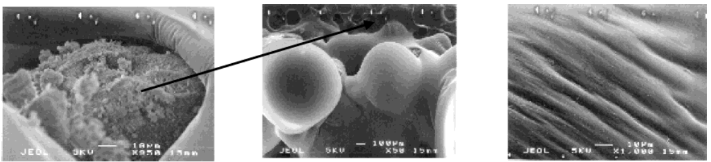
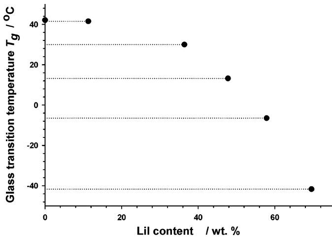
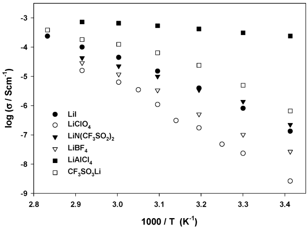
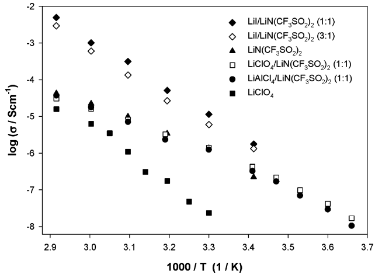
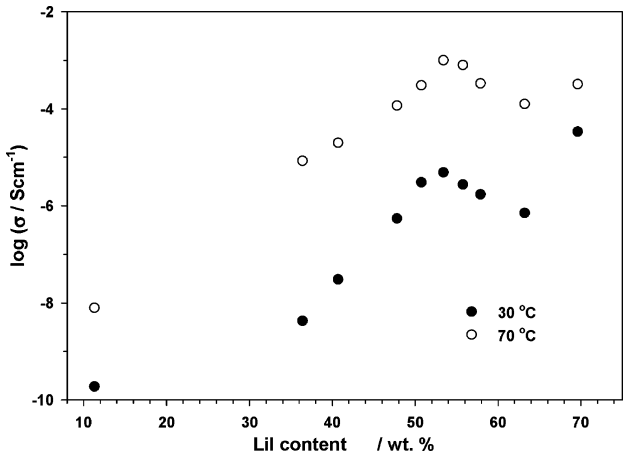
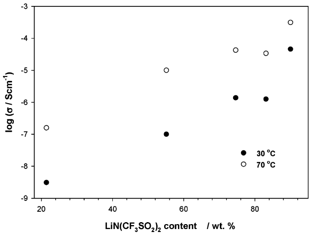
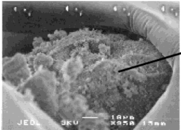
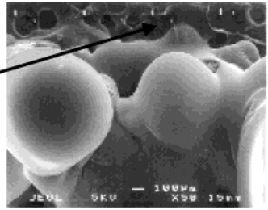
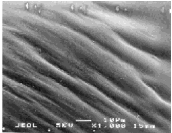
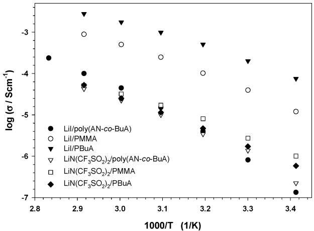

<!-- page 1 of 8 -->

J. Phys. Chem. B 2004, 108, 14907-14914

14907

# Polymer-in-Salt Electrolytes Based on Acrylonitrile/Butyl Acrylate Copolymers and Lithium Salts

Zbigniew Florjań **czyk,† Ewa Zygadło-Monikowska,\*,† Władysław Wieczorek,† Agnieszka Ryszawy,**<strong>†</strong> **Anna Tomaszewska,† Katrin Fredman,‡ Diana Golodnitsky,**<strong>‡</strong> **Emanuel Peled,‡ and Bruno Scrosati§**

Faculty of Chemistry, Warsaw UniVersity of Technology, ul. Noakowskiego 3, 00-664 Warsaw, Poland, School of Chemistry, Tel AViV UniVersity, Tel AViV, 69978 Israel, and Department of Chemistry, UniVersity of Rome “La Sapienza”, Piazza Aldo Moro 5, 00185 Rome, Italy

ReceiVed: February 22, 2004; In Final Form: July 15, 2004

Solid polymeric electrolytes for battery purposes in the form of composites of lithium salts [LiI, LiN(CF3SO2)2, LiClO4, LiAlCl4, LiCF3SO3, and LiBF4] and acrylic polymeric matrixes [poly(acrylonitrile-co-butyl acrylate), poly(methyl methacrylate), and poly(butyl acrylate)] have been obtained by film casting from acetonitrile. The ionic conductivity (σ) as a function of temperature was studied by the impedance spectroscopy method. These systems show the highest σ values, on the order of $10^{-4}-10^{-7}\  S \cdot  cm ^{-1}$ at high salt concentrations (above 50 wt %), characteristic of polymer-in-salt electrolytes. The ionic conductivity and mechanical properties of composites depend on the chemical structure of the polymer matrix, the anion, and the salt concentration. The glass transition temperature $( T _ { \mathrm { g } } )$ was determined from DSC studies. The introduction of a salt causes, in a majority of the composites studied, a considerable decrease in the $T _ { \mathrm { g } }$ values, indicating a strong plasticizing effect. DSC studies show a multiphase character of the composites, in which, with the exception of the amorphous system with LiN(CF3SO2)2, phases of the plasticized matrix, complexes of the salt with the matrix of varying stoichiometry, and often the separating salt are observed. The logarithm of the decoupling index (log Rτ) on the order of 3-5 as well as the shift in the IR spectrum of the groups present in the polymer (CtN and CdO) by about $2 0 { - } 3 0 ~ \mathrm { c m } ^ { - 1 }$ indicate a weak interaction of the salt with the matrix. The ion transference numbers (0.5-0.8) determined by the electrochemical method indicate an increased participation of cations in the electrical charge conduction and a different conduction mechanism compared to that of classical electrolytes based on complexes with polyethers.

## Introduction

There is great interest in the development of high-performance sources of energy for applications such as mobile telephones, laptops, and also electric vehicles and engine/battery hybrid vehicles. Among these energy sources, great attention is devoted to studies of lithium and lithium-ion cells. The application of polymer electrolytes in lithium batteries in the place of liquid ones avoids the problems of electrolyte leakage from the devices and also enables the design of devices with large surfaces and any shape. The large contribution of anions in the electric charge transfer is an important problem both in solid and liquid systems. During the operation of a cell, agglomeration of anions around the anode takes place, resulting in the formation of a charged layer. This lowers the cation transport from the anode to the electrolyte, which is manifested in a decrease in the power of the cell. The cation transference numbers are often not larger than 0.5,1,2 and the average t+ value is ca. 0.3 for both solid and gel electrolytes.3 A cation transference number of 1.0 is obtained for polyelectrolytes in which the anions are covalently bonded to the polymer matrix. However, because of the strong interaction of the ions, the conductivities of solid polyelectrolytes are low. An increase in the degree of dissociation is achieved

by the addition of a highly polar solvent, such as DMSO or DMA, but this is connected with strong passivation of the electrodes.4

A method has been proposed for obtaining electrolytes with high anion immobilization that involves the use of high salt concentrations (exceeding 50 wt %). This type of electrolyte, called a polymer-in-salt solid electrolyte (PISE), was first described by Angell et al.5,6 In the solid polymer electrolytes studied most often to date, the polymer is the main component, and the lithium salt is introduced in an amount from several to ∼10 mol %, so they can be called salt-in-polymer systems. In systems of high salt content, the polymer induces mechanical stability of the conducting composite and suppresses salt crystallization through its interaction with the lithium cations. Many papers have appeared since then on PISEs, mainly reporting systems based on polyacrylonitrile (PAN) and its copolymers.7-11 These systems combine the excellent mechanical properties characteristic of polymeric electrolytes with features of fast-ion-conducting glasses. It is assumed, on the basis of conductivity measurements of the PAN-LiCFSO3 system in the glass transition temperature region, that long-range ion transport is not connected with the segmental relaxation of the polymer chain, as no rapid decrease in ionic conduction below $T _ { \mathrm { g } }$ was observed.7,8 Thus, there is a considerable difference in behavior between these systems and the classical “salt-in-polymer” systems. In the latter case, ion transport is due to motions of the matrix and at temperatures below the

<small>\* To whom correspondence should be addressed. Fax +48-22-660-7279; e-mail ewazyga@ch.pw.edu.pl.</small>

<small>† Warsaw University of Technology.</small>

<small>‡ Tel Aviv University.</small>

<small>§ University of Rome “La Sapienza”.</small>

10.1021/jp049195d CCC: &#36;27.50 © 2004 American Chemical Society

Published on Web 09/08/2004

<!-- page 2 of 8 -->

14908

J. Phys. Chem. B, Vol. 108, No. 39, 2004

Florjańczyk et al.

glass transition temperature, where the relaxation disappears, the conductivity is minimal. It is assumed that, in “polymerin-salt” electrolytes, the effective ion transport is related to a high degree of ionic aggregation. At an appropriately high salt concentration, aggregates of varying degrees of association, $\mathrm { L i ^ { + } } _ { m } \mathrm { X ^ { - } } _ { n _ { 2 } }$ form internal clusters, the charge of which is transported mainly by cations. FT-Raman spectroscopic studies carried out for $\mathrm{LiCF}_{3}\mathrm{SO}_{3}$ confirm the high degree of aggregation of the ionic salt and the absence of “free” anions.9 This suggests that the anions are involved in extensive ionic aggregation, which makes them much less mobile than the cations. A conduction mechanism based on a dynamic percolation model with a “smeared” percolation threshold is postulated for these electrolytes.10 According to the studies of Bushkova et al. carried out for systems with $\mathrm{LiClO_{4}},$ the formation of an ionic structure favoring fast transport of lithium ions is dependent on the salt concentration and on the absence of traces of low-molecularweight additives, e.g., solvent.11 When a critical cluster concentration has been achieved, all separate single clusters come into contact with each other, forming an infinite cluster. According to these authors, the presence of a solvent disturbs this structure, causing marked decreases in the conductivity and cation transference number values.

PAN is most often used as a polymer additive in polymerin-salt systems and, as appears from a comparison of this matrix with polyvinylpyrrolidone and poly(N,N-dimethylacrylamide), PAN affords better results.12 The data from FT-Raman spectral measurements presented for $\mathrm{LiCF}_{3}\mathrm{SO}_{3}$ and $\mathrm{LiN}(\mathrm{CF}_{3}\mathrm{SO}_{2})_{2}$ in a system with $\mathrm{P}\dot{\mathrm{A}}\mathrm{N}_{\mathrm{s}}^{9,13}$ as well as studies carried out for systems containing polyacrylamide,14 show the occurrence of a distinct interaction of cations with the matrix. The interaction of the salt with the matrix is revealed also by the decrease in the glass transition temperatures of the electrolytes.

In this paper, we report an investigation of the conductivity behavior in a number of PISEs as a function of salt concentration, type of lithium salt anion, and chemical structure of the polymeric matrix. Because PAN is soluble in a small number of aprotic solvents, such as DMSO and DMF, that could never be completely removed, the electrolytes involving PAN were obtained by hot pressing at 150 °C and under high pressure. In this paper, we propose the application of acrylonitrile (AN) and butyl acrylate (BuA) copolymers [poly(AN-co-BuA)] as the matrix. These copolymers are soluble in acetonitrile, a volatile solvent easily removable from the solvent-cast films.

In an attempt to understand the nature of conduction in saltrich electrolytes, we investigated the thermal (DSC) and FTIR characteristics of the systems studied. An additional goal of this investigation was to determine whether lithium ions are more mobile in PISE than in classic electrolytes of low salt concentrations by measuring the cation transference number using the electrochemical method.15,16

## Experimental Section

**Synthesis of the Polymeric Matrix.** Poly(AN-co-BuA) (both monomers, AN and BuA, from Aldrich, commercial grade) was obtained by radical polymerization in the presence of azobisisobutyronitrile as the initiator. The reactions were carried out in a solvent (acetonitrile) at 70 °C for 5 h. The polymers were isolated with methanol, washed several times, and dried under dynamic vacuum for 72 h. The reaction yield was over 95%. The reactions were carried out with varying compositions of the monomer feed. The copolymer compositions were determined by elemental analysis, on the basis of the percentage contents of $\mathrm { C } _ { z }$ H, and N. Poly(methyl methacrylate) (PMMA)

TABLE 1: Characteristics of Poly(AN-co-BuA)s

| AN content in copolymer (mol %) | $M_{\text{n}}$(kDa) | $M_{\text{w}}$(kDa) | polydispersity$D$ | $T_{\text{g}}^{a}$(°C) | $T_{\text{m}}^{b}$(°C) |
| --- | --- | --- | --- | --- | --- |
| 50 | 36 | 80 | 2.2 | 15.3 | - |
| 67 | 65 | 109 | 1.7 | 42.1 | 49 |
| 75 | 25 | 46 | 1.8 | 52.1 | 52 |
| 83 | 6 | 7 | 1.2 | 55.6 | 57 |

$^ { a } \mathrm { ~ } T _ { \mathrm { g } }$ determined from the second heating cycle. $^ { b } \mathrm { ~ } T _ { \mathrm { m } }$ determined from the first heating cycle.

and poly(butyl acrylate) (PBuA) were obtained and purified by the same technique using benzoyl peroxide as the initiator.

**Characteristics of Poly(AN-co-BuA).** The molecular weights of the copolymers were determined by gel permeation chromatography in tetrahydrofuran (THF) with polystyrene as a standard (GPC LabAlliance). The values of $M _ { \mathrm { w } } , M _ { \mathrm { n } } ,$ and degree of polydispersity (D) are presented in Table 1. On the basis of DSC studies, the phase transitions of the copolymers studied were determined (Table 1).

As noted, the glass transition temperatures of the matrixes vary over a broad temperature range, from 15 °C at an equimolar composition to 56 °C at a molar ratio of AN monomeric units (m.u.) to BuA m.u. equal 5 (83 mol %). The copolymer comprising 50 mol % of AN m.u. is amorphous, whereas the other copolymers contain a crystalline fraction (∆H on the order of several joules per gram) with a melting point close to the glass transition temperature. In the second heating cycle crystallinity disappears, and therefore, $T _ { \mathrm { g } }$ was determined from the second heating cycle. All copolymers with AN m.u. contents of up to 83 mol % are soluble in acetonitrile.

**Preparation of Polymeric Electrolytes.** The electrolytes were obtained by the casting technique from a polymer and salt solution in acetonitrile. In the case of PBuA, a mixture of acetonitrile and chloroform was used. All operations connected with obtaining electrolytes and performing measurements were carried out in an atmosphere of dried argon. The solvent was removed under dynamic vacuum in two steps, first for 50 h at a vacuum of 20 Torr and then for 140 h at $\left[ 1 0 ^ { - 3 } \right.$ Torr at room temperature. In the FTIR spectrum, the signals assigned to acetonitrile completely disappeared after about the first 70 h of such drying. The solvents were dried and distilled in an argon atmosphere prior to use. The following lithium salts were used: LiI, $\mathrm{LiN}(\mathrm{CF}_{3}\mathrm{SO}_{2})_{2}$ , LiClO4, LiAlCl4, $\mathrm{LiCF}_{3}\mathrm{SO}_{3}$ and $\mathrm { L i B F _ { 4 } }$ (Aldrich, reagent grade). The salts were dried at 120 °C under a vacuum of $1 0 ^ { - 4 }$ Torr for 24 h. The salt concentration varied from 10 to 80 mol % with respect to the AN m.u. in the copolymer. In the cases of PMMA and PBuA, the molar ratio of salt to MMA or BuA m.u. was 1.2. The properties of the electrolyte obtained depend on the lithium salt. When the salt was used at a molar ratio of salt to AN m.u. (in the copolymer) of 1.2, flexible membranes with very good adhesion to the electrodes were obtained for only LiI, $\mathrm{LiN}(\mathrm{CF}_{3}\mathrm{SO}_{2})_{2}$ , and their mixtures. With $\mathrm{LiClO_{4}},$ LiAlCl4, $\mathrm{LiCF}_{3}\mathrm{SO}_{3},$ and $\mathrm { L i B F } _ { 4 } ,$ the electrolytes were glassy and brittle.

**Experimental Techniques.** Impedance Spectroscopy. Ionic conductivity was determined by the complex-impedance method. The samples were introduced into a specially designed measuring cell in a drybox in an atmosphere of argon in which the moisture level was below 10 ppm. The samples were sandwiched between stainless steel blocking electrodes and placed in a temperature-controlled oven. The impedance measurements were carried out on a Solartron-Schlumberger 1255 impedance analyzer over the frequency range from 1 Hz to 1 MHz.

Transference Number $( t _ { + } )$ Measurement. The transference number (t+) of cations was determined by the polarization-

<!-- page 3 of 8 -->

Polymer-in-Salt Electrolytes

J. Phys. Chem. B, Vol. 108, No. 39, 2004

14909

variable current method described in the literature.1,2,15,16 According to this method, a constant polarization voltage of 10 mV was applied to the system, and the resulting polarization current was monitored until it achieved its constant value, $I _ { \mathrm { S S } } .$ Impedance spectra were recorded before and after constantcurrent polarization. The transference number was calculated according to the equation

$$
t _ {+} = \frac {I _ {\mathrm{SS}} (\Delta V - I _ {0} R _ {0})}{I _ {0} (\Delta V - I _ {\mathrm{SS}} R _ {\mathrm{SS}})}
$$

where $I _ { 0 }$ and $I _ { \mathrm { S S } }$ are the initial and steady-state currents, respectively, and $R _ { 0 }$ and $R _ { \mathrm { S S } }$ are the corresponding initial and steady-state resistances of the solid-state interface calculated from the impedance plots before and after polarization.

For the system with the imide salt at temperatures above 65 °C and for the system with LiI near room temperature, we succeeded in separating bulk conductivity, grain-boundary conductivity, and the Li/polymer electrolyte interfacial resistance from the Nyquist plot data.

DSC Studies. DSC experiments were performed on a Perkin-Elmer Pyris 1 scanning calorimeter equipped with a lowtemperature measuring head and liquid-nitrogen-cooled heating element. The samples were placed in hermetically closed aluminum vessels. The measurement was carried out in the temperature range between -100 and +200 °C in two heating cycles, after the system had been cooled to -150 °C . The heating rate was 20°/min, and in some cases, when the glass transition was hard to determine, the rate was increased to 40°/min.

FTIR Spectroscopy. Infrared spectra were recorded on a Bio-Rad 165 FTIR spectrophotometer with the samples in KBr pellets or thin membranes deposited on NaCl plates.

## Results and Discussion

**FTIR and DSC Characteristics of Electrolytes Containing High Lithium Salt Concentrations and Acrylic Polymeric Matrixes.** To compare the effects of lithium salts on the properties of electrolytes involving various polymeric matrixes of clearly differing glass transition temperatures, poly(AN-co-BuA) $( \dot { T _ { \mathrm { g } } } = 4 3 ~ ^ { \circ } \dot { \mathrm { C } } )$ , PMMA $(T_{\mathrm{g}}=105\ ^{\circ}\mathrm{C})$ , and PBuA $( T _ { \mathrm { g } } =$ -55 °C) were used. The results of DSC and FTIR studies of electrolytes comprising various lithium salts at the molar ratio of the salt to the AN m.u. in the copolymer (or to the MMA m.u. in PMMA or BuA m.u. in PBuA) of 1.2 are shown in Table 2.

As is seen, the salt acts as a plasticizing agent on the system, causing a decrease in the glass transition temperature in a majority of systems. This effect depends on the salt anion; it is the clearest for $\mathrm{LiN}(\mathrm{CF}_{3}\mathrm{SO}_{2})_{2},$ , in which case the system is amorphous, and $T _ { \mathrm { g } }$ decreases to about -22 °C for poly-(AN-co-BuA), about -40 °C for PMMA, and $- 7 3 . 5 ~ ^ { \circ } \mathrm { C }$ for PBuA. In the case of $\mathrm{LiCF}_{3}\mathrm{SO}_{3}$ separation of the salt and polymer is observed. We attribute the transformation at 56 °C (first heating cycle) and the relaxation peaks at 62 and 45 °C (second heating cycle) correspond to $T _ { \mathrm { g } }$ of poly(AN-co-BuA) forming a separate phase. This temperature is slightly shifted with respect to $T _ { \mathrm { g } }$ of the “pure” copolymer. This fact can be explained by the polydispersity of molecular weights and distribution of the m.u. sequences in the copolymer. A better solubility of the salt can be assigned in such a system to the copolymer phase richer in the BuA m.u., resulting in domains in which the free matrix is enriched in AN m.u., or to interactions of large ionic agglomerates of the salt with the

TABLE 2: Phase Transitions and Absorption Bands $( \nu _ { \mathrm { C N } } )$ in IR Spectra of Electrolytes Comprising Poly(AN-co-BuA),a PMMA, or PBuA and Various Lithium Salts

<table><tr><td> $salt^b$ </td><td> $T_g$ (°C)</td><td> $\Delta T_{g}^{c}$ (°C)</td><td> $T_m$ (°C)</td><td> $\nu_{C\equiv N},^d\nu_{C=O}{}^e$ (cm-1)</td></tr><tr><td colspan="5">poly(AN-co-BuA 2:1)</td></tr><tr><td>-</td><td>42-44 (I, II) $^f$ </td><td>-</td><td>49-50 (I, II)</td><td>2242</td></tr><tr><td> $LiN(CF_3SO_2)_2$ </td><td>-22.5 (I, II)</td><td>64.5</td><td>-(I, II)</td><td>2236, 2252 $^g$ </td></tr><tr><td rowspan="2">LiI</td><td>10 (I)</td><td>32 (I)</td><td>69 (I)</td><td>2244, 2264</td></tr><tr><td>-6.5 (II)</td><td>48.5 (II)</td><td>-(II)</td><td></td></tr><tr><td rowspan="2"> $LiCF_3SO_3$ </td><td>56 (I)</td><td>-14 (I)</td><td>145</td><td>2246, 2270</td></tr><tr><td>45 (II)</td><td>-3 (II)</td><td>~140 (trace)</td><td></td></tr><tr><td rowspan="2"> $LiAlCl_4$ </td><td>54 (I)</td><td>-12 (I)</td><td>98, 105 (I)</td><td>2248, 2260 $^h$ </td></tr><tr><td>49 (II)</td><td>-7 (II)</td><td>98.5, 103.5 (II)</td><td></td></tr><tr><td rowspan="2"> $LiClO_4$ </td><td>-8.5 (I)</td><td>50.5 (I)</td><td>70, 91 (I)</td><td>2242, 2268</td></tr><tr><td>-27 (II)</td><td>69 (II)</td><td>65, 95 (II)</td><td></td></tr><tr><td rowspan="2"> $LiBF_4$ </td><td>27 (I)</td><td>15 (I)</td><td>110 (I)</td><td>2242, 2260</td></tr><tr><td>20 (II)</td><td>22 (II)</td><td>93 (II)</td><td></td></tr><tr><td colspan="5">PMMA</td></tr><tr><td>-</td><td>105</td><td>-</td><td>&gt;300</td><td>1735</td></tr><tr><td> $LiN(CF_3SO_2)_2$ </td><td>no data</td><td>-</td><td>-</td><td>1712</td></tr><tr><td rowspan="2">LiI</td><td>50 (I)</td><td>55 (I)</td><td>-</td><td>1714</td></tr><tr><td>48 (II)</td><td>57 (II)</td><td></td><td></td></tr><tr><td colspan="5">PBuA</td></tr><tr><td>-</td><td>-55</td><td>-</td><td>-</td><td>1735</td></tr><tr><td rowspan="2"> $LiN(CF_3SO_2)_2$ </td><td>-72 (I)</td><td>17 (I)</td><td>-</td><td>1712</td></tr><tr><td>-73.5 (II)</td><td>18.5 (II)</td><td></td><td></td></tr><tr><td rowspan="2">LiI</td><td>-92 (I)</td><td>37 (I)</td><td>-</td><td>1718</td></tr><tr><td>-95 (II)</td><td>40 (II)</td><td></td><td></td></tr></table>

a Poly(AN-co-BuA) comprising 67 mol % of AN monomeric units. b Molar ratio of salt to monomeric units in the copolymer ) 1.2. $^ { c } \Delta T _ { \mathrm { g } } = T _ { \mathrm { g \; m a t r i x } } - T _ { \mathrm { g \; e l e c t r o l y t e } } . ^ { d }$ In FTIR spectrum for poly(AN-co-BuA). e In FTIR spectra for PMMA or PBuA. f I and II indicate the first and second heating cycles, respectively. g Bold font indicates the most intense band. h Trace.

matrix that limit the segmental motion of the polymer chains, causing stiffening of the system and an increase in $T _ { \mathrm { g } \cdot }$ The effect of melting at about 140 °C might result from the complex formed between the salt ionic agglomerates and polymeric matrix. The electrolyte has a milky coloring, which might indicate the occurrence of polymer and salt microdomains. Such a structure might result from the similar solubilities of the components in acetonitrile, so that no clear separation of the phases occurs during solvent removal. It seems that a similar situation arises in the case of $\mathrm { L i A l C l _ { 4 } } _ { , }$ where we also observe a slight increase in $T _ { \mathrm { g } } .$ For this system, however, considerable heat effects are observed that are probably related to the melting of the crystalline phase of positive ionic associates of varying stoichiometry with the polymeric matrix $( T _ { \mathrm { m } } = 9 8$ and 103 °C) The electrolytes have a milky coloring and are rigid, which might also result from the presence of microdomains of the polymer, complexes, and also undissolved salt. For $\mathrm{LiClO_{4}}$ the occurrence of melting peaks of complexes at 70 and 91 °C are also observed. This system, despite the low glass transition temperature $(T_{\mathrm{g}} \; = \; - 8.5 \; ^{\circ}\mathrm{C}$ in the first heating cycle and $- 2 6 . 5 \; ^ { \circ } \mathrm { C }$ in the second one), is rigid because of the high share of the crystalline phase. For LiI, over the whole concentration range studied from 11 to 70 wt %, the plasticizing effect of the salt is clearly observed; $T _ { \mathrm { g } }$ decreases from 42 °C for the pristine poly(AN-co-BuA) matrix $\mathrm { \bar { t o } - } 6 . 5   ^ { \circ } \mathrm { C }$ for the system with a molar ratio of salt to AN m.u. in the copolymer of 1.2 (57.9 wt %) and $\mathrm { t o } \; \mathrm { - } 4 2 \; ^ { \circ } \mathrm { C }$ at a 2-fold molar excess of the salt (69.6 wt %). The dependence of $T _ { \mathrm { g } }$ on concentration is presented in Figure 1 and Table 3. Furthermore, the DSC studies show that the electrolytes comprising nearly 60 wt % of LiI contain a crystalline phase with a melting point of about 70 °C. At higher salt concentrations, a second crystalline phase appears at 80 °C<!-- page 4 of 8 -->

14910

J. Phys. Chem. B, Vol. 108, No. 39, 2004

Florjańczyk et al.

| Glass transition temperature Tg \(({}^{\circ}C)\) | Lil content (wt. %) |
| --- | --- |
| ~42 | 0 |
| ~42 | ~12 |
| ~30 | ~36 |
| ~13 | ~48 |
| ~-7 | ~58 |
| ~-42 | ~70 |

Figure 1. Glass transition temperature, $T _ { \mathrm { g } _ { 2 } }$ of electrolytes comprising poly(AN-co-BuA 2:1) and LiI depending on the salt concentration.

TABLE 3: Phase Transitions and Absorption Bands $( \nu _ { \mathrm { C N } } )$ in IR Spectra of Electrolytes Comprising Poly(AN-co-BuA)a and LiI

| LiI concentration (wt %) | Li/CN molar ratio | $T_{\text{g}}^{b}$(°C) | $T_{\text{m}}$(°C) | $\nu_{\text{CN}}$(cm-1) |
| --- | --- | --- | --- | --- |
| 11.3 | 0.1 | 41.5 | - | $2242^{d}$ |
| 36.4 | 0.5 | 30.0 | - | 2242, 2264 |
| 47.8 | 0.8 | 13.2 | - | 2244, 2264 |
| 57.9 | 1.2 | 10 | 69 (I)c | 2244, 2264 |
|  |  | -6.5 | -(II)c |  |
| 69.6 | 2.0 | -41.7 | 69, 82 (I)67, 80 (II) | $2248^{e}$ 2272 |

a Poly(AN-co-BuA) comprises 67 mol % of AN monomeric units. b Glass transition temperature was determined from the second heating cycle. c I and II indicate the first and second heating cycles, respectively. d Bold font indicates the more intense band. e Trace.

with a decrease in $T _ { \mathrm { g } } .$ These are probably phases of crystalline complexes of the polymer matrix and positive ions of various degrees of association $[ \mathrm { L i } _ { n } \mathrm { I } _ { m } ] ^ { + }$

The plasticizing effect of the lithium salts was observed earlier for PISE containing PAN or its copolymers.7,9,11,17 Our observations, in accordance with literature reports, show that, in contrast to classical salt-in-polymer systems based on polyether matrixes, in composites containing acrylic matrixes [poly(AN-co-BuA), PMMA, PBuA], no stiffening of chains due to physical cross-linking occurs, even at low salt concentrations; rather, only an increase in their flexibility is observed. The interaction of the salt with polymer polar groups such as CtN or CdO is considerably weaker than that in polyethers and depends on the anion and on the salt concentration. The salt compensates the dipole-dipole interactions between the polymer chains, resulting in greater chain mobility and increased system flexibility. This effect is clearer with an increase in the salt content. Such a situation occurs for salts such as $\mathrm{LiN}(\mathrm{CF}_{3}\mathrm{SO}_{2})_{2}$ or LiI that dissolve well in a given polymeric matrix, and for their complexes with the polymer. In the case of limited solubility, the system becomes heterogeneous, and a crystalline phase of the salt or/and its complex with the matrix appears.

The mode of interaction of the salt with the polymeric matrix can be observed by the changes in the vibration frequencies of bonds of polar groups present in the matrix and capable of forming complexes with the salt ions. Examples of the complexation of CtN groups with lithium salts are known. The formation of these complexes results in an increase in the vibration frequency of the CtN bond observed in Raman and IR spectra.8,9,11,13 As a result of complexation, a new band at about $2 2 7 0 \; \mathrm { c m } ^ { - 1 }$ attributed to the groups engaged in complexes

TABLE 4: Phase Transitions and Absorption Bands $( \nu _ { \mathrm { C N } } )$ in IR Spectra of Electrolytes Comprising Poly(AN-co-BuA)a and Mixtures of Lithium Salts with $\mathbf{LiN(CF_3SO_2)_2}$

| $salt^{b} + LiN(CF_3SO_2)_2$ | $T_{g}^{c}$(°C) | $T_{m}$(°C) | $\nu_{CN}$(cm-1) |
| --- | --- | --- | --- |
| $LiN(CF_3SO_2)_2$ | -22.5 | - | 2236, 2252d |
| $LiClO_4$ | -23.4 | 79 | 2244, 2260 |
| LiI | -21.4, 4 | 71.5 | 2272 |
| $LiAlCl_4$ | -22.5 | - | 2248, 2260 |

$a \mathrm{poly}(\mathrm{AN}-\mathrm{co}-\mathrm{BuA})$ containing 67 mol % of AN monomeric units. b Total molar ratio of salt to AN monomeric units in the copolymer ) 1.2; molar ratio of salts ) 1:1. c Glass transition temperature determined from the second heating cycle. d Bold font indicates the most intense band.

with positive salt ions appears, in addition to the band of the free CtN group at $2 2 4 4 ~ \mathrm { c m ^ { - 1 } }$ . Tables 2 and 3 list the bands observed in the IR spectra in the vibration ranges of the CtN and CdO groups.

It can be noted that, in the cases of $\mathrm{LiCF}_{3}\mathrm{SO}_{3}$ and $\mathrm { L i A l C l } _ { 4 } ,$ the interaction of the salt with the matrix is weak, and uncomplexed CtN groups dominate in the system. In the case of $\mathrm { L i A l C l } _ { 4 } ,$ , this interaction is weaker, and a weak band at 2260 $\mathrm { c m } ^ { - 1 }$ is observed. Similarly, the number of bands derived from complexed $C { = } 0$ groups in the copolymer is small (these data are not included in the table). In the pristine copolymer, $\nu _ { \mathrm { C = O } }$ appears at $1 7 3 2 \; \mathrm { c m } ^ { - 1 }$ . The salt causes broadening and splitting of this band with a shift toward lower wavelengths. Salts plasticizing the copolymer well, e.g., $\mathrm{LiN}(\mathrm{CF}_{3}\mathrm{SO}_{2})_{2}$ and LiI, interact more strongly with the matrix, which is manifested by the greater intensity of the bands of the complexed groups. For LiI (Table 3), at a 2-fold molar excess of the salt, a band derived from complexed CtN groups is present almost alone in the FTIR spectrum, and in the $C { = } 0$ group region, well separated bands appear at 1700, 1710, and $1 7 2 0 ~ \mathrm { c m } ^ { - 1 }$ . For electrolytes involving $\mathrm{LiN}(\mathrm{CF}_{3}\mathrm{SO}_{2})_{2}$ 2 or LiI and for PMMA and PBuA matrixes, bands of complexed carbonyl groups are mainly present. This might result from the better solubility of these salts in polymers containing exclusively ester substituents.

Table 4 lists the temperatures of phase transitions for electrolytes comprising equimolar mixtures of the imide salt with other lithium salts at the molar ratio of Li to CN groups of 1.2. The $T _ { \mathrm { g } }$ values of these systems decrease to between -22 and -23 °C, characteristic of electrolytes with $\mathrm{LiN}(\mathrm{CF}_{3}\mathrm{SO}_{2})_{2}.$ We also see changes in the melting points; the system with $\mathrm { L i A l C l } _ { 4 }$ becomes amorphous, and the system with $\mathrm{LiClO_{4}}$ loses one of the crystalline phases of higher melting point. The plasticizing effect of the imide salt is clearly revealed in these systems. Electrolytes comprising a mixture of salts, LiI and $\dot{\mathrm{LiN}}(\mathrm{CF}_3\mathrm{SO}_2)_2$ , behave differently from the other systems. In the FTIR spectrum, the $\nu _ { \mathrm { C N } }$ band derived from the uncomplexed group is not present and a much shifted signal at 2272 cm-1 appears. In the DSC results, these electrolytes exhibit two glass transition temperatures characteristic of systems with neat LiI and $\mathrm{LiN}(\mathrm{CF}_{3}\mathrm{SO}_{2})_{2}$ salts (Table 4).

The results presented show the occurrence of weak interactions of the lithium salts with polar CtN and $C { = } 0$ groups in the studied acrylic matrixes, which result in a considerable decrease in the glass transition temperatures and, in some cases, in the appearance of crystalline phases. These interactions are visible in the form of new absorption bands in the IR spectra, shifted by about $2 0 { - } 3 0 ~ \mathrm { c m } ^ { - 1 }$ . The magnitude of these effects depends on the lithium salt and its concentration, which is probably related to the solubility in the matrix of the salt and its complexes with the polymer.

<!-- page 5 of 8 -->

Polymer-in-Salt Electrolytes

J. Phys. Chem. B, Vol. 108, No. 39, 2004

14911

| \(1000 / T (K^{-1})\) | LiI | \(LiClO_{4}\) | \(LiN(CF_{3}SO_{2})_{2}\) | \(LiBF_{4}\) | \(LiAlCl_{4}\) | \(CF_{3}SO_{3}\)Li |
| --- | --- | --- | --- | --- | --- | --- |
| 2.83 | ~-3.6 | — | — | — | — | ~-3.4 |
| 2.91 | ~-4.0 | ~-4.8 | ~-4.4 | ~-4.5 | ~-3.1 | ~-3.8 |
| 3.00 | ~-4.3 | ~-5.2 | ~-4.7 | ~-5.0 | ~-3.2 | ~-3.9 |
| 3.10 | ~-4.8 | ~-6.0 | ~-5.0 | ~-5.5 | ~-3.3 | ~-4.2 |
| 3.20 | ~-5.4 | ~-6.8 | — | ~-6.3 | ~-3.4 | ~-4.6 |
| 3.30 | ~-6.1 | ~-7.6 | ~-5.9 | ~-7.0 | ~-3.5 | ~-5.3 |
| 3.41 | ~-6.9 | ~-8.6 | ~-6.7 | ~-7.6 | ~-3.6 | ~-6.2 |

Figure 2. Ionic conductivity of electrolytes based on poly(AN-co-BuA 2:1) with different lithium salts (molar ratio of salt to AN m.u. in the copolymer ) 1.2).

**Conductivity of Electrolytes Comprising Various Lithium Salts.** Figure 2 shows the conductivity as a function of temperature for electrolytes comprising poly(AN-co-BuA) (2:1) and various lithium salts [LiI, $\mathrm{LiN}(\mathrm{CF}_{3}\mathrm{SO}_{2})_{2},\ \mathrm{LiClO}_{4},$ $\widetilde{ LiAlCl _4},  LiCF _3 SO _3,$ and $\mathrm { L i B F } _ { 4 } ]$ at the salt/AN m.u. molar ratio of 1.2. As can be seen, the salt anion clearly affects the electrolyte conductivity. The highest conductivity, on the order of $1 0 ^ { - 4 } \mathrm { S } { \cdot } \mathrm { c m } ^ { - 1 }$ , is exhibited by the system with $\mathrm { L i A l C l } _ { 4 _ { 3 } }$ with a slight effect of temperature on its value. The electrolytes involving this salt have a milky coloring and are rigid. The DSC and FTIR studies show a multiphase structure of this system and very weak interactions with the polymer matrix (Table 2). High conductivity indicates a favorable structure for fast ionic transport. Similar properties are shown by electrolytes involving $\mathrm{LiCF}_{3}\mathrm{SO}_{3},$ but the interaction with the matrix is stronger, and in the FTIR spectrum, a band at $2 2 7 0 ~ \mathrm { c m } ^ { - 1 }$ in addition to the $\nu _ { \mathrm { C \equiv N } }$ band of the uncomplexed matrix at $2 2 4 6 \; \mathrm { c m } ^ { - 1 }$ is present. The conductivity of this system was lower, but it was the highest among the other salts studied. The lowest conductivity, especially in the temperature range close to ambient temperature, was exhibited by the electrolyte with $\mathrm{LiClO_{4}}.$ In this system, as in the system with $\mathrm { L i A l C l } _ { 4 _ { 1 } }$ , crystalline phases of high heat of fusion $\dot { ( } \Delta H \approx 5 0 ~ \mathrm { J / g ) }$ are present, providing the composite with stiffness and brittleness, even though $T _ { \mathrm { g } }$ is lower than ambient temperature. It does not exhibit a milky coloring, however, and strongly shifts the absorption bands of the $\mathrm{C} \equiv \mathrm{N}$ and $C { = } 0$ groups in the FTIR spectrum, which might indicate good mixing of the salt and polymer. Transparent and flexible membranes were obtained for systems containing $\mathrm{LiN}(\mathrm{CF}_{3}\mathrm{SO}_{2})_{2}$ and LiI, at the same molar concentration of the salt. The conductivities of these membranes are similar, with values on the order of $1 0 ^ { - 7 } \mathrm { S } { \cdot } \mathrm { c m } ^ { - 1 }$ at 20 °C and $1 0 ^ { - 5 } \mathrm { S } { \cdot } \mathrm { c m } ^ { - 1 }$ at 60 °C. The fact that the conductivity values are repeated in subsequent heating and cooling cycles, and also for LiI after being heated to above its $T _ { \mathrm { m } }$ value, is a characteristic property for these systems. The temperature dependence of conductivity for these systems is well described by the VTF equation

$$
\sigma (T) = \sigma_ {\mathrm{o}} T ^ {- 0. 5} \exp [ - B / (T - T _ {\mathrm{o}}) ]
$$

In this equation, $\sigma _ { 0 }$ is the preexponential conductivity, B is the pseudoactivation energy for conduction, and $T _ { 0 }$ is the ideal glass transition temperature. The parameters of the equation obtained from optimization are presented in Table 5. This table also includes the logarithmic values of the conductivities of the electrolytes at $T _ { \mathrm { g } } ~ ( \log ~ \sigma _ { T _ { \mathrm { g } } } )$ and the corresponding decoupling

TABLE 5: VTF Parameters and Logarithm of Decoupling Indexes (log Rτ) of Electrolytes Comprising Poly(AN-co-BuA) and LiN(CF3SO2)2 or LiIa

| $salt^b$ | $σ_o$(S·cm-1) | B(K) | $T_o$(K) | $T_g^c$(K) | log $σ_{T_g}$ | log $R_\tau$ |
| --- | --- | --- | --- | --- | --- | --- |
| $LiN(CF_3SO_2)_2$ | 5.18 | 1810 | 182 | 250 | -11.1 | 3.3 |
| LiI | 4.93 | 799 | 195 | 266 | -9.9 | 4.4 |

a VTF parameters and log $R _ { \tau }$ were determined from conductivity results from the second heating cycle. b Molar ratio of salt to AN monomeric units in the copolymer $\dot { \cdot } = 1 . 2 .$ c Determined from DSC.

| 1000 / T (1/K) | LiI/LiN(CF3SO2)2 (1:1) | LiI/LiN(CF3SO2)2 (3:1) | LiN(CF3SO2)2 | LiClO4/LiN(CF3SO2)2 (1:1) | LiAlCl4/LiN(CF3SO2)2 (1:1) | LiClO4 |
| --- | --- | --- | --- | --- | --- | --- |
| 2.9 | -2.3 | -2.5 | -4.4 | -4.5 | -4.4 | -4.8 |
| 3.0 | -3.0 | -3.2 | -4.7 | -4.8 | -4.8 | -5.2 |
| 3.1 | -3.5 | -3.9 | -5.0 | -5.1 | -5.1 | -6.0 |
| 3.2 | -4.3 | -4.6 | -5.5 | -5.6 | -5.6 | -6.8 |
| 3.3 | -5.0 | -5.3 | -5.9 | -5.9 | -5.9 | -7.6 |
| 3.4 | -5.8 | -5.9 | -6.6 | -6.4 | -6.5 | — |
| 3.5 | — | — | — | -6.7 | -6.8 | — |
| 3.6 | — | — | — | -7.0 | -7.1 | — |
| 3.65 | — | — | — | -7.4 | -7.5 | — |
| 3.66 | — | — | — | -7.8 | -8.0 | — |

Figure 3. Ionic conductivity of electrolytes based on poly(AN-co-BuA 2:1) and mixtures of lithium salts with $\mathrm{LiN(CF_3SO_2)_2}$ (molar ratio of salt to AN m.u. in the copolymer ) 1.2).

index (log $R _ { \tau } ) .$ The $R _ { \tau }$ parameter is defined as the ratio of the structural relaxation time (τs) to the conductivity relaxation time $\left( \tau _ { \mathrm { o } } \right)$ and describes the extent to which the mobility of ions is related to the segmental relaxation of the polymer chains. $\lfloor ^ { 1 8 }$ For highly conducting glasses, the logarithm of the decoupling index value is high, about $1 2 . ^ { \dot { 1 9 } }$

log $R _ { \tau }$ values were calculated on the basis of the approximate relaxation20

$$
\log R _ {\tau} \approx 1 4. 3 + \log \sigma_ {T _ {\mathrm{g}}}
$$

The log $R _ { \tau }$ value of the system with $\mathrm{LiN}(\mathrm{CF}_{3}\mathrm{SO}_{2})_{2}$ is $3 . 3 ,$ and that of the system with LiI is higher and equal to 4.4. log $R _ { \tau }$ values on the order of $3 { - } 5$ are achieved for electrolytes of high $\mathrm{LiClO_{4}}$ concentrations, for which it is assumed that the lithium cation motion is highly decoupled from the structural relaxation $\cdot ^ { 2 1 }$ If the $T _ { \mathrm { g } }$ value of the system with $\mathrm { L i A l C l } _ { 4 }$ is assumed to be $4 9 ~ ^ { \circ } \mathrm { C } _ { \mathrm { i } }$ , then the log $R _ { \tau }$ value for this system would be 11. For the pristine LiAlCl4 salt, the determined $R _ { \tau }$ value is $9 . 3 . ^ { 2 2 }$ Thus, it can preliminarily be assumed that the conductivities of the systems studied depend on the degree of interaction of the salt with the matrix, and the stronger these interactions, the less mobile the ions in the conduction process. Good conduction is possible at appropriate organization of the salt, complexes of various stoichiometries and polymer microphases, and these depend on the anion and polymer as well as the salt concentration. The results of studies carried out for systems containing mixtures of salts confirm such a conception. Figure 3 shows changes in conductivity as a function of temperature for electrolytes comprising poly(AN-co-BuA 2:1) and equimolar mixtures of $\mathrm{LiN}(\mathrm{CF}_{3}\mathrm{SO}_{2})_{2}$ with LiI, $\mathrm{LiClO_{4}},$ or LiAlCl4.

As can be noted, the use of various lithium salts together with the imide salt causes the electrolytes to achieve conductivity values similar to those of the system with the imide salt alone. A clear increase in conductivity can be noted for the electrolytes

<!-- page 6 of 8 -->

14912

J. Phys. Chem. B, Vol. 108, No. 39, 2004

Florjańczyk et al.

| Lil content (wt. %) | \(30 {}^{\circ}C (\)log σ / Scm⁻¹) | \(70 {}^{\circ}C (\)log σ / Scm⁻¹) |
| --- | --- | --- |
| ~11 | -9.7 | -8.1 |
| ~36 | -8.4 | -5.1 |
| ~41 | -7.5 | -4.7 |
| ~48 | -6.3 | -3.9 |
| ~51 | -5.5 | -3.5 |
| ~53 | -5.3 | -3.0 |
| ~55 | -5.6 | -3.1 |
| ~58 | -5.8 | -3.4 |
| ~63 | -6.2 | -3.9 |
| ~70 | -4.5 | -3.4 |

Figure 4. Conductivity isotherms determined at (b) 30 and (O) $7 0 ^ { \circ } \mathrm { { } ^ { \circ } C }$ for electrolytes comprising poly(AN-co-BuA 2:1) and LiI depending on the salt concentration.

| Series | LiN(CF3SO2)2 content (wt. %) | \(log(\sigma /\) Scm⁻¹) |
| --- | --- | --- |
| \(30 {}^{\circ}C\) | ~22 | ~-8.5 |
| \(30 {}^{\circ}C\) | ~55 | -7.0 |
| \(30 {}^{\circ}C\) | ~75 | ~-5.9 |
| \(30 {}^{\circ}C\) | ~84 | ~-5.9 |
| \(30 {}^{\circ}C\) | ~92 | ~-4.4 |
| \(70 {}^{\circ}C\) | ~22 | ~-6.8 |
| \(70 {}^{\circ}C\) | ~55 | -5.0 |
| \(70 {}^{\circ}C\) | ~75 | ~-4.4 |
| \(70 {}^{\circ}C\) | ~84 | ~-4.5 |
| \(70 {}^{\circ}C\) | ~92 | ~-3.5 |

Figure 5. Conductivity isotherms determined at (b) 30 and (O) 70 °C for electrolytes comprising poly(AN-co-BuA 2:1) and LiN(CF3- $\mathrm { S O } _ { 2 } ) _ { 2 }$ depending on the salt concentration.

containing $\mathrm{LiN}(\mathrm{CF}_{3}\mathrm{SO}_{2})_{2}$ and $\mathrm{LiClO_{4}}$ over that for the perchlorate alone, especially in the range of lower temperatures. For mixtures with LiAlCl4, a decrease in conductivity is seen, the system becomes more flexible, the solubility of the salt and its interaction with the matrix increase, and thus the fine phase structure responsible for the high conductivity is destroyed. Systems with LiN(CF3SO2)2/LiI exhibit conductivity values larger than those for singular systems, and the composition of this mixture in the concentration ranges studied does not significantly affect the conductivity of the system. In DSC traces, these electrolytes show two glass transition temperatures close to the $T _ { \mathrm { g } }$ values of systems with neat LiI and $\mathrm{LiN}(\mathrm{CF}_{3}\mathrm{SO}_{2})_{2}$ salts (Table 4). Thus, the addition of the imide salt causes changes in the mode of interaction of the ions with the matrix and of the microstructure of the composites, which affects their conducting properties.

**Effect of the Salt Concentration on the Conductivity of PISEs.** The dependence of ionic conductivity on salt concentration was determined for LiI and $\mathrm{LiN}(\mathrm{CF}_{3}\mathrm{SO}_{2})_{2}$ with poly(AN-co-BuA 2:1) as the polymeric matrix.

The conductivity isotherms at 30 and 70 °C presented in Figures 4 and 5 show that, with an increase in the salt concentration, a gradual increase in conductivity occurs, until a maximum value is reached, after which a further increase in concentration causes a slight drop in conductivity, followed by another increase. For LiI, the maximum occurs at the salt concentration of 53 wt %, which corresponds to an equimolar ratio of the salt to the CN groups of the matrix. The DSC traces, at a Li-to-CN molar ratio of 1.2, indicate the presence of a crystalline phase of a complex with $T _ { \mathrm { m } } = 6 9 ~ ^ { \circ } \mathrm { C }$ , the proportion of which increases with increasing salt concentration. At a 2-fold molar excess of the salt, a second phase of a complex with $T _ { \mathrm { m } } \approx 8 0 \; ^ { \circ } \mathrm { C }$ is present, probably with the participation of larger ionic agglomerates, and the phase of the recrystallizing salt is also possible. At the same time, an increase in the intensity of the absorption bands of complexed CtN and $C { = } 0$ groups is seen in the infrared spectra, which indicates a nearly complete engagement of the matrix polar groups in the interaction with positive salt ions. An increase in conductivity with increasing concentration probably results from the gradual increase in the concentration of charge carriers. The decreasing distances between the ion agglomerates and the possibility of their aggregation into clusters change the conduction mechanism to one involving increasing decoupling from the matrix. The decrease in conductivity after reaching a maximum and subsequent increase are hard to explain. In this concentration range, changes in the ion agglomerate structure probably take place, and the conduction mechanism changes to one similar to that of conduction in glasses. A similar relationship occurs for $\mathrm{LiN}(\mathrm{CF}_{3}\mathrm{SO}_{2})_{2}$ with a maximum at 75 wt % of the salt, which corresponds to a molar ratio of the salt to the CN groups of the matrix equal to 1.2. At salt concentrations above equimolar, the system becomes heterogeneous, and crystalline islands are visible on the electrolyte surface in scanning electron microscopy (SEM) images. In the DSC studies of this sample, no melting effect is observed up to 200 °C. It can therefore be suggested that crystallization of the salt takes place on the surface of the film $(T_{\mathrm{m}} = 234\ ^{\circ}\mathrm{C})$ . SEM images of the electrolyte containing $poly ( AN-co-BuA )$ and 75 wt $\bar { \% }$ of $\mathrm{LiN}(\mathrm{CF}_{3}\mathrm{SO}_{2})_{2}$ (obtained by casting from solution) are shown in Figure 6. The system with the imide at a very high salt concentration of over 90 wt % has the form of a very viscous metastable liquid of high conductivity, which is transformed into a high-melting-point solid after a certain time (Figure 5).

**Effect of the Chemical Structure of the Polymeric Matrix on PISE Conductivity.** For these studies, the systems chosen were poly(AN-co-BuA 2:1) $(T_{\mathrm{g}}   =   42   ^{\circ}\mathrm{C})$ and polymers of dramatically different glass transition temperatures such as PMMA $(T_{\mathrm{g}} \; = \; 105 \; \; ^{\circ}\mathrm{C})$ and PBuA $(T_{\mathrm{g}} \; = \; -55 \; \; ^{\circ}\mathrm{C})$ The

Figure 6. SEM images of the polymer electrolyte based on poly(AN-co-BuA 2:1) and 74.6 wt % of $\mathrm{LiN(CF_3SO_2)_2}$

<!-- page 7 of 8 -->

Polymer-in-Salt Electrolytes

J. Phys. Chem. B, Vol. 108, No. 39, 2004

14913

| 1000/T (1/K) | Lil/poly(AN-co-BuA) | Lil/PMMA | Lil/PBuA | \(LiN(CF_{3}SO_{2})_{2}/poly(AN-co-BuA)\) | \(LiN(CF_{3}SO_{2})_{2}/PMMA\) | \(LiN(CF_{3}SO_{2})_{2}/PBuA\) |
| --- | --- | --- | --- | --- | --- | --- |
| 2.85 | -3.6 | — | — | — | — | — |
| 2.92 | -4.0 | -3.0 | -2.6 | -4.4 | -4.3 | -4.3 |
| 3.01 | -4.3 | -3.3 | -2.8 | -4.6 | -4.5 | -4.6 |
| 3.10 | — | -3.6 | -3.0 | -5.0 | -4.8 | -4.9 |
| 3.20 | — | -4.0 | -3.3 | -5.4 | -5.1 | -5.4 |
| 3.30 | -6.1 | -4.4 | -3.7 | -5.8 | -5.6 | -5.8 |
| 3.42 | -6.9 | -4.9 | -4.1 | -6.7 | -6.0 | -6.3 |

Figure 7. Conductivities of electrolytes comprising 58 wt % of LiI, 75 wt % of $\mathrm{LiN(CF_3SO_2)_2}$ and various polymeric matrixes.

TABLE 6: Transference Number (t+) for Polymer-in-Salt Electrolytes Based on Poly(AN-co-BuA 2:1) and $\mathrm{LiN(CF_{3}^{\circ}SO_{2})_{2}}$ or LiIa

<table><tr><td>salt</td><td>temperature (°C)</td><td> $t_{+}$ </td></tr><tr><td rowspan="2"> $LiN(CF_3SO_2)_2$ </td><td>65</td><td>0.67</td></tr><tr><td>85</td><td>0.48</td></tr><tr><td>LiI</td><td>70</td><td>0.54-0.76</td></tr></table>

a Molar ratio of salt to AN monomeric units in the copolymer ) 1.2.

conductivity behavior of systems comprising $\mathrm{LiN}(\mathrm{CF}_{3}\mathrm{SO}_{2})_{2}$ and LiI is shown in Figure 7.

The use of PMMA or PBuA as the matrix together with LiI gives a distinct increase in conductivity compared to that of poly(AN-co-BuA) over the whole temperature range. The highest conductivity is achieved by systems of PBuA with LiI. Lithium iodide strongly plasticizes these matrixes, decreasing $T _ { \mathrm { g } }$ by 40-60 °C (Table 2). The effect of different polymeric matrixes on the conductivity of electrolytes containing LiN-$( \mathrm { C F } _ { 3 } \mathrm { S O } _ { 2 } ) _ { 2 }$ is not as pronounced as for those containing LiI. A possible explanation for these differences might lie in the differing degrees of dissociation of the salts in the polymers. The imide salt mixes equally well with poly(AN-co-BuA), as with PMMA and PBuA, whereas LiI dissolves much better in polymers containing ester groups and, as will be noted, favors a longer aliphatic substituent in this group.

**Transference Number (t**+**) for PISE: Poly(AN-co-BuA) with** $\mathrm{LiN(CF_3SO_2)_2}$ **or LiI.** Table 6 reports the results of measurements of the cation transference number for the electrolyte containing poly(AN-co-BuA 2:1) and lithium salts $\mathrm{LiN}(\mathrm{CF}_{3}\mathrm{SO}_{2})_{2}$ or LiI at the salt-to-AN m.u. molar ratio of 1.2. These electrolytes were selected as optimal ones from the point of view of their conducting and mechanical properties (they form flexible membranes). For the system with $\mathrm{LiN}(\mathrm{CF}_{3}\mathrm{SO}_{2})_{2}$ the values 0.67 and 0.48 were obtained from the measurement carried out at 65 and 85 °C. Similarly high values were obtained for the system with LiI (Table 6). In low-concentration LiI-PEO polymer electrolytes, the transference number is $0 . 3 { - } 0 . 3 5 , ^ { 2 \hat { 3 } }$ and for $\mathrm{LiN}(\mathrm{CF}_{3}\mathrm{SO}_{2})_{2},$ it is 0.1-0.5, depending on the temperature.24 Thus, it can be noted that, compared to classical systems, electrolytes of high salt concentrations represent great progress from the anion immobilization point of view. It seems that, by appropriate selection of the salt concentration and matrix, it is possible to obtain systems with a dominating proportion of cations in the electric charge transport. Furthermore, the electrochemical measurements in the

system of lithium electrodes indicate a high chemical stability of the electrolytes in relation to lithium electrodes. For example, $R _ { \mathrm { s e i } }$ of electrolytes with $\mathrm{LiN}(\mathrm{CF}_{3}\mathrm{SO}_{2})_{2}$ at 70 °C varies from 280 to 300 $\Omega { \cdot } \mathrm { c m } ^ { 2 }$ over a period of 320 h.

## Conclusions

The mechanical properties of electrolytes and their ability to conduct an electrical charge are determined by the complex interplay of several factors, such as the salt concentration, the chemical structure of the polymer matrix, and the identity of the lithium salt anion.

The application of poly(AN-co-BuA) instead of PAN in the synthesis of polymeric electrolytes combines the possibility of introducing the AN m.u. into the polymeric matrix with the solubility of these systems in a volatile aprotic solvent, such as acetonitrile. The $T _ { \mathrm { g } }$ of the matrix can be controlled in a simple way over a broad temperature range (15-56 °C) by appropriate selection of the monomer feed composition. For certain lithium salts, e.g., LiI, acrylic polymers such as PMMA or PBuA are favorable matrixes.

The introduction of classical, commercially available salts at a suitable ratio to the polymer allows highly conducting systems to be obtained. At high concentrations, the salt occurs in the form of aggregates, which interact with the matrix. This was observed in the FTIR spectra as the appearance of a new absorption band of the CtN and $C { = } 0$ groups. DSC studies indicated the presence of crystalline phases in a majority of systems, which are probably crystalline complexes of varied stoichiometry of the salt ions and the polymer. The formation of complexes causes a decrease in the glass transition temperature of the system, resulting from the equalization of polar interactions between the polymer chains. This decrease in $T _ { \mathrm { g } }$ increases with increasing salt concentration. The plasticizing effect depends on the salt anion.

The determined $t _ { + }$ values indicate an increased participation of cations in the electric charge transport compared to that occurring in classic polymer electrolytes.

**Acknowledgment.** This paper is based on work that was supported in part by the U.S. European Office of Aerospace Research and Development, Air Force Office of Scientific Research, Air Force Research Laboratory, under Contract F61775-01-WE019, and in part by the Polish State Committee for Scientific Research (7 09B 067 20 and PBZ-KBN 15/09/ T09/99/01b).

## References and Notes

(1) Gorecki, W.; Jeannin, M.; Belorizky, E.; Roux, C.; Armand, M. J. Phys.: Condens. Matter. 1995, 7, 6823.
(2) Bruce, P. G.; Haregrave, M. T.; Vincent, C. A. Solid State Ionics 1992, 53-56, 1087.
(3) Tarascon, J. M.; Armand, M. Nature 2001, 414, 359.
(4) Florjańczyk, Z.; Bzducha, W.; Dygas, J. R.; Misztal-Faraj, B.; Krok, F. Solid State Ionics 1999, 119, 251.
(5) Angell, C. A.; Liu, C.; Sanchez, E. Nature 1993, 362, 137.
(6) Fan, J.; Angell, C. A. Electrochim. Acta 1995, 40, 2397.
(7) Forsyth, M.; Sun, J.; MacFarlane, D. R. Solid State Ionics 1998, 112, 161.
(8) Ferry, A.; Edman, L.; Forsyth, M.; MacFarlane, D. R.; Sun, J. J. Appl. Phys. 1999, 86, 2346.
(9) Ferry, A.; Edman, L.; Forsyth, M.; MacFarlane, D. R.; Sun, J. Electrochim. Acta 2000, 45, 1237.
(10) Forsyth, M.; Sun, J. Z.; MacFarlane, D. R.; Hill, J. A. J. Polym. Sci. B: Polym. Phys. 2000, 38, 341.
(11) Bushkova, O. V.; Zhukovsky, V. M.; Lirova, B. I.; Kruglyashov, A. L. Solid State Ionics 1999, 119, 217.
(12) Forsyth, M.; Jiazeng, S.; MacFarlane, D. R. Electrochim. Acta 2000, 45, 1249.<!-- page 8 of 8 -->

14914

J. Phys. Chem. B, Vol. 108, No. 39, 2004

Florjańczyk et al.

(13) Wang, Zh.; Gao, W.; Chen, L.; Mo, Y.; Huang, X. Solid State Ionics 2002, 154-155, 51.
(14) Zalewska, A.; Pruszczyk, I.; Sułek, E.; Wieczorek, W. Solid State Ionics 2003, 157, 233.
(15) Evans, J.; Vincent, C. A.; Bruce, P. G.; Doyle, M.; Newman, J. J. Electrochem. Soc. 1995, 142, 3465.
(16) Appetecchi, G. B.; Dautzenberg, G.; Scrosati, B. J. Electrochem. Soc. 1996, 143, 6.
(17) Watanabe, M.; Kanba, M.; Nagaoka, K.; Shinohara, I. J. Polym. Sci. B: Polym. Phys. 1983, 21, 939.
(18) Angell, C. A. Solid State Ionics 1986, 18-19, 72.

(19) Gray, F. M. Polymer Electrolytes; The Royal Society of Chemistry: Cambridge, U.K., 1997.
(20) Angell, C. A. Annu. ReV. Phys. Chem. 1992, 43, 693.
(21) Xu, W.; Wang, L.-M.; Angell, C. A. Electrochim. Acta 2003, 48, 2037.
(22) Videa, M.; Angell, C. A. J. Phys. Chem. B 1999, 103, 4185.
(23) Strauss, E.; Golodnitsky, D.; Ardel, G.; Peled, E. Electrochim. Acta 1998, 43, 1315.
(24) Doeff, M. M.; Edman, L.; Sloop, S. E.; Kerr, J.; De Jonghe, L. C. J. Power Sources 2000, 89, 227.

## Figure crops from a second parse

The images below are crops of this same PDF produced by a second parser pass
(standard tier) that preserves charts as images. The body text above came
from the advanced tier, which digitises many charts into tables instead --
so for several of these figures the numbers appear above as a table with `~`
values, and the image below is the original plot those values were read off.
Use the image to sanity-check any `~` value you rely on.

