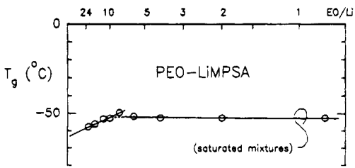
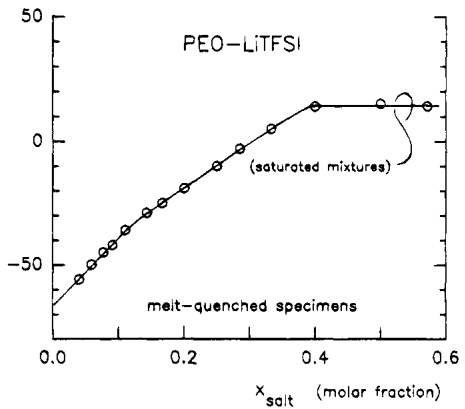
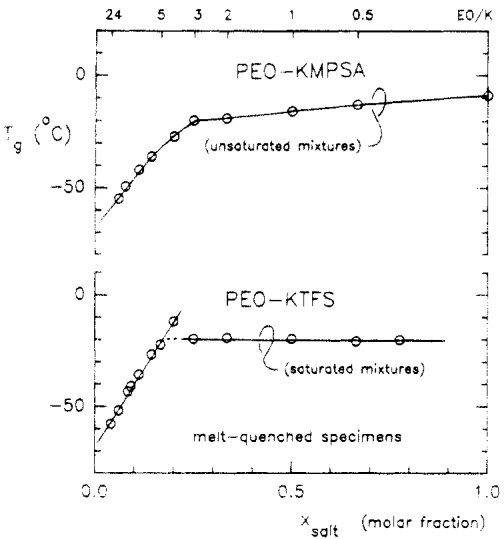
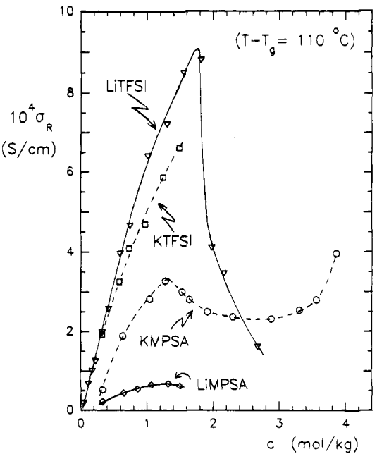
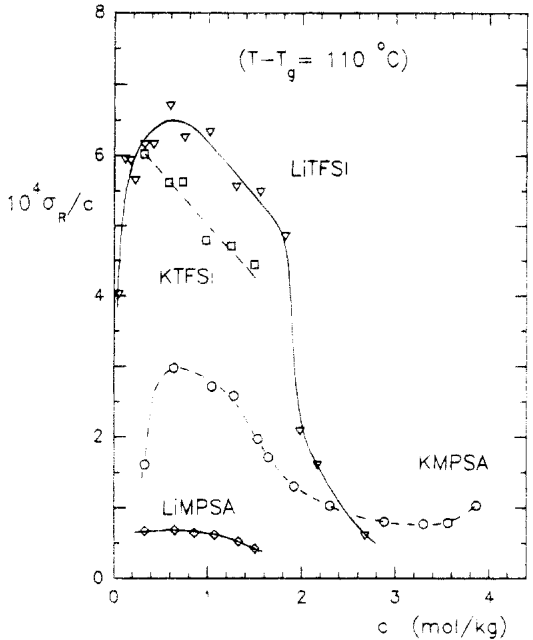

<!-- page 1 of 9 -->

0024-9297/94/2227-7469&#36;04.50/0 © 1994 American Chemical Society

Macromolecules 1994, 27, 7469–7477

7469

# Phase Diagrams and Conductivity Behavior of Poly(ethylene oxide)-Molten Salt Rubbery Electrolytes

S. Lascaud, M. Perrier, A. Vallée, S. Besner, and J. Prud'homme\*

Department of Chemistry, University of Montréal, Montréal, Québec, Canada H3C 3J7

M. Armand

Laboratoire d'Ionique et d'Electrochimie du Solide, URA 1213 CNRS ENSEEG/INP Grenoble, BP 75, 38402 Saint Martin d'Hères, France

Received May 17, 1994; Revised Manuscript Received September 12, 1994$^{\text{®}}$

ABSTRACT: New alkali metal salts capable of forming ionic complexes with poly(ethylene oxide) (PEO) have been prepared from the amide $\mathrm{CF_3SO_2NH(CH_2)_3OCH_3}$. Among these salts, the potassium salt $\mathrm{KCF_3SO_2N(CH_2)_3OCH_3}$ (KMPSA), which has both a low melting point ($T_{\mathrm{m}} = 45^{\circ}\mathrm{C}$) and a low glass transition temperature ($T_{\mathrm{g}} = -9^{\circ}\mathrm{C}$), is miscible in all proportions with PEO at moderate temperatures. This allowed, for the first time, a study of the $T_{\mathrm{g}}$-composition and conductivity-composition relationships of PEO rubbery electrolytes from the semidilute regime to the molten salt. A comparison with $\mathrm{LiCF_3SO_2N(CH_2)_3OCH_3}$ (LiMPSA), on the one hand, and with $\mathrm{Li(CF_3SO_2)_2N}$ (LiTFSI) and $\mathrm{K(CF_3SO_2)_2N}$ (KTFSI), on the other hand, shows other features resulting from the presence of the methoxypropyl group in the new anion. At moderate salt contents (EO/salt $>8$), the $T_{\mathrm{g}}$ elevation produced by LiMPSA ($1.3^{\circ}\mathrm{C/mol}\%$) is substantially lower than that produced by KMPSA ($2.3^{\circ}\mathrm{C/mol}\%$) or LiTFSI and KTFSI ($2.8^{\circ}\mathrm{C/mol}\%$). Over this range, cation charge density has about no effect on the reduced ($T - T_{\mathrm{g}} = \text{constant}$) molar conductivities of LiTFSI and KTFSI, while it has a strong effect on those of LiMPSA and KMPSA. The relationships obtained from KMPSA and LiTFSI, which extend to the bulk salt and to EO/salt $= 2$, respectively, show a change of regime that may be interpreted in terms of a percolation threshold. This feature, which is caused by the depletion of the free EO units, is evidenced by a sigmoidal decrease in the reduced molar conductivity. For EO/salt $< 3$, the rubbery electrolytes consist of fully complexed PEO dissolved in molten KMPSA or molten LiTFSI ($T_{\mathrm{g}} = 50^{\circ}\mathrm{C}$).

## Introduction

Thin-film polyether electrolytes have opened a route for the development of new technologies such as all-solid lithium rechargeable batteries, metal microdeposition, smart windows, and microsensors.$^{1,2}$ In their optimal form, these electrolytes are rubbery materials of low glass transition temperature ($T_g$) that involve liquidlike molecular motion at the microscopic level. Among the various polyethers and related materials investigated until now, poly(ethylene oxide) (PEO) is undoubtedly the best solvating medium for a variety of metal salts. It is unfortunate, however, that phase diagrams of many PEO-metal salt systems involve liquid-solid equilibria over temperature ranges that exceed ambient temperature. Since the crystalline phases do not contribute to conductivity, effort has been made to develop new metal salts (particularly lithium salts) that could impede PEO-salt compound crystallization. It is now well established that this feature applies to lithium salts such as Li(CF$_3$SO$_2$)$_2$N (LiTFSI)$^{3,4}$ or Li(CF$_3$SO$_2$)$_3$C (LiTriTFSM),$^5$ which bear two or three trifluoromethylsulfonyl (TFS) groups in their anions.

The other important features of these imide and methide anions are their great charge delocalization, their large window of electrochemical stability, and their ability to act as plasticizers in the amorphous phases of their polyether electrolytes. The former of these features is favorable to ion dissociation, while the latter is favorable to ion mobility. Anions bearing a single TFS group can be easily synthesized from commercially available products. In this work, the amide  $CF_{3}SO_{2}-NH(CH_{2})_{3}OCH_{3}$ , which is capable of forming salts with alkali metals, was prepared through the reaction of

3-methoxypropylamine with trifluoromethanesulfonic anhydride. An ether substituent was chosen in order to examine the effect of a donor group that could compete with the polyether in the coordination of the metal cations. Such a group, which favors ion-ion short-range interactions, is not expected to increase the conductivity. However, it could assist the cation transport in a situation where a salt concentration gradient is built up by polarization. This situation is encountered in many direct-current devices based on thin-film polymer electrolytes.

Among the alkali metal salts prepared from this amide, the lithium salt  $LiCF_{3}SO_{2}N(CH_{2})_{3}OCH_{3}$  (LiMPSA) has a higher melting point (256 °C) than LiTFSI (234 °C), while the corresponding potassium salt (KMPSA) has a much lower melting point (45 °C) than KTFSI (205 °C). Furthermore, at room temperature, supercooled KMPSA exhibits both a high viscosity and a slow, spherulitic crystallization similar to a polymer. In view of the marked differences in the physical properties of LiMPSA and KMPSA, their phase diagrams with PEO were compared with those of LiTFSI and KTFSI. Also compared were the  $T_{g}$ -composition relationships for amorphous mixtures of these four systems. The main features of this thermal study are presented in the first section of this paper. Among these features, it is noticeable that, contrary to LiTFSI and KTFSI, neither LiMPSA nor KMPSA forms crystalline compounds with PEO. Furthermore, at moderate temperatures, KMPSA is miscible in all proportions with PEO. This allowed a conductivity study of the PEO–KMPSA system from the semidilute regime to the molten salt. This study, which is presented in the second section of this paper, includes a comparison with the other salts. The chemical structures of the two anions studied in this work are the following:

<small>$^{®}$  Abstract published in Advance ACS Abstracts, November 1, 1994.</small>

<!-- page 2 of 9 -->

7470 Lascaud et al.

Macromolecules, Vol. 27, No. 25, 1994

$$
\begin{array}{c c} \mathrm{CF} _ {3} - \underset {\text {O}} {\overset {\text {O}} {\mathrm{S}}} - \underset {\text {N}} {\overset {\text {N}} {\mathrm{S}}} - \mathrm{CF} _ {3} & \mathrm{CF} _ {3} - \underset {\text {O}} {\overset {\text {O}} {\mathrm{S}}} - \underset {\text {N}} {\overset {\text {N}} {\mathrm{CH}}} - \mathrm{CH} _ {2} - \mathrm{CH} _ {2} - \mathrm{CH} _ {2} - \mathrm{O} - \mathrm{CH} _ {3} \\ \text {TFSI} & \text {MPSA} \end{array}
$$

## Experimental Section

Materials. The PEO samples (Aldrich), $M_{\mathrm{n}} = (3.9 - 4.5) \times 10^{3}$ and $M_{\mathrm{w}} / M_{\mathrm{n}} = 1.02 - 1.21$, were purified by precipitation in petroleum ether from $5\%$ tetrahydrofuran solutions and dried under high vacuum for $48\mathrm{h}$ prior to their utilization. A control made with a high molecular weight PEO sample ($M_{\mathrm{n}} = 3 \times 10^{5}$, $M_{\mathrm{w}} / M_{\mathrm{n}} = 4$) containing LiTFSI in molar ratios EO/Li = 8 and 128 yielded conductivity data over the range 50-110 °C that were perfectly superimposable on those obtained with these low molecular weight samples. LiTFSI, $\mathrm{Li(CF_3SO_2)_2N}$ (3M), was dried under high vacuum for $24\mathrm{h}$ at 150 °C and for an additional $1\mathrm{h}$ at 170 °C. Before drying, the DSC curves of this salt exhibited a dehydration endotherm at 166 °C ($40\mathrm{J / g}$ compared to $46\mathrm{J / g}$ for the heat of fusion at 234 °C). Thermogravimetry showed a small weight loss of $1.8\%$ over the range from 166 to 234 °C, suggesting the formula LiTFSI-$^{1/3}\mathrm{H}_2\mathrm{O}$ for the hydrate. LiMPSA was prepared by reacting $\mathrm{CF_3SO_2NH(CH_2)_3OCH_3}$ with LiH under a nitrogen atmosphere in acetonitrile. The excess of LiH (not soluble in acetonitrile) was removed by filtration. After solvent evaporation, the salt was dried under the same conditions as LiTFSI. Before drying, the DSC curves of this salt exhibited a small dehydration endotherm at 157 °C ($6\mathrm{J / g}$ compared to $92\mathrm{J / g}$ for the heat of fusion at 256 °C). KTFSI and KMPSA were prepared by reacting $(\mathrm{CF_3SO_2})_2\mathrm{NH}$ and $\mathrm{CF_3SO_2NH(CH_2)_3OCH_3}$ with $\mathrm{K_2CO_3}$ under a nitrogen atmosphere in acetonitrile. The excess of $\mathrm{K_2CO_3}$ (not soluble in acetonitrile) was removed by filtration. After solvent evaporation, these salts were dried under high vacuum for $24\mathrm{h}$ at 130 °C. Polymer-salt mixtures were prepared under a dry atmosphere by mixing weighed quantities of $1 - 5\%$ methanol solutions of each component. Solvent evaporation was carried out in ampules connected to a vacuum system. The mixtures were dried under high vacuum for $24\mathrm{h}$ at 130 °C. Those containing the lithium salts were heated to 170 °C for an additional $1\mathrm{h}$.

Bis(trifluoromethanesulfonyl)amine,  $(\mathrm{CF}_{3}\mathrm{SO}_{2})_{2}\mathrm{NH}$ , was kindly supplied by Dr. Michel Gauthier of Hydro-Québec. N-(3-Methoxypropyl)trifluoromethanesulfonamide,  $\mathrm{CF}_{3}\mathrm{SO}_{2}\mathrm{NH}(\mathrm{CH}_{2})_{3}-\mathrm{OCH}_{3}$ , was prepared by reacting equimolar quantities of 3-methoxypropylamine (Aldrich) with trifluoromethanesulfonic anhydride (Aldrich) in the presence of triethylamine (equimolar) under nitrogen in  $CH_{2}Cl_{2}$ . The anhydride was added under cooling (-30 °C), and the reaction was allowed to proceed for a period of 2 h at room temperature. After solvent evaporation, the liquid residue was dissolved in aqueous NaOH (4 N), and the organic byproducts were extracted with  $CH_{2}-Cl_{2}$ . After neutralization of the aqueous phase by HCl, the amide was extracted several times with  $CH_{2}Cl_{2}$ . The organic phase was dried over magnesium sulfate and filtrated, and the solvent was evaporated under vacuum. The  ${}^{1}H$  NMR features (300 MHz/ $CD_{3}CN$ ) of this amide (a liquid) were δ (TMS) 1.79 ( $CH_{2}$ ), 3.28 ( $CH_{3}O$ ), 3.31 ( $CH_{2}N$ ), 3.42 ( $CH_{2}O$ ), and 6.62 ppm (NH), respectively. The integration ratios were within a few percent of the expected values. Under the same conditions, the imide ( $CF_{3}SO_{2})_{2}NH$  (a solid,  $T_{m}=49^{\circ}C$ ) yielded a single line (NH) at 12.50 ppm. Both spectra did not show any evidence for residual impurities. In turn,  ${}^{1}H$  NMR spectra recorded on the salts under a high sensitivity did not show any trace of the acids.

DSC Measurements. Melting (or dissolution) endotherms and glass transition features were recorded at heating rates of 10 and 40 °C/min, respectively. The calorimeter (Perkin-Elmer DSC-4) was flushed with dry helium. Fusion and dissolution temperatures were read at the peak of the endotherms. Supercooled specimens were obtained by melt quenching at a cooling rate of 320 °C/min. The values of  $T_{g}$  were read at the intersection of the tangent drawn through the heat capacity jump with the base line recorded before the transition.

![Figure 1. Schematic diagram of the conductivity cells used in this work. The electrode active diameter is 1 cm and the gap between electrodes is 3 mm. Parts a and b are stainless steel solid cylinders, part c is a 7-mm-thick Teflon ring, and parts d and e are 2-mm-thick Teflon sleeves. Electrolyte thermal expansion takes place through grooves f and g. Vertical dimensions are  $h_{a} = 24$  mm,  $h_{b} = 5$  mm, and  $h_{t} = 32$  mm. Holes i are for three screw bolts inserted in 2-mm-thick Teflon sleeves. Well j is for the thermocouple.](figures/page2-block8.png)

Figure 1. Schematic diagram of the conductivity cells used in this work. The electrode active diameter is 1 cm and the gap between electrodes is 3 mm. Parts a and b are stainless steel solid cylinders, part c is a 7-mm-thick Teflon ring, and parts d and e are 2-mm-thick Teflon sleeves. Electrolyte thermal expansion takes place through grooves f and g. Vertical dimensions are  $h_{a} = 24$  mm,  $h_{b} = 5$  mm, and  $h_{t} = 32$  mm. Holes i are for three screw bolts inserted in 2-mm-thick Teflon sleeves. Well j is for the thermocouple.

Sample pans were filled and sealed under a dry atmosphere in a glovebox.

Conductivity Measurements. The bulk electrolytes (0.5 cm$^{3}$) were contained in cells (Figure 1) consisting of two stainless steel solid cylinders (a and b) encapsulated at both ends of a Teflon ring (c). A 1-cm-diameter disk-shape electrode-electrolyte contact surface was imposed by 2-mm-thick Teflon sleeves (d and e). Free space for electrolyte expansion was provided by two grooves (f and g) machined on the external wall of the inner sleeve. The gap between the electrodes (3 mm) was measured at room temperature with an accuracy better than 1%. For that purpose, the heights ($h_{a}$ and $h_{b}$) of the stainless steel electrodes along the cell axis were subtracted from the total height ($h_{t}$) of the cell. Prior to this measurement, the cell had been filled and sealed by means of three screw bolts inserted in holes (i) containing 2-mm-thick Teflon sleeves. To fill the cell, the bulk electrolyte and the cell assembly were heated to 110–130 °C in the glovebox. The cell constant (ca. 0.4 cm$^{-1}$) determined from the cell geometry was checked against standard aqueous solutions (0.01 M KCl). The departure was less than 1%. As will be shown shortly, due to other factors, the accuracy of the conductivity measurements performed on the polymer electrolytes was not as good as that obtained for the aqueous solutions. Therefore, no correction was made for the thermal expansion of the cell over the temperature range (30–115 °C) of the study.

The conductivity measurements were performed in a Model 3111 Instron temperature chamber equipped with a computer-driven controller. The temperature of the electrolytes was measured with an accuracy better than $\pm 0.2^{\circ}\mathrm{C}$ by means of a thermocouple inserted in a well dug in the body of the cells (j on Figure 1). The real part, $Z'$, and the imaginary part, $Z''$, of the complex impedance of the cells were measured over the frequency range $5\mathrm{Hz}$ to $13\mathrm{MHz}$ by using a Model 4192A Hewlett-Packard impedance analyzer. The impedance data were collected at intervals of 5 °C by means of a HP-IB interface. A typical run started at 75 °C to first collect the data upon step heating up to the highest temperature and then went back to 75 °C to collect the data upon step cooling down to the lowest temperature. Once the programmed temperature was obtained, each step involved a further stabilization for a period of $15\mathrm{min}$. As usual,$^{6}$ the bulk dc resistance of the electrolyte was determined as the point where the high-frequency semicircle in the plot of $Z''$ as a function of $Z'$ cuts the $Z'$ axis. The reliability of the equipment was checked against high- and low-impedance dummy cells consisting of precision resistors and capacitors. For each electrolyte, measurements were made in duplicate on distinct cells. The reproducibility was better than $5\%$. Some of the high-temperature data were obtained with cells having a different geometry (0.5-cm-diameter electrode surface and 8-mm gap between electrodes). Over the range where a comparison was

<!-- page 3 of 9 -->

Macromolecules, Vol. 27, No. 25, 1994

PEO-Molten Salt Electrolytes

7471

![Figure 2. Phase diagrams of the PEO–LiMPSA (a) and the PEO–LiTFSI (b) systems. The vertical boundaries at  $W_{salt} = 0.52, 0.68$ , and 0.76 in the diagram related to LiTFSI were derived from a calorimetric analysis of the DSC data. They show the formation of 6/1, 3/1, and 2/1 crystalline compounds designated by  $C_{6}$ ,  $C_{3}$ , and  $C_{2}$ , respectively. For EO/Li > 6, the as-cast mixtures related to this salt were either amorphous or semicrytalline as indicated by the  $T_{g}$  tie line. Each diagram shows the low-temperature solubility limit (diamond symbol) derived from the supercooled mixture  $T_{g}$  data (Figure 3).](figures/page3-block4.png)

![Figure 2. Phase diagrams of the PEO–LiMPSA (a) and the PEO–LiTFSI (b) systems. The vertical boundaries at  $W_{salt} = 0.52, 0.68$ , and 0.76 in the diagram related to LiTFSI were derived from a calorimetric analysis of the DSC data. They show the formation of 6/1, 3/1, and 2/1 crystalline compounds designated by  $C_{6}$ ,  $C_{3}$ , and  $C_{2}$ , respectively. For EO/Li > 6, the as-cast mixtures related to this salt were either amorphous or semicrytalline as indicated by the  $T_{g}$  tie line. Each diagram shows the low-temperature solubility limit (diamond symbol) derived from the supercooled mixture  $T_{g}$  data (Figure 3).](figures/page3-block5.png)

Figure 2. Phase diagrams of the PEO–LiMPSA (a) and the PEO–LiTFSI (b) systems. The vertical boundaries at  $W_{salt} = 0.52, 0.68$ , and 0.76 in the diagram related to LiTFSI were derived from a calorimetric analysis of the DSC data. They show the formation of 6/1, 3/1, and 2/1 crystalline compounds designated by  $C_{6}$ ,  $C_{3}$ , and  $C_{2}$ , respectively. For EO/Li > 6, the as-cast mixtures related to this salt were either amorphous or semicrytalline as indicated by the  $T_{g}$  tie line. Each diagram shows the low-temperature solubility limit (diamond symbol) derived from the supercooled mixture  $T_{g}$  data (Figure 3).

possible, these data were superimposable on those obtained with the other cells.

## Results and Discussion

(a) Thermal Properties. Figure 2 shows the phase diagrams constructed for the PEO–LiMPSA and the PEO–LiTFSI systems. The former system is a simple binary eutectic system, while the latter system involves a series of intermediate crystalline compounds. As reported in a former work,$^{4}$ the 6/1 (EO/Li) compound related to LiTFSI does not crystallize in the presence of an excess of PEO. This leads to a crystallinity gap over the range 6 < EO/Li < 12. For lower salt contents (EO/Li > 12) the as-cast mixtures of this system consist of an amorphous phase of invariant $T_{\mathrm{g}}$ ($-40 \pm 2$ °C) in equilibrium with crystalline PEO. Over the entire range of compositions, no $T_{\mathrm{g}}$ features were recorded for the mixtures of the PEO–LiMPSA system. Since this system is a binary eutectic system, its phase diagram

Figure 3. $T_g$-composition relationships for melt-quenched, supercooled mixtures of the PEO-LiMPSA and the PEO-LiTFSI systems. PEO-LiMPSA mixture with EO/Li = 8 exhibits supersaturation.

allows the definition of the salt liquidus curve over a wide range of temperatures. This curve and the corresponding curve above 106 °C in the phase diagram of the PEO–LiTFSI system show that both salts are miscible in all proportions with PEO at elevated temperatures. Each diagram contains a complementary data point (diamond symbol) that allows the definition of the salt liquidus curve down to -53 °C for LiMPSA and down to 14 °C for LiTFSI. This data point corresponds to the solubility limit deduced from the  $T_{g}$ -composition relationship obtained for melt-quenched mixtures of each of these systems (Figure 3). A comparison based on the resulting, metastable salt liquidus curves (dashed curves) shows that LiMPSA is considerably less soluble than LiTFSI at moderate and low temperatures.

The  $T_{g}$ -composition relationships depicted in Figure 3 correspond to supercooled mixtures, that is, mixtures free from any crystalline phase related to the PEO component. Over the range below saturation (EO/Li > 10 for LiMPSA), these relationships show that the  $T_{g}$  elevation produced by LiMPSA is noticeably lower than that produced by LiTFSI (1.3 °C/mol % compared to 2.8 °C/mol %). Over the same range of compositions, more classical lithium salts such as  $LiCF_{3}SO_{3}$ , LiSCN,  $LiClO_{4}$ , and  $LiBPh_{4}$  yield  $T_{g}$  elevations of 2.9, 3.7, 4.3, and 6.7 °C/mol %, respectively. $^{4,6}$  Hence, on a molar basis, LiMPSA yields the lowest  $T_{g}$  elevation ever reported for homogeneous mixtures of PEO with a lithium salt. Figure 4 shows the relationships obtained for KMPSA and KTFSI. Over the range below saturation (EO/K > 5 for KTFSI), the  $T_{g}$  elevation produced by KMPSA is also lower than that produced by KTFSI (2.3 °C/mol % compared to 2.8 °C/mol %). These changes in  $T_{g}$  associated with the nature of the anions, particularly those quoted for the various lithium salts, are not easy to interpret physically. They depend on several factors, including short-range and long-range ion-ion interactions in addition to the contribution of the anions to the free volume of the materials. The present comparison of the  $T_{g}$  data made on a molar basis has a physical ground in the semidilute regime only, that is, over the

<!-- page 4 of 9 -->

7472

Lascaud et al.

Macromolecules, Vol. 27, No. 25, 1994

Figure 4. $T_g$-composition relationships for melt-quenched, supercooled mixtures of the PEO-KMPSA and the PEO-KTFSI systems. PEO-KTFSI mixture with EO/K = 4 exhibits supersaturation.

range where the rise in  $T_{g}$  is essentially due to the increasing amount of EO units coordinated to the cations. The  $T_{g}$  data obtained for LiTFSI and KMPSA, which extend well above this range, will be further analyzed in terms of the weight fraction at the end of this section.

Figure 5 depicts the phase diagrams constructed for the PEO-KMPSA and the PEO-KTFSI systems. As in the case of the PEO-LiMPSA system, the solid phases present in the as-cast mixtures of the former system are either PEO or the salt. However, due to the low melting point of KMPSA a crystallinity gap occurs over the range $0.5 < \mathrm{EO} / \mathrm{K} < 9$. All the mixtures within this region were limpid, homogeneous materials at room temperature. Over the same range of compositions KTFSI forms 10/1 and 1.5/1 crystalline compounds with PEO. Like the 6/1 compound related to LiTFSI, the 10/1 compound related to KTFSI does not crystallize in the presence of an excess of PEO. This leads to a sharp discontinuity in the phase diagram of the PEO-KTFSI system. The mixture in a ratio $\mathrm{EO} / \mathrm{K} = 10$ was highly crystalline, while that in a ratio $\mathrm{EO} / \mathrm{K} = 11$ was almost completely amorphous. The PEO-rich mixtures of both these systems exhibit the same feature as those of the PEO-LiTFSI system. They consist of an amorphous phase of invariant $T_{\mathrm{g}}(-41 \pm 2^{\circ}\mathrm{C}$ for KMPSA, and $-44 \pm 2^{\circ}\mathrm{C}$ for KTFSI) in equilibrium with crystalline PEO. This feature may be rationalized by considering that the mixtures of each of these systems were equilibrated for a long period at room temperature prior to their DSC study. According to the phase rule, in the absence of a eutectic crystallization and for a given system, the composition of the amorphous phase should be the same in all these biphasic mixtures.

The phase diagram of the PEO-KMPSA system shows that KMPSA is miscible in all proportions with PEO at moderate temperatures. Although a change of regime is observed near EO/K = 3 in the $T_g$-composition relationship of this system (Figure 4), this feature is not caused by saturation. As already mentioned, mixtures with much higher salt contents were homogeneous at room temperature. According to the phase diagram of the PEO-KTFSI system, KTFSI is also miscible in all proportions with PEO, but at elevated temperatures only. As may be deduced from the peritectic equilibrium associated with the 1.5/1 compound

![Figure 5. Phase diagrams of the PEO-KMPSA (a) and the PEO-KTFSI (b) systems. For EO/K < 32, the as-cast mixtures related to KMPSA were either amorphous or semicrystalline as indicated by the $T_g$ tie line. The latter feature also applies to the EO/K > 10 mixtures of the PEO-KTFSI system. The vertical boundaries at $W_{\mathrm{salt}} = 0.42$ and 0.83 in the diagram related to KTFSI were derived from a calorimetric analysis of the DSC data. They show the formation of 10/1 and 1.5/1 crystalline compounds designated by $C_{10}$ and $C_{1.5}$, respectively. This diagram also shows the low-temperature solubility limit (diamond symbol) derived from the supercooled mixture $T_g$ data (Figure 4).](figures/page4-block9.png)

![Figure 5. Phase diagrams of the PEO-KMPSA (a) and the PEO-KTFSI (b) systems. For EO/K < 32, the as-cast mixtures related to KMPSA were either amorphous or semicrystalline as indicated by the $T_g$ tie line. The latter feature also applies to the EO/K > 10 mixtures of the PEO-KTFSI system. The vertical boundaries at $W_{\mathrm{salt}} = 0.42$ and 0.83 in the diagram related to KTFSI were derived from a calorimetric analysis of the DSC data. They show the formation of 10/1 and 1.5/1 crystalline compounds designated by $C_{10}$ and $C_{1.5}$, respectively. This diagram also shows the low-temperature solubility limit (diamond symbol) derived from the supercooled mixture $T_g$ data (Figure 4).](figures/page4-block10.png)

Figure 5. Phase diagrams of the PEO-KMPSA (a) and the PEO-KTFSI (b) systems. For EO/K < 32, the as-cast mixtures related to KMPSA were either amorphous or semicrystalline as indicated by the $T_g$ tie line. The latter feature also applies to the EO/K > 10 mixtures of the PEO-KTFSI system. The vertical boundaries at $W_{\mathrm{salt}} = 0.42$ and 0.83 in the diagram related to KTFSI were derived from a calorimetric analysis of the DSC data. They show the formation of 10/1 and 1.5/1 crystalline compounds designated by $C_{10}$ and $C_{1.5}$, respectively. This diagram also shows the low-temperature solubility limit (diamond symbol) derived from the supercooled mixture $T_g$ data (Figure 4).

related to this salt, its solubility limit corresponds to EO/K = 4 at 124 °C. Below this temperature, the metastable salt liquidus curve (dashed curve) is defined down to -20 °C on the basis of the solubility limit (diamond symbol) deduced from the $T_g$-composition relationship (Figure 4). The curve shows that KTFSI is substantially less soluble than LiTFSI at moderate temperatures. This feature, which conforms to the trend observed for other series of alkali metal salts with a common anion,$^{7,8}$ is at variance with that observed for KMPSA and LiMPSA. These latter salts may be considered as hybrids between the former salts and their crystalline compounds with PEO. The analogy with these compounds suggests that cation coordination to the methoxypropyl groups leads to crystallize structures (and lattice energies) that depend markedly on the size (and the coordination number) of the alkali metals. This effect probably accounts for the low<!-- page 5 of 9 -->

Macromolecules, Vol. 27, No. 25, 1994

PEO-Molten Salt Electrolytes

7473

Figure 6. Plots of $T_{\mathrm{g}}$ as a function of salt weight fraction for supercooled mixtures of the PEO-KMPSA and the PEO-LiTFSI systems. The diamond symbols correspond to supersaturated mixtures of the PEO-LiTFSI system. These mixtures were quenched from a temperature above the melting point of LiTFSI (234 °C). The change of regime at $W_{\mathrm{salt}} = 0.65$ (EO/K = 3.2 and EO/Li = 3.5) is attributed to the completion of the solvation reaction.

melting point and the extensive miscibility of KMPSA with amorphous PEO at moderate temperatures, as opposed to the high melting point and the limited miscibility of LiMPSA with this polymer.

As mentioned at the beginning of this section, the $T_{\mathrm{g}}$-composition relationships of the PEO-LiTFSI and the PEO-KMPSA systems deserve a further analysis. These relationships are particularly interesting because both these salts exhibit an extensive miscibility with amorphous PEO at low temperatures. As may be seen in Figure 2, the solubility limit of LiTFSI corresponds to a salt weight fraction of $81\%$ at 14 °C. Furthermore, supersaturation could be obtained by heating more concentrated mixtures of this system above the melting point of the salt (234 °C) prior to their quenching in the DSC apparatus. Figure 6 shows a comparison of the $T_{\mathrm{g}}$ data of the two systems as a function of salt weight fraction. The new data for LiTFSI (diamond symbols) allow a reliable extrapolation to a zero PEO content. According to this extrapolation, supercooled LiTFSI should exhibit a $T_{\mathrm{g}}$ of 50 °C, compared to -9 °C for KMPSA. Since weight fraction is a better approximation of the volume fraction than the molar fraction, these plots are well suited to examine the physical basis of both the $T_{\mathrm{g}}$ elevation of PEO and the $T_{\mathrm{g}}$ depression of the salt. It may be seen that there is no apparent relation between these two features. Although both systems first exhibit comparable relationships over a wide range of salt weight fractions (from 20 to $65\%$), their $T_{\mathrm{g}}$ data follow very different relationships above this range. Only the latter relationships appear to be governed by the $T_{\mathrm{g}}$ of the PEO-free salts.

The change of regime in the relationships of Figure 6 may be interpreted as the completion of the solvation reaction. If this interpretation is correct, above a certain salt content, which roughly corresponds to a 3/1 molar ratio for both salts, the amorphous mixtures consist of fully complexed PEO dissolved in the molten salt. Below this range, the present systems yield comparable relationships for casual reasons only. Inorganic salts such as LiSCN and  $LiClO_{4}$ , which involve smaller anions, would have yielded much steeper relationships than KMPSA and LiTFSI. Furthermore, at low temperatures, the solubility limits of these salts in amor-

phous PEO (EO/Li = 3 for LiSCN $^{7}$ and EO/Li = 2.3 for LiClO $_{4}^{4,8}$) are inferior to 50% by weight. Due to their higher lattice energies, these salts separate from fully complexed PEO at low temperatures. In the present case, the addition of more salt probably contributes to modify the average free volume as in any other binary system involving miscible components of different $T_{g}$. Therefore, when such a miscibility occurs, depending on the physical properties of the fully complexed polymer and the molten salt, $T_{g}$ may either increase or decrease with increasing salt content. $^{9}$ In the case of the present salts the $T_{g}$ of fully complexed PEO is ca. -20 °C, that is, 10 °C only below that of molten KMPSA and 70 °C below that expected for molten LiTFSI. From these features, it is clear that it is the physical properties of the fully complexed polymer, as opposed to those of the molten salt, that govern the $T_{g}$ elevation in the semidilute regime.

(b) Conductivity Study. The conductivity data ( $\sigma$ ) obtained for amorphous mixtures of the PEO-KMPSA and the PEO-KTFSI systems are listed in Tables 1 and 2, respectively. Figure 7 shows semilogarithmic plots of the 50 and 100 °C data as a function of salt concentration (c, in mol per kg of mixture) over the range from 0.32 mol/kg (EO/K = 64) to 1.5 mol/kg (EO/K = 8) for KTFSI and to 3.9 mol/kg (bulk salt) for KMPSA. Once melted, the PEO-rich mixtures of these systems remained supercooled for a period long enough to allow conductivity measurements down to 40–50 °C without any evidence for PEO crystallization. The upper limit of 1.5 mol/kg for KTFSI was imposed by the liquidus curve of the 1.5/1 compound related to this salt (Figure 5). In spite of this limit, the data allow a comparison over the range where  $\sigma$  exhibits a maximum for both systems. This maximum, which is located near 0.8–1.0 mol/kg, is of lower magnitude for KMPSA. Furthermore, the discrepancy between the data of these salts increases markedly with both increasing temperature and decreasing concentration below the maximum.

As reported for a number of polyether electrolytes, over the range above the conductivity maximum, the decrease in conductivity with increasing salt content is much steeper at low temperatures than at high temperatures. This feature is essentially due to the VTF (Vogel–Tammann–Fulcher) dynamical behavior characteristic of glass-forming materials. Local viscosity in amorphous polymers increases exponentially with decreasing temperature toward  $T_{g}$ . Since  $T_{g}$  increases with increasing salt concentration, this behavior precludes any further analysis based on the conductivity isotherms. When the VTF empirical formula for the temperature dependence of fluidity of glass-forming liquids is applied to conductivity, it leads to the familiar equation $^{10}$

$$
\sigma (T) = A \exp [ - B / (T - T_ {0}) ]\tag{1}
$$

where $A$ and $B$ are empirical factors and $T_0$ is the ideal glass transition temperature. Although the factor $A$ is often assumed to vary as $T^{-1/2}$, this variation is of little effect as opposed to that of the exponential term.

In a former work,$^{6}$ a series of alkali metal salts dissolved in a PEO sample of the same molecular weight ($M_{\mathrm{n}} = 4 \times 10^{3}$) as the present samples were examined at a single composition (EO/salt = 9). Amorphous electrolytes of some of these salts (MSCN and MCF$_{3}$-SO$_{3}$ with M = K, Rb, and Cs) could be investigated over the range from 30 to 100 °C. The best fits of ln $\sigma$ as a function of $(T - T_{0})^{-1}$ yielded $T_{0}$ values close to $(T_{\mathrm{g}} -$

<!-- page 6 of 9 -->

7474

Lascaud et al.

Macromolecules, Vol. 27, No. 25, 1994

Table 1. Conductivity Data ( $10^{4}\sigma$ (S/cm)) of the PEO-KMPSA System

<table><tr><td rowspan="2"> $T (°C)$ </td><td colspan="11">EO/K</td><td rowspan="2">KMPSA</td></tr><tr><td>64/1</td><td>30/1</td><td>16/1</td><td>12/1</td><td>9/1</td><td>8/1</td><td>6/1</td><td>4/1</td><td>2/1</td><td>1/1</td><td>0.5/1</td></tr><tr><td>45</td><td></td><td></td><td>1.73</td><td>1.65</td><td>0.84</td><td>0.64</td><td>0.358</td><td>0.147</td><td>0.064</td><td>0.036</td><td>0.032</td><td>0.035</td></tr><tr><td>50</td><td>0.63</td><td>2.02</td><td>2.22</td><td>2.10</td><td>1.20</td><td>0.92</td><td>0.54</td><td>0.233</td><td>0.102</td><td>0.072</td><td>0.057</td><td>0.064</td></tr><tr><td>55</td><td>0.72</td><td>2.47</td><td>2.81</td><td>2.57</td><td>1.61</td><td>1.24</td><td>0.78</td><td>0.359</td><td>0.163</td><td>0.120</td><td>0.097</td><td>0.113</td></tr><tr><td>60</td><td>0.85</td><td>2.93</td><td>3.50</td><td>3.16</td><td>2.09</td><td>1.69</td><td>1.07</td><td>0.54</td><td>0.271</td><td>0.202</td><td>0.160</td><td>0.189</td></tr><tr><td>65</td><td>0.96</td><td>3.47</td><td>4.35</td><td>3.85</td><td>2.70</td><td>2.22</td><td>1.44</td><td>0.79</td><td>0.415</td><td>0.319</td><td>0.258</td><td>0.305</td></tr><tr><td>70</td><td>1.03</td><td>4.03</td><td>5.0</td><td>4.49</td><td>3.41</td><td>2.82</td><td>2.00</td><td>1.15</td><td>0.62</td><td>0.482</td><td>0.415</td><td>0.485</td></tr><tr><td>75</td><td>1.16</td><td>4.62</td><td>5.8</td><td>5.4</td><td>4.22</td><td>3.60</td><td>2.57</td><td>1.50</td><td>0.90</td><td>0.69</td><td>0.64</td><td>0.73</td></tr><tr><td>80</td><td>1.35</td><td>5.3</td><td>6.7</td><td>6.2</td><td>5.2</td><td>4.51</td><td>3.35</td><td>2.02</td><td>1.22</td><td>1.00</td><td>0.92</td><td>1.07</td></tr><tr><td>85</td><td>1.44</td><td>6.0</td><td>7.7</td><td>7.2</td><td>6.2</td><td>5.4</td><td>4.19</td><td>2.70</td><td>1.66</td><td>1.43</td><td>1.30</td><td>1.50</td></tr><tr><td>90</td><td>1.56</td><td>6.6</td><td>8.7</td><td>8.0</td><td>7.4</td><td>6.4</td><td>5.2</td><td>3.41</td><td>2.20</td><td>1.95</td><td>1.85</td><td>2.07</td></tr><tr><td>95</td><td>1.70</td><td>7.3</td><td>9.9</td><td>9.0</td><td>8.6</td><td>7.6</td><td>6.3</td><td>4.31</td><td>2.85</td><td>2.72</td><td>2.50</td><td>2.80</td></tr><tr><td>100</td><td>1.85</td><td>8.0</td><td>11.2</td><td>10.0</td><td>9.8</td><td>8.8</td><td>7.5</td><td>5.4</td><td>3.70</td><td>3.55</td><td>3.31</td><td>3.75</td></tr><tr><td>105</td><td>1.97</td><td>8.7</td><td>12.7</td><td>11.2</td><td>11.0</td><td>10.3</td><td>8.8</td><td>6.7</td><td>4.86</td><td>4.72</td><td>4.31</td><td>4.93</td></tr><tr><td> $c (mol/kg)^a$ </td><td>0.325</td><td>0.633</td><td>1.037</td><td>1.269</td><td>1.525</td><td>1.635</td><td>1.910</td><td>2.30</td><td>2.88</td><td>3.30</td><td>3.56</td><td>3.857</td></tr><tr><td> $T_g (°C)$ </td><td>-66b</td><td>-62b</td><td>-55</td><td>-49</td><td>-43</td><td>-41</td><td>-36</td><td>-27</td><td>-19</td><td>-16</td><td>-13</td><td>-9</td></tr></table>

$^{a}$  In mol per kg of electrolyte.  $^{b}$  Values extrapolated from Figure 4.

Table 2. Conductivity Data ( $10^{4}\sigma$ (S/cm)) of the PEO-KTFSI System

<table><tr><td rowspan="2"> $T (°C)$ </td><td colspan="6">EO/K</td></tr><tr><td>64/1</td><td>32/1</td><td>24/1</td><td>16/1</td><td>11/1</td><td>8/1</td></tr><tr><td>30</td><td></td><td></td><td></td><td></td><td>0.48</td><td>0.243</td></tr><tr><td>35</td><td></td><td></td><td></td><td></td><td>0.75</td><td>0.401</td></tr><tr><td>40</td><td></td><td></td><td></td><td>1.86</td><td>1.13</td><td>0.64</td></tr><tr><td>45</td><td></td><td>2.62</td><td>2.95</td><td>2.45</td><td>1.61</td><td>1.00</td></tr><tr><td>50</td><td>2.27</td><td>3.28</td><td>3.75</td><td>3.20</td><td>2.29</td><td>1.50</td></tr><tr><td>55</td><td>2.78</td><td>4.15</td><td>4.79</td><td>4.13</td><td>3.12</td><td>2.15</td></tr><tr><td>60</td><td>3.30</td><td>5.0</td><td>5.8</td><td>5.2</td><td>4.20</td><td>3.04</td></tr><tr><td>65</td><td>3.99</td><td>6.0</td><td>7.1</td><td>6.6</td><td>5.4</td><td>4.11</td></tr><tr><td>70</td><td>4.63</td><td>7.3</td><td>8.9</td><td>8.0</td><td>6.8</td><td>5.4</td></tr><tr><td>75</td><td>5.4</td><td>8.7</td><td>10.4</td><td>9.9</td><td>8.5</td><td>7.1</td></tr><tr><td>80</td><td>6.2</td><td>10.1</td><td>12.4</td><td>11.9</td><td>10.3</td><td>9.1</td></tr><tr><td>85</td><td>7.2</td><td>11.8</td><td>14.4</td><td>14.1</td><td>12.8</td><td>11.4</td></tr><tr><td>90</td><td>8.0</td><td>13.2</td><td>16.8</td><td>16.6</td><td>15.3</td><td>14.0</td></tr><tr><td>95</td><td>8.9</td><td>15.0</td><td>19.2</td><td>19.2</td><td>18.1</td><td>16.8</td></tr><tr><td>100</td><td>10.0</td><td>16.9</td><td>22.2</td><td>21.9</td><td>21.0</td><td>20.1</td></tr><tr><td> $c (mol/kg)^a$ </td><td>0.319</td><td>0.578</td><td>0.726</td><td>0.976</td><td>1.244</td><td>1.489</td></tr><tr><td> $T_g (°C)$ </td><td>-64b</td><td>-60b</td><td>-58</td><td>-52</td><td>-43.5</td><td>-36</td></tr></table>

$^{a}$  In mol per kg of electrolyte.  $^{b}$  Values extrapolated from Figure 4.

Figure 7. Semilogarithmic plots of the conductivity data at 50 and 100 °C as a function of salt concentration (in mol per kg of electrolyte) for amorphous mixtures of the PEO-KMPSA and the PEO-KTFSI systems. The data at the upper end of the concentration range (c = 3.9 mol/kg) correspond to PEO-free KMPSA.

25) °C. As illustrated for the PEO-KTFSI system in Figure 8, over the range from EO/K = 64 to EO/K = 8 this adjustment of $T_0$ also provided excellent fits to the

Figure 8. Fits of eq 1 to the conductivity data of the PEO-KTFSI system. These fits are based on the same adjustment of $T_0$ as that ($T_0 = T_g - 25^\circ\text{C}$) reported in a former work.$^6$ For clarity, the plots are shifted along the vertical axis.

present data. Figure 9 shows that it leads to less satisfactory fits for more concentrated electrolytes of the PEO-KMPSA system. The best fit obtained for bulk KMPSA led to $T_0 = (T_g - 49)^\circ \mathrm{C}$, while that for the EO/K = 1 electrolyte of this salt led to $T_0 = (T_g - 44)^\circ \mathrm{C}$. However, in these best fits, as well as in those related to the PEO-KTFSI system, we noted a departure from the VTF equation. The value of $T_0$ systematically increases with increasing temperature (or $T - T_g$) within a given set of data. For instance, in the case of the EO/K = 8 electrolyte depicted in Figure 8 ($T_g = -36^\circ \mathrm{C}$), $T_0$ increases from -68 to -52 °C when separate fits are made over the ranges 30–80 and 50–100 °C, respectively, while the global, best fit yields a $T_0$ value of -61 °C. This departure was noted for other amorphous electrolytes, including noncrystallizable electrolytes prepared from atactic poly(methyl glycidyl ether). It is not attenuated by including a $T^{-1/2}$ term in factor

<!-- page 7 of 9 -->

Macromolecules, Vol. 27, No. 25, 1994

PEO-Molten Salt Electrolytes

7475

Figure 9. Fits of eq 1 to the conductivity data of bulk KMPSA and concentrated mixtures of this salt with PEO. Based on the same adjustment of $T_0$ as that ($T_0 = T_g - 25^\circ\text{C}$) used in Figure 8. For clarity, the plots are shifted along the vertical axis.

A of eq 1. Since $T_0$ depends on the range of the variable $(T - T_{\mathrm{g}})$, the same feature applies to the factors A and B. For a given set of data, their values decrease substantially with increasing $(T - T_{\mathrm{g}})$. Therefore, no reliable quantitative interpretation can be made through the concentration dependence of $T_0$, A, and B.

In view of these considerations, we opted for a qualitative analysis made on the basis of a same reduced temperature  $(T - T_{\mathrm{g}})$ . The nearly parallel relationships in Figures 8 and 9 suggest that this classical approach may allow a crude separation of the effects due to ion–ion and ion–polymer interactions from that associated with the local viscosity of the materials. For that purpose, a value of  $(T - T_{\mathrm{g}})$  of 110 °C was chosen. This value corresponds to the coordinate  $(T - T_{\mathrm{g}} + 25)^{-1} = 0.741 \times 10^{-2}$  in Figures 8 and 9. It is within the narrow range of  $(T - T_{\mathrm{g}})$  that allows a comparison over the entire range of compositions. For the PEO–KMPSA system, the actual temperature increases from 44 to 101 °C over this range. The resulting, reduced conductivity  $(\sigma_{\mathrm{R}})$  is plotted as a function of salt concentration in Figure 10. Included are values of  $\sigma_{R}$  obtained for the PEO–LiMPSA and PEO–LiTFSI systems, whose  $\sigma$  data are listed in Tables 3 and 4, respectively. The former salt could be investigated up to 1.5 mol/kg (EO/Li = 10). Higher salt contents yielded saturated mixtures over a range of temperature above 60 °C. For this salt, as well as for LiTFSI, which was investigated over the range from 0.045 mol/kg (EO/Li = 500) to 2.7 mol/kg (EO/Li = 2), some of the values of  $\sigma_{R}$  (at the lower end of the concentration range) were obtained by extrapolation on the VTF plots.

Inspection of Figure 10 shows that over the concentration range where a comparison is possible (0.32 < c < 1.5 mol/kg), cation charge density has little effect on  $\sigma_{R}$  of LiTFSI and KTFSI, while it has a strong effect on  $\sigma_{R}$  of LiMPSA and KMPSA. A similar, marked depres-

Figure 10. Concentration dependence of the reduced conductivity ( $\sigma_{R} = \sigma$  at  $T - T_{g} = 110^{\circ}C$ ) of the four systems studied in this work (c is in mol per kg of electrolyte).

Table 3. Conductivity Data (10⁴σ (S/cm)) of the PEO–LiMPSA System

<table><tr><td rowspan="2">T (°C)</td><td colspan="6">EO/Li</td></tr><tr><td>64/1</td><td>30/1</td><td>21/1</td><td>16/1</td><td>12/1</td><td>10/1</td></tr><tr><td>55</td><td>0.265</td><td>0.52</td><td>0.62</td><td>0.69</td><td>0.64</td><td>0.55</td></tr><tr><td>60</td><td>0.309</td><td>0.61</td><td>0.75</td><td>0.86</td><td>0.79</td><td>0.68</td></tr><tr><td>65</td><td>0.353</td><td>0.72</td><td>0.88</td><td>1.02</td><td>0.97</td><td>0.84</td></tr><tr><td>70</td><td>0.399</td><td>0.83</td><td>1.03</td><td>1.22</td><td>1.15</td><td>1.02</td></tr><tr><td>75</td><td>0.451</td><td>0.96</td><td>1.22</td><td>1.44</td><td>1.38</td><td>1.21</td></tr><tr><td>80</td><td>0.50</td><td>1.10</td><td>1.40</td><td>1.68</td><td>1.60</td><td>1.42</td></tr><tr><td>85</td><td>0.56</td><td>1.23</td><td>1.58</td><td>1.94</td><td>1.86</td><td>1.68</td></tr><tr><td>90</td><td>0.61</td><td>1.38</td><td>1.78</td><td>2.23</td><td>2.14</td><td>1.94</td></tr><tr><td>95</td><td>0.67</td><td>1.53</td><td>1.98</td><td>2.49</td><td>2.43</td><td>2.23</td></tr><tr><td>100</td><td>0.72</td><td>1.70</td><td>2.20</td><td>2.82</td><td>2.79</td><td>2.57</td></tr><tr><td>105</td><td>0.78</td><td>1.85</td><td>2.42</td><td>3.10</td><td>3.15</td><td>2.91</td></tr><tr><td>110</td><td>0.83</td><td>2.05</td><td>2.70</td><td>3.45</td><td>3.53</td><td>3.28</td></tr><tr><td>115</td><td>0.89</td><td>2.20</td><td>2.93</td><td>3.80</td><td>3.95</td><td>3.66</td></tr><tr><td>c (mol/kg) $^a$ </td><td>0.328</td><td>0.646</td><td>0.857</td><td>1.072</td><td>1.324</td><td>1.498</td></tr><tr><td> $T_g (°C)$ </td><td>-62 $^b$ </td><td>-60 $^b$ </td><td>-58</td><td>-56.5</td><td>-53.5</td><td>-53</td></tr></table>

$^{a}$  In mol per kg of electrolyte.  $^{b}$  Values extrapolated from Figure 3.

sion in $\sigma_{\mathrm{R}}$ with increasing cation charge density was reported in the former work on the PEO-MSCN and the PEO-$\mathrm{MCF}_3\mathrm{SO}_3$ systems.$^6$ For these systems, the single composition studied (EO/salt = 9) roughly corresponds to a molarity of $2.5\mathrm{mol} / \mathrm{dm}^3$, that is, to an average distance ca. $0.7\mathrm{nm}$ between nearest-neighbor ions. In view of this small ion-ion separation, the depression in $\sigma_{\mathrm{R}}$ with increasing cation charge density was interpreted in terms of a local effect due to anion polarization. At such a high concentration, ion-induced dipole interactions between ions of opposite charge should be promoted by the local asymmetry resulting from the presence of the polymer. As opposed to ion pairing in diluted electrolytes, this effect is expected to give rise to a short-lived coupling between ions of opposite charge. Since cation mobility is governed by the cation-polymer interactions, this coupling should reduce anion mobility. This interpretation was reinforced by a second comparison made on EO/Li = 11 amorphous electrolytes involving anions of increasing polarizabilities (LiClO$_4$, LiSCN, and LiBPh$_4$). In this second comparison, which also included LiTFSI, $\sigma_{\mathrm{R}}$ was

<!-- page 8 of 9 -->

7476

Lascaud et al.

Macromolecules, Vol. 27, No. 25, 1994

Table 4. Conductivity Data ( $10^{4}\sigma$  (S/cm)) of the PEO–LiTFSI System

<table><tr><td rowspan="2"> $T (°C)$ </td><td colspan="15">EO/Li</td></tr><tr><td>500/1</td><td>192/1</td><td>128/1</td><td>96/1</td><td>64/1</td><td>48/1</td><td>32/1</td><td>24/1</td><td>16/1</td><td>11/1</td><td>8/1</td><td>6/1</td><td>5/1</td><td>4/1</td><td>2/1</td></tr><tr><td>50</td><td>0.228</td><td>0.82</td><td>1.20</td><td>1.41</td><td>1.85</td><td>2.68</td><td>3.63</td><td>3.84</td><td>3.81</td><td>2.96</td><td>2.23</td><td>1.74</td><td>0.421</td><td>0.229</td><td></td></tr><tr><td>55</td><td>0.270</td><td>0.94</td><td>1.43</td><td>1.71</td><td>2.31</td><td>3.25</td><td>4.46</td><td>4.80</td><td>4.90</td><td>3.92</td><td>3.04</td><td>2.39</td><td>0.63</td><td>0.350</td><td></td></tr><tr><td>60</td><td>0.318</td><td>1.16</td><td>1.69</td><td>2.02</td><td>2.80</td><td>3.95</td><td>5.4</td><td>5.9</td><td>6.1</td><td>5.2</td><td>4.11</td><td>3.24</td><td>0.92</td><td>0.52</td><td></td></tr><tr><td>65</td><td>0.370</td><td>1.36</td><td>1.99</td><td>2.42</td><td>3.35</td><td>4.67</td><td>6.4</td><td>7.1</td><td>7.7</td><td>6.7</td><td>5.4</td><td>4.22</td><td>1.29</td><td>0.75</td><td></td></tr><tr><td>70</td><td>0.418</td><td>1.56</td><td>2.29</td><td>2.79</td><td>3.97</td><td>5.6</td><td>7.4</td><td>8.4</td><td>9.4</td><td>8.4</td><td>7.0</td><td>5.4</td><td>1.75</td><td>1.06</td><td></td></tr><tr><td>75</td><td>0.477</td><td>1.80</td><td>2.60</td><td>3.20</td><td>4.65</td><td>6.5</td><td>8.8</td><td>9.9</td><td>11.1</td><td>10.4</td><td>8.9</td><td>6.8</td><td>2.35</td><td>1.48</td><td></td></tr><tr><td>80</td><td>0.54</td><td>2.02</td><td>2.97</td><td>3.67</td><td>5.4</td><td>7.4</td><td>10.1</td><td>11.6</td><td>13.2</td><td>12.6</td><td>11.0</td><td>8.4</td><td>3.12</td><td>1.97</td><td></td></tr><tr><td>85</td><td>0.62</td><td>2.29</td><td>3.36</td><td>4.22</td><td>6.2</td><td>8.5</td><td>11.7</td><td>13.5</td><td>15.5</td><td>15.6</td><td>13.6</td><td>10.3</td><td>4.09</td><td>2.60</td><td></td></tr><tr><td>90</td><td>0.67</td><td>2.55</td><td>3.79</td><td>4.76</td><td>7.0</td><td>9.6</td><td>13.4</td><td>15.4</td><td>17.9</td><td>18.7</td><td>16.5</td><td>12.7</td><td>5.3</td><td>3.35</td><td>0.456</td></tr><tr><td>95</td><td>0.74</td><td>2.84</td><td>4.19</td><td>5.36</td><td>7.9</td><td>10.8</td><td>15.1</td><td>17.6</td><td>20.6</td><td>21.8</td><td>20.2</td><td>14.8</td><td>6.6</td><td>4.28</td><td>0.59</td></tr><tr><td>100</td><td>0.82</td><td>3.12</td><td>4.63</td><td>5.8</td><td>9.0</td><td>12.0</td><td>17.1</td><td>19.6</td><td></td><td>25.0</td><td>23.5</td><td>17.2</td><td>8.2</td><td>5.3</td><td>0.75</td></tr><tr><td>105</td><td>0.89</td><td>3.39</td><td>5.1</td><td>6.5</td><td>10.0</td><td>13.4</td><td>19.1</td><td></td><td></td><td>29.4</td><td>27.7</td><td></td><td>9.7</td><td>6.5</td><td>0.97</td></tr><tr><td>110</td><td>0.97</td><td>3.71</td><td>5.6</td><td>7.1</td><td>11.2</td><td>14.9</td><td></td><td></td><td></td><td>33.7</td><td>32.1</td><td></td><td>11.5</td><td>7.8</td><td>1.26</td></tr><tr><td>115</td><td>1.04</td><td>4.03</td><td>6.0</td><td>7.7</td><td>12.3</td><td>16.2</td><td></td><td></td><td></td><td>38.4</td><td>36.8</td><td></td><td></td><td>9.5</td><td>1.60</td></tr><tr><td> $c (mol/kg)^a$ </td><td>0.045</td><td>0.114</td><td>0.169</td><td>0.221</td><td>0.322</td><td>0.416</td><td>0.589</td><td>0.744</td><td>1.010</td><td>1.296</td><td>1.550</td><td>1.815</td><td>1.973</td><td>2.16</td><td>2.67</td></tr><tr><td> $T_g (°C)$ </td><td>-66b</td><td>-65b</td><td>-64b</td><td>-63.5b</td><td>-62b</td><td>-61b</td><td>-58b</td><td>-56</td><td>-50</td><td>-43</td><td>-36</td><td>-29</td><td>-25</td><td>-19</td><td>5</td></tr></table>

$^{a}$  In mol per kg of electrolyte.  $^{b}$  Values extrapolated from Figure 3.

Figure 11. Concentration dependence of the ratio  $\sigma_{R}/c$  computed from the data of Figure 10 (c is in mol per kg of electrolyte and units of  $\sigma_{R}/c$  are S cm $^{-1}$  kg mol $^{-1}$ ).

reported to decrease in the order LiTFSI  $\gtrsim$  LiClO $_{4}$  > LiSCN > LiBPh $_{4}$ . This order suggests that the TFSI anion is slightly less polarizable (or harder) than the perchlorate anion. The present data show that for the same composition (EO/Li = 11) the difference in  $\sigma_{R}$  between LiTFSI and LiMPSA (a factor of 10) is even greater than that (a factor of 7) between LiTFSI and LiBPh $_{4}$ . The stronger effect observed for the MPSA anion, which contains a highly polarizable ether group, is a further indication that anion polarization markedly affects the conductivity magnitude of polyether concentrated electrolytes.

The other interesting features of the $\sigma_{\mathrm{R}}$-concentration relationships depicted in Figure 10 are the salient shape of the maximum related to LiTFSI and the flat minimum observed at concentrations well above the maximum in the case of KMPSA. To get a better insight into these features, the ratio $\sigma_{\mathrm{R}} / c$ is plotted as a function of $c$ in Figure 11. For LiTFSI and KMPSA, this quantity first rises abruptly to exhibit a maximum near $c = 0.6$ mol/kg (EO/salt = 30) and then decreases smoothly over a range of concentrations to finally exhibit an abrupt (or a more accelerated) sigmoidal decrease that levels

off near the composition of fully complexed PEO (2.5 mol/kg, EO/salt = 3). The relationship related to KMPSA shows a flat minimum over the range above this limit. The maximum observed near c = 0.6 mol/kg is probably due to the competing effects resulting from the redissociation of the ion pairs, on the one hand, and from the decrease in the ion mobility, on the other hand, both with increasing concentration. Data previously reported for several ether–salt systems $^{11}$ as well as for PEO-based copolymer–salt systems $^{12,13}$ show that the onset of redissociation, which is characterized by a minimum in the concentration dependence of molar conductivity, takes place over a range of concentrations below the range of the present study (ca. 0.02 mol/kg). The increase in molar conductivity above this minimum is often interpreted in terms of triple ion formation. As shown by Davies $^{14}$ and more recently by Petrucci and Eyring, $^{11}$ the postulation of such ionic species is unnecessary to explain this effect. Theories based on multibody interactions (that is, pair–pair, ion–pair, and ion–ion interactions) predict a redissociation pattern that perfectly fits the experimental data of these systems. $^{11,14}$

Since the maximum of $\sigma_{\mathrm{R}} / c$ corresponds to the point where the increase in molar conductivity due to redissociation is offset by the depression in ion mobility, redissociation may extend over a range of concentrations above this point. A narrow maximum, however, is an indication that the competing effects both exhibit a strong dependence on concentration over the range near the maximum. Since this feature applies to KMPSA but not to LiMPSA, the flat maximum of lower magnitude observed for the latter salt may be explained in terms of both a stronger polarization of the MPSA anions and a slower redissociation with increasing concentration. On the other hand, the abrupt decrease in $\sigma_{\mathrm{R}} / c$ above $1.8\mathrm{mol / kg}$ (EO/salt = 6) for LiTFSI is an effect reminiscent of a percolation threshold. Since this change occurs over a range well below the concentration of PEO-free LiTFSI (3.5 mol/kg), it is probably associated with the depletion of the free EO units with increasing salt content. By postulating that above a certain salt content cation diffusion should take place through cooperative jumps within the polymer matrix, a critical concentration in free EO units must exist below which the probability for such cooperative jumps tends toward zero. Since this threshold occurs over a range where strong short-range and long-range ion-ion interactions<!-- page 9 of 9 -->

Macromolecules, Vol. 27, No. 25, 1994

PEO-Molten Salt Electrolytes

7477

take place, a similar feature should apply to the anions due to the interionic correlations. Inspection of Figure 11 shows that for salt contents above the composition of fully complexed PEO (c = 2.5 mol/kg, EO/salt = 3), conduction of KMPSA appears to be dominated by the same effects as in the molten salt. Furthermore, judging by the small minimum of  $\sigma_{R}/c$  near c = 3.3 mol/kg (EO/K = 1), the presence of the fully complexed polymer appears to be slightly detrimental to the ion mobility over this range.

## Concluding Remarks

The present study shows that the concentration dependence of molar conductivity in concentrated PEO electrolytes is governed by a cascade of effects related to the multibody interactions characteristic of these systems. Some of these effects are competing ones. This latter feature applies to the pair redissociation and the ion–ion interactions, which lead to a maximum of molar conductivity at moderate concentrations. It also applies to the immobilization of the ions in the fully complexed polymer and the dilution effect by the molten salt, which lead to a minimum of molar conductivity at the upper end of the concentration range. Other effects are cumulative. This appears to be the case of the ion–ion interactions and the ion–polymer interactions near the composition of fully complexed PEO. In the most favorable situation, that is, for systems like the PEO–LiTFSI system, which exhibit a great ionic mobility at moderate concentrations, this feature leads to a sharp decrease in molar conductivity, which is reminiscent of a percolation threshold.

Due to the complexity resulting from all these effects, it is clear that any quantitative analysis, even one made over a limited range of concentrations as those often reported in the literature, is a formidable task. This is particularly true in view of the specific local interactions (e.g., ion pairing and anion polarization) that may take place over a range of compositions on either side of the molar conductivity maximum. Note that even a more complex situation can be encountered in amorphous electrolytes involving polyethers other than PEO. Electrolytes based on poly(propylene oxide) (PPO), for instance, exhibit a liquid-liquid microphase separation below a certain salt concentration in the concentrated regime. In a recent work by Vachon et al.,$^{8}$ this feature was shown to apply to the PPO-LiClO$_{4}$ and the PPO-NaI systems, whose mixtures with molar ratios PO/M > 10 (PO = PPO monomer unit) consist of complexed

microdomains of a fixed composition (PO/M = 10) in equilibrium with salt-free PPO. Since this microscopic, two-phase structure fluctuates at a rate slow enough to yield two $T_g$ features over a range of compositions ($10 < \text{PO/M} < 32$),$^8$ it must play a determinant role on the conductivity behavior of these systems. According to a more recent study (to be reported by these authors), similar fluctuations in composition, with relaxation times long enough to yield effects detectable by DSC, also take place in PPO electrolytes containing LiTFSI, $\text{LiCF}_3\text{SO}_3$, and $\text{NaCF}_3\text{SO}_3$.

Acknowledgment. This work was supported by the Natural Sciences and Engineering Research Council of Canada and the Research Institute of Hydro-Québec (IREQ). We thank Dr. M. Gauthier of IREQ for supplying materials and for helpful discussions.

## References and Notes

(1) Gauthier, M.; Armand, M.; Muller, D. In Electroresponsive Molecular and Polymeric Systems; Skotheim, T. A., Ed.; Marcel Dekker Inc.: New York, 1988; Vol. 1, p 41.

(2) Gray, F. M. Solid Polymer Electrolytes; VCH Publishers: New York, 1991.

(3) Armand, M.; Gorecki, W.; Andréani, R. In Second International Symposium on Polymer Electrolytes; Scrosati, B., Ed.; Elsevier Applied Science: New York, 1990; p 91.

(4) Vallée, A.; Besner, S.; Prud'homme, J. Electrochim. Acta 1992, 37, 1579.

(5) Benrabah, D.; Baril, D.; Sanchez, J.-Y.; Armand, M.; Gard, G. G. J. Chem. Soc., Faraday Trans. 1993, 89, 355.

(6) Besner, S.; Vallée, A.; Bouchard, G.; Prud'homme, J. Macromolecules 1992, 25, 6480.

(7) Besner, S.; Prud'homme, J. Macromolecules 1989, 22, 3029.

(8) Vachon, C.; Vasco, M.; Perrier, M.; Prud'homme, J. Macromolecules 1993, 26, 4023.

(9) According to a recent study made in our laboratory (Vachon, C.; Prud'homme, J., unpublished results), the $T_{\mathrm{g}}$-composition relationship of the PEI$_{\mathrm{b}}$-LiClO$_4$ system [PEI$_{\mathrm{b}}$ = branched poly(ethylene imine), $M_{\mathrm{n}} = 1 \times 10^{4}$, $T_{\mathrm{g}} = -52^{\circ}\mathrm{C}$] exhibits a maximum ($T_{\mathrm{g}} = 73^{\circ}\mathrm{C}$) near EI/Li = 4.5 followed by a decrease to -25 °C near the saturation composition (EI/Li = 0.7). This feature, which suggests a $T_{\mathrm{g}}$ value lower than -25 °C for supercooled LiClO$_4$, is in agreement with the strong depression in $T_{\mathrm{g}}$ recently reported (Angell, C. A.; Liu, C.; Sanchez, E. Nature 1993, 362, 137) for supercooled mixtures of LiClO$_4$ with lithium acetate ($T_{\mathrm{g}} = 128^{\circ}\mathrm{C}$).

(10) Moynihan, C. T. In Ionic Interactions from Dilute Solutions to Fused Salts; Petrucci, S., Ed.; Academic Press: New York, 1971; Vol. I, p 261.

(11) Petrucci, S.; Eyring, E. M. J. Phys. Chem. 1991, 95, 1731.

(12) Cameron, G. G.; Harvie, J. L.; Ingram, M. D.; Sorrie, G. A. Br. Polym. J. 1988, 20, 199.

(13) Gray, F. M. Solid State Ionics 1990, 40/41, 637.

(14) Davies, C. W. Ion Association; Butterworths: London, 1962; p 105.