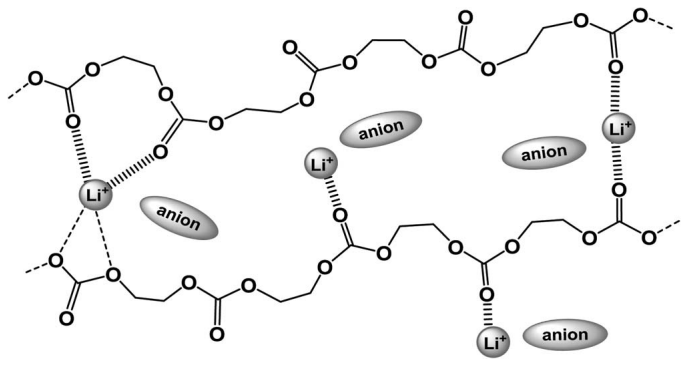

<!-- page 1 of 4 -->

Journal of The Electrochemical Society, 162 (2) A3133-A3136 (2015)

A3133

## [FOCUS ISSUE OF SELECTED PRESENTATIONS FROM IMLB 2014](http://jes.ecsdl.org/content/162/2.toc)

# Effect of Anions on Lithium Ion Conduction in Poly(ethylene carbonate)-based Polymer Electrolytes

**Yoichi Tominaga,**<strong>∗,z</strong> **Kenta Yamazaki, and Vannasa Nanthana**

Graduate School of Bio-Applications and Systems Engineering, Tokyo University of Agriculture and Technology, Koganei, Tokyo 184-8588, Japan

Poly(ethylene carbonate)-based polymer electrolytes with lithium salts (LiX; X = TFSI, ClO4, BF4 and PF6) were prepared, and their lithium transference numbers $( t _ { \pm } )$ were measured to make comparison between different anion radius and salt concentrations. The LiTFSI electrolytes had the highest $t _ { + }$ and Li-ion conductivities of all samples at 80 °C; these values increased with increasing salt concentration. According to the results of FT-IR measurements for all concentrated samples, the changes of band fraction, which divide at around $1 7 2 0 \; \mathrm { c m ^ { - 1 } }$ for carbonyl groups interact, with $\mathrm { L i ^ { + }   ( C { = } O \mathrm { \ldots }   L i ^ { + } ) }$ , are strongly related to the mobility of $\mathrm { L i ^ { + } }$ ions. © The Author(s) 2015. Published by ECS. This is an open access article distributed under the terms of the Creative Commons Attribution Non-Commercial No Derivatives 4.0 License (CC BY-NC-ND, [http://creativecommons.org/licenses/by-nc-nd/4.0/](http://creativecommons.org/licenses/by-nc-nd/4.0/)),which permits non-commercial reuse, distribution, and reproduction in any medium, provided the original work is not changed in any way and is properly cited. For permission for commercial reuse, please email: [oa@electrochem.org.](mailto:oa@electrochem.org) [DOI: [10.1149/2.0211502jes](http://dx.doi.org/10.1149/2.0211502jes)] All rights reserved.

Manuscript submitted September 25, 2014; revised manuscript received January 9, 2015. Published January 17, 2015. This was Paper 610 presented at the Como, Italy, Meeting of the IMLB, June 10–14, 2014. [This paper is part of the Focus Issue of Selected Presentations from IMLB 2014.](http://jes.ecsdl.org/content/162/2.toc)

For four decades polymer electrolytes have gained attention as soft ionic materials suitable for novel battery systems such as Li-ion secondary batteries,1,2 because of their greater safety than liquid electrolytes, their flexibility and their light weight. Unfortunately, the conductivity of typical polyether-based electrolytes such as poly(ethylene oxide) (PEO)-metal salt mixtures is not greater than about $1 0 ^ { - 4 }   \mathrm { S   c m ^ { - 1 } }$ at room temperature.3–5 Moreover, it is extremely difficult to increase the lithium transference number above 0.5.

We have recently considered polycarbonates, obtained by the alternating copolymerization of carbon dioxide with epoxides, and potential novel polymers for use as electrolytes.6–8 We focused on the chemical structure of the copolymer, which has a single carbonate group $( - \mathrm { O } { - } ( \mathrm { C } { = } \mathrm { O } ) { - } \mathrm { O } { - } )$ in each repeating unit of the main chain. Carbonate-based organic solvents are usually used as the electrolyte solution in Li-ion batteries, because of their high dielectric constant. The carbonate group therefore provides a suitable structure for the polymer framework. We reported in our previous studies that a commercial polycarbonate, poly(ethylene carbonate) (PEC) can be used as a novel polymer matrix for the electrolyte, and has extraordinary ion-conductive properties.9 The ionic conductivity of PEC-Li salt electrolytes increases with increasing salt concentration, whereas the conductivities of typical PEO-based electrolytes are maximum at around 5 mol% and decrease with increasing concentration.9 Moreover, we recently found that the lithium transference numbers $( t _ { + } )$ of PEC-based electrolytes are greater than 0.5, and that for their composites filled with small amount of $\mathrm { T i O } _ { 2 }$ the values are extremely high, more than $0 . 8 . ^ { 1 0 }$ In the present study, we focused on the effect of anions on Li-ion conduction in PEC, and studied $t _ { + }$ as a function of anion radius and salt concentration. Interactions between PEC and ions were also studied using FT-IR measurement for the first time.

## Experimental

Preparation of PEC-Li salt electrolytes.— Poly(ethylene carbonate) (PEC, $M_{n} = 3.7 \times 10^{4}$ was donated by a Japanese company. PEC was dissolved as received in chloroform, and the solution was added to excess methanol. The PEC precipitated was dried in a vacuum oven at 60◦C for 24 h. The 1H and $^ { 1 3 } \mathbf { C }$ NMR spectra of the purified PEC were observed, and the ratio of the carbonate units to all units in the main chain (carbonate and ethylene oxide units) was determined to be

approximately 95%.9 To prepare the electrolyte samples, the PEC was dissolved in acetonitrile with Lithium Battery Grade Li salts $( \mathrm { L i X } , \mathrm { X }   =$ $\mathrm{N}(\mathrm{SO}_{2} \mathrm{CF}_{3})_{2}$ (TFSI), ClO4, BF4 and $\mathrm { P F _ { 6 } } ,$ all purchased from Kishida Chemical Co.). The ratio of $\mathbf { L i ^ { + } }$ to the EC monomer unit of PEC was chosen as $5 \sim 8 0$ mol% $( [ \mathrm { L i ^ { + } } ] / [ \mathrm { E C } ] = 1 / 2 0 \sim 1 / 1 . 2 5 )$ . The homogeneous solution was cast onto a plastic dish, which has placed for several hours in a dry circulation chamber filled with $\mathrm{N}_{2}$ . The sample film was dried in a vacuum at 60◦C for 24 h and then introduced into a glove box filled with dry Ar gas.

Measurements.— The ionic conductivities of all electrolytes were measured in the glove box using the complex impedance method with a potentiostat/galvanostat SP-150 (BioLogic) in the frequency range 100 Hz to 1 MHz. Temperature dependences of the conductivity for all electrolytes are summarized in Figure S1 of Supplementary Material. To determine the lithium-ion transference number $( t _ { + } )$ of each sample, we used a conventional electrochemical method combined with DC polarization and AC impedance measurements for Li|electrolyte|Li cells. The measurement temperature was set at 80◦C because of large direct current and clear electrochemical response between Li electrode and electrolyte. The value of $t _ { + }$ can be estimated from the following equation:11

$$
t _ {+} = \frac {I _ {s} (\Delta V - I _ {0} R _ {0})}{I _ {0} (\Delta V - I _ {s} R _ {s})} \tag {[1]}
$$

where I is the direct current, R is the electron-transfer resistance between the Li electrode and electrolyte, and -V is the applied voltage (10 mV). The subscripts 0 and s refer respectively to the initial and steady-state (approx. after 24 hours). Before the first AC impedance measurement, the open circuit voltage of each cell was confirmed to be almost zero. The current and resistance were measured using an Impedance Analyzer 1280C (Solartron). The sample was sandwiched between two stainless plates, with 0.2 mm-thick Li foils as non-blocking electrodes. The entire process was carried out in an Ar gas-filled glove box, with control of the content of water and oxygen below 1 ppm. Differential scanning calorimetry (DSC) measurements of all samples were made using a DSC120 (Seiko Inst.) from −100 to 100◦C at a heating rate of $1 0 ^ { \circ } \mathrm { C } \min ^ { - 1 }$ under dry N2 gas (see Figure S2 of Supplementary Material). FT-IR spectra of neat PEC and of all electrolytes were recorded on a FT-IR spectrometer (FT/IR-4100, JASCO Co.), using an ATR unit (ZnSe lens) in the region from 400 to 4000 cm−1 with a resolution of 1 cm−1, under dry N2 gas. The resulting spectra were curve-fitted by a non-linear least-squares method

∗Electrochemical Society Active Member.
zE-mail: [ytominag@cc.tuat.ac.jp](mailto:ytominag@cc.tuat.ac.jp)

Downloaded on 2015-01-22 to IP 132.203.227.63 address. Redistribution subject to ECS terms of use (see [ecsdl.org/site/terms\_use](http://ecsdl.org/site/terms_use)) unless CC License in place (see abstract).

<!-- page 2 of 4 -->

A3134

Journal of The Electrochemical Society, 162 (2) A3133-A3136 (2015)

| Salt Concentration (mol%) | LiTFSI (t+) | LiClO4 (t+) | LiBF4 (t+) | LiPF6 (t+) |
| --- | --- | --- | --- | --- |
| 5 | — | — | — | ~0.41 |
| 20 | — | ~0.27 | ~0.22 | ~0.31 |
| 40 | ~0.57 | ~0.24 | ~0.17 | ~0.17 |
| 50 | — | — | ~0.16 | — |
| 60 | ~0.59 | ~0.23 | ~0.12 | — |
| 80 | ~0.63 | — | — | — |

Figure 1. Dependence on salt concentration of $: t _ { + }$ for PEC-Li salt electrolytes.

using an original curve resolution program having a straight baseline and a Gaussian product function for each band (see Figure S3 of Supplementary Material).

## Results and Discussion

The PEC electrolytes obtained using Li salt concentrations of 5, 20, 40, 50 and 60 mol% were all self-standing films, and those prepared with a Li salt concentration of 80 mol% were rubbery solids. It was impossible to measure $t _ { + }$ for salt concentrations greater than 60 mol% except for the LiTFSI electrolytes. The LiTFSI, LiClO4 and LiBF4 electrolytes were all transparent, and the LiPF6 electrolytes became slightly opaque films.

Lithium ion conduction in PEC-LiX electrolytes.— The values of $t _ { + }$ for all electrolyte samples were successfully estimated from Eq. 1, and are shown as a function of salt concentration in Figure 1. In the case of the $\mathrm { L i P F _ { 6 } }$ electrolytes, the value of $\left[ t _ { + } \right.$ at a concentration of 5 mol% was relatively high, above 0.4, but the value decreased drastically with increasing concentration. The decrease was also seen in the $\mathrm{LiClO_{4}}$ and $\mathrm { L i B F _ { 4 } }$ systems, and the values decreased gradually with increasing concentration to below 0.3. All behavior and values were in good agreement with the polyether-based electrolytes with some Li salts.12 For the PEO-LiPF6 electrolyte,12 the transference number was more than 0.5 at low salt concentrations, but the value decreased with increasing concentration and was close to 0.15 at concentrations higher than 30 mol%. This result implies that the $\mathrm { L i ^ { + } }$ conduction depends strongly on the segmental motion of PEO chains, and the decrease in $t _ { + }$ gives rise to a decrease in the number of free PEO segments, resulting in a decrease in the mobility of $\mathrm { L i ^ { + } }$ . The PEC-$\mathrm{LiClO_{4},LiBF_{4}}$ and $\mathrm { L i P F _ { 6 } }$ electrolytes are also considered to have the same conduction mechanism as in the PEO system. The LiTFSI system, in contrast, showed completely opposite behavior (see Figure 1). The values of $t _ { + }$ were greater than $0 . 5 ,$ and increased with increasing concentration to 0.63 at a concentration of 80 mol%. There are no pre-vious reports of such high $t _ { + }$ values for polyether-based electrolytes, and values are usually lower than $0 . 5$ in PEO-salt mixtures. Watanabe et al. have shown that amorphous polyether-based LiTFSI electrolytes have very low $t _ { + }$ values less than $0 . 1 . ^ { \dot { 5 } }$ Munshi et al. have also reported that crystalline PEO-based electrolytes also show low values less than 0.2 at Li salt concentration higher than 30 mol%.12 It is well known that, in the polyether electrolyte, dissociated $\mathbf { L i } ^ { + }$ stable interact with dipoles of ether oxygens in the polymer chains where the transference number is lowered.

Figure 2 shows the relation between transference numbers and the radius of anions dissociated into PEC electrolytes. Values of the anion radius were quoted from data reported by $\dot { \mathrm { U } \mathbf { e } _ { \cdot } ^ { 1 3 } }$ From this figure we confirm that the average $t _ { + }$ value in each electrolyte sample increases

| Series | Anion Radius (Å) | t+ at 80 \({}^{\circ}C\) |
| --- | --- | --- |
| LiTFSI | ~3.25 | ~0.63 |
| LiTFSI | ~3.25 | ~0.59 |
| LiTFSI | ~3.25 | ~0.57 |
| LiClO4 | ~2.38 | ~0.28 |
| LiClO4 | ~2.38 | ~0.26 |
| LiClO4 | ~2.38 | ~0.24 |
| LiBF4 | ~2.29 | ~0.22 |
| LiBF4 | ~2.29 | ~0.17 |
| LiBF4 | ~2.29 | ~0.16 |
| LiBF4 | ~2.29 | ~0.13 |
| LiPF6 | ~2.55 | ~0.41 |
| LiPF6 | ~2.55 | ~0.31 |
| LiPF6 | ~2.55 | ~0.17 |

Figure 2. Relation between dissolved anion radius and $t _ { + }$ for PEC-Li salt electrolytes with different salt concentrations in each electrolyte system.

with increasing anion radius. This fact indicates that large anions such as TFSI promote the migration of $\mathbf { L i } ^ { + }$ in PEC. In the case of lithium bis-(fluorosulfonyl) imide (LiFSI) in PEC, we can estimate $t _ { + }$ to be approximately 0.40∼0.45 from Figure 2, when we calculate the radius of a FSI anion as approximately 2.83 Å from the van der Waals volume.14 These estimated values are in fairly good agreement with our previous results (0.4∼0.5 at low salt concentrations, unpublished work) and with published reports (0.54 at 188 mol%).10 Comparison involving two LiTFSI electrolyte systems confirms that there are large differences in the transference numbers between PEO and PEC, exceeding 0.5. In the PEO system, low $t _ { + }$ values are due to the formation of strong coordination structures which depend on the interactions between $\check { \mathbf { L } } \mathbf { i } ^ { + }$ and the ether chains. On the other hand, significant high values of $t _ { + }$ for the PEC electrolytes were observed because of the structure of the polymer chain. The PEC has a single carbonate group in a monomer unit, and interactions probably take place between $\mathrm { L i ^ { + } }$ and dipoles such as carbonyl groups of the main chain. Strong and stable coordination structures of $\mathrm { L i ^ { + } }$ with polymer chains as seen in the PEO system are probably negligible in case of the PEC system.9,10

Based on the estimation of $t _ { + }$ for PEC-based electrolytes with a variety of anions, we can also compare the Li-ion conductivities $\sigma _ { \mathrm { L i } } ~ ( =   t _ { \mathrm { + } } ~ \times$ ionic conductivity (σ) at 80◦C) of these electrolytes as a function of salt concentration (Figure 3). The dependency on the salt concentration of σ for PEC-LiX electrolytes has already

| Salt Concentration (mol%) | LiTFSI (log \(\sigma Li)\) | LiClO4 (log \(\sigma Li)\) | LiBF4 (log \(\sigma Li)\) | LiPF6 (log \(\sigma Li)\) |
| --- | --- | --- | --- | --- |
| 5 | — | — | — | -5.0 |
| 20 | — | -5.1 | -5.4 | -5.9 |
| 40 | -4.7 | -4.5 | -4.6 | -6.4 |
| 50 | — | — | -4.6 | — |
| 60 | -4.1 | -5.2 | -4.8 | — |
| 80 | -3.7 | — | — | — |

Figure 3. Dependence on salt concentration of $\mathbf { \sigma _ { L i } }$ for PEC-Li salt electrolytes.

Downloaded on 2015-01-22 to IP 132.203.227.63 address. Redistribution subject to ECS terms of use (see [ecsdl.org/site/terms\_use](http://ecsdl.org/site/terms_use)) unless CC License in place (see abstract).

<!-- page 3 of 4 -->

Journal of The Electrochemical Society, 162 (2) A3133-A3136 (2015)

A3135

| Sample | Absorbance Trend |
| --- | --- |
| Neat PEC | Peaks at ~1700, ~1350, ~1250, ~1150, ~950, ~850, ~750 |
| LiPF6 | Peaks at ~1700, ~1350, ~1250, ~1150, ~950, ~850, ~750 |
| LiBF4 | Peaks at ~1700, ~1350, ~1250, ~1150, ~950, ~850, ~750 |
| LiClO4 | Peaks at ~1700, ~1350, ~1250, ~1150, ~950, ~850, ~750 |
| LiTFSI | Peaks at ~1700, ~1350, ~1250, ~1150, ~950, ~850, ~750 |

Figure 4. FT-IR spectra $( 2 0 0 0 { \sim } 7 0 0 \; \mathrm { c m } ^ { - 1 } )$ of neat PEC and the electrolytes at a salt concentration of 40 mol%.

been reported,9 and the dependency for $\mathrm{LiClO_{4}}$ and LiTFSI electrolytes is similar to those as seen in Figure 3. For the $\mathrm { L i P F _ { 6 } }$ electrolyte, $\mathbf { \sigma _ { L i } }$ decreased drastically with increasing concentration. For the $\dot{\mathrm{LiClO}_{4}}$ and $\mathrm { L i B F _ { 4 } }$ electrolytes, $\sigma _ { \mathrm { L i } }$ was greatest at a concentration of 40 mol%, which is an extremely high proportion compared with the typical polyether system (approx. 5 mol%).3–5 The value of $\mathbf { \sigma _ { L i } }$ for LiTFSI electrolytes increased linearly with increasing concentration, and the value at 80 mol% was at least $1 0 ^ { - 4 } \mathrm { S c m ^ { - 1 } }$ . This behavior was also observed in the LiFSI electrolyte system,10 and the increase in conductivity at very high salt concentrations is due to the decrease in the glass transition temperature, $T _ { \mathrm { g } } ,$ of $\mathrm { { P E C } . ^ { 9 , 1 0 } }$ For the LiTFSI electrolytes in particular, the plasticizing effect of TFSI anions may influence the decrease in $T _ { \mathrm { g } }$ of PEC, but it is impossible to explain such a large decrease on this effect alone. In fact, LiTFSI has a similar effect with polyethers such as PEO, but the $T _ { \mathrm { g } }$ value of PEO increases with increasing LiTFSI concentration.5

FT-IR spectra of PEC-LiX electrolytes.— To study the dissociation state of $\mathrm { L i ^ { + } }$ in PEC, we observed the FT-IR spectra of neat PEC and the Li salt electrolytes. Figure 4 shows spectra of these electrolytes at a salt concentration of 40 mol%. It has been reported previously that dissolved $\mathrm { L i ^ { + } }$ usually interacts strongly with dipoles of carbonyl oxygens $( \mathrm { C } { = } 0 )$ and ether oxygens $( \mathrm { O } { - } \mathrm { \tilde { C } } { - } \mathrm { \tilde { O } } )$ in electrolyte solutions such as propylene carbonate $( \dot { \mathrm { P C } } )$ and dimethyl carbonate (DMC).15,16 The $\hat { 0 } \hat { - } \hat { C } \hat { - } \hat { 0 }$ asymmetric stretching mode at around $1 3 0 0   \mathrm { c m ^ { - 1 } }$ in DMC is very sensitive to the interaction with $\mathrm { L i ^ { + } , ^ { 1 6 } }$ but the band sometimes overlaps with other bands such as the TFSI anion $( 1 3 0 0 { \sim } 1 2 0 0 \; \mathrm { c m } ^ { - 1 }$ in Figure 4), making it difficult to characterize interactions. The band

chemical

Molecular structure diagram showing lithium ion coordination with anion ligands

Figure 5. Structural image of interactions of $\mathrm { L i ^ { + } }$ with carbonate groups in PEC-Li salt electrolyte at a salt concentration of 40 mol%.

of the $\mathbf { C } \mathbf { = } \mathbf { O }$ stretching vibration $( \nu _ { \mathrm { C = O } } )$ mode at around $1 7 5 0 ~ \mathrm { c m ^ { - 1 } }$ usually appears without overlaps and is suitable for detailed study, and we focused on this region (highlighted by dot-line square in Figure 4 and summarized separately in Figure 3S of the Supplementary Material). In the case of DMC, the interacting $\nu _ { \mathrm { C = O } }$ band appears at the lower wavenumber upon addition of Li salt $\cdot ^ { 1 5 } \mathrm { A s }$ seen in Figure 4, the interacting band $( \mathrm { C } \dot { = } \mathrm { O }   \mathrm { \overline { { \quad } }   L i ^ { + } } )$ at around $1 7 2 0   \mathrm { c m } ^ { - 1 } ,$ shifted from the free $\dot { \mathbf { C } \mathbf { = } \mathbf { O } }$ band value (in neat PEC at $1 7 4 0 ~ \mathrm { c m ^ { - 1 } ) }$ appears very clearly in the LiTFSI, $\mathrm{LiClO_{4}}$ and $\mathrm { L i B F _ { 4 } }$ electrolytes. The $\mathrm { L i P F _ { 6 } }$ electrolyte appears to have no interacting band, but a very small shoulder-like band is included with the free $\dot { \mathrm { C } } { = } 0$ band.

The $\nu _ { \mathrm { C = O } }$ region of all PEC-based electrolytes is divided into two bands at around 1750 and $1 7 2 0 \; \mathrm { c m } ^ { - 1 }$ ; Table I summarizes each fraction and wavenumber at the peak-top. If the fraction of interacting $\mathbf { C } \mathbf { = } \mathbf { O }$ groups is larger than that for free ones, dissociated $\mathrm { L i ^ { + } }$ (carrier ions) are more numerous than undissociated and aggregated ions in PEC. The average fraction of interacting $\mathbf { C } \mathbf { = } \mathbf { O }$ groups was smallest for $\mathrm { L i P F _ { 6 } }$ electrolytes, and this probably indicates that $\mathrm { L i P F _ { 6 } }$ has a low degree of dissociation in PEC. The $\mathrm{LiClO_{4}}$ and $\mathrm { L i B F _ { 4 } }$ electrolytes had the largest fractions of interacting $\mathbf { C } \mathbf { = } \mathbf { O }$ groups at a concentration of 40 mol%; these results correlate with the highest values of $\sigma _ { \mathrm { L i } }$ in Figure 3. The LiTFSI electrolytes had continually high fractions of interacting $\mathbf { C } \mathbf { = } \mathbf { O }$ groups, approximately 60% at all salt concentrations. The transference numbers and conductivities of the LiTFSI electrolytes are therefore higher, as seen in Figures $1 { - } 3 .$ , because of the greater dissociation state of $\mathrm { L i ^ { + } }$ . Interacting $\mathbf { C } \mathbf { = } \mathbf { O }$ groups in PEC are considered to enable migration of $\mathbf { L i } ^ { + }$ faster than that coordinated with ether chains in PEO. The TFSI anion (approx. 3.25 Å) is much larger than $\mathrm { L i ^ { + } }$ (approx. 0.76 $\mathring { \mathrm { A } } ) , ^ { 1 3 }$ and the increase in the transference numbers in PEC may be due simply to the difference in molecular mass between these ions (TFSI anion is more than 44-times

Table I. Fractions of free and interacting carbonyl groups in PEC-Li salt electrolytes as determined by the curve-fitting analysis of FT-IR spectra for the C=O stretching vibrational $( \mathfrak { v } _ { \mathbf { C } = \mathbf { 0 } } )$ mode.

<table><tr><td rowspan="2">Li salt</td><td rowspan="2">Concentration to PEC /mol%</td><td colspan="2">Free C=O groups</td><td colspan="2">Interacting C=O groups</td></tr><tr><td>Fraction /%</td><td>Wavenumber /cm $^{-1}$ </td><td>Fraction /%</td><td>Wavenumber /cm $^{-1}$ </td></tr><tr><td rowspan="4">LiTFSI</td><td>20</td><td>45</td><td>1755</td><td>55</td><td>1721</td></tr><tr><td>40</td><td>42</td><td>1748</td><td>58</td><td>1724</td></tr><tr><td>60</td><td>43</td><td>1746</td><td>57</td><td>1720</td></tr><tr><td>80</td><td>43</td><td>1749</td><td>57</td><td>1723</td></tr><tr><td rowspan="3"> $LiClO_4$ </td><td>20</td><td>58</td><td>1746</td><td>42</td><td>1716</td></tr><tr><td>40</td><td>30</td><td>1750</td><td>70</td><td>1720</td></tr><tr><td>60</td><td>34</td><td>1747</td><td>66</td><td>1721</td></tr><tr><td rowspan="4"> $LiBF_4$ </td><td>20</td><td>61</td><td>1750</td><td>38</td><td>1718</td></tr><tr><td>40</td><td>34</td><td>1751</td><td>66</td><td>1723</td></tr><tr><td>50</td><td>43</td><td>1750</td><td>57</td><td>1724</td></tr><tr><td>60</td><td>48</td><td>1748</td><td>52</td><td>1721</td></tr><tr><td rowspan="2"> $LiPF_6$ </td><td>20</td><td>61</td><td>1750</td><td>39</td><td>1720</td></tr><tr><td>40</td><td>60</td><td>1742</td><td>40</td><td>1720</td></tr></table>

Downloaded on 2015-01-22 to IP 132.203.227.63 address. Redistribution subject to ECS terms of use (see [ecsdl.org/site/terms\_use](http://ecsdl.org/site/terms_use)) unless CC License in place (see abstract).

<!-- page 4 of 4 -->

A3136

Journal of The Electrochemical Society, 162 (2) A3133-A3136 (2015)

heavier than $\mathbf { L i ^ { + } } )$ . The $\mathrm { L i ^ { + } }$ can therefore migrate faster than the anion in PEC matrix, whereas the $\mathrm { L i ^ { + } }$ interact with $\mathbf { C } \mathbf { = } \mathbf { O }$ groups. The structural image of a PEC-Li salt electrolyte (40 mol%) is finally shown in Figure 5. In case of the carbonate-based liquid electrolytes, Zhou et al. have discussed that the interaction of $\mathrm { L i ^ { + } }$ occurs mainly through oxygens of $\mathbf { C } \mathbf { = } \mathbf { O }$ and ether (O–C–O) groups.16 In the PEC system, there are complex interactions of $\mathrm { L i ^ { + } }$ with carbonate unit(s). We think that the interacting single $\mathbf { C } \mathbf { = } \mathbf { O }$ groups may exist and this interaction makes $\mathrm { L i ^ { + } }$ easy to migrate faster via the segmental motion of PEC chains.

## Conclusions

This study has focused on the effect of anions on Li-ion conduction in PEC, and determined the lithium transference number $( t _ { + } )$ as a function of anion radius and salt concentration. The values of $t _ { + }$ for PEC-LiTFSI electrolytes were greater than $0 . 5 ,$ and increased with increasing concentration up to 0.63 at a concentration of 80 mol%. The dependency of $t _ { + }$ on the anion radius indicates that large anions such as TFSI promote the migration of $\mathbf { L i ^ { + } }$ in PEC. The Li-ion conductivity $\sigma _ { \mathrm { L i } }$ of LiTFSI electrolytes increased linearly with increasing concentration. The value at 80 mol% was the highest of all electrolytes, and beyond $1 0 ^ { - 4 } \; \mathrm { S \; c m ^ { - 1 } }$

We also carried out FT-IR measurements for neat PEC and all concentrated electrolytes in order to characterize the dissociation state of carrier ions in PEC. The stretching vibration mode of carbonyl (C=O) groups for all PEC-based electrolytes was divided into two bands at around 1750 and $1 7 2 0 ~ \mathrm { c m ^ { - 1 } }$ , which are due to the free and interacting $\mathbf { C } \mathbf { = } \mathbf { O }$ groups. The changes in the band fraction at around $1 7 2 0 \; \mathrm { c m } ^ { - 1 }$ for interacting $\mathbf { C } \mathbf { = } \mathbf { O }$ groups with $\mathrm { L i ^ { + } \; ( C { = } O \; { \overline { { \mathrm { ~ \text ~ } } } } \; L i ^ { + } ) }$ are

strongly related to the mobility of $\mathrm { L i ^ { + } }$ in PEC. It is possible that PEC does not form any stronger stable coordination structures with $\mathrm { L i ^ { + } }$ , as seen in the typical polyether system.

## Acknowledgment

This work was financially supported by the Specially Promoted Research for Innovative Next Generation Batteries of the Advanced Low Carbon Technology Research and Development Program (ALCA-SPRING) from the Japan Science and Technology Agency (JST), Japan.

## References

1. J. M. Tarascon and M. Armand, [Nature,](http://dx.doi.org/10.1038/35104644) 414, 359 (2001).
2. B. Scrosati and J. Garche, [J. Power Sources,](http://dx.doi.org/10.1016/j.jpowsour.2009.11.048) 195, 2419 (2010).
3. M. A. Ratner and D. F. Shriver, [Chem. Rev.,](http://dx.doi.org/10.1021/cr00083a006) 88, 109 (1988).
4. S. Takeoka, H. Ohno, and E. Tsuchida, [Polym. Adv. Technol.,](http://dx.doi.org/10.1002/pat.1993.220040202) 4, 53 (1993).
5. A. Nishimoto, K. Agehara, N. Furuya, T. Watanabe, and M. Watanabe, [Macromolecules,](http://dx.doi.org/10.1021/ma981436q) 32, 1541 (1999).
6. Y. Tominaga, T. Shimomura, and M. Nakamura, [Polymer,](http://dx.doi.org/10.1016/j.polymer.2010.07.037) 51, 4295 (2010).
7. M. Nakamura and Y. Tominaga, [Electrochim. Acta,](http://dx.doi.org/10.1016/j.electacta.2011.03.003) 57, 36 (2011).
8. V. Nanthana and Y. Tominaga, [Kobunshi Ronbunshu,](http://dx.doi.org/10.1295/koron.70.23) 70, 23 (2013).
9. Y. Tominaga, V. Nanthana, and D. Tohyama, [Polym. J.,](http://dx.doi.org/10.1038/pj.2012.97) 44, 1155 (2012).
10. Y. Tominaga and K. Yamazaki, [Chem. Commun.,](http://dx.doi.org/10.1039/c3cc49588d) 50, 4448 (2014).
11. J. Evans, C. A. Vincent, and P. G. Bruce, [Polymer,](http://dx.doi.org/10.1016/0032-3861%2887%2990394-6) 28, 2324 (1987).
12. M. Z. A. Munshi, B. B. Owens, and S. Nguyen, [Polym. J.,](http://dx.doi.org/10.1295/polymj.20.597) 20, 597 (1988).
13. M. Ue, [J. Electrochem. Soc.,](http://dx.doi.org/10.1149/1.2059336) 141, 3336 (1994).
14. H.-B. Han, S.-S. Zhou, D.-J. Zhang, S.-W. Feng, L.-F. Li, K. Liu, W.-F. Feng, J. Nie, H. Li, X.-J. Huang, M. Armand, and Z.-B. Zhou, [J. Power Sources,](http://dx.doi.org/10.1016/j.jpowsour.2010.12.040) 196, 3623 (2011).
15. J. J. Wang, Y. P. Wu, X. P. Xuan, and H. Q. Wang, [Spectrochim. Acta A,](http://dx.doi.org/10.1016/S1386-1425%2801%2900686-2) 58, 2097 (2002).
16. B. Zhang, Y. Zhou, X. Li, X. Ren, H. Nian, Y. Shen, and Q. Yun, [Spectrochim. Acta A,](http://dx.doi.org/10.1016/j.saa.2013.11.054) 122, 59 (2014).

Downloaded on 2015-01-22 to IP 132.203.227.63 address. Redistribution subject to ECS terms of use (see [ecsdl.org/site/terms\_use](http://ecsdl.org/site/terms_use)) unless CC License in place (see abstract).