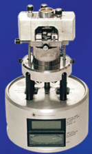
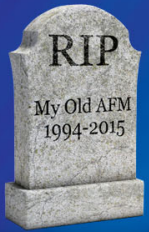
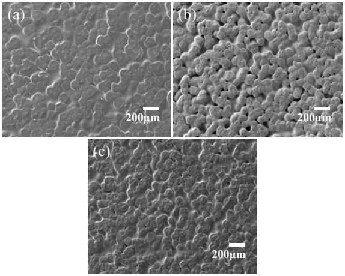
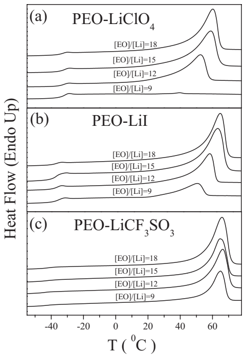

<!-- page 1 of 7 -->

AIP

Journal of Applied Physics

## A comparison of ion transport in different polyethylene oxide–lithium salt composite electrolytes

[A. Karmakar](http://scitation.aip.org/search?value1=A.+Karmakar&option1=author) and [A. Ghosh](http://scitation.aip.org/search?value1=A.+Ghosh&option1=author)

Citation: [Journal of Applied Physics](http://scitation.aip.org/content/aip/journal/jap?ver=pdfcov) **107**, 104113 (2010); doi: 10.1063/1.3428389

View online: [http://dx.doi.org/10.1063/1.3428389](http://dx.doi.org/10.1063/1.3428389)

View Table of Contents: [http://scitation.aip.org/content/aip/journal/jap/107/10?ver=pdfcov](http://scitation.aip.org/content/aip/journal/jap/107/10?ver=pdfcov)

Published by the [AIP Publishing](http://scitation.aip.org/content/aip?ver=pdfcov)

**Articles you may be interested in**

[Optical and dielectric properties of TiO 2 doped PVA - CN / LiClO 4 composite electrolyte](http://scitation.aip.org/content/aip/proceeding/aipcp/10.1063/1.4791519?ver=pdfcov)

AIP Conf. Proc. **1512**, 1278 (2013); 10.1063/1.4791519

[Conductivity studies on PEMA based polymer electrolyte system with LiClO 4 salt](http://scitation.aip.org/content/aip/proceeding/aipcp/10.1063/1.4791486?ver=pdfcov)

AIP Conf. Proc. **1512**, 1212 (2013); 10.1063/1.4791486

[Structural and impedance studies of doped LLT materials for electrolytes of lithium-ion batteries](http://scitation.aip.org/content/aip/proceeding/aipcp/10.1063/1.4710472?ver=pdfcov)

AIP Conf. Proc. **1447**, 1265 (2012); 10.1063/1.4710472

[Role of SnO2 as a filler in (PEO)50AgCF3SO3 nanocomposite polymer electrolyte system](http://scitation.aip.org/content/aip/proceeding/aipcp/10.1063/1.4710048?ver=pdfcov)

AIP Conf. Proc. **1447**, 399 (2012); 10.1063/1.4710048

[Characterization studies of plasticized PEO-PMMA nano-composite polymer electrolyte system](http://scitation.aip.org/content/aip/proceeding/aipcp/10.1063/1.4709969?ver=pdfcov)

AIP Conf. Proc. **1447**, 241 (2012); 10.1063/1.4709969

Frustrated by old technology?

Is your AFM dead and can't be repaired?

Sick of bad customer support?

natural_image

Man in light blue shirt and tie shouting with raised fists against blue background (no text or symbols)

## It is time to upgrade your AFM

Minimum &#36;20,000 trade-in discount for purchases before August 31st

Asylum Research is today's technology leader in AFM

dropmyoldAFM@oxinst.com

The Business of Science\*

[This article is copyrighted as indicated in the article. Reuse of AIP content is subject to the terms at: http://scitation.aip.org/termsconditions. Downloaded to ] IP: 205.133.226.104 On: Fri, 12 Jun 2015 04:18:14

<!-- page 2 of 7 -->

JOURNAL OF APPLIED PHYSICS 107, 104113 2010-

# [A comparison of ion transport in different polyethylene oxide–lithium salt composite electrolytes](http://dx.doi.org/10.1063/1.3428389)

A. Karmakar and A. Ghosha

Department of Solid State Physics, Indian Association for the Cultivation of Science, Jadavpur, Kolkata 700 032, India

Received 5 March 2010; accepted 15 April 2010; published online 24 May 2010-

Polyethylene oxide PEO- and lithium salts $(LiI, LiClO _{4}  ,$ and $\mathrm{LiCF}_{3}\mathrm{SO}_{3})$ based composite polymer electrolytes have been prepared for different EO/Li ratio using solution casting method and characterized by x-ray diffraction XRD-, scanning electron microscope, and differential scanning calorimetry DSC-. The electrical measurements have been carried out at different temperatures. XRD patterns, field emission scanning electron micrographs, and DSC clearly depict that amorphous region in the $\mathrm{PEO--LiClO_{4}}$ composite electrolyte with $\mathrm{[EO]}/\mathrm{[Li]}{=}9$ is dominant over the other electrolytes. It has been observed that the electrical conductivity of the $\mathrm{PEO--LiClO_{4}}$ electrolyte is higher than that of the PEO–LiI and $\mathrm{PEO--LiCF}_{3}\mathrm{SO}_{3}$ composite electrolytes. It has been also observed that the hoping rate of charge carriers for the $\mathrm{PEO--LiClO_{4}}$ electrolyte is higher than that of the other two electrolytes. The concentration of charge carriers is not thermally activated and the mobility controls the temperature dependence of electrical properties. Scaling of the conductivity spectra has been performed in order to get insight into the relaxation mechanisms.

© 2010 American Institute of Physics. doi:[10.1063/1.3428389](http://dx.doi.org/10.1063/1.3428389)

## I. INTRODUCTION

Over the last two decades polymer electrolyte complexes having considerable ionic conductivity have been studied extensively for application in solid-state lithium ion rechargeable batteries.1–5 In particular, PEO–lithium salt complexes6–8 are very interesting due to the high energy density, better cycle ability, and safety when they are used as electrolytes in solid-state battery.

Though PEO has better flexibility, good complexation properties, and good mechanical stability, the conductivity below melting point of PEO is restricted due to high crystalline phase. Some authors7,11 have reported that insertion of inorganic salts reduces the crystallinity and, therefore, increases the conductivity of composite electrolytes. It is well established that the nature of polymer–salt complexes, at room temperature, is biphasic consisting of both amorphous region and crystalline phase. Li+ ion transport in PEO electrolytes is, generally, governed by the local relaxation and segmental motion of PEO chains. The charge transfer process occurs when PEO is in the amorphous phase.11–14 The high dissociation degree of lithium salts is essential for achieving high ionic conductivity in polymer complexes. This can be obtained when lattice energy of the salts is low and the host polymer has high dielectric constant. Also polymers containing a Lewis base in case of PEO it is ether oxygen- facilitate the dissolution of the salts due to coordination with the cations. Driven by their potential application in devices, there has been much interest in the mechanism of ion conduction in solid polymer electrolytes.15

The study of electrical relaxation in polymer–lithium salt complexes provides an important bearing on the viability of

such materials for use as electrolytes in lithium ion batteries, which is still an unresolved problem. In order to gain further insight into the understanding of ion transport processes we have studied the electrical conductivity and relaxation in PEO–LiX $(X=I ^{-},\  ClO _{4}^{-},\  CF _{3} SO _{3}^{-} )$ composite polymer electrolytes for different EO/Li ratio.

## II. EXPERIMENTAL PROCEDURE

For the preparation of $\mathrm{PEO-LiI/LiClO_{4}/LiCF_{3}SO_{3}}$ composite electrolyte PEO MW= 400 000, Aldrich- and appropriate amount of vacuum dried anhydrous $\mathrm{LiI/LiClO_{4}/LiCF_{3}SO_{3}}$ Aldrich- were dissolved in acetonitrile under stirring condition. The molar ratio of the ethylene oxide segments to the lithium ions i.e., EO/Li- were varied during preparation. After stirring for 8–10 h at room temperature, the solutions became very thick due to solvent evaporation. Finally, they were cast in PTFE containers and dried in vacuum at a pressure 0.01 mbar- at 60 °C for 36 h to form the homogeneous free standing films. Good free standing films were obtained for EO / Li = 9, 12, 15, and 18.

X-ray diffraction XRD- patterns of the as-prepared PEO–LiI, $\mathrm{PEO--LiClO_{4}}$ and $\mathrm{PRO} - \mathrm{LiCF}_{3}\mathrm{SO}_{3}$ samples were recorded in an x-ray diffractometer Rich-Seifert, model 3000P- using Cu $K _ { \alpha }$ radiation and scan rate of 0.02°/s. The surface morphology of the films was studied using a field emission scanning electron microscope FE-SEM- JEOL JSM-6700F-. The differential scanning calorimetry DSC-experiments were performed at a heating scan rate 10 °C/min in Perkin-Elmer DSC-7 in $\mathrm{N}_{2}$ atmosphere. Electrical measurements such as capacitance and conductance of the samples were measured at different temperatures in an anhydrous environment in the frequency range 10 Hz–2 MHz using a RLC meter QuadTech, model 7600-. A con-

<small>a-Author to whom correspondence should be addressed. Electronic mail: sspag@iacs.res.in.</small>

0021-8979/2010/107-10/104113/6/&#36;30.00

107, 104113-1

© 2010 American Institute of Physics

[This article is copyrighted as indicated in the article. Reuse of AIP content is subject to the terms at: http://scitation.aip.org/termsconditions. Downloaded to ] IP:

205.133.226.104 On: Fri, 12 Jun 2015 04:18:14

<!-- page 3 of 7 -->

104113-2

A. Karmakar and A. Ghosh

J. Appl. Phys. 107, 104113 -2010

| Sample | [EO]/[Li] Ratio | Peak Position \((2\theta\) degree) |
| :--- | :--- | :--- |
| PEO-LiClO4 | 12 | ~19, ~24 |
| PEO-LiClO4 | 18 | ~19, ~24 |
| PEO-LiClO4 | 15 | ~19, ~24 |
| PEO-LiClO4 | 12 | ~19, ~24 |
| PEO-LiClO4 | 9 | ~19, ~24 |
| PEO-LiCF3SO3 | 12 | ~19, ~24 |
| PEO-LiCF3SO3 | 18 | ~19, ~24 |
| PEO-LiCF3SO3 | 15 | ~19, ~24 |
| PEO-LiCF3SO3 | 12 | ~19, ~24 |
| PEO-LiCF3SO3 | 9 | ~19, ~24 |

FIG. 1. a- XRD patterns for $\mathrm{PEO{-}LiClO_{4}}$ , PEO–LiI, and PEO–LiCF3SO3 electrolytes for EO / Li = 12. b- XRD patterns for PEO–LiI electrolyte for different EO/Li ratio.

ductivity cell containing two stainless steel blocking electrodes was used for the ac measurements. The dc conductivity at different temperatures was obtained from the complex impedance plots.

## III. RESULTS AND DISCUSSIONS

The XRD patterns for the $\mathrm{PEO\text{-}LiClO_{4}},$ PEO–LiI and $\mathrm{PEO--LiCF_{3}SO_{3}}$ composite electrolytes are shown in Fig. 1a- for $\left[  EO  \right] / \left[  Li  \right] {=} 12$ for each case, while Fig. 1b- shows the XRD patterns for the PEO–LiI composite electrolyte for various EO/Li ratio. It is observed that the peak positions occurring due to the crystallinity of the PEO in all the electrolytes remains essentially unaltered but the relative peak intensity of the samples differs. For the $\mathrm{PEO--LiClO_{4}}$ composite electrolyte cf. Fig. 1a- the peak intensity is the lowest, whereas the peak intensity for the $\mathrm{PEO--LiCF_{3}SO_{3}}$ composite electrolyte is the highest. Since the decrease in relative peak intensity corresponds to a decrease in crystallinity, the crystalline phase for the $\mathrm{PEO--LiClO_{4}}$ composite electrolyte is less than those of the other electrolytes. It is observed in Fig. 1b- that the peak intensity increases with the increase in EO/Li ratio for PEO–LiI electrolyte. Other electrolytes show similar behavior for different EO/Li ratio. Thus the crystalline phase increases with the increase in EO/Li ratio for all the electrolytes studied here.

Figure 2 shows FE-SEM micrographs for the $\mathrm{PEO\text{-}LiClO_{4}}$ PEO–LiI and $\mathrm{PEO--LiCF}_{3}\mathrm{SO}_{3}$ composite electrolytes for the same EO/Li ratio, while Fig. 3 shows FE-SEM micrographs for the $\mathrm{PEO-LiClO_{4}}$ composite electrolyte for different EO/Li ratio. The micrographs of all the samples exhibit crystalline structures separated by amorphous region. The small pores, which are present in the micrographs, are caused by the fast evaporation of the acetonitrile solvent during the preparation process. It is further

FIG. 2. Field emission scanning electron micrographs for $(a)  $\mathrm{PEO{-}LiClO_{4}}$$ b- PEO–LiI and c- $\mathrm{PEO}-\mathrm{LiCF}_{3}\mathrm{SO}_{3}$ electrolytes for $\left[  EO  \right] / \left[  Li  \right] {=} 12.$

observed in these figures that relative smoothness of the surface is better for the $\mathrm{PEO-LiClO_{4}}$ composite electrolyte than that of other two electrolytes. It is also observed in Fig. 3 that the relative smoothness of the surface decreases and crystalline structures of the PEO becomes prominent when EO/Li ratio are increased. The smooth surface morphology is closely related to the reduction in the crystallinity of PEO. Thus the crystallinity of the PEO is much less in the $\mathrm{PEO-LiClO_{4}}$ composite electrolyte for EO / Li = 9, which is also confirmed from XRD studies.

The DSC curves for all the electrolytes are displayed in Fig. 4. The thermodynamic properties such as glass transition temperature $( \mathrm { T } _ { \mathrm { g } } ) ,$ , melting temperature $( \mathrm { T _ { m } } )$ , and melting enthalpy $( \Delta \mathrm { H _ { m } } )$ have been obtained from DSC results and are summarized in Table I. The percentage of crystalline PEO $( \mathrm { X _ { c } } )$ has been calculated using the equation $\mathrm{X_{c}}$ $\mathrm { = } \Delta \mathrm { H _ { m } } / \Delta \mathrm { H _ { P E O } } ,$ where $\Delta \mathrm { H _ { m } }$ is the melting enthalpy of the sample and $\Delta \mathrm { H } _ { \mathrm { P E O } }$ is the melting enthalpy of completely crystalline PEO, namely 213.7 J/g Ref. 16. It is noted in Table I that the percentage of crystalline phase of PEO decreases with the decrease in EO/Li ratio for each series. It can be observed Table I- that the effect of the salt concentration EO/Li ratio- on $\mathrm { T _ { g } }$ for all electrolytes is not sig-

FIG. 3. Field emission scanning electron micrographs for $\mathrm{PEO--LiClO_{4}}$ electrolytes for a- EO / Li = 9, b- EO / Li = 12, c- $\left[  EO  \right] / \left[  Li  \right] {=} 15,$ and d- $\left[  EO  \right] / \left[  Li  \right] {=} 18.$

[This article is copyrighted as indicated in the article. Reuse of AIP content is subject to the terms at: http://scitation.aip.org/termsconditions. Downloaded to ] IP: 205.133.226.104 On: Fri, 12 Jun 2015 04:18:14

<!-- page 4 of 7 -->

104113-3

A. Karmakar and A. Ghosh

J. Appl. Phys. 107, 104113 -2010

FIG. 4. DSC curves of a- $\mathrm{PEO-LiClO_{4}}$ b- PEO–LiI and c-PEO– $-LiCF _3 SO _3$ electrolytes shown for different EO/Li ratio.

nificant. One possible reason is that as the salt concentration is increased, formation of ion-pairing occurs and the numbers of free Li ions remain more or less constant. It is also observed that $\mathrm{PEO}-\mathrm{LiCF}_{3}\mathrm{SO}_{3}$ electrolytes possess lowest $\mathrm { T _ { g } }$ value. It is worthy to note that $\mathrm{LiCF}_{3}\mathrm{SO}_{3}$ ions have permanent dipole moments in contrast to $\mathrm{LiClO_{4}}$ and LiI ions and because of this reason $\mathrm{LiCF}_{3}\mathrm{SO}_{3}$ ions interact strongly with the polymer chains. This strong interaction together with the complexity of the $\mathrm{LiCF}_{3}\mathrm{SO}_{3}$ ions decreases $\mathrm { T _ { g } }$ for $\mathrm{PEO--LiCF}_{3}\mathrm{SO}_{3}$ electrolytes.18 The melting temperature $( \mathrm { T _ { m } } )$ shows a gradual increase with the increase in EO/Li ratio and so also the degree of crystallinity. The amorphous phase present in $\mathrm{PEO--LiClO_{4}}$ electrolytes is highest as compared with other electrolytes.

The dc electrical conductivity, obtained from the complex impedance plots, is shown in Fig. 5a- as a function of reciprocal temperature for different electrolytes with the

TABLE I. Comparison of thermal parameters of PEO–LiX $(X=I ^{-},\  ClO _{4}^{-}  )$ CF3SO−- electrolytes.

<table><tr><td>Compositions</td><td>[EO]/[Li]</td><td> $T_g$ (°C)</td><td> $T_m$ (°C)</td><td>ΔH(J/g)</td><td>% $X_c$ </td></tr><tr><td rowspan="4">PEO-LiClO4</td><td>9</td><td>-31.28</td><td>39.63</td><td>1.986</td><td>0.93</td></tr><tr><td>12</td><td>-31.56</td><td>52.55</td><td>48.242</td><td>22.57</td></tr><tr><td>15</td><td>-31.22</td><td>58.96</td><td>64.416</td><td>30.14</td></tr><tr><td>18</td><td>-32.25</td><td>60.31</td><td>81.810</td><td>38.28</td></tr><tr><td rowspan="4">PEO-LiI</td><td>9</td><td>-35.54</td><td>48.36</td><td>24.664</td><td>11.54</td></tr><tr><td>12</td><td>-36.35</td><td>55.92</td><td>51.936</td><td>24.30</td></tr><tr><td>15</td><td>-35.69</td><td>60.64</td><td>70.781</td><td>33.12</td></tr><tr><td>18</td><td>-36.52</td><td>62.16</td><td>82.108</td><td>38.42</td></tr><tr><td rowspan="4">PEO-LiCF3SO3</td><td>9</td><td>-42.63</td><td>64.82</td><td>58.952</td><td>27.59</td></tr><tr><td>12</td><td>-43.78</td><td>66.30</td><td>78.168</td><td>36.58</td></tr><tr><td>15</td><td>-42.57</td><td>64.79</td><td>88.974</td><td>41.64</td></tr><tr><td>18</td><td>-41.88</td><td>65.96</td><td>95.535</td><td>44.71</td></tr></table>

FIG. 5. a- dc conductivity plotted as a function of inverse temperature for PEO–LiClO4, PEO–LiI, and $\mathrm{PEO}-\mathrm{LiCF}_{3}\mathrm{SO}_{3}$ for $\mathrm{[EO]}/\mathrm{[Li]}\dot{=}12$ . b- dc conductivity with reciprocal temperature for $\mathrm{PEO-LiClO_{4}}$ for different values of the EO/Li ratio. The solid lines are the least square straight-line fits to the experimental data.

same EO/Li ratio. Figure 5b- shows the same for the $\mathrm{PEO-LiClO_{4}}$ composite electrolyte with different EO/Li ratio. It is noted that the plots in all cases are linear obeying the Arrhenius relation given by

$$
\sigma = \sigma_ {0} \exp (- \mathrm{E} _ {\mathrm{a}} / \mathrm{k} _ {\mathrm{B}} \mathrm{T}), \tag {1}
$$

where, $\sigma _ { 0 }$ is the pre-exponential factor, $\mathrm { E _ { a } }$ is the activation energy, kB is the Boltzmann constant, and T is the absolute temperature. The values of $\mathrm { E _ { a } }$ have been obtained from the least square straight-line fits of the data and are shown in Table II. It may be noted that the values of activation energy is very large similar to other polymer electrolytes7,19 due to slow hopping processes arising from the strong coupling between mobile cations and the polymer backbone structure. It is noted in Fig. 5a- that at room temperature the conductivity of the $\mathrm{PEO--LiClO_{4}}$ composite electrolyte is an order of magnitude higher than that for the PEO–LiI composite electrolyte and the conductivity of the $\mathrm{PEO--LiCF}_{3}\mathrm{SO}_{3}$ composite electrolyte is the lowest. As the temperature is increased the conductivity of the PEO–LiI electrolyte increases much faster than that of the $\mathrm{PEO--LiClO_{4}}$ electrolyte, whereas for the $\mathrm{PEO--LiCF}_{3}\mathrm{SO}_{3}$ electrolyte the increase in conductivity with increasing temperature is very slow. Figure 5b- indicates that the conductivity of the $\mathrm{PEO--LiClO_{4}}$ electrolyte is the highest for the lowest value of EO/Li ratio. Similar results have been observed for the PEO–LiI and PEO– $\mathrm{LiCF}_{3}\mathrm{SO}_{3}$ electrolytes.

The frequency dependence of the ac conductivity at different temperatures is shown in Fig. 6a- for the $\mathrm{PEO-LiClO_{4}}$ composite electrolyte for $\left[  EO  \right] / \left[  Li  \right] {=} 12,$ , while Fig. 6b- shows the same at 303 K for the three composites for a fixed EO/Li ratio. It is observed that at low frequencies the conductivity is independent of frequency and corre-

[This article is copyrighted as indicated in the article. Reuse of AIP content is subject to the terms at: http://scitation.aip.org/termsconditions. Downloaded to ] IP: 205.133.226.104 On: Fri, 12 Jun 2015 04:18:14

<!-- page 5 of 7 -->

104113-4

A. Karmakar and A. Ghosh

J. Appl. Phys. 107, 104113 -2010

TABLE II. dc conductivity $( \sigma _ { \mathrm { d c } } )$ at 300 K, activation energy Ea- for the dc conductivity, activation energy Ecfor the cross over frequency and power law exponent n- for different compositions of the PEO–LiClO4, PEO–LiI and $\mathrm{PEO}-\mathrm{LiCF}_{3}\mathrm{SO}_{3}$ composite electrolytes.

<table><tr><td>Composition</td><td>[EO]/[Li]</td><td> $\log \sigma_{\text{dc}}$  $(\Omega^{-1} \text{ cm}^{-1})$  T=300 K</td><td> $E_{\sigma} (\pm 0.01)$ (eV)</td><td> $E_{c} (\pm 0.02)$ (eV)</td><td>n</td></tr><tr><td rowspan="4">PEO–LiClO4</td><td>9</td><td>-3.8622</td><td>1.18</td><td>1.21</td><td>0.61</td></tr><tr><td>12</td><td>-5.6881</td><td>1.88</td><td>1.89</td><td>0.54</td></tr><tr><td>15</td><td>-4.5033</td><td>1.20</td><td>1.21</td><td>0.50</td></tr><tr><td>18</td><td>-5.7449</td><td>1.57</td><td>1.59</td><td>0.50</td></tr><tr><td rowspan="4">PEO–LiI</td><td>9</td><td>-4.1468</td><td>1.31</td><td>1.30</td><td>0.62</td></tr><tr><td>12</td><td>-6.6305</td><td>1.98</td><td>2.00</td><td>0.57</td></tr><tr><td>15</td><td>-5.7789</td><td>1.69</td><td>1.75</td><td>0.50</td></tr><tr><td>18</td><td>-5.8269</td><td>1.64</td><td>1.65</td><td>0.52</td></tr><tr><td rowspan="4">PEO–LiCF3SO3</td><td>9</td><td>-5.178 41</td><td>1.16</td><td>1.19</td><td>0.58</td></tr><tr><td>12</td><td>-7.2962</td><td>1.27</td><td>1.30</td><td>0.54</td></tr><tr><td>15</td><td>-6.491 94</td><td>1.06</td><td>1.05</td><td>0.58</td></tr><tr><td>18</td><td>-6.225 43</td><td>1.18</td><td>1.19</td><td>0.58</td></tr></table>

sponds to the dc conductivity for all composites and temperatures. But at higher frequencies there is a cross over from the dc conductivity to the dispersive conductivity, which marks the onset of a relaxation process. The crossover frequency shifts toward higher frequencies as the temperature is increased. It is further observed that the ac conductivity of the $\mathrm{PEO--LiClO_{4}}$ composite electrolyte is much higher than that of the other electrolytes similar to the dc conductivity.

The ac conductivity of different materials, including polymeric materials, has been studied in the framework of the power law formalisms.21–23 In the power law formalism21,22 the ac conductivity, - is expressed by

$$
\sigma (\omega) = \sigma_ {\mathrm{dc}} \left[ 1 + \left(\omega / \omega_ {\mathrm{c}}\right) ^ {\mathrm{n}} \right], \tag {2}
$$

where $\sigma _ { \mathrm { d c } }$ is the dc conductivity, $\omega _ { \mathrm { c } }$ is the crossover frequency, and n is the power law exponent, which measures

| \(log10[\omega\) (rad \(s^{-1})]\) | PEO-LiClO4 (T=273 K) | PEO-LiClO4 (T=278 K) | PEO-LiClO4 (T=283 K) | PEO-LiClO4 (T=288 K) | PEO-LiClO4 (T=293 K) | PEO-LiClO4 (T=298 K) | PEO-LiClO4 (T=303 K) | PEO-LiClO4 (T=308 K) | PEO-LiCF3SO3 (T=303 K) | PEO-LiCF3SO3 (T=278 K) | PEO-LiCF3SO3 (T=283 K) | PEO-LiCF3SO3 (T=288 K) | PEO-LiCF3SO3 (T=293 K) | PEO-LiCF3SO3 (T=298 K) | PEO-LiCF3SO3 (T=303 K) | PEO-LiCF3SO3 (T=308 K) |
| --- | --- | --- | --- | --- | --- | --- | --- | --- | --- | --- | --- | --- | --- | --- | --- | --- |
| 2 | — | ~-8.15 | ~-7.55 | ~-7.05 | ~-6.45 | ~-6.05 | ~-5.45 | ~-5.05 | — | ~-6.35 | ~-6.05 | ~-5.45 | ~-5.05 | ~-4.75 | ~-4.05 | ~-3.95 |
| 3 | — | ~-8.15 | ~-7.55 | ~-7.05 | ~-6.45 | ~-6.05 | ~-5.45 | ~-5.05 | — | ~-6.35 | ~-6.05 | ~-5.45 | ~-5.05 | ~-4.75 | ~-4.05 | ~-3.95 |
| 4 | — | ~-8.15 | ~-7.55 | ~-7.05 | ~-6.45 | ~-6.05 | ~-5.45 | ~-5.05 | — | ~-6.35 | ~-6.05 | ~-5.45 | ~-5.05 | ~-4.75 | ~-4.05 | ~-3.95 |
| 5 | — | ~-8.15 | ~-7.55 | ~-7.05 | ~-6.45 | ~-6.05 | ~-5.45 | ~-5.05 | — | ~-6.35 | ~-6.05 | ~-5.45 | ~-5.05 | ~-4.75 | ~-4.05 | ~-3.95 |
| 6 | — | ~-8.15 | ~-7.55 | ~-7.05 | ~-6.45 | ~-6.05 | ~-5.45 | ~-5.05 | — | ~-6.35 | ~-6.05 | ~-5.45 | ~-5.05 | ~-4.75 | ~-4.05 | ~-3.95 |
| 7 | — | ~-8.15 | ~-7.55 | ~-7.05 | ~-6.45 | ~-6.05 | ~-5.45 | ~-5.05 | — | ~-6.35 | ~-6.05 | ~-5.45 | ~-5.05 | ~-4.75 | ~-4.05 | ~-3.95 |

FIG. 6. a- ac conductivity at different temperatures shown as a function of frequency for $\mathrm{PEO-LiClO_{4}}$ electrolyte with EO / Li = 12. b- The ac conductivity at T= 303 K shown as a function of frequency for the different electrolytes with same EO / Li = 12.

the interaction between the mobile charge carriers. Such power law conductivity has been observed earlier in glassy and other materials.24–26 In general, the value of n is generally less than unity. However, the values of n greater than

We have applied the above model to study the ac conductivity of the materials under investigation. The conductivity data at different temperatures have been fitted to Eq. 2-, using $\sigma _ { \mathrm { d c } } , \omega _ { \mathrm { c } }$ , and n as variable parameters. We have observed that the values of $\sigma _ { \mathrm { d c } }$ obtained from the fits match perfectly with those obtained from complex impedance plot cf. Fig. 5-. The variation in the crossover frequency, obtained from the $\mathrm { f i t } _ { z }$ with reciprocal temperature is shown in Fig. 7. It is noted that the crossover frequency is thermally activated, obeying Arrhenius relation

$$
\omega_ {\mathrm{c}} = \omega_ {0} \exp (- \mathrm{E} _ {\mathrm{c}} / \mathrm{K} _ {\mathrm{B}} \mathrm{T}), \tag {3}
$$

where $\mathrm { E _ { c } }$ is the activation energy for the crossover frequency. The value of $\mathrm { E _ { c } }$ has been obtained from the least square straight-line fits of the data and is summarized in Table II. It is observed in Table II that the values of the activation en-

| \(1000 / T (K^{-1})\) | PEO-LiClO4 (log \([\omega c])\) | PEO-LiI (log \([\omega c])\) | PEO-LiCF3SO3 (log \([\omega c])\) |
| --- | --- | --- | --- |
| 3.15 | ~8.2 | ~7.2 | ~5.8 |
| 3.20 | ~7.7 | ~6.6 | ~5.5 |
| 3.25 | ~7.0 | ~6.0 | ~5.2 |
| 3.30 | ~6.5 | ~5.5 | ~4.8 |
| 3.35 | ~6.0 | ~4.9 | ~4.5 |
| 3.40 | ~5.5 | ~4.3 | ~4.1 |
| 3.45 | ~4.9 | ~3.8 | ~3.7 |
| 3.50 | ~4.4 | ~3.2 | ~3.2 |
| 3.55 | ~3.8 | ~2.6 | ~2.9 |
| 3.60 | ~3.2 | — | — |

FIG. 7. Dependence of crossover frequency on reciprocal temperature for $\mathrm{PEO-LiClO_{4}}$ PEO–LiI, and $\stackrel{\circ}{\mathrm{PEO}-\mathrm{LiCF}_{3}\mathrm{SO}_{3}}$ electrolytes having $\left[  EO  \right] / \left[  Li  \right] {=} 12.$ The solid lines are the least square straight-line fits to the experimental data.

[This article is copyrighted as indicated in the article. Reuse of AIP content is subject to the terms at: http://scitation.aip.org/termsconditions. Downloaded to ] IP: 205.133.226.104 On: Fri, 12 Jun 2015 04:18:14<!-- page 6 of 7 -->

104113-5

A. Karmakar and A. Ghosh

J. Appl. Phys. 107, 104113 -2010

| Series | \(log10(\omega/\omega c)\) (range) | \(log10(\sigma'/\sigma\)dc) (range) |
| --- | --- | --- |
| PEO-LiClO4::T=278 K | -3.5~3.2 | 0.0~1.7 |
| PEO-LiClO4::T=283 K | -3.5~3.0 | 0.0~1.4 |
| PEO-LiClO4::T=288 K | -3.5~2.8 | 0.0~1.2 |
| PEO-LiClO4::T=293 K | -3.5~2.6 | 0.0~1.1 |
| PEO-LiClO4::T=298 K | -3.5~2.4 | 0.0~1.0 |
| PEO-LiClO4::T=303 K | -3.5~2.2 | 0.0~0.9 |
| PEO-LiClO4::T=308 K | -3.5~2.0 | 0.0~0.8 |
| PEO-LiI::T=293 K | -3.5~3.0 | 0.0~1.6 |
| PEO-LiI::T=9 | -4.0~3.0 | 0.0~0.1 |

FIG. 8. a- Scaling of the conductivity spectra with temperature for $\mathrm{PEO--LiClO_{4}}$ electrolytes with EO / Li = 18 shown in the inset. b- Scaling of the conductivity spectra at T= 293 K for PEO–LiI electrolyte with different EO/Li ratio shown in the inset.

ergy for the crossover frequency are in good agreement with those for the dc conductivity. The above results suggest that the hopping process with same barrier energy is responsible for the dc conduction and the ac relaxation.

It is noted in Fig. 7 that the value of the crossover frequency is the highest for the $\mathrm{PEO-LiClO_{4}}$ composite electrolyte. The value of the crossover frequency is also the highest for the lowest value of EO/Li ratio= 9 for the three composite electrolytes. It has been observed that the power law exponent n is almost independent of temperature and is much less than unity similar to glassy and other materials.24–26

The charge carrier concentration $\mathbf { n } _ { \mathrm { c } }$ is related to the hopping frequency by the following Nernst–Einstein relation:

$$
\sigma_ {\mathrm{dc}} = \left(\mathrm{q} ^ {2} \mathrm{d} ^ {2} \mathrm{n} _ {\mathrm{c}} \omega_ {\mathrm{h}} / 1 2 \pi \mathrm{K} _ {\mathrm{B}} \mathrm{T}\right), \tag {4}
$$

where $\sigma _ { \mathrm { d c } }$ is the dc conductivity, q is the charge of the carrier, d is the ion hopping distance, and $\omega _ { \mathrm { h } }$ is the hopping frequency. It is generally assumed that the crossover frequency is a good approximation for the hopping frequency.26 As the activation energies for $\sigma _ { \mathrm { d c } }$ and $\omega _ { \mathrm { c } }$ are approximately same, Eq. 4- predicts that the charge carrier concentration $( \mathrm { n } _ { \mathrm { c } } )$ is not thermally activated. Thus the mobility, which is proportional to the hopping frequency, controls the temperature dependence of the conductivity.

The scaling behavior of the conductivity spectra provides an insight into the temperature and composition dependence of the ion dynamics. The scaling of the conductivity spectra has been performed using the procedure outlined elsewhere.28 The results at different temperatures for $\mathrm{PEO--LiClO_{4}}$ electrolytes are shown in Fig. 8a-. The nearperfect overlap of the spectra at different temperatures indicates that the polymer electrolytes obey the time-temperature superposition principle. The scaling results for different

EO/Li ratio of PEO–LiI electrolytes at a particular temperature are shown in Fig. 8b-, in which it is noted that all the conductivity spectra of different EO/Li ratio are nearly scaled to a common master curve. Similar results were also obtained for all other compositions. Thus, the relaxation dynamics of charge carriers in these PEO–Li salt based electrolytes follow a common mechanism throughout the entire temperature and salt concentration ranges.

## IV. CONCLUSIONS

The temperature dependence of the electrical conductivity and relaxation behavior for different compositions of the PEO–LiI, $\mathrm{PEO\text{-}LiClO_{4}},$ and $\mathrm{PEO--LiCF}_{3}\mathrm{SO}_{3}$ composite polymer electrolyte films has been investigated. The XRD, SEM, and DSC studies confirm that the amorphous phase is dominant in the $\mathrm{PEO--LiClO_{4}}$ composite electrolyte with EO/Li ratio= 9 compared to other electrolytes studied here. The conductivity for this composition is highest of the other two series of electrolytes. The crossover frequency of the $\mathrm{PEO--LiClO_{4}}$ electrolyte is higher than that of the other two composites for all salt concentrations. The hopping rate of charge carriers together with the percentage of amorphous phase of PEO is very important in controlling the conductivity of the polymer electrolytes. The scaling of the conductivity spectra indicates that relaxation dynamics of charge carriers follow a common mechanism for all temperatures and salt concentrations.

## ACKNOWLEDGMENTS

One A.K.- of the authors acknowledges the Council of Scientific and Industrial Research, Government of India, for providing him research fellowship via Grant No. 09/ 0800573-/2007-EMR-I- for the work.

1J. Y. Song, Y. Y. Wang, and C. C. Wan, [J. Power Sources](http://dx.doi.org/10.1016/S0378-7753%2898%2900193-1) 77, 183 1999-.
2Z. Gadjourova, Y. G. Andreev, D. P. Tunstall, and P. G. Bruce, [Nature London-](http://dx.doi.org/10.1038/35087538) 412, 520 2001-.
3A. Liivat, D. Brandell, A. Aabloo, and J. O. Thomas, [Polymer](http://dx.doi.org/10.1016/j.polymer.2007.08.051) 48, 6448 2007-.
4T. Itoh, Y. Miyamura, Y. Ichikawa, T. Uno, M. Kubo, and O. Yamamoto, [J. Power Sources](http://dx.doi.org/10.1016/S0378-7753%2803%2900261-1) 119–121, 403 2003-.
5J. S. Thokchom, C. Chen, K. M. Abraham, and B. Kumar, [Solid State Ionics](http://dx.doi.org/10.1016/j.ssi.2005.06.001) 176, 1887 2005-.
6W. H. Meyer, Adv. Mater. 10, 439 1998-.
7Z. Stoeva, I. M. Litas, E. Staunton, Y. G. Andreev, and P. G. Bruce, [J. Am. Chem. Soc.](http://dx.doi.org/10.1021/ja029326t) 125, 4619 2003-.
8F. B. Dias, L. Plomp, and J. B. J. Veldhuis, [J. Power Sources](http://dx.doi.org/10.1016/S0378-7753%2899%2900529-7) 88, 169 2000-.
9J. M. Tarascon and M. Armand, [Nature](http://dx.doi.org/10.1038/35104644) [London-](http://dx.doi.org/10.1038/35104644) 414, 359 2001-.
10W. Wieczorek, D. Raducha, A. Zalewska, and J. R. Stevens, [J. Phys. Chem. B](http://dx.doi.org/10.1021/jp982403f) 102, 8725 1998-.
11F. Croce, R. Curini, A. Martinelli, L. Persi, F. Ronci, and B. Scrosati, [J. Phys. Chem. B](http://dx.doi.org/10.1021/jp992307u) 103, 10632 1999-.
12C. Berthier, W. Gorecki, M. Minier, M. B. Armand, J. M. Chabagno, and P. Rigaud, [Solid State Ionics](http://dx.doi.org/10.1016/0167-2738%2883%2990068-1) 11, 91 1983-.
13J. Xi and X. Tang, [Chem. Phys. Lett.](http://dx.doi.org/10.1016/j.cplett.2004.06.054) 393, 271 2004-.
14F. Croce, G. B. Appetecchi, L. Persi, and B. Scrosati, [Nature](http://dx.doi.org/10.1038/28818) [London-](http://dx.doi.org/10.1038/28818)394, 456 1998-.
15W. Gorecki, P. Donoso, C. Berthier, M. Mali, J. Roos, D. Brinkmann, and M. B. Armand, Solid State Ionics 28–30, 1018 1988-.
16X. Li and S. L. Hsu, [J. Polym. Sci., Polym. Phys. Ed.](http://dx.doi.org/10.1002/pol.1984.180220715) 22, 1331 1984-.
17N. K. Karan, D. K. Pradhan, R. Thomas, B. Natesan, and R. S. Katiyer, [Solid State Ionics](http://dx.doi.org/10.1016/j.ssi.2008.04.034) 179, 689 2008-.
18B. Natesan, N. K. Karan, M. B. Rivera, F. M. Aliev, and R. S. Katiyer, [J.](http://dx.doi.org/10.1016/j.jnoncrysol.2006.01.138)

[This article is copyrighted as indicated in the article. Reuse of AIP content is subject to the terms at: http://scitation.aip.org/termsconditions. Downloaded to ] IP:

205.133.226.104 On: Fri, 12 Jun 2015 04:18:14

<!-- page 7 of 7 -->

104113-6 A. Karmakar and A. Ghosh

J. Appl. Phys. 107, 104113 -2010

[Non-Cryst. Solids](http://dx.doi.org/10.1016/j.jnoncrysol.2006.01.138) 352, 5205 2006-.
19C. Zhang, S. Gamble, D. Ainsworth, A. M. Z. Slawin, Y. G. Andreev, and P. G. Bruce, [Nature Mater.](http://dx.doi.org/10.1038/nmat2474) 8, 580 2009-.
20Y. Karatas, R. D. Banhatti, N. Kaskhedikar, M. Burjanadze, K. Funke, and H.-D. Wiemhofer, [J. Phys. Chem. B](http://dx.doi.org/10.1021/jp907832q) 113, 15473 2009-.
21D. P. Almond, G. K. Duncan, and A. R. West, [Solid State Ionics](http://dx.doi.org/10.1016/0167-2738%2883%2990079-6) 8, 159 1983-: 9-10, 277 1983-.
22D. P. Almond and A. R. West, [Nature](http://dx.doi.org/10.1038/306456a0) [London-](http://dx.doi.org/10.1038/306456a0) 306, 456 1983-.
23A. K. Jonscher, [Nature](http://dx.doi.org/10.1038/267673a0) [London-](http://dx.doi.org/10.1038/267673a0) 267, 673 1977-; A. K. Jonscher, Dielec-

tric Relaxations in Solids Chelsea Dielectric, London, 1983-.
24M. Cutroni, A. Mandanici, P. Mustarelli, C. Tomasi, and M. Federico, [J. Non-Cryst. Solids](http://dx.doi.org/10.1016/S0022-3093%2802%2901561-2) 307–310, 963 2002-; M. Cutroni, A. Mandanici, A. Raimondo, and S. Sanson, Phys. Chem. Glasses 47, 388 2006-.
25S. Bhattacharya and A. Ghosh, [J. Appl. Phys.](http://dx.doi.org/10.1063/1.2400116) 100, 114119 2006-.
26M. M. Ahmad and K. Yamada, [J. Chem. Phys.](http://dx.doi.org/10.1063/1.2778680) 127, 124507 2007-.
27A. N. Papathanassiou, I. Sakellis, and J. Grammatikakis, [Appl. Phys. Lett.](http://dx.doi.org/10.1063/1.2779255) 91, 122911 2007-.
28A. Ghosh and A. Pan, [Phys. Rev. Lett.](http://dx.doi.org/10.1103/PhysRevLett.84.2188) 84, 2188 2000-.

[This article is copyrighted as indicated in the article. Reuse of AIP content is subject to the terms at: http://scitation.aip.org/termsconditions. Downloaded to ] IP: 205.133.226.104 On: Fri, 12 Jun 2015 04:18:14