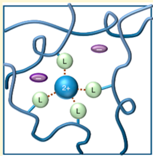
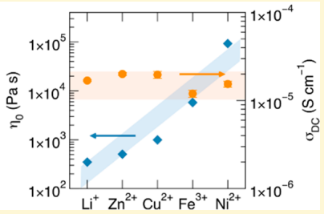
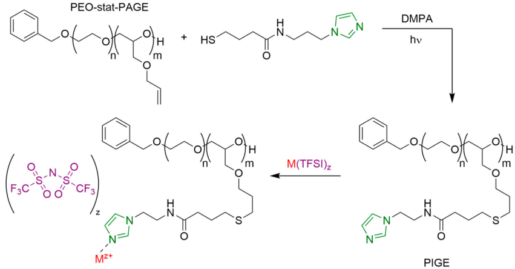

<!-- page 1 of 11 -->

DOI: [10.1021/acs.chemmater.8b02633](http://dx.doi.org/10.1021/acs.chemmater.8b02633) Chem. Mater. 2018, 30, 5759−5769

Downloaded from pubs.acs.org by KAOSHIUNG MEDICAL UNIV on 11/09/18. For personal use only.

cm CHEMISTRYOF Cite This: [Chem. Mater. 2018, 30, 5759−5769](http://pubs.acs.org/action/showCitFormats?doi=10.1021/acs.chemmater.8b02633)

Article

pubs.acs.org/cm

# Decoupling Bulk Mechanics and Mono- and Multivalent Ion Transport in Polymers Based on Metal−Ligand Coordination

Nicole S. Schauser,† Gabriel E. Sanoja,‡ Joshua M. Bartels,‡ Sheetal K. Jain,§ Jerry G. Hu,† Songi Han,§ Lynn M. Walker,∥ Matthew E. Helgeson,‡ Ram Seshadri,† and Rachel A. Segalman\*,†,‡

†Materials Department and Materials Research Laboratory, ‡Department of Chemical Engineering, and §Department of Chemistry and Biochemistry, University of California, Santa Barbara, California 93106, United States

∥Department of Chemical Engineering, Center for Complex Fluids Engineering, Carnegie Mellon University, Pittsburgh, Pennsylvania 15213, United States

\*S Supporting Information

ABSTRACT: Decoupling bulk mechanics and ion conduction in conventional ion conducting polymers is challenging due to their mutual dependence on segmental chain dynamics. Polymers based on dynamic metal−ligand coordination are promising materials toward this aim. This work examines the effect of the nature and concentration of metal bis-(trifluoromethylsulfonyl)imide (MTFSI) salts on the mechanical properties and ionic conductivity of poly[(ethylene oxide)- stat-(allyl glycidyl ether)] functionalized with tethered imidazole ligands (PIGE). Varying the cation identity of

metal salts mixed in PIGE enables dramatic tunability of the zero-frequency viscosity from 0.3 to 100 kPa s. The ionic conductivity remains comparable at approximately 16 μS cm−1 among mono-, di-, and trivalent salts at constant metal-to-ligand molar ratios due to negligible changes in glass transition temperatures at low ion concentrations. Thus, polymers based on metal−ligand coordination enable decoupling of polymer zero-frequency viscosity from ion conduction. Pulsed-field-gradient NMR on PIGE containing Li+ or Zn2+ salts complement electrochemical impedance spectroscopy to demonstrate that both the anion and cation contribute to ionic conductivity.

## ■ INTRODUCTION

The outstanding mechanical properties of associating polymers biomedicine,3−5 and energy storage.6,7 Associating polymers can be formed from a variety of transient interactions including π−π stacking,8 Diels−Alder adducts,9 electrostatic forces,10 hydrogen bonds,1,11,12 and metal−ligand (M−L) coordination.13−15 M−L interactions are particularly interesting since they enable precise control of bulk properties through the nature and concentration of metal−ligand complexes with well-defined coordination geometry and large tunability in interaction time scale.16,17 While the effect of M−L interactions on the mechanics of associating polymers has been well-studied,18−24 the use of such systems as ion conducting polymers remains relatively unexplored. A recent investigation on these materials demonstrates that the zerofrequency viscosity and ionic conductivity are governed by processes with distinct relaxation times, suggesting that the transient nature of the M−L bonds plays a role in ion transport.25

The viscoelastic response of associating polymers is governed by the lifetime of the physical cross-links. Above the percolation threshold, these materials behave as elastic rubbers at shorter times and flow as liquids otherwise.26−28 The time scale of breakage and re-formation of M−L

coordination complexes depends on the nature and concentration of the metal and ligand, parameters that can be readily tuned without significant synthetic efforts.13,17 This flexibility results from a strategy in which the polymer is first synthesized, postfunctionalized with a variety of ligands, and finally dynamically cross-linked with a transition metal salt. Seminal work on poly(4-vinylpyridine) based on Pd2+ or Pt2+ coordinated by N,C,N-pincer ligands illustrates that the linear mechanical response of polymers based on M−L interactions is universally described by the dissociation rate of model smallmolecule coordination complexes.13,16 However, quantitative prediction of M−L polymer dynamic moduli using model small-molecule M−L complexes in solution remains limited, with discrepancies in behavior between the model compounds and their polymeric equivalents presumably arising as a result of chain connectivity, solvent concentration, and cooperativity.20 Nevertheless, the bulk mechanical properties can be widely controlled based on the identity and concentration of metal and ligand, enabling the rational design of complex 29 engineering materials.

<small>Received: June 21, 2018 Revised: July 24, 2018 Published: August 13, 2018</small>

© 2018 American Chemical Society

5759

<!-- page 2 of 11 -->

Chemistry of Materials

Article

Scheme 1. Synthesis of Imidazole-Functionalized PIGE Copolymer and Subsequent Addition of Metal Salts Allows for Unique Control of Bulk Propertiesa

aVarious MTFSI salts $\left( \mathrm{Li^{+}, Ni^{2+}, Cu^{2+}, Zn^{2+}} \right.$ , and $\mathrm { F e } ^ { 3 + } )$ are added in controlled molar ratios of metal to imidazole ligand (r-ratios) to understand the role of M−L interactions and concentration on mechanical properties and ionic conductivity. The cations preferentially coordinate with the imidazole ligand, forming dynamic cross-links between polymer chains.

Polymer mechanics also plays an integral role in ion conduction due to the coupling between ion transport and local segmental dynamics.30 Polymers containing solvating groups, such as ether oxygens in poly(ethylene oxide), facilitate salt dissociation by preferentially interacting with the cation while hindering its motion through the polymer matrix.31−34 This issue is exacerbated for multivalent ions because of stronger interactions with solvating moieties that result in lower cation mobilities and ionic conductivities.35−37 These ion−polymer interactions are at the core of the trade-off between ion concentration and mobility prompting the design of polymer electrolytes with low glass transition temperatures $( T _ { \mathrm { g } } ^ { ^ { \star } } ) . ^ { ^ { 3 \bar { 3 } , 3 8 - 4 0 } }$ However, low- $. T _ { \mathrm { g } }$ polymers are not mechanically robust at the temperatures required to operate many energy conversion and storage devices motivating the development of novel molecular designs for high-performance materials.41

Previous work to decouple the bulk mechanical and ion conducting properties has focused on the use of either nanostructured materials (e.g., block copolymers42,43 and polymer nanocomposites44,45) or chemically cross-linked polymer networks.46,47 Although numerous studies on nanostructured materials have illustrated the role of structure on ionic conductivity, their bulk performance ultimately depends on the long-range ion transport enabled by the percolation of the conducting domains. Chemically cross-linked polymer networks are often tedious to optimize because their properties are extremely sensitive to synthetic conditions. More importantly, these materials exhibit reductions in the ionic conductivity upon cross-linking due to an increase in $T _ { \mathrm { g } }$ with concomitant detrimental effects on segmental dynamics and ion mobility.

This study illustrates the connection between the mechanics and ionic conductivity of a series of polymers based on M−L coordination composed of mono-, di-, and trivalent metal bis(trifluoromethylsulfonyl)imide salts (MTFSI) incorporated in a poly(ethylene oxide) with tethered imidazole groups. As expected from previous investigations on analogous materials, the dynamic moduli and terminal relaxation time are dependent on the identity of the metal species.13,16,17 However, in contrast to the dramatic tunability of the linear viscoelastic response, the ionic conductivity is relatively

independent of salt identity. The ability to control the terminal relaxation time separately from local segmental motion at low ion concentration potentially enables the decoupling of the bulk mechanical and ion conducting properties within a specific concentration regime. Comparisons between $^ 7 \mathrm { L i }$ and $\mathrm { { ^ 1 \dot { 9 } _ { F } } }$ pulsed-field-gradient NMR with electrochemical impedance spectroscopy (EIS) in the polymer mixed with LiTFSI and Zn(TFSI)2 reveal that the TFSI− anion is not the only species contributing to conductivity, suggesting that $\mathrm { L i ^ { + } }$ and $\dot { \bf Z n } ^ { 2 + }$ contribute to the ionic conductivity. While the ionconducting polymers investigated here do not possess conductivities high enough for device application, the ability to decouple the polymer mechanical response from the ionic conductivity represents a promising route for future optimization.

DOI: [10.1021/acs.chemmater.8b02633](http://dx.doi.org/10.1021/acs.chemmater.8b02633) Chem. Mater. 2018, 30, 5759−5769

## ■ EXPERIMENTAL SECTION

Synthesis of Imidazole-Functionalized Copolymer (PIGE). The synthesis of the imidazole-functionalized poly[(ethylene oxide)- stat-(allyl glycidyl ether)] (PIGE) polymer used in this study was previously reported by Sanoja et al. (Scheme 1) and is based on a combination of ionic copolymerization and click chemistry.25 First, the allyl-functionalized copolymer (PEO-stat-PAGE) was synthesized using epoxide ring-opening anionic copolymerization of ethylene oxide (EO) and allyl glycidyl ether (AGE), followed by UV (365 nm) activated thiol−ene click chemistry of N-(2-(1H-imidazol-1-yl)- propyl)-4-mercaptobutanamide (Im-SH). The resulting polymer was dried in vacuo at 55 °C and immediately transferred to a nitrogen glovebox to mitigate moisture uptake.

Synthesis of Polymers PEO-stat-PAGE and PIGE Containing Metal Salt. Samples of ion-conducting polymers were prepared in a nitrogen glovebox by mixing stock solutions of polymer and anhydrous metal salts (0.1 M) in anhydrous methanol. The metal salts used for this study were LiTFSI, $\mathrm{Ni(TFSI)_{2}}$ and Fe(TFSI)3 (anhydrous, Alfa Aesar) and Zn(TFSI)2 and Cu(TFSI)2 (anhydrous, Alfa Aesar and Solvionic). Salts from two manufacturers were acquired for $\mathrm { Z n } ^ { 2 + }$ and $\mathbf { C } \mathbf { u } ^ { 2 + } ,$ with subtle differences detected throughout the measurements. Unless explicitly stated, the measurements reported here are for salts sourced from Alfa Aesar. Controlled ratios of metal cation $\left( \mathbf { M } ^ { z + } \right)$ to imidazole (Im) ligand $\left( \boldsymbol { r }   =   \left[ \mathbf { M } ^ { z + } \right] \right. \mathrm { : }$ [Im]), for PIGE, or equivalently of metal cation to AGE $\left( \boldsymbol { r } = \left[ \mathbf { M } ^ { z + } \right] \right.$ [AGE]) for PEO-stat-PAGE polymers, of $r = 0.05,   r = 0.083,$ and $r =$ 0.1 were prepared by stoichiometrically mixing appropriate amounts

5760

<!-- page 3 of 11 -->

Chemistry of Materials

Article

of the polymer and salt solutions. The resulting solutions were stirred in the glovebox at 40 °C until they were homogeneously mixed.

Molecular Characterization. Size exclusion chromatography was performed on a Waters instrument using a refractive index detector and Agilent PL gel 5 μm MiniMIX-D column. THF at 35 °C was used as the mobile phase with a flow rate of 1.0 mL min−1. The polydispersity index (Đ) was determined against PEO narrow standards (Agilent). 1H NMR spectra were collected on a Bruker Avance DMX 500 MHz. The molecular weight of the precursor PEO-stat-PAGE copolymer was determined using 1H NMR end-group analysis ([Figure S1](http://pubs.acs.org/doi/suppl/10.1021/acs.chemmater.8b02633/suppl_file/cm8b02633_si_001.pdf)). This spectrum was collected in $\mathrm { { C D C I } } _ { 3 } ^ { - }$ at a polymer concentration of 60 mg mL−1 with 128 scans and a pulse delay time of 5 s.

General Protocol for Sample Preparation. All polymer samples were handled in a nitrogen glovebox prior to characterization. Samples were drop-cast from solution onto substrates (Teflon, clean ITO-coated glass, or aluminum DSC pans) and dried in vacuo at 55 °C first for 8 h in a vacuum chamber in the glovebox $\left( 1 \times 1 0 ^ { - 3 }   \mathrm { T o r r } \right)$ and then for 1 h in a high-vacuum oven $\mathrm { ( 1 \times 1 0 ^ { - 8 } ~ T o r r ) }$

Thermal Characterization. Polymer samples were drop-cast from solution into standard aluminum pans and dried as detailed above. The samples were briefly exposed to air between the final vacuum step and the sealing of the DSC pans. The glass transition temperature $( T _ { \mathrm { g } } )$ was measured with a PerkinElmer DSC 8000 on second heating at 20 °C min−1 using the onset method.

Mechanical Characterization. Samples with a molar ratio $r = 0 . 1$ were drop-cast onto Teflon sheets, dried as described above, and transferred to a TA Instruments ARG2 rheometer operating under dry nitrogen flow. Samples were loaded onto a temperature-controlled platen and contacted with an 8 mm parallel top plate for measurement. Sample thicknesses were approximately 200 μm. Dynamic frequency sweeps were performed over a range of temperature, frequency, and strain amplitude of 5 to 70 °C, 100 to 0.1 rad $s ^ { - 1 } ,$ and 0.1 to 10%, respectively. Strain sweeps at 10 rad $s ^ { - 1 }$ confirmed that measurements were performed in the linear viscoelastic regime ([Figure S4](http://pubs.acs.org/doi/suppl/10.1021/acs.chemmater.8b02633/suppl_file/cm8b02633_si_001.pdf)). Time−temperature superposition (TTS) was performed using horizontal shift factors with a reference temperature of 20 °C. TTS was not performed for the PEO-stat-PAGE samples, except for the Ni(TFSI)2 in PEO-stat-PAGE.

1H−7Li 2D Heteronuclear Correlation NMR. A PIGE sample mixed with LiTFSI at a molar ratio $r   =   0 . 0 8 3$ was drop-cast onto Teflon, dried as described above, and packed into a solid-state NMR Teflon 4 mm rotor insert. The insert was centrifuged to yield a uniform sample and subsequently sealed into a 4 mm rotor. 1D 1H and 2D 1H−7Li heteronuclear correlation spectra were collected at a spinning frequency of 10 kHz at room temperature in a 11.7 T magnet. For the 2D experiment, 128 increments with 64 number of scans were used with an indirect dimension spectral width of 20 ppm for 1H. A recycle delay of 3 s and cross-polarization (CP) contact time of 1.6 ms were used.

Ionic Conductivity Characterization. Ionic conductivity was measured using EIS on samples sandwiched between parallel ITO blocking electrodes. ITO electrodes on glass substrates were cleaned via subsequent sonications of 5 min with detergent, deionized water, acetone, and isopropyl alcohol followed by a 5 min UV/ozone treatment. A 1/8 or 3/16 in. hole was punched into 150 μm doublesided Kapton tape to define the cell surface area. Samples with a molar ratio $r   =   0 . 0 5$ and $r   =   0 . 1$ were drop-cast into the Kapton spacer placed on the ITO-coated glass and dried as described above. Samples were sealed with a second ITO electrode under an inert atmosphere, with sample thicknesses ranging from 150 to 200 $\mu \mathrm { m } .$ Transparent ITO-coated glass substrates were used to ensure complete contact of the sample to the electrodes. Both the Alfa Aesar and Solvionic $\mathrm { Z n } ^ { 2 + }$ and $\mathbf { C u } ^ { \overset { \rightharpoonup } { 2 } + }$ salts were investigated. The EIS measurements were performed using a Biologic SP-200 potentiostat in a nitrogen glovebox. A sinusoidal 100 mV signal was applied over a frequency range of 1 MHz to 1 Hz at temperatures ranging from 30 to 90 °C. The data were converted into dielectric storage and loss, and the ionic conductivities were determined from the real component of conductivity at the maximum in tan(δ).48 This method is equivalent

to determining the ionic conductivity from the low-frequency intercept of the impedance with the real axis. At least two samples were measured for each composition.

Determination of Lithium Transference Number. The PIGE and PEO-stat-PAGE LiTFSI ion-conducting polymers at a molar ratio $r = 0 . 0 8 3$ were further characterized via dc polarization of symmetric lithium foil−polymer−lithium foil coin cells assembled in an argon glovebox. Samples were drop-cast on Teflon, dried as described above, and transferred to a $1 / \dot { 8 }$ in. diameter hole within a 50 μm thick Kapton spacer on top of lithium foil. Coin cells were assembled, transferred to an oven set to 80 °C, and equilibrated for up to 48 h until the interfacial resistance, monitored via EIS, stabilized. This indicated the complete formation of a solid−electrolyte interphase (SEI) layer. Then, a 100 mV potential bias was applied and the resulting current measured as a function of time. EIS measurements were performed periodically to evaluate changes in the interfacial resistance. Lithium transference numbers were calculated following the method of Bruce and Vincent:49,50

$$
t _ {+} = \frac {I _ {\mathrm{ss}} (\Delta V - I _ {\Omega} R _ {0})}{I _ {\Omega} (\Delta V - I _ {\mathrm{ss}} R _ {\mathrm{ss}})}\tag{1}
$$

Here, $\Delta V$ is the applied potential (100 mV), $R _ { 0 }$ and $R _ { \mathrm { s s } }$ are the initial and steady-state interfacial resistances, respectively, $I _ { \mathrm { s s } }$ is the steadystate current, and $I _ { \Omega }$ is the initial current determined from Ohm’s law:

$$
\left| I _ {\Omega} = \frac {\Delta V}{R _ {\Omega}} \right.\tag{2}
$$

where $R _ { \Omega }$ is the initial cell resistance (bulk and interfacial) measured by EIS. Using $I _ { \Omega }$ instead of the initial current eliminates measurement errors related to the speed at which the instrument can record the initial current.51

Pulsed-Field-Gradient (PFG) NMR. Samples at a molar ratio $r =$ 0.083 were drop-cast onto Teflon and dried as described above. In a nitrogen glovebox, the polymers were packed with a spatula into thick-walled glass capillaries and centrifuged to yield uniform 4 cm long samples. The capillaries were centered in medium-walled NMR tubes and sealed with high-pressure caps before measurement.

PFG NMR measurements were performed on a Bruker Avance III super-wide-bore spectrometer equipped with a Bruker DIFF50 diffusion probe tuned to 7Li and $^ { 1 9 } \mathrm { F }$ nuclei with replaceable radiofrequency (RF) inserts. $^ { 1 9 } \mathrm { F }$ diffusion measurements of the TFSI− anion were performed on the $\mathrm { L i ^ { + } }$ and $\mathrm { { Z n } ^ { 2 + } }$ PEO-stat-PAGE and PIGE samples at temperatures ranging from 30 to 80 °C. Diffusion measurements were not possible for the $\mathrm{Ni^{2+}-,\ Cu^{2+}-}$ , or $\mathbf { F } \mathbf { e } ^ { 3 + } .$ containing samples due to line broadening by the paramagnetic relaxation effects. 7Li diffusion measurements were performed between 30 and 75 °C on the Li+ PEO-stat-PAGE sample and at 80 °C on the $\mathrm { L i ^ { + } }$ PIGE sample. Lower temperatures for the Li+ PIGE could not be explored due to the low cation diffusion coefficient. Samples were equilibrated at each temperature for 15 min before measurement. A pulse sequence of stimulated echoes with bipolar pulses was used to measure diffusion coefficients. The attenuation of the echo (E) was fit to

DOI: [10.1021/acs.chemmater.8b02633](http://dx.doi.org/10.1021/acs.chemmater.8b02633) Chem. Mater. 2018, 30, 5759−5769

$$
E = \exp \left[ - \gamma^ {2} g ^ {2} \delta^ {2} D \left(\Delta - \frac {\delta}{3}\right) \right]\tag{3}
$$

where γ is the gyromagnetic ratio, g is the gradient strength, δ is the gradient pulse length, Δ is the interval between gradient pulses (diffusion time), and D is the diffusion coefficient. The intervals between gradient pulses used for the acquisitions ranged from 20 to 40 ms for 7Li and from 15 to 20 ms for $^ { 1 9 } \mathrm { F } ,$ The pulse lengths used for acquisitions ranged from 4 to 5 ms for 7Li and 1 to 4 ms for $^ { 1 9 } \mathrm { F } .$ For each diffusion measurement, 16 experiments of varying gradient strength up to a maximum of 2300 $\mathrm { ~ G ~ }   \mathrm { { c m } ^ { - 1 } }$ were performed. All measured attenuations were adequately fit with single-exponential decays. Two samples were measured for the PIGE polymers, while only one was measured for the PEO-stat-PAGE samples.

5761

<!-- page 4 of 11 -->

Chemistry of Materials

Article

Figure 1. (a) Addition of metal salt to a polymer with tethered ligands results in an equilibrium between M−L coordination and salt dissociation. The application of an electric field allows for both ions to move, although the motion of coordinated cations is related to the time scale of metal− ligand coordination. (b) Addition of equal cation:ligand molar ratios (r) results in varying amounts of anions. In all figures, a 4-fold coordination geometry is used for illustrative purposes.

The PFG NMR experiments were analyzed in the context of dilute solution theory. Within this framework, an ionic conductivity can be calculated from the measured diffusion coefficients using the Nernst− Einstein equation52

$$
\sigma = \frac {F ^ {2}}{R T} (z _ {+} ^ {2} c _ {+} D _ {+} + z _ {-} ^ {2} c _ {-} D _ {-})\tag{4}
$$

where F is Faraday’s constant, R is the ideal gas constant, T is the absolute temperature, and $z _ { \pm } , \quad c _ { \pm } ,$ and $D _ { \pm }$ are the valency, concentration, and diffusion coefficient of the cation/anion, respectively. PFG NMR probes ion diffusion on a characteristic length scale $\sqrt { D \Delta }$ on the order of 1−10 μm. While the characteristic length scale probed by electrochemical impedance spectroscopy depends on more complex factors, it is generally assumed to be roughly equivalent to that of PFG NMR. Thus, a comparison of the conductivity extracted from each technique is reasonable, within the context of dilute solution theory. This theory neglects intermolecular interactions and assumes that the ionic species are completely dissociated.52 Consequent $\mathrm { l y } ,$ there might be discrepancies between the calculated and experimentally determined ionic conductivities, which could be due to either the diffusion coefficients measured via PFG NMR having contributions from a number of associated or aggregated species (inaccurate $D _ { \pm }$ measurements) or incomplete salt dissociation (inaccurate estimation of $c _ { \pm } ) . ^ { 5 3 ^ { \frac { 7 } { - 5 5 } } }$ In the binary electrolytes investigated in this study, the anion TFSI− concentration will equal $z _ { + } c _ { + }$ under the assumption of full salt dissociation. Thus, eq 4 reduces to

$$
\sigma = \frac {F ^ {2} c _ {+}}{R T} (z _ {+} ^ {2} D _ {+} + z _ {+} D _ {-})\tag{5}
$$

## ■ RESULTS AND DISCUSSION

To elucidate the effect of the nature and concentration of $\mathbf { M } -$ L bonds on the mechanical and ion conducting properties of polymers with tethered ligands, an array of mono- (Li+), di-$\left(  Ni ^{2+},  Zn ^{2+},  Cu ^{2+} \right)$ , and trivalent $\left( \mathrm { F e } ^ { 3 \dot { + } } \right)$ MTFSI salts were incorporated into model PIGE at controlled molar ratios of metal cations to pendant imidazoles (r-ratios). These neutral, nitrogen-linked, and pendant imidazoles (see Scheme 1) lack mobile protons that might contribute to the ionic conductivity, while enabling M−L interactions between the metal cations and the non-aromatic lone pair of the nitrogen in the imidazole ring. Note that due to the stoichiometry of salt dissociation,

there is an increase in the concentration of anions with metal valency at constant r-ratios (Figure 1b). Moreover, the fraction of cations coordinated by imidazole and part of a M−L cross-link will depend on the preferred complex geometry and is expected to range between 4 and $6 . ^ { 1 7 }$ The weak electrostatic interactions resulting from large and charge-delocalized TFSI− anions resemble that of ionic liquids, yielding “plasticized” and amorphous polymers which even at high ion concentrations exhibit low $T _ { \mathrm { g } } \mathrm { s . A P E O }$ backbone was investigated because its relatively high dielectric constant potentially enables sufficient salt dissociation and hinders ion aggregation to enhance ionic conductivity. Although the extent of dissociation results from a balance between the salt lattice energy, ion solvation, and M−L coordination (Figure 1a), the latter is expected to be the primary interaction dictating the bulk polymer properties as the equilibrium constant for metal cation−imidazole complexation is significantly larger than that of metal cation−crown ether solvation. $^ { 2 2 , 5 6 , 5 7 }$ In the case of LiTFSI salt in PIGE, this is substantiated by $^ 1 \mathrm { H } \mathrm { - } ^ { 7 } \mathrm { L i }$ 2D NMR heteronuclear correlation, which reveals the proximity of $\mathrm { L i ^ { + } }$ to imidazole ligands (Figure 2). The peak intensities of the imidazole protons (6.1−8.2

(b)

DOI: [10.1021/acs.chemmater.8b02633](http://dx.doi.org/10.1021/acs.chemmater.8b02633) Chem. Mater. 2018, 30, 5759−5769

Figure 2. Solid-state NMR spectra demonstrate that cations interact preferentially with imidazole ligands. (a) 2D HETCOR $^ { 1 } \mathrm { H } \mathrm { - } ^ { 7 } \mathrm { L i }$ spectrum. (b) Comparison of 1D 1H spectrum (red) with the projections of 1H dimension (blue) from the 2D spectrum. This highlights the relative intensity changes of the 1H peaks.

5762<!-- page 5 of 11 -->

Chemistry of Materials

Article

ppm) relative to the aliphatic protons on the PEO backbone (0−5.8 ppm) is significantly higher in the heteronuclear correlation (HETCOR) spectrum of $^ 1 \mathrm { H }$ coupled to $^ 7 \mathrm { L i }$ compared to the direct 1D $^ 1 \mathrm { H }$ spectrum, as illustrated in Figure 2. In the 1D 1H spectrum the ratio of the peak integrals of 6.1−8.2 ppm to $0 { - } 5 . 8$ ppm peaks is ${ \sim } 0 . 1 3 ,$ which increases to ∼1.32 in the HETCOR spectrum. This implies that the aliphatic protons are weakly coupled to the $\mathbf { L i } ^ { \bar { + } }$ whereas the imidazole protons have a relatively strong interaction to the $\mathrm { L i ^ { + } }$ due to spatial proximity. The other cation species are expected to follow similar behavior.

The dynamic nature of these M−L coordination bonds also allows for bond breakage and re-formation on time scales that facilitate long-range cation transport. This mechanism of ion conduction is fundamentally different from that of anions as these weakly interact with polymers and have motion primarily dependent on the local segmental dynamics. Cation conduction through these systems would be maximum with extremely labile M−L coordination bonds. This physical picture is similar to that of conventional polymer electrolytes (PEO) which are composed of nucleophilic polymer backbones that only solvate cations. The model PIGE is a statistical copolymer $\mathrm { P E O } _ { 3 2 3 }$ -stat- $\mathrm{PIGE}_{79} (M_{\mathrm{n}} = 40$ kDa, $D < 1 . 2 )$ with a constant mole fraction of imidazole moieties $( x _ { \mathrm { I G E } } = 0 . 1 7 )$ and was previously synthesized by Sanoja et $\mathrm { a l . } ^ { 2 5 }   \mathrm { D S C }$ traces $\bar{ ( Figure   S3) }$ demonstrate its amorphous nature, a result consistent with the suppression of PEO crystallization in an atactic backbone. The molecular properties and thermal transitions of the various polymers are summarized in Table 1.

Table 1. Properties of Ion-Conducting Polymersa

| $polymer^b$ | $r^c$ | salt (wt %) | $T_g^d$(°C) | $\sigma (\mu S/cm) at 70\ ^{\circ}C$ | $\sigma (\mu S/cm) at T - T_g = 90\ ^{\circ}C$ |
| --- | --- | --- | --- | --- | --- |
| PIGE | 0.0 | 0 | -33 | 1.0 ± 0.49 | 0.47 ± 0.21 |
| PIGE $Li^+$ | 0.1 | 4.8 | -32 | 17 ± 0.37 | 8.1 ± 0.35 |
| PIGE $Ni^{2+}$ | 0.1 | 9.8 | -29 | 15 ± 1.2 | 9.3 ± 0.92 |
| PIGE $Cu^{2+(AA)}$ | 0.1 | 9.9 | -31 | 20 ± 1.8 | 10 ± 0.73 |
| PIGE $Cu^{2+(S)}$ | 0.1 | 9.9 | -25 | 13.6 ± 1.6 | 10 ± 1.1 |
| PIGE $Zn^{2+(AA)}$ | 0.1 | 9.9 | -28 | 20 ± 0.7 | 13 ± 0.33 |
| PIGE $Zn^{2+(S)}$ | 0.1 | 9.9 | -25 | 18 ± 1.4 | 13 ± 1.1 |
| PIGE $Fe^{3+}$ | 0.1 | 13.6 | -28 | 12 ± 1.1 | 7.6 ± 0.70 |

aAll polymers are based on the same PIGE precursor synthesized in Sanoja et ${ \mathrm { a l . , } } ^ { 2 5 }$ with a degree of polymerization of EO of 323 and of AGE of 79. $^ { b ( \mathrm { A A } ) } \mathrm { S a l t }$ acquired from Alfa Aesar. $^ { ( s ) } \mathrm { S a l t }$ acquired from Solvionic. $\mathbf { \nabla } ^ { c } \boldsymbol { r } = \left[ \mathbf { M } ^ { z + } \right.$ :imidazole]. dDetermined via differential scanning calorimetry.

I. Linear Polymer Mechanics. M−L coordination dramatically changes the bulk mechanical properties, as evidenced by a shift in the linear viscoelastic response to higher modulus and lower frequency upon incorporation of various MTFSI salts into PIGE (Figures 3a and 3b). These materials mechanically respond as dynamic networks with a plateau in the storage modulus at high frequencies, a crossover of the storage $( G ^ { \check { \prime } } )$ and loss modulus $\left[ \left( G ^ { \prime } \right) \right]$ , and terminal relaxation similar to that of liquids.26−28 The neat PIGE polymer is expected to be weakly entangled based on the molecular weight of the PEO backbone, with small contributions to elasticity relative to M−L cross-linking.58 At an r-ratio of 0.1, the rheological signature of polymers with $\mathbf { N i } ^ { 2 + }$ and $\mathrm { F e } ^ { 3 + }$ clearly show a plateau in $G ^ { \prime }$ and a peak in $G ^ { \prime \prime }$ while that of polymers with $\mathbf { L } \mathbf { \bar { i } } _ { \mathrm { ~ , ~ } } ^ { + }$ $\mathbf { C u } ^ { 2 + }$ , and Zn $\mathrm { Z n } ^ { 2 + }$ only reveals a

![Figure 3. Mechanical properties of the polymer change drastically upon the addition of various metal salts. For the PIGE polymer containing covalently tethered ligands, $\mathrm { { N i } ^ { 2 + } }$ and $\mathbf { F } \mathbf { e } ^ { 3 + }$ cations act as transient cross-linkers, resulting in the appearance of a plateau in the storage modulus (a) and peak in the loss modulus (b) within the accessible frequency−temperature range. (c) A clearer effect of metal cross-linking can be seen from the complex viscosity, which increases dramatically with the addition of metal salts except for LiTFSI. Time−temperature superposition was successfully performed on all samples.](figures/page5-block9.png)

![Figure 3. Mechanical properties of the polymer change drastically upon the addition of various metal salts. For the PIGE polymer containing covalently tethered ligands, $\mathrm { { N i } ^ { 2 + } }$ and $\mathbf { F } \mathbf { e } ^ { 3 + }$ cations act as transient cross-linkers, resulting in the appearance of a plateau in the storage modulus (a) and peak in the loss modulus (b) within the accessible frequency−temperature range. (c) A clearer effect of metal cross-linking can be seen from the complex viscosity, which increases dramatically with the addition of metal salts except for LiTFSI. Time−temperature superposition was successfully performed on all samples.](figures/page5-block10.png)

![Figure 3. Mechanical properties of the polymer change drastically upon the addition of various metal salts. For the PIGE polymer containing covalently tethered ligands, $\mathrm { { N i } ^ { 2 + } }$ and $\mathbf { F } \mathbf { e } ^ { 3 + }$ cations act as transient cross-linkers, resulting in the appearance of a plateau in the storage modulus (a) and peak in the loss modulus (b) within the accessible frequency−temperature range. (c) A clearer effect of metal cross-linking can be seen from the complex viscosity, which increases dramatically with the addition of metal salts except for LiTFSI. Time−temperature superposition was successfully performed on all samples.](figures/page5-block11.png)

Figure 3. Mechanical properties of the polymer change drastically upon the addition of various metal salts. For the PIGE polymer containing covalently tethered ligands, $\mathrm { { N i } ^ { 2 + } }$ and $\mathbf { F } \mathbf { e } ^ { 3 + }$ cations act as transient cross-linkers, resulting in the appearance of a plateau in the storage modulus (a) and peak in the loss modulus (b) within the accessible frequency−temperature range. (c) A clearer effect of metal cross-linking can be seen from the complex viscosity, which increases dramatically with the addition of metal salts except for LiTFSI. Time−temperature superposition was successfully performed on all samples.

slight increase in $G ^ { \prime }$ and decrease in terminal relaxation time, indicating slower polymer dynamics. Although it is known that both $\mathrm { { C u } ^ { 2 + } }$ and $\mathbf { Z } \mathbf { \hat { n } } ^ { 2 + }$ interact with imidazole to form dynamic cross-links,17,29 there is an almost inconsequential change in the mechanical response that presumably results from either a change in cross-link concentration compared to the $\mathrm { { \bf N } i ^ { 2 + } }$ system or the similarity in time scale of M−L dissociation

5763

DOI: [10.1021/acs.chemmater.8b02633](http://dx.doi.org/10.1021/acs.chemmater.8b02633) Chem. Mater. 2018, 30, 5759−5769

<!-- page 6 of 11 -->

Chemistry of Materials

Article

compared to relaxation of the entangled polymer melt. Additionally, all but the PIGE with $\tilde { \mathbf { N i } ^ { 2 + } }$ and $\mathrm { F e } ^ { 3 + }$ show liquid-like behavior at low frequency as evidenced by the scaling of $G ^ { \prime } \sim \omega ^ { 2 }$ and $G ^ { \prime \prime } \sim \omega .$ . The system based on $\mathbf { N i } ^ { 2 + }$ yields the most dramatic change in the viscoelastic properties. Existing theories relate the modulus and terminal relaxation time scale with M−L (“sticker”) binding kinetics.26,27 M−L dissociation kinetics trends for the equivalent small-molecule M−L system in aqueous solution do not match the experimental trend of characteristic relaxation time in this study (see the [Supporting Information](http://pubs.acs.org/doi/suppl/10.1021/acs.chemmater.8b02633/suppl_file/cm8b02633_si_001.pdf)). As mentioned earlier, such discrepancies are perhaps expected since kinetic trends of M−L dissociation in aqueous solution neglect solvent cooperativity and polymer chain connectivity.20 Further work is needed to determine the kinetics of M−L dissociation in polymer melts.

The effect of the MTFSI salts on the mechanical properties can be illustrated more clearly by inspecting the complex viscosity $| \eta ^ { * } | = \sqrt { ( \eta ^ { \prime } ) ^ { 2 } + ( i \eta ^ { \prime \prime } ) ^ { 2 } }$ , a property which describes the resistance of a fluid to undergo shear flow. More specifically, examination of its low-frequency plateau $\eta _ { 0 }$ (zero-frequency complex viscosity) is more convenient as this accounts for changes in cross-link concentration, polymer structure, and relaxation times with dynamic M−L bonds.18,28 $\mathbf { M } \mathbf { - } \mathbf { L }$ Figure 3c illustrates an increase in $\eta _ { 0 }$ upon addition of MTFSI to PIGE for all metal cations except for $\mathbf { L i } ^ { + } .$ The rheological similarity between PIGE and PIGE mixed with LiTFSI suggests that either each Li+ interacts with only one imidazole, thus not forming temporary cross-links, or the time scale for interaction between $\mathbf { L i } ^ { + }$ and imidazole is short compared to polymer dynamics. Interestingly, the increase over 3 orders of magnitude in $\eta _ { 0 }$ does not correlate with $T _ { \mathrm { g } }$ (Table 1), as the polymer with $\hat { \mathbf { N i } } ^ { 2 + }$ is significantly more viscous than that with $\mathbf { \hat { C u } ^ { \hat { 2 } + } }$ or $\mathrm { Z n } ^ { 2 + }$ even though they all have $T _ { \mathrm { g } } \sim - 3 0 ~ ^ { \circ } \mathrm { C } .$ This observation serves to demonstrate that the segmental dynamics, as expressed by $T _ { \mathrm { g } } ,$ and bulk polymer dynamics, as described by $\eta _ { 0 } ,$ are decoupled, as the latter depends on the lability of $\mathbf { M } \mathbf { - } \mathbf { L }$ cross-links. As will be discussed shortly, this is the fundamental reason that enables independent control over the mechanical and ion conducting properties through the identity of the metal cation.

II. Ion Transport. The ionic conductivity of the PIGE-MTFSI is roughly independent of the identity of the metal cation (Figure 4, Tables 1 and 2). Its Vogel−Fulcher− Tamman (VFT) temperature dependence reveals the importance of entropy and free volume on ion motion. As previously noted, there is a minimal shift in $T _ { \mathrm { g } }$ across the polymer series that indicates that local segmental dynamics are not greatly affected by cation valency, identity, or anion concentration. This is once again why this material design enables independent tunability over bulk mechanical and ion conducting properties.

The decoupling of the polymer zero-frequency viscosity from ionic conductivity upon the inclusion of metal salts provides a promising route to stiffening polymers without compromising ion transport. From a fundamental standpoint, this is a consequence of the molecular processes governing ion transport and bulk mechanics. While the former primarily depends on the local segmental dynamics as quantified by $T _ { \mathfrak { g } }$ the latter results from polymer self-diffusion through a sequence of M−L association and dissociation steps. $\operatorname { A t } T =$ 70 °C, σ of PIGE-MTFSI is approximately 16 $\mu \mathrm { S } \; \mathrm { c m } ^ { 2 }$ with no

Figure 4. Ionic conductivity can be approximately normalized by the ratio of the concentration of metal to imidazole (r), regardless of ion valency or identity. Each data point results from an average of at least two different samples; error bars represent 68% confidence intervals.

Table 2. Ratios of the Ionic Conductivity of PIGE with Diand Trivalent MTFSI Salts to That of the Same Polymer Containing Monovalent LiTFSIa

<table><tbody><tr><td colspan="2">1000/</td><td>σNi/</td><td>σAZAn/</td><td>σSZn/</td><td>σACAu/</td><td>σSCu/</td><td>σFe/</td></tr><tr><td>T - Tg</td><td>(T - Tg)</td><td>σLi</td><td>σLi</td><td>σLi</td><td>σLi</td><td>σLi</td><td>σLi</td></tr><tr><td>111.1</td><td>9</td><td>1.0</td><td>1.4</td><td>1.6</td><td>1.2</td><td>1.3</td><td>0.8</td></tr><tr><td>83.3</td><td>12</td><td>1.2</td><td>1.6</td><td>1.8</td><td>1.3</td><td>1.3</td><td>1.0</td></tr><tr><td>66.7</td><td>15</td><td>1.4</td><td>1.9</td><td>1.9</td><td>1.3</td><td>1.4</td><td>1.2</td></tr></tbody></table>

$^ a \mathbf { A t }$ three different reduced temperatures $T - T _ { \mathrm { g } }$ the ratios are very close to 1, indicating that the ionic conductivity does not scale with ion valency as predicted by dilute solution theory. Divalent salts were acquired from $\tt ^ { 1 } A A _ { A l f a }$ Aesar and SSolvionic.

observable trend with the identity of the metal ion, while $\eta _ { 0 }$ increases from 0.3 to 100 kPa s between $\mathrm { L i ^ { + } }$ and $\mathrm { { N i } ^ { \dot { 2 } + } }$ (Figure 5). Again, the dramatic increase in $\eta _ { 0 }$ is due to physical cross-linking and changes in the lifetime of M−L coordination. These observations complement our previous investigation on the effect of ion concentration on the bulk properties of polymers based on M−L coordination25 and allow us to develop rational design rules for high-performance materials. In particular, there is an optimum ionic conductivity due to the competing effects of increasing ion concentration and decreasing ion ${ \mathsf { m o b i l i t y } } , ^ { 2 5 }$ with further stiffening enabled by changing the identity of the metal cation without detrimental effects to the ionic conductivity.

Examination of the ionic conductivity within the framework of dilute solution theory not only demonstrates a complex trade-off between ion mobility, valency, and ion concentration on ion transport but also serves to further investigate the fundamental reason why the ionic conductivity is coupled to segmental dynamics. Normalization of the ionic conductivity by the r-ratio yields a universal curve, a scaling behavior that is inconsistent with $\mathrm { ~ e q ~ } ~ \delta ,$ and vexing because the anion and overall ion concentration increase with metal valency. Assuming (1) full salt dissociation (strong electrolyte) and (2) that all metal cations have the same diffusion coefficient, it

5764

DOI: [10.1021/acs.chemmater.8b02633](http://dx.doi.org/10.1021/acs.chemmater.8b02633) Chem. Mater. 2018, 30, 5759−5769

<!-- page 7 of 11 -->

Chemistry of Materials

Article

Figure 5. Polymers based on M−L coordination enable independent control over the mechanical and ion conducting properties. The zerofrequency viscosity of the material can be tuned over almost 3 orders of magnitude with minimal changes in the ionic conductivity. Error bars represent 68% confidence intervals.

follows from $\mathrm { ~ e q ~ } ~ 5$ that the contributions to the ionic conductivity from the cation and anion should scale with ${ z _ { + } } ^ { 2 }$ and $z _ { + } ,$ respectively.52 These are presumably invalid assumptions, yet they serve as a starting point to explain ion transport in polymers based on M−L coordination. If the contribution to the ionic current would be predominantly from the TFSI−, a common feature in polymer electrolytes such as PEO/LiTFSI, the polymers with di- and trivalent salts would have a 2- or 3-fold increase in the ionic conductivity relative to their monovalent counterpart. Table 2 summarizes the ratio of the ionic conductivity of PIGE with di- and trivalent MTFSI salts to that of the same polymer containing monovalent LiTFSI. This ratio is evaluated at three different reduced temperatures $\left( T - T _ { \mathrm { g } } \right)$ to account for differences in segmental dynamics among the polymers investigated, though this correction is inconsequential due to the negligible change in $T _ { \mathrm { g } }$ with the identity of the MTFSI salts. Only at the lowest reduced temperature $\left(T-T_{\mathrm{g}}=66.67\mathrm{~K}\right)$ , the PIGE based on $\mathbf { Z n } ^ { 2 + }$ is approximately twice as conductive as that based on $\mathbf { L i } ^ { + } ,$ but for all other temperatures and metal cations the theoretical scaling does not hold. Similar results are observed for an r-ratio of 0.05 ([Figure S8 and Tables S1−S3](http://pubs.acs.org/doi/suppl/10.1021/acs.chemmater.8b02633/suppl_file/cm8b02633_si_001.pdf)). This motivates a thorough reassessment of the comparison between measured ionic conductivity and predictions from dilute solution theory and suggests that changes in diffusion coefficient or incomplete salt dissociation likely dominate the behavior of the M−L polymers studied here.

III. Ion Diffusion Coefficients and Dilute Solution Theory. The deviation from dilute solution theory of the ionic conductivity suggests a change in either the ion mobility or extent of dissociation with metal identity. Pulsed-field-gradient (PFG) NMR provides a powerful tool to investigate the role of ion mobility on conduction by probing the self-diffusion coefficients of NMR-active nuclei on a micrometer length scale.53,54,59 This technique does not distinguish between ions and aggregates composed of an NMR-active species unless their diffusion coefficients or chemical shifts are distinguishable over the experimental time scale $( \mathbf { i . e . } ,$ in the absence of fast exchange between ion and aggregate states). Previous investigations on PEO−LiTFSI have demonstrated that the ion diffusion coefficients decrease with ion concentration,54 an

observation attributed to an increase in either polymer viscosity due to solvation or ion drag force from ion−ion interactions. If local chain dynamics are critical in the ion mobility of PIGE−MTFSI, a VFT normalization of the diffusion coefficient by $T _ { \mathrm { g } }$ should yield a universal master curve irrespective of metal identity. This is indeed the case when examining the diffusion coefficient of TFSI− in PIGE with $\mathrm { L i ^ { + } }$ and $\mathbf { Z n } ^ { \mathbf { o } } { } ^ { + }$ (Figure 6). The only subtle differences in

![Figure 7. Comparison of measured conductivity values with calculated conductivity suggest incomplete salt dissociation for the PEO-stat-PAGE and cation contribution to the conductivity for the PIGE. Conductivity is calculated using diffusion coefficients measured from pulsed-field-gradient NMR using the Nernst−Einstein equation assuming full salt dissociation. First only anion (TFSI−) participation in ion conductivity is accounted for, and then for the lithiumcontaining polymers full participation from both Li+ and TFSI− is assumed. In the PEO-stat-PAGE samples $( \mathsf { a } , \mathsf { c } ) ,$ , an overestimation of conductivity compared to the measured conductivity indicates incomplete salt dissociation, while in the PIGE samples (b, d) $\mathrm { T F S I } ^ { - 1 }$ diffusion underestimates the observed conductivity. Lithium diffusion adequately accounts for the remaining difference in LiTFSI PIGE (b), suggesting the possibility that zinc might account for the remaining difference in the Zn(TFSI)2 PIGE (d). Zn(TFSI)2 from Alfa Aesar was used for the PEO-stat-PAGE measurement, while the Solvionic salt was used for the PIGE measurement.](figures/page7-block8.png)

Figure $\mathbf { 6 . } ^ { 1 9 } \mathrm { { F } }$ diffusion measurements reveal the nature of the cation and concentration of the anion do not play a role in the anion diffusivity in polymers based on M−L coordination. Although PIGE with $\mathrm { Z n } ^ { \vec { 2 + } }$ has twice as much TFSI−, the anion is just as mobile as in PIGE with $\mathrm { L i ^ { + } }$ after accounting for differences in $T _ { \mathfrak { g } ^ { * } }$ (AA) and (S) refer to salt sourced from Alfa Aesar and Solvionic, respectively.

diffusion coefficient implies not only that the metal identity and the anion concentration are only relevant insofar as they affect the polymer segmental dynamics but also that these salts probably do not form significant aggregation, as changes in polymer viscosity are enough to account for the difference in diffusion coefficient of the salts. A similar comparison between the diffusion coefficient of TFSI− in PEO-stat-PAGE with Li+ and $\mathrm { Z n } ^ { 2 + }$ does not yield the same universal scaling after normalizing for $T _ { \mathrm { g } }$ ([Figure S9](http://pubs.acs.org/doi/suppl/10.1021/acs.chemmater.8b02633/suppl_file/cm8b02633_si_001.pdf)). As will be discussed later, this is presumably due to incomplete dissociation of the MTFSI salts within the PEO-stat-PAGE, causing ion−ion interactions to affect the anion diffusion coefficient. Thus, we hypothesize that metal−imidazole coordination in the $\mathbf { L i } ^ { + }$ and $\hat { \mathbf { Z n } } ^ { 2 + }$ PIGE effectively screens the electrostatic interactions such that the cation identity and anion concentration do not play a key role on anion mobility.

The anion diffuses faster than the cation in polymers based on M−L coordination, consistent with previous investigations on PEO−LiTFSI and presumably due to interactions of the cation with the polyether backbone or imidazole ligands.33 7Li PFG NMR experiments on PIGE ([Figure S10](http://pubs.acs.org/doi/suppl/10.1021/acs.chemmater.8b02633/suppl_file/cm8b02633_si_001.pdf)) enable measurement of the Li+ diffusion coefficient and further calculation of the transference number within the context of dilute solution theory

$$
t _ {+} = \frac {z _ {+} D _ {+}}{z _ {+} D _ {+} + D _ {-}}\tag{6}
$$

5765

DOI: [10.1021/acs.chemmater.8b02633](http://dx.doi.org/10.1021/acs.chemmater.8b02633) Chem. Mater. 2018, 30, 5759−5769

<!-- page 8 of 11 -->

Chemistry of Materials

Article

where $z _ { + }$ is the valency of the cation, and $D _ { \pm }$ are the diffusion coefficients of the cation and anion. This analysis reveals that the Li+ transference number in PIGE (0.19, at 80 °C) is slightly higher than that of the corresponding PEO-stat-PAGE system (0.15, at 75 °C) . While this small difference could be attributed to temperature effects, the higher transference number in PIGE could also result from weaker Li+−polymer interactions in the presence of imidazole. Whereas the $\mathrm { L i ^ { + } }$ ions in the PEO-stat-PAGE polymer are solvated by ether oxygens and thus tightly wrapped by the polymer backbone, the $\mathrm { L } \dot { \mathrm { i } } ^ { + }$ in the PIGE interact primarily with the imidazole, as demonstrated with $^ { 1 } \mathrm { H } \mathrm { - } ^ { 7 } \mathrm { L i } ^ { \dot { } }$ 2D heteronuclear correlation in Figure 2. This likely facilitates hopping between adjacent sites in the PIGE. These results are further supported by comparisons of the transference number with that determined via conventional chronoamperometry (eq 1) in symmetric lithium foil−polymer electrolyte−lithium foil coin cells (0.18 at 80 $^ \mathrm { { { } ^ { \circ } C ) } _ { \cdot } ^ { \mathrm { { } ^ { \mathrm { { } ^ { \mathrm { { } ^ { \mathrm { { } ^ { \mathrm { { } } } } } } 4 9 } } } } } }$ The agreement demonstrates that the diffusion coefficients measured by PFG NMR do not have an important contribution from ion aggregates.

DOI: [10.1021/acs.chemmater.8b02633](http://dx.doi.org/10.1021/acs.chemmater.8b02633) Chem. Mater. 2018, 30, 5759−5769

Comparison of the ionic conductivity with predictions from dilute solution theory indicates that the $\mathbf { L } \mathbf { \hat { i } } ^ { + }$ and $\mathbf { Z n } ^ { 2 + }$ mobile in PIGE (Figure 7). In PEO-stat-PAGE with $\mathbf { L i } _ { \mathrm { ~ } } ^ { + } ,$ the ionic conductivity calculated with eq 5 overestimates that experimentally determined with EIS, especially when accounting for contributions from both ions. This observation

![Figure 7. Comparison of measured conductivity values with calculated conductivity suggest incomplete salt dissociation for the PEO-stat-PAGE and cation contribution to the conductivity for the PIGE. Conductivity is calculated using diffusion coefficients measured from pulsed-field-gradient NMR using the Nernst−Einstein equation assuming full salt dissociation. First only anion (TFSI−) participation in ion conductivity is accounted for, and then for the lithiumcontaining polymers full participation from both Li+ and TFSI− is assumed. In the PEO-stat-PAGE samples $( \mathsf { a } , \mathsf { c } ) ,$ , an overestimation of conductivity compared to the measured conductivity indicates incomplete salt dissociation, while in the PIGE samples (b, d) $\mathrm { T F S I } ^ { - 1 }$ diffusion underestimates the observed conductivity. Lithium diffusion adequately accounts for the remaining difference in LiTFSI PIGE (b), suggesting the possibility that zinc might account for the remaining difference in the Zn(TFSI)2 PIGE (d). Zn(TFSI)2 from Alfa Aesar was used for the PEO-stat-PAGE measurement, while the Solvionic salt was used for the PIGE measurement.](figures/page8-block6.png)

Figure 7. Comparison of measured conductivity values with calculated conductivity suggest incomplete salt dissociation for the PEO-stat-PAGE and cation contribution to the conductivity for the PIGE. Conductivity is calculated using diffusion coefficients measured from pulsed-field-gradient NMR using the Nernst−Einstein equation assuming full salt dissociation. First only anion (TFSI−) participation in ion conductivity is accounted for, and then for the lithiumcontaining polymers full participation from both Li+ and TFSI− is assumed. In the PEO-stat-PAGE samples $( \mathsf { a } , \mathsf { c } ) ,$ , an overestimation of conductivity compared to the measured conductivity indicates incomplete salt dissociation, while in the PIGE samples (b, d) $\mathrm { T F S I } ^ { - 1 }$ diffusion underestimates the observed conductivity. Lithium diffusion adequately accounts for the remaining difference in LiTFSI PIGE (b), suggesting the possibility that zinc might account for the remaining difference in the Zn(TFSI)2 PIGE (d). Zn(TFSI)2 from Alfa Aesar was used for the PEO-stat-PAGE measurement, while the Solvionic salt was used for the PIGE measurement.

indirectly suggests incomplete dissociation or aggregation of LiTFSI in PEO-stat-PAGE. A similar analysis on PIGE with $\mathrm { L i ^ { + } }$ reveals that contributions of both the $\mathrm { L i ^ { + } }$ and TFSI− are required to adequately capture the experimentally measured conductivity. The addition of the imidazole ligands presumably enhances salt dissociation such that the Nernst−Einstein relation in eq 5 adequately describes the ionic conductivity. This comparison between theory and experiment becomes useful when analyzing the ionic conductivity and diffusivities of polymers based on $\tilde { \mathbf { Z n } } ^ { 2 + }$

In particular, incomplete dissociation is even more apparent in the PEO-stat-PAGE for Zn(TFSI)2 than for LiTFSI. Though a $\mathrm { Z n } ^ { 2 + }$ diffusion coefficient cannot be measured with NMR, the ionic conductivity estimated with eq 5 assuming a single-ion TFSI− conductor $\dot { \left( { D _ { + } } = 0 \right) }$ already overestimates the measured conductivity value. The $\dot { \mathbf { Z n } ^ { 2 + } }$ PIGE system, however, underestimates the conductivity when only taking TFSI− diffusion into account (Figure 7 for Solvionic salt and [Figure S11](http://pubs.acs.org/doi/suppl/10.1021/acs.chemmater.8b02633/suppl_file/cm8b02633_si_001.pdf) for Alfa Aesar salt). This suggests either the presence of an additional mobile ion or that the TFSI− diffusion coefficient measured via PFG NMR does not adequately capture the true behavior of the ion. A combination of XRF, 1H and $^ { 1 9 } \mathrm { F }$ NMR, and Karl Fischer (KF) titration corroborated the high purity (>99%) of the Zn(TFSI)2 salt, indicating that the residual conductivity is likely due to mobile $\mathrm { Z n } ^ { 2 + }$ within the sample. Assuming all $\mathrm { Z n } ^ { 2 + }$ are dissociated and mobile, one can estimate with eq 5 the diffusion coefficient that would be required to obtain the experimentally measured conductivity value. This analysis provides a lower bound of a diffusion coefficient of $\mathrm { Z n } ^ { 2 + }$ in PIGE of around $3   \times   1 0 ^ { - 9 }$ cm2 s−1 at 80 °C, which would correspond to a transference number of 0.13 (see the [Supporting Information](http://pubs.acs.org/doi/suppl/10.1021/acs.chemmater.8b02633/suppl_file/cm8b02633_si_001.pdf)). Although the $\mathrm { Z n } ^ { 2 + }$ diffusion coefficient is about 35% that of Li+, its higher valency provides leeway for an equivalent contribution to the ionic conductivity at slower ion motion.

## ■ CONCLUSION

The introduction of metal salts into a polymer matrix containing covalently tethered imidazole ligands enables the decoupling of mechanical properties from ionic conductivity. Polymers based on M−L coordination exhibit higher zerofrequency viscosities compared to the neat entangled polymer melt, with high sensitivity toward the identity of the metal cation due to the formation of dynamic M−L cross-links. In contrast, the ionic conductivity of these materials is relatively insensitive to the metal cation identity and seems instead to be a function of cation to ligand ratio. Ion mobility in polymers is dictated to a significant extent by the local segmental dynamics, which remain largely unchanged with metal cation identity but depend more strongly on salt concentration. These results enable orders-of-magnitude changes in polymer zero-frequency viscosity with negligible changes in ionic conductivity. PFG NMR diffusion measurements performed on polymers based on $\mathrm { L i ^ { + } }$ and $\mathrm { { \bf Z n } ^ { 2 + } }$ demonstrate that TFSI diffusion is insensitive to cation identity or anion concentration and only depends on polymer $T _ { \mathfrak { g } ^ { \bullet } }$ Interestingly this result only holds for the imidazole-containing polymer and not the PEO-stat-PAGE precursor. Whether this is a function of the extent of dissociation of the metal salt or is due to the nature of the M−L interaction with pendant imidazole groups merits further analysis. Lastly, diffusion measurements can be used to estimate an ionic conductivity assuming full salt dissociation. While it is known that impedance spectroscopy and PFG NMR

5766<!-- page 9 of 11 -->

Chemistry of Materials

Article

probe different time scales, this analysis for the PIGE with $\mathrm { Z n } ^ { 2 + }$ suggests that, in addition to the TFSI−, $\mathrm { Z n } ^ { 2 + }$ ions contribute to the ionic conductivity measured by EIS. While $\mathbf { Z n } ^ { 2 + }$ ions appear to have lower diffusion coefficients than Li+, their higher valence ensures that their contribution to the overall conductivity is significant, even comparable to what is seen in the case of Li+ in PIGE. This work paves the way for future studies on polymers based on M−L coordination, suggesting multivalent systems can be designed with beneficial mechanical properties and no detriment to total ionic conductivity compared with monovalent salt species.

## ■ ASSOCIATED CONTENT

## \*S Supporting Information

The Supporting Information is available free of charge on the [ACS Publications website](http://pubs.acs.org) at DOI: [10.1021/acs.chemmater.8b02633](http://pubs.acs.org/doi/abs/10.1021/acs.chemmater.8b02633).

1H NMR, GPC, DSC traces, strain sweeps for PIGE with MTFSI, discussion on the connection between M− L dissociation kinetics and the zero-frequency viscosity, PFG NMR, calculation of the diffusion coefficient and transference number of $\mathrm { Z n } ^ { 2 + }$ in PIGE, rheology of PEO-stat-PAGE with MTFSI, and other information ([PDF](http://pubs.acs.org/doi/suppl/10.1021/acs.chemmater.8b02633/suppl_file/cm8b02633_si_001.pdf))

## ■ AUTHOR INFORMATION

## Corresponding Author

\*(R.A.S.) E-mail [segalman@ucsb.edu](mailto:segalman@ucsb.edu).

ORCID

Songi Han: [0000-0001-6489-6246](http://orcid.org/0000-0001-6489-6246)

Lynn M. Walker: [0000-0002-7478-9759](http://orcid.org/0000-0002-7478-9759)

Matthew E. Helgeson: [0000-0001-9384-4023](http://orcid.org/0000-0001-9384-4023)

Ram Seshadri: [0000-0001-5858-4027](http://orcid.org/0000-0001-5858-4027)

Rachel A. Segalman: [0000-0002-4292-5103](http://orcid.org/0000-0002-4292-5103)

Present Address

G.E.S.: Sciences et Ingenierie de la Matie ́ re Molle, CNRS ̀ UMR 7615, École Superieure de Physique et de Chimie ́ Industrielles de la Ville de Paris (ESPCI), ParisTech, PSL Research University, 10 Rue Vauquelin, F-75231, Paris Cedex 05, France.

## Author Contributions

N.S.S. and G.E.S. contributed equally.

## Funding

This work was supported by the MRSEC Program of the National Science Foundation under Award DMR 1720256 (IRG-2). N.S.S gratefully acknowledges the Fannie and John Hertz Foundation, the Holbrook Foundation Fellowship through the UCSB Institute for Energy Efficiency, and the National Science Foundation Graduate Research Fellowship Program under Grant 1650114. Any opinions, findings, and conclusions or recommendations expressed in this material are those of the authors and do not necessarily reflect the views of the National Science Foundation. PIGE was synthesized by G.E.S. with funding from the Institute for Collaborative Biotechnologies through grant W911NF-09-0001 from the U.S. Army Research Office. The content of the information does not necessarily reflect the position or the policy of the Government, and no official endorsement should be inferred.

## Notes

The authors declare no competing financial interest.

## ■ ACKNOWLEDGMENTS

The authors thank Prof. Christopher Evans for initial conceptualization of the idea of ion transport in metal−ligand polymers

## ■ REFERENCES

(1) Cordier, P.; Tournilhac, F.; Soulie-Ziakovic, C.; Leibler, L. Self- ́ Healing and Thermoreversible Rubber from Supramolecular Assembly. Nature 2008, 451, 977−980.

(2) Enke, M.; Döhler, D.; Bode, S.; Binder, W. H.; Hager, M. D.; Schubert, U. S. Intrinsic Self-Healing Polymers Based on Supramolecular Interactions: State of the Art and Future Directions. In Self-healing Materials, Hager, M. D., van der Zwaag, S., Schubert, U. S., Eds.; Springer International Publishing: Cham, 2016; pp 59−112.

(3) Webber, M. J.; Appel, E. A.; Meijer, E. W.; Langer, R. Supramolecular Biomaterials. Nat. Mater. 2016, 15, 13−26.

(4) Rosales, A. M.; Anseth, K. S. The Design of Reversible Hydrogels to Capture Extracellular Matrix Dynamics. Nat. Rev. Mater. 2016, 1, 15012.

(5) Chaudhuri, O.; Gu, L.; Klumpers, D.; Darnell, M.; Bencherif, S. A.; Weaver, J. C.; Huebsch, N.; Lee, H.-p.; Lippens, E.; Duda, G. N.; Mooney, D. J. Hydrogels with Tunable Stress Relaxation Regulate Stem Cell Fate and Activity. Nat. Mater. 2016, 15, 326−334.

(6) Wang, C.; Wu, H.; Chen, Z.; McDowell, M. T.; Cui, Y.; Bao, Z. Self-Healing Chemistry Enables the Stable Operation of Silicon Microparticle Anodes for High-Energy Lithium-Ion Batteries. Nat. Chem. 2013, 5, 1042−1048.

(7) Chen, D.; Wang, D.; Yang, Y.; Huang, Q.; Zhu, S.; Zheng, Z. Self-Healing Materials for Next-Generation Energy Harvesting and Storage Devices. Adv. Energy Mater. 2017, 7, 1700890.

(8) Burattini, S.; Greenland, B. W.; Merino, D. H.; Weng, W.; Seppala, J.; Colquhoun, H. M.; Hayes, W.; Mackay, M. E.; Hamley, I. W.; Rowan, S. J. A Healable Supramolecular Polymer Blend Based on Aromatic π-π Stacking and Hydrogen-Bonding Interactions. J. Am. Chem. Soc. 2010, 132, 12051−12058.

(9) Sheridan, R. J.; Bowman, C. N. A. Simple Relationship Relating Linear Viscoelastic Properties and Chemical Structure in a Model Diels−Alder Polymer Network. Macromolecules 2012, 45, 7634−7641.

(10) Hunt, J. N.; Feldman, K. E.; Lynd, N. A.; Deek, J.; Campos, L. M.; Spruell, J. M.; Hernandez, B. M.; Kramer, E. J.; Hawker, C. J. Tunable, High Modulus Hydrogels Driven by Ionic Coacervation. Adv. Mater. 2011, 23, 2327−2331.

(11) Sijbesma, R. P.; Beijer, F. H.; Brunsveld, L.; Folmer, B. J. B.; Hirschberg, J. H. K. K.; Lange, R. F. M.; Lowe, J. K. L.; Meijer, E. W. Reversible Polymers Formed from Self-Complementary Monomers Using Quadruple Hydrogen Bonding. Science 1997, 278, 1601−1604.

(12) Feldman, K. E.; Kade, M. J.; Meijer, E. W.; Hawker, C. J.; Kramer, E. J. Model Transient Networks from Strongly Hydrogen-Bonded Polymers. Macromolecules 2009, 42, 9072−9081.

(13) Yount, W. C.; Loveless, D. M.; Craig, S. L. Strong Means Slow: Dynamic Contributions to the Bulk Mechanical Properties of Supramolecular Networks. Angew. Chem., Int. Ed. 2005, 44, 2746− 2748.

(14) Holten-Andersen, N.; Harrington, M. J.; Birkedal, H.; Lee, B. P.; Messersmith, P. B.; Lee, K. Y.; Waite, J. H. pH-Induced Metal-Ligand Cross-links Inspired by Mussel Yield Self-Healing Polymer Networks with Near-Covalent Elastic Moduli. Proc. Natl. Acad. Sci. U. S. A. 2011, 108, 2651−2655.

(15) Mozhdehi, D.; Ayala, S.; Cromwell, O. R.; Guan, Z. Self-Healing Multiphase Polymers via Dynamic Metal−Ligand Interactions. J. Am. Chem. Soc. 2014, 136, 16128−16131.

(16) Yount, W. C.; Loveless, D. M.; Craig, S. L. Small-Molecule Dynamics and Mechanisms Underlying the Macroscopic Mechanical Properties of Coordinatively Cross-Linked Polymer Networks. J. Am. Chem. Soc. 2005, 127, 14488−14496.

DOI: [10.1021/acs.chemmater.8b02633](http://dx.doi.org/10.1021/acs.chemmater.8b02633) Chem. Mater. 2018, 30, 5759−5769

(17) Mozhdehi, D.; Neal, J. A.; Grindy, S. C.; Cordeau, Y.; Ayala, S.; Holten-Andersen, N.; Guan, Z. Tuning Dynamic Mechanical Response in Metallopolymer Networks through Simultaneous

5767

<!-- page 10 of 11 -->

Chemistry of Materials

Article

Control of Structural and Temporal Properties of the Networks. Macromolecules 2016, 49, 6310−6321.

(18) Xu, D.; Craig, S. L. Scaling Laws in Supramolecular Polymer Networks. Macromolecules 2011, 44, 5465−5472.

(19) Grindy, S. C.; Lenz, M.; Holten-Andersen, N. Engineering Elasticity and Relaxation Time in Metal-Coordinate Cross-Linked Hydrogels. Macromolecules 2016, 49, 8306−8312.

(20) Tang, S.; Olsen, B. D. Relaxation Processes in Supramolecular Metallogels Based on Histidine−Nickel Coordination Bonds. Macromolecules 2016, 49, 9163−9175.

(21) Fullenkamp, D. E.; He, L.; Barrett, D. G.; Burghardt, W. R.; Messersmith, P. B. Mussel-Inspired Histidine-Based Transient Network Metal Coordination Hydrogels. Macromolecules 2013, 46, 1167−1174.

(22) Rossow, T.; Habicht, A.; Seiffert, S. Relaxation and Dynamics in Transient Polymer Model Networks. Macromolecules 2014, 47, 6473−6482.

(23) Groote, R.; Szyja, B. M.; Pidko, E. A.; Hensen, E. J. M.; Sijbesma, R. P. Unfolding and Mechanochemical Scission of Supramolecular Polymers Containing a Metal-Ligand Coordination Bond. Macromolecules 2011, 44, 9187−9195.

(24) Filippidi, E.; Cristiani, T. R.; Eisenbach, C. D.; Waite, J. H.; Israelachvili, J. N.; Ahn, B. K.; Valentine, M. T. Toughening Elastomers using Mussel-Inspired Iron-Catechol Complexes. Science 2017, 358, 502−505.

(25) Sanoja, G. E.; Schauser, N. S.; Bartels, J. M.; Evans, C. M.; Helgeson, M. E.; Seshadri, R.; Segalman, R. A. Ion Transport in Dynamic Polymer Networks Based on Metal-Ligand Coordination: Effect of Crosslinker Concentration. Macromolecules 2018, 51, 2017− 2026.

(26) Leibler, L.; Rubinstein, J. M.; Colby, R. H. Dynamics of Reversible Networks. Macromolecules 1991, 24, 4701−4707.

(27) Tanaka, F.; Edwards, S. F. Viscoelastic Properties of Physically Crosslinked Networks. 1. Transient Network Theory. Macromolecules 1992, 25, 1516−1523.

(28) Rubinstein, M.; Semenov, A. N. Dynamics of Entangled Solutions of Associating Polymers. Macromolecules 2001, 34, 1058− 1068.

(29) Grindy, S. C.; Learsch, R.; Mozhdehi, D.; Cheng, J.; Barrett, D. G.; Guan, Z.; Messersmith, P. B.; Holten-Andersen, N. Control of Hierarchical Polymer Mechanics with Bioinspired Metal-Coordination Dynamics. Nat. Mater. 2015, 14, 1210−1216.

(30) Miller, T. F.; Wang, Z. G.; Coates, G. W.; Balsara, N. P. Designing Polymer Electrolytes for Safe and High Capacity Rechargeable Lithium Batteries. Acc. Chem. Res. 2017, 50, 590−593.

(31) Fenton, D. E.; Parker, J. M.; Wright, P. V. Complexes of Alkali Metal Ions with Poly(ethylene oxide). Polymer 1973, 14, 589.

(32) Wheatle, B. K.; Keith, J. R.; Mogurampelly, S.; Lynd, N. A.; Ganesan, V. Influence of Dielectric Constant on Ionic Transport in Polyether- Based Electrolytes. ACS Macro Lett. 2017, 6, 1362−1367.

(33) Webb, M. A.; Jung, Y.; Pesko, D. M.; Savoie, B. M.; Yamamoto, U.; Coates, G. W.; Balsara, N. P.; Wang, Z.-G.; Miller, T. F. Systematic Computational and Experimental Investigation of Lithium-Ion Transport Mechanisms in Polyester-Based Polymer Electrolytes. ACS Cent. Sci. 2015, 1, 198−205.

(34) Bruce, P. G.; Vincent, C. A. Polymer Electrolytes. J. Chem. Soc., Faraday Trans. 1993, 89, 3187−3203.

(35) Farrington, G. C.; Linford, R. G. Poly(ethylene oxide) Electrolytes Containing Divalent Cations. In Polymer Electrolyte Reviews II; MacCallum, J. R., Vincent, C. A., Eds.; Elsevier: London, 1989; pp 255−284.

(36) Lewandowski, A.; Stepniak, I.; Grzybkowski, W. Copper ̧ Transport Properties in Polymer Electrolytes Based on Poly(ethylene oxide) and Poly(acrylonitrile). Solid State Ionics 2001, 143, 425−432.

(37) Thelen, J. L.; Inceoglu, S.; Venkatesan, N. R.; Mackay, N. G.; Balsara, N. P. Relationship between Ion Dissociation, Melt Morphology, and Electrochemical Performance of Lithium and Magnesium Single-Ion Conducting Block Copolymers. Macromolecules 2016, 49, 9139−9147.

(38) Shi, J.; Vincent, C. A. The Effect of Molecular Weight on Cation Mobility in Polymer Electrolytes. Solid State Ionics 1993, 60, 11−17.

(39) Borodin, O.; Smith, G. D. Mechanism of Ion Transport in Amorphous Poly(ethylene oxide)/LiTFSI from Molecular Dynamics Simulations. Macromolecules 2006, 39, 1620−1629.

(40) Donoso, J. P.; Bonagamba, T. J.; Panepucci, H. C.; Oliveira, L. N.; Gorecki, W.; Berthier, C.; Armand, M. Nuclear Magnetic Relaxation Study of Poly(ethylene oxide)−Lithium Salt Based Electrolytes. J. Chem. Phys. 1993, 98, 10026−10036.

(41) Monroe, C.; Newman, J. The Impact of Elastic Deformation on Deposition Kinetics at Lithium/Polymer Interfaces. J. Electrochem. Soc. 2005, 152, A396−A404.

(42) Singh, M.; Odusanya, O.; Wilmes, G. M.; Eitouni, H. B.; Gomez, E. D.; Patel, A. J.; Chen, V. L.; Park, J.; Fragouli, P.; Iatrou, H.; Hadjichristidis, N.; Cookson, D.; Balsara, N. P. Effect of Molecular Weight on the Mechanical and Electrical Properties of Block Copolymer Electrolytes. Macromolecules 2007, 40, 4578−4585.

(43) Young, W. S.; Kuan, W. F.; Epps, T. H. Block Copolymer Electrolytes for Rechargeable Lithium Batteries. J. Polym. Sci., Part B: Polym. Phys. 2014, 52, 1−16.

(44) Weston, J. E.; Steele, B. C. H. Effects of Inert Fillers on the Mechanical and Electrochemical Properties of Lithium Salt-Poly-(Ethylene Oxide) Polymer Electrolytes. Solid State Ionics 1982, 7, 75− 79.

(45) Croce, F.; Appetecchi, G. B.; Persi, L.; Scrosati, B. NanoComposite Polymer Electrolytes for Lithium Batteries. Nature 1998, 394, 456−458.

(46) Ben Youcef, H.; Garcia-Calvo, O.; Lago, N.; Devaraj, S.; Armand, M. Cross-Linked Solid Polymer Electrolyte for All-Solid-State Rechargeable Lithium Batteries. Electrochim. Acta 2016, 220, 587−594.

(47) Khurana, R.; Schaefer, J. L.; Archer, L. A.; Coates, G. W. Suppression of Lithium Dendrite Growth Using Cross-Linked Polyethylene/Poly(ethylene oxide) Electrolytes: A New Approach for Practical Lithium-Metal Polymer Batteries. J. Am. Chem. Soc. 2014, 136, 7395−7402.

(48) Runt, J.; Fitzgerald, J. J. Dielectric Spectroscopy of Polymeric Materials: Fundamentals and Applications; American Chemical Society: 1997.

(49) Bruce, P. G.; Vincent, C. A. Steady State Current Flow in Solid Binary Electrolyte Cells. J. Electroanal. Chem. Interfacial Electrochem. 1987, 225, 1−17.

(50) Doyle, M.; Newman, J. Analysis of Transference Number Measurements Based on the Potentiostatic Polarization of Solid Polymer Electrolytes. J. Electrochem. Soc. 1995, 142, 3465−3468.

(51) Chintapalli, M.; Timachova, K.; Olson, K. R.; Mecham, S. J.; Devaux, D.; DeSimone, J. M.; Balsara, N. P. Relationship between Conductivity, Ion Diffusion, and Transference Number in Perfluoropolyether Electrolytes. Macromolecules 2016, 49, 3508−3515.

(52) Newman, J. S.; Thomas-Alyea, K. E. Electrochemical Systems; J. Wiley: 2004.

(53) Gorecki, W.; Jeannin, M.; Belorizky, E.; Roux, C.; Armand, M. Physical Properties of Solid Polymer Electrolyte PEO(LiTFSI) Complexes. J. Phys.: Condens. Matter 1995, 7, 6823−6832.

(54) Timachova, K.; Watanabe, H.; Balsara, N. P. Effect of Molecular Weight and Salt Concentration on Ion Transport and the Transference Number in Polymer Electrolytes. Macromolecules 2015, 48, 7882−7888.

(55) Arumugam, S.; Shi, J.; Tunstall, D. P.; Vincent, C. A. Cation and Anion Diffusion Coefficients in a Solid Polymer Electrolyte Measured by Pulsed-Field-Gradient Nuclear Magnetic Resonance. J. Phys.: Condens. Matter 1993, 5, 153−160.

(56) Sundberg, R. J.; Martin, R. B. Interactions of Histidine and Other Imidazole Derivatives with Transition Metal Ions in Chemical and Biological Systems. Chem. Rev. 1974, 74, 471−514.

(57) Chen, L.; Bos, M.; Grootenhuis, P. D. J.; Christenhusz, A.; Hoogendam, E.; Reinhoudt, D. N.; Van Der Linden, W. E. Stability Constants for Some Divalent Metal Ion/Crown Ether Complexes in

5768

DOI: [10.1021/acs.chemmater.8b02633](http://dx.doi.org/10.1021/acs.chemmater.8b02633) Chem. Mater. 2018, 30, 5759−5769

<!-- page 11 of 11 -->

Chemistry of Materials

Article

Methanol Determined by Polarography and Conductometry. Anal. Chim. Acta 1987, 201, 117−125.

(58) Appel, M.; Fleischer, G. Investigation of the Chain Length Dependence of Self-Diffusion of Poly(dimethylsiloxane) and Poly-(ethylene oxide) in the Melt with Pulsed Field Gradient NMR. Macromolecules 1993, 26, 5520−5525.

(59) Bhattacharja, S.; Smoot, S. W.; Whitmore, D. H. Cation and Anion Diffusion in the Amorphous Phase of the Polymer Electrolyte $\mathrm{(PEO)_{8}LiCF_{3}SO_{3}}$ Solid State Ionics 1986, 18-19, 306−314.

5769

DOI: [10.1021/acs.chemmater.8b02633](http://dx.doi.org/10.1021/acs.chemmater.8b02633) Chem. Mater. 2018, 30, 5759−5769