<!-- page 1 of 11 -->

Vol. 133, No. 2

COMPOSITE POLYMER MEMBRANES

315

data show that the enhanced current at Pt/NIGT (Fig. 8) is not an artifact of the electrode area.

Conductivities.—NIGT/PP membranes were removed from the Pt electrodes, and the electrical conductivities of both the solution sides and the electrode sides of these membranes were measured. The electrode sides showed conductivities that varied between 20 and 50 S·cm $^{-1}$ . If polymerization was interrupted before the PP film reached the NIGT-solution interface, the electronic conductivity of the solution face was essentially zero (i.e., the electronic conductivity of NIGT). In contrast, when PP was grown all the way through the NIGT membrane, the conductivity of the solution face varied from 20 to 50 S·cm $^{-1}$ . These conductivities compare favorably with conductivities for homogeneous PP films, which vary from 10 to 100 S·cm $^{-1}$  (25).

## Conclusions

We have shown that electronically conductive composite membranes can be prepared by electropolymerizing pyrrole within Nafion-impregnated Gore-tex. The electronic conductivity of the polypyrrole-doped NIGT membrane is essentially identical to the conductivity of polypyrrole (25). An interesting and potentially useful attribute of these composite membranes is that the conductive element (PP) can be grown to any desired thickness within the host material. Thus, membranes that conduct on one surface only, membranes that are conductive throughout, or even membranes that conduct, independently, on both surfaces but not in the bulk can be prepared.

We have also found that pyrrole oxidation occurs at less positive potentials at Pt/NIGT than at bare Pt. As a result of this negative shift, polymerization currents are higher at Pt/NIGT than at bare Pt. We are currently attempting to ascertain the causes of this shift in oxidation potential. Finally, we have found that Nafion can function as an adhesive to produce strong binding between a membrane and an electrode surface. This could prove to be a useful, general, method for adhering free-standing polymer, or other, membranes to electrode surfaces.

## Acknowledgments

This work was supported by the Office of Naval Research and the Robert A. Welch Foundation. We wish to thank A. J. Bard and F. R. Fan of the University of Texas at Austin for providing a preprint of Ref. (17).

Manuscript submitted July 16, 1985; revised manuscript received Sept. 20, 1985.

The Office of Naval Research assisted in meeting the publication costs of this article.

## REFERENCES

1. J. H. Kaufman, T.-C. Chung, and A. J. Heeger, This Journal, 131, 2847 (1984).

2. S. Feldberg, J. Am. Chem. Soc., 106, 4671 (1984).

3. A. F. Diaz, J. I. Castillo, J. A. Logan, and W.-Y. Lee, J. Electroanal. Chem., 129, 115 (1981).

4. R. J. Waltman, A. F. Diaz, and J. Bargon, This Journal, 131, 2847 (1984).

5. A. F. Diaz and B. Hall, IBM J. Res. Dev., 27, 342 (1983).

6. M.-A. De Paoli, R. J. Waltman, A. F. Diaz, and J. Bargon, J. Chem. Soc., Chem. Commun., 1016 (1984).

7. M.-A. De Paoli, R. J. Waltman, A. F. Diaz, and J. Bargon, J. Poly. Sci., Poly. Chem. Ed., 23, 1687 (1985).

8. Gore-tex is a registered trademark of W. L. Gore & Associates, Inc.

9. Nafion is a registered trademark of E.I. du Pont de Nemours and Co.

10. R. M. Penner and C. R. Martin, This Journal, 132, 514 (1985).

11. C. R. Martin, T. A. Rhoades, and J. A. Ferguson, Anal. Chem., 54, 1639 (1982).

12. C. R. Martin and K. A. Dollard, J. Electroanal. Chem., 159, 127 (1983).

13. C. M. Elliott and J. G. Redepenning, ibid., 181, 137 (1984).

14. A. F. Diaz and J. I. Castillo, J. Chem. Soc., Chem. Commun., 397 (1980).

15. J. R. Reynolds, Ph.D. Dissertation, University of Massachusetts, Amherst, MA (1984).

16. W. G. Grot, U.S. Pat. 4,433,082 (1984).

17. F.-R. F. Fan and A. J. Bard, Submitted to This Journal.

18. D. A. Buttry and F. C. Anson, J. Am. Chem. Soc., 104, 4824 (1982).

19. R. M. Penner, Texas A&M University, Unpublished results, February 1985.

20. R. J. Waltman, J. Bargon, and A. F. Diaz, J. Phys. Chem., 87, 1459 (1983).

21. C. R. Martín, I. Rubinstein, and A. J. Bard, J. Am. Chem. Soc., 104, 4817 (1982).

22. M. N. Szentirmay, N. E. Prieto, and C. R. Martin, J. Phys. Chem., 89, 3017 (1985).

23. E. M. Genies, G. Bidan, and A. F. Diaz, J. Electroanal. Chem., 149, 101 (1983).

24. A. J. Bard and L. R. Faulkner, "Electrochemical Methods," Chap. 11, John Wiley and Sons, New York (1980).

25. A. F. Diaz, K. K. Kanazawa, and G. P. Gardini, J. Chem. Soc., Chem. Commun., 635 (1979).

# Phase Diagrams and Conductivity Characterization of Some PEO-LiX Electrolytes

C. D. Robitaille and D. Fauteux

Institut de Recherche d'Hydro-Québec, Varennes, Québec, Canada, J0L 2P0

## ABSTRACT

PEO-LiX ( $X = CF_{3}SO_{3}^{-}, ClO_{4}^{-}$ , and  $AsF_{6}^{-}$ ) systems have been characterized by x-ray diffraction and optical microscopy, and the resulting phase diagrams are taken into account for the interpretation of ac impedance measurements. Eutectic reactions and multiple-intermediate-compound formation are characteristic of most systems. Simple phenomenological models do not explain the overall conductivity behavior. The activation energy of ion transport is independent of the anion, and remains mainly constant at 0.7 eV over the concentration range studied for  $T > 60^{\circ}C$ . Ion-pair formation seems to occur at low salt concentration.

Since the original work of Wright (1, 2) and Armand et al. (3) poly(ethylene oxide)-lithium salt (POE-LiX)-based electrolytes have been the focus of many characterization studies of their ion transport properties. Recently, their use in high-energy-density electrochemical batteries has been demonstrated (4, 5).

Three types of temperature dependence have been observed and discussed for electrolyte conductivity (3). Downloaded on 2014-07-08 to IP 129.130.252.222 address. Redistribution subject to EC

First, for electrolytes with a high degree of crystallinity, this dependence is described by an Arrhenius-type relation

$$
\sigma = A \exp (- E a / R T)\tag{[1]}
$$

even when a discontinuity is observed in the $\log_{10}(\sigma)$ vs. $1 / T$ curve, in which case Eq. [1] applies to each segment.

<!-- page 2 of 11 -->

316

J. Electrochem. Soc.: ELECTROCHEMICAL SCIENCE AND TECHNOLOGY

February 1986

(VTF) equation provides a better description

$$
\sigma = A \sqrt {T} \exp (- E a / (T - T o))\tag{[2]}
$$

where To is a temperature which can be associated with the glass-transition temperature ( $T_{g}$ ) of the electrolyte and Ea a pseudo-activation energy related to the configurational entropy of the polymer chain (6). The third type of electrolyte conductivity temperature dependence is a combination of the first two, namely, an Arrhenius type for temperatures below the transition temperature and a VTF for higher values.

Concurrently with research on the electrochemical applications of polymer electrolytes, James et al. (7) and Robitaille and Prud'homme (8) have characterized the interactions between PEO and sodium salts. The latter authors' work has enabled the phase diagram of the POE-NaSCN system to be established. This led the stoichiometry of the intermediate compound to be determined as $\mathrm{P(EO_3NaSCN)}$, as recently confirmed by Hibma (9). Meanwhile, Gorecki (10), Berthier et al. (11), and Minier et al. (12) have shown for the PEO-NaI system that the stoichiometry of the intermediate compound is $\mathrm{P(EO_3NaI)}$ whereas for the $\mathrm{PEO - LiCF_3SO_3}$ system, the mole ratio of the intermediate compound appears to be 3.5. Also, Dupon et al. (13) have identified crystalline electrolytes having a composition $\mathrm{PEO_{3.4}LiBH_4}$. Thus, contrary to what was generally admitted, by analogy with $\mathrm{PEO_4 - HgCl_2}$ (1, 14), the stoichiometry of intermediate compounds can be below the O/M mole ratio of 4.

Recently, Sorensen and Jacobsen (15), Gorecki (10), and Minier et al. (12) used phase diagrams to describe the interactions between PEO and  $LiCF_{3}SO_{3}$  in an attempt to predict the variation in the total ionic conductivity with temperature and electrolyte composition. It is now generally accepted that these types of polymer electrolytes are not single-phase homogeneous materials in the ranges of temperature and composition of interest for electrochemical batteries. These binary systems can therefore be represented by phase diagrams and can sometimes reveal the presence of more than one definite compound (10, 16, 17). A number of these studies have also suggested that ion mobility is greatest in the amorphous phase.

In the study described here, PEO-LiX polymer electrolytes (X being  $CF_{3}SO_{3}^{-}$ ,  $ClO_{4}^{-}$ , and  $AsF_{6}^{-}$ ) were characterized by wide angle x-ray scattering (WAXS), polarized-light optical microscopy and ac conductivity and then described using the phase diagrams thus established. The dependence of the variation in  $\log_{10}(\sigma)$  as a function of  $(1/T)$  is discussed with reference to these diagrams. From the results presented here, it seems that simple phenomenological models do not provide a correct description of the variation in conductivity in terms of the different dependent parameters. A better understanding of the interactions between the solvating polymer and the lithium salts under study leads to a more accurate definition of the factors determining the ion transport mechanisms in such electrolytes.

## Experimental

The high molecular weight (900 K) PEO was supplied by Aldrich. It was dried under partial vacuum, < 5 mm/Hg argon at 45°-50°C for ≈ 48h. The following lithium salts were recrystallized in acetonitrile then dried under partial vacuum for ≈ 48h at the temperatures specified: LiCF₃SO₃ (Pennwalt), 100°-110°C, LiAsF₆ (USS), 140°-150°C, LiClO₄ (Alfa), 100°-110°C.

All subsequent manipulations of these materials were carried out under an argon or helium anhydrous atmosphere. Thin films of electrolytes were obtained using a procedure described elsewhere (3, 18, 19). The latter, briefly, consists in dissolving predetermined amounts of PEO and lithium salts in acetonitrile (12-20% by vol) and casting these solutions on inert supports, then evaporating the solvent at 25°C. This yields films approximately 50 μm thick, which are then dried under partial vacuum at 95°-100°C for a minimum of 48h. Once dry and solvent-free, the electrolytes were stored in a glove box at 25°C

and not used until crystallization was completed. Determination of the water content of the electrolyte materials by the Karl-Fischer technique revealed negligible values (< 25 ppm). The solvent used for the electrolyte preparations had previously been stored on a molecular sieve ( $H_{2}O < 20$  ppm).

Microscopy.—The thermal behavior of the various electrolytes was studied by polarized-light optical microscopy using a Zeiss microscope and an in-house designed heating stage at an average heating rate of  2 ° C min $^{-1}$ . The samples were mounted between two glass slides which were then sealed together with rapid-action epoxy glue in the glove box. Such a setup was sufficiently airtight to allow microscope observations in air.

X-ray diffraction.—Capillaries, 0.5 mm in diameter, were filled in the glove box with small pieces of electrolyte. The sealed capillaries were then exposed to nickel-filtered CuK$_{\alpha}$ radiation for 1.5h at ambient temperature. The diffraction patterns were recorded on Kodak AA5 film using a Debye-Scherrer camera ($\phi = 114.6$ mm). The Bragg angle values were measured by means of a lighted glass plate fitted with a vernier with 1/20 mm graduations. The relative intensity of the diffraction lines was evaluated visually.

Conductivity.—The conductivity of the polymer electrolytes was determined by ac impedance measurements over a frequency range between 65 kHz and 1 Hz, with a Solartron 1250 frequency analyzer coupled to a HP-85 controller which handles all the digital-data acquisition and processing for the electrochemical cells under test. Two parallel symmetrical plane electrodes of stainless steel or lithium, 3.88 cm$^{2}$ in surface area, were used irrespectively although when lithium was used the surfaces were refreshed before being placed in contact with the electrolytes. The electrochemical cells were assembled at ambient temperature and were not preheated before the impedance measurements. They were kept under a mechanical pressure of approximately 2 kg cm$^{-2}$. A stabilization time of 1h was allowed for each of the ten or so temperature levels. All the conductivity curves of this work represented average values of $\sigma$ for at least two different samples of each electrolyte. For the reported experimental conditions the conductivity behavior was quite reproducible; the $\sigma$ values were within a few percent of the mean value.

## Results and Discussion

Figure 1 gives the values of the various phase-transition temperatures published for the PEO-LiCF$_3$SO$_3$ system. The salt mass fractions are between 0.47 and 0.11, corresponding to mole ratios of O/Li = 4 and O/Li = 30, respectively. The values presented in Fig. 1 were obtained by NMR (12), by DTA or DSC (12, 18, 20), from ac conductivity measurements (12, 18), by optical microscopy (21) or by means of a conductivity-based model (15). The values determined by the authors of this work using optical microscopy and ac conductivity are also presented in the same figure. Gorecki (10), Berthier et al. (11), and Minier et al. (12) have proposed a 3.5:1 stoichiometry for the intermediate compound rather than the 4:1 stoichiometry usually accepted, basing their assumption on the NMR results and DSC analysis of the electrolytes, which characterize the electrolyte crystallinity and the salt concentration of the amorphous phase in terms of the temperature. Moreover the presence of a eutectic mixture at low salt concentrations is not unanimously accepted (10, 12, 15).

Figure 1 also presents a phase diagram for the POE-LiCF$_3$SO$_3$ system which was obtained from experimental results. This diagram is slightly different from the diagram of Minier et al. (12) although similar to the approximate diagram proposed by Sorensen and Jacobsen (15). The present authors' results suggest that the eutectic composition is somewhere around an O/Li mole ratio of 100. The melting of the eutectic mixture is easily detected by optical microscopy if the sample contains a large enough proportion of this eutectic mixture. This can be

Downloaded on 2014-07-08 to IP 129.130.252.222 address. Redistribution subject to ECS terms of use (see ecsdl.org/site/terms\_use) unless CC License in place (see abstract).

<!-- page 3 of 11 -->

Vol. 133, No. 2

PEO-LiX ELECTROLYTES

317

0/Li

Fig. 1. Phase diagram of the PEO-LiCF$_3$SO$_3$ system. The transition temperatures were obtained using various experimental techniques: NMR (12), DTA or DSC (12), $\triangle$ (18), $\otimes$ (20), conductivity (12), $\triangle$ (18), optical microscopy (21), and modeling (15). This study: optical microscopy +; conductivity $\times$.

seen very clearly in Fig. 2 which presents a number of photomicrographs of the POE$_{36}$LiCF$_{3}$SO$_{3}$ mixture. The photos were taken at different increasing temperatures. The transmitted intensity does not decrease before 55°C but by 59°C, two-thirds of the sample has melted, although at this temperature its spherulitic morphology is preserved (Fig. 2a). One degree higher, around 60°C, al-

most all the sample has melted, leaving a liquid of eutectic composition in equilibrium with a small amount of the intermediate compound, whose spherulitic macrostructure is still conserved. The exposure time of the photo at 61°C (Fig. 2b) was about 30 times longer than for the previous one. The intensity transmitted by the small amount of intermediate compound then decreases gradually (Fig. 2c) to finally disappear at ≈ 95°C. The progressive dissolution of the small fraction of intermediate compound over such a wide temperature range would be hard to observe by DSC. Optical microscopy is therefore a suitable method for determining the liquidus line for compounds of near-eutectic composition, although it is less appropriate for detecting the presence of small amounts of eutectic mixtures in samples with a high salt concentration. The WAXS technique, as may be seen in Fig. 3, proves useful for this purpose. Debye-Scherrer patterns of PEO and LiCF₃SO₃ can be seen in Fig. 3a and 3c. The pattern of the PEO₄LiC₃SO₃ electrolyte in Fig. 3b does not show any lines characteristic of the pure salt. However, it cannot be concluded from this pattern that crystalline PEO is not present in this electrolyte, because two faint lines can be discerned corresponding to the two strongest reflections of PEO.

Histograms of the entire set of WAXS results for the PEO-LiCF$_3$SO$_3$ system are presented in Fig. 4. A slight addition of LiCF$_3$SO$_3$ to PEO produces several new diffraction lines, the two strongest being located at $2\theta$ Bragg angles of 0.21 and 0.37 rad. The intensity of these new lines gradually increases, in proportion to the salt content of the mixtures, with an accompanying decrease in the intensity of the characteristic PEO lines. For the PEO$_4$LiCF$_3$SO$_3$ electrolyte, only very faint lines corresponding to PEO still can be distinguished. Furthermore the absence of all reflections at 0.34 and 0.58 rad, which are characteristic of salt, bears witness to the absence of free salt in this electrolyte. Thus, in agreement with the DSC and NMR results (10-12), the stoichiometry of the definite compound appears to be less than 4.

Figure 5 depicts the curves of $\log_{10}(\sigma)$ vs. (1/T) for electrolytes with a mole ratio between 4 and 100. These total ion conductivity curves were obtained at increasing temperatures (from 25 ° to 130 °C) for electrolytes that had reached their maximum degree of crystallinity and without preheating of the electrochemical cell. This differs from the usual procedure described by Armand et al. (3) and Weston and Steele (18, 19) among others, which consists in preheating the electrolyte under study, in situ, at a high temperature of $120^{\circ} - 150^{\circ}\mathrm{C}$, usually under vacuum, for 16-24h. It was observed during the present work that long thermal cycles up to high temperatures have several effects on electrolytes, including: (i) substantial modifications in the geometry of the sample due to radial

Fig. 2. Photomicrographs of the $\mathrm{PEO}_{36}\mathrm{LiCF}_3\mathrm{SO}_3$ mixture: (a) T = 59 °C, (b) T = 61 °C, and (c) T = 81 °C. Downloaded on 2014-07-08 to IP 129.130.252.222 address. Redistribution subject to ECS terms of use (see ecsdl.org/site/terms\_use) unless CC License in place (see abstract).

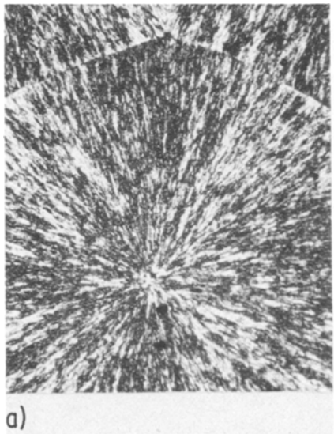

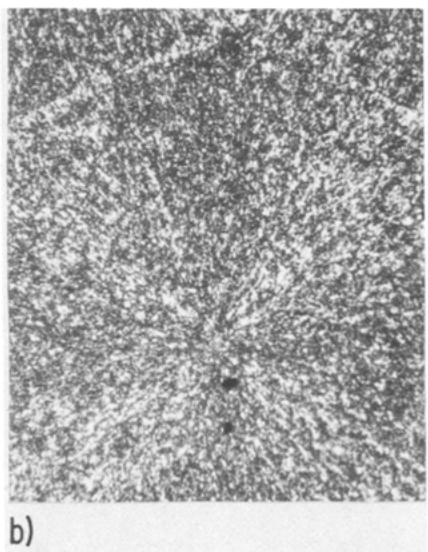

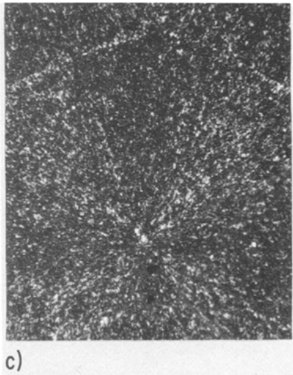

<!-- page 4 of 11 -->

318

J. Electrochem. Soc.: ELECTROCHEMICAL SCIENCE AND TECHNOLOGY

February 1986

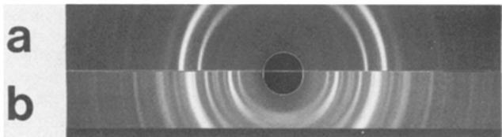

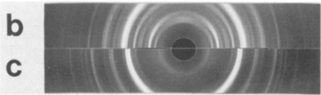

Fig. 3. X-ray diffraction patterns at T = 25 °C: (a) PEO, (b) $\mathrm{PEO}_4\mathrm{LiCF}_3\mathrm{SO}_3$ mixture, and (c) $\mathrm{LiCF}_3\mathrm{SO}_3$.

creeping of the electrolyte; (ii) VTF type conductivity behavior due to recrystallization kinetics, which can be very slow (several days, even weeks); (iii) modifications in the crystalline macrostructure of intermediate compounds and PEO when either of these are present (see phase diagrams).

For the experimental conditions used, the conductivity measurements therefore seem very representative of the materials characterized. All the curves in Fig. 5 show a knee and two regions of linear dependence of $\log_{10}(\sigma)$ with (1/T). Equation [1] provides an accurate description of these two regions. The temperatures observed for the discontinuities, plotted on Fig. 1, correspond to the eutectic melting temperature, the only exception being $\mathrm{PEO}_{100}\mathrm{LiCF}_3\mathrm{SO}_3$, whose transition temperature was observed to be slightly higher.

It should be noted that the sharp variation in the conductivity observed at the transition temperature is relatively proportional to the mass fraction of the amorphous phase formed when the eutectic melts. Figure 6 contains

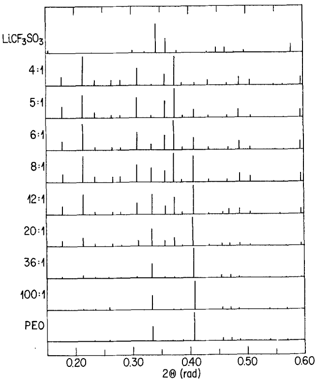

Fig. 4. Histograms of x-ray diffraction patterns for the PEO-LiCF$_3$SO$_3$ system.

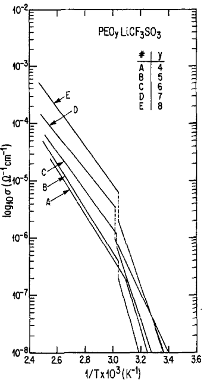

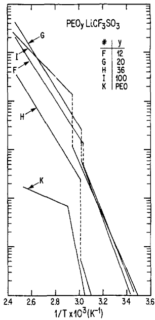

Fig. 5. Variation in total ion conductivity vs. inverse temperature for PEO-LiCF$_3$SO$_3$ based electrolytes with variable mole ratios O/Li(y).

plotted values of the activation energy of the ion conduction mechanism vs. the salt concentration for  $T > 60^{\circ}C$ . Also included are values published by Berthier et al. (11) and Weston and Steele (18), for the same temperature range but under nonequivalent experimental conditions. Since all these systems are close to thermodynamic equilibrium, the activation energy values show good agreement. For PEO- $LiCF_{3}SO_{3}$  electrolytes with salt mass fractions of over  $X \simeq 0.05$ , a single ion transport mechanism seems to be determinant. Its activation energy is  $\simeq 0.7$  eV. For temperatures below the transition temperatures, both the recrystallization kinetics and the different crystalline macrostructures can significantly influence the measured conductivity values and, consequently, the activation-energy values of the apparent conduction mechanisms.

Variations in  $\log_{10}(\sigma)$  vs. the salt mass fraction in the electrolyte are plotted in Fig. 7 for different isotherms at  $T > 60^{\circ}C$ . Two conductivity maxima are observed: one at  $X \simeq 0.03$  (O/Li  $\simeq 100$ ), the other at  $X \simeq 0.16$  (O/Li  $\simeq 18$ ). Two phenomenological models have been proposed (10, 12, 15) to describe and predict the conductivity variation of polymer electrolytes vs. temperature and salt content. Neither is able to describe the observed dependence (Fig. 7).

The ambiguity related to the conduction mechanism of the PEO-LiCF$_3$SO$_3$ system was pointed out by Gorecki (10). This system has a two-phase (crystalline and amorphous) composition at $T > 60^\circ\text{C}$, with ion mobility occurring mainly in the amorphous phase. However, such electrolytes have an apparently Arrhenius type rather than a VTF behavior. Ratner (22) mentions that if the amorphous chains strong molecular movements are prevented, as in the case of very crystalline polymers, the dependence of configurational entropy on temperature is weak, giving rise to the Arrhenius type behavior observed. The phase diagram in Fig. 1 can be used to evaluate the relative proportions of the amorphous and crystalline phases present at $T > 60^\circ\text{C}$. For PEO$_3$LiCF$_3$SO$_3$, for example, at least 50% (by wt) of the electrolyte is amorphous although after Ratner's discussion (22) this seems to represent a limiting case. Furthermore, according to Gorecki (10), Berthier et al. (11), and Minier et al. (12), the conductive amorphous-phase fraction ($L(T)$) is defined by the following equation

Downloaded on 2014-07-08 to IP 129.130.252.222 address. Redistribution subject to ECS terms of use (see ecsdl.org/site/terms\_use) unless CC License in place (see abstract).

$$
L (T) = 1 / 2 [ 3 A (T) - 1 ]\tag{[3]}
$$

where $A(T)$ is the amorphous-phase proportion evaluated from the phase diagram. Yet Eq. [3] is equal to zero when

<!-- page 5 of 11 -->

Vol. 133, No. 2

PEO-LiX ELECTROLYTES

319

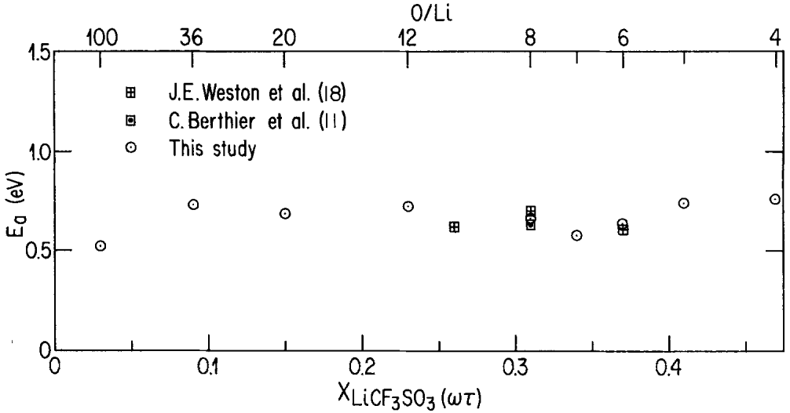

Fig. 6. Variation in activation energy of ion conduction mechanism vs. mass fraction of $\mathrm{LiCF_3SO_3}$ in the electrolyte, for $60 < T < 130^{\circ}\mathrm{C}$.

$A(T)$ is equal to $1/3$ so that the proposed modeling equation

$$
\sigma = L (T) N (T) / \alpha (T) T\tag{[4]}
$$

cannot apply to isotherms because temperature (T), scale factor  $(\alpha(T))$  and concentration  $(N(T))$  are constant, making  $\sigma$  dependent only on  $L(T)$ , which varies between -0.5 and 1 over the entire concentration range. Sorensen and Jacobsen (15) proposed a model which, although simple, does not account for such significant parameters as variation in ion mobility vs. the salt concentration of the conductive amorphous phase. The activation energy of the conduction mechanism, calculated from Sorensen and Jacobsen's experimental results does depend on the salt concentration, contrary to previously reported results (18) and those of this study. The major influence of the amorphous phase on the ionic conductivity is the only point of convergence of the proposed models. A

nonmodel-based study (23) suggests that anion mobility in PEO-LiX electrolytes depends on the viscosity of the amorphous phase. A similar conclusion was drawn from results for lithium salts in liquid organic solvents (24). However, such observations fail to take account of all the parameters governing the ion conductivity mechanism in PEO-$\mathrm{LiCF}_3\mathrm{SO}_3$ polymer electrolytes.

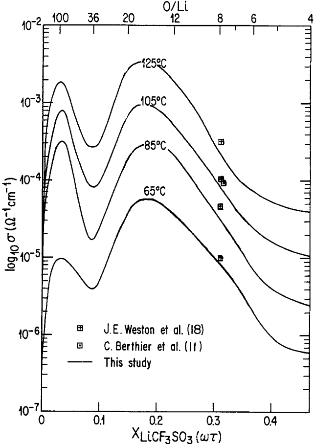

Fig. 7. Isotherms of ion conductivity vs. mass fraction of $\mathrm{LiCF_3SO_3}$ in the electrolyte.

Figure 8 presents the WAXS results obtained at ambient temperature for PEO-LiClO$_{4}$ electrolytes. It shows very clearly that the addition of salt has two main effects. First it causes additional lines to appear, two of which, at $2\theta = 0.18$ and $0.29$ rad, are very distinct from those for PEO; these can already be seen on the pattern of the PEO$_{20}$LiClO$_{4}$ mixture. Secondly, the intensity of two other lines at $2\theta = 0.26$ and $0.39$ increases up to a salt concentration corresponding to that of the PEO$_{6}$LiClO$_{4}$ mixture. Note that at this stoichiometry there is no diffraction due to pure PEO. For salt concentrations higher than that of PEO$_{6}$LiClO$_{4}$, several new lines appear, the most intense

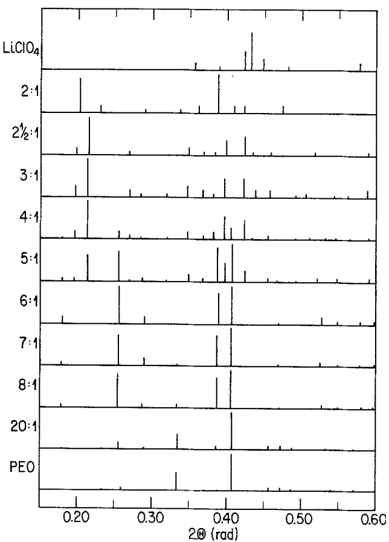

Fig. 8. Histograms of x-ray diffraction patterns for the PEO-LiClO₄

Downloaded on 2014-07-08 to IP 129.130.252.222 address. Redistribution subject to ECS terms of use (see ecsdl.org/site/terms\_use) unless CC License in place (see abstract).<!-- page 6 of 11 -->

320

J. Electrochem. Soc.: ELECTROCHEMICAL SCIENCE AND TECHNOLOGY

February 1986

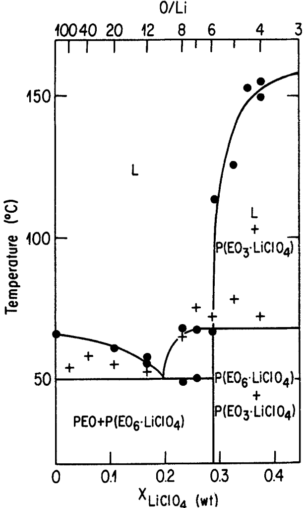

Fig. 9. Phase diagram of the PEO-LiClO$_{4}$ system: (●) transitions observed by microscopy, (+) transitions observed by conductivity measurements.

around  $2\theta = 0.21$ , 0.40, and 0.42 rad. These do not correspond to the lines of lithium perchlorate, and the intensity of these lines increases in proportion to the salt concentration whereas that for the  $PEO_{6}LiClO_{4}$  mixture are no longer observed.

The PEO-LiClO$_{4}$ system does not result in the formation of an intermediate compound with a mole ratio of 4 but in intermediate compounds with stoichiometries of P(EO$_{3}$LiClO$_{4}$) and P(EO$_{6}$LiClO$_{4}$), among others. Referring again to Fig. 8, it can be seen that the subsequent addition of salt to P(EO$_{3}$LiClO$_{4}$) does not produce diffraction lines characteristic of pure lithium salt. As observed, the diffraction pattern of the PEO$_{2}$LiClO$_{4}$ mixture seems to indicate the presence of a new complex, whose most intense lines are located at 2$\theta$ = 0.20 and 0.39 rad. It therefore appears that the PEO-LiClO$_{4}$ system results in the formation of at least three intermediate compounds having different stoichiometries. After characterizing a PEO$_{8}$LiClO$_{4}$ mixture by DSC and NMR, Gorecki (10) raised the possible existence of two crystalline complexes with different LiClO$_{4}$ concentrations.

Figure 9 presents phase transitions observed by microscopy when various electrolytes of the PEO-LiClO$_{4}$ system were heated. These results suggest, in agreement with the WAXS results, the presence of an intermediate compound, P(EO$_{6}$LiClO$_{4}$), melting at $\simeq$ 65°C. This compound forms with PEO, a eutectic whose melting temperature is $\simeq$ 50°C and whose composition is near PEO$_{10}$LiClO$_{4}$. However, no eutectic is observed between the intermediate compounds P(EO$_{6}$LiClO$_{4}$) and P(EO$_{3}$LiClO$_{4}$) but rather a monotectic, in other words the limit case where the eutectic composition is no longer distinguishable from the composition of one of the two constituents. The eutectic temperature, therefore, is the same as the melting temper-

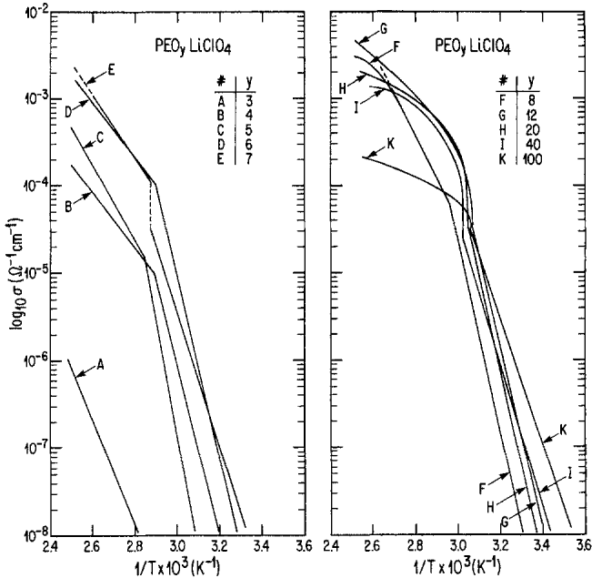

Fig. 10. Variations in total ion conductivity vs. inverse temperature for PEO-LiClO$_4$ based electrolytes with variable mole ratios O/Li(y).

ature of  $P(EO_{6}LiClO_{4})$ . The solubility curve of  $P(EO_{3}LiClO_{4})$  is relatively steep around this particular composition before finally reaching the melting temperature of  $P(EO_{3}LiClO_{4})$ , namely, 160°C. Electrolytes with a salt concentration higher than that of  $P(EO_{3}LiClO_{4})$  have not been studied by microscopy.

As observed by optical microscopy and in agreement with the phase diagram in Fig. 9, most of the PEO$_{8}$LiClO$_{4}$ mixture melts at the eutectic temperature and then slowly dissolves the remaining P(EO$_{6}$LiClO$_{4}$). This process reaches completion at $\simeq$ 68°C. Weston and Steele (18, 19) report very different behavior for PEO$_{8}$LiClO$_{4}$ mixtures prepared in air with an anhydrous solvent compared to those prepared with solvents containing up to 2% water (by vol). However, infrared analysis reveals that anhydrous and BDH 99.7% acetonitriles have quasi equivalent water contents. Anhydrous PEO$_{8.2}$LiClO$_{4}$ has a reversible behavior in DSC during thermal cycling, which indicates fast recrystallization kinetics. According to DSC and conductivity measurements, this same electrolyte is similar in behavior to PEO-LiCF$_{3}$SO$_{3}$ electrolytes. The authors also report a transition temperature of 137°C for PEO$_{8.2}$LiClO$_{4}$, which is close to that obtained upon completion of the PEO$_{8}$LiCF$_{3}$SO$_{3}$ dissolution. Analysis of the DSC results reveals an equivalent end of dissolution temperature. It should be recalled that the samples used in the present work were prepared and stored under anhydrous conditions. The results reported here accurately describe the behavior of PEO-LiClO$_{4}$ electrolytes. Berthier et al. (11) have also reported that a PEO$_{8}$LiClO$_{4}$ mixture prepared under anhydrous conditions is totally amorphous at temperatures above the PEO melting temperature.

The PEO-LiClO$_{4}$ electrolytes were characterized by ac conductivity measurements. Curves of $\log_{10}(\sigma)$ vs. (1/T) are presented in Fig. 10 for various compositions. These conductivity values were obtained during the first temperature rise. For temperatures below the transition temperature, the variation of $\log_{10}(\sigma)$ vs. (1/T) shows a linear relationship, adequately described by Eq. [1], for all compositions investigated. The transition temperatures, given in Fig. 9, show agreement with the phase transitions predicted by the phase diagram. For temperatures above the transition temperatures, the variation in $\log_{10}(\sigma)$ vs. (1/T) can be described by Eq. [1] for electrolytes with a salt content greater than that of PEO$_{8}$LiClO$_{4}$. For less concentrated electrolytes the experimental results show a VTF-type dependence but, in view of the restricted temperature range, these results can statistically be linearized in accordance with Eq. [1], with linearity coefficients close

Downloaded on 2014-07-08 to IP 129.130.252.222 address. Redistribution subject to ECS terms of use (see ecsdl.org/site/terms\_use) unless CC License in place (see abstract).

<!-- page 7 of 11 -->

Vol. 133, No. 2

PEO-LiX ELECTROLYTES

321

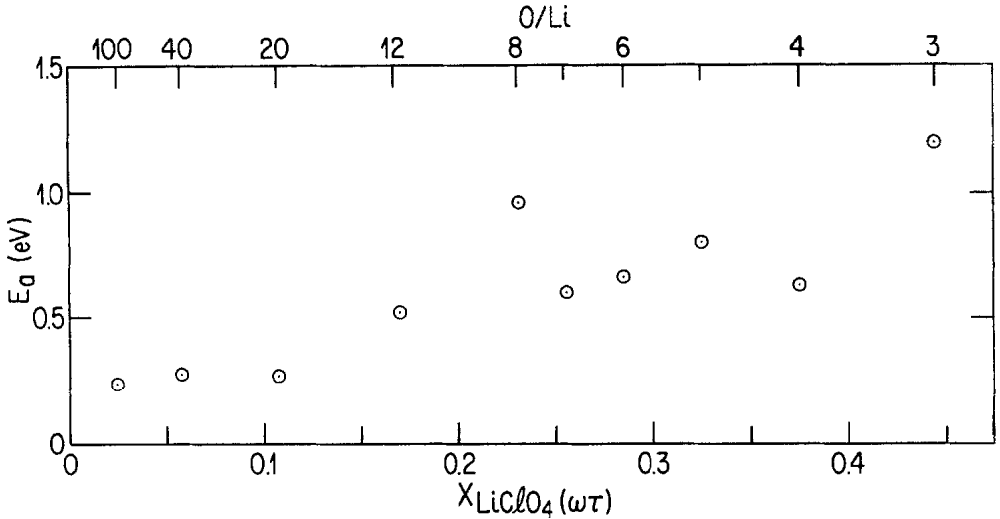

Fig. 11. Variations in activation energy of the ion conduction mechanism vs. mass fraction of $\mathrm{LiClO_4}$ in the electrolyte, for $60 < T < 120^{\circ}\mathrm{C}$. For $X < 0.18$, the values were obtained by VTF curve linearization.

to 1 (r > 0.95), if account is taken of a jump in the conductivity value at the transition temperature. The calculated activation energies as a function of the salt mass fraction, are presented in Fig. 11. It can be seen that for high mass fractions the activation energy is approximately constant and equal to  $\simeq 0.7$  eV whereas for diluted electrolytes, the value is nearer 0.3 eV.

Figure 12 depicts the variation in $\log_{10}(\sigma)$ vs. the mass fraction of $\mathrm{LiClO_4}$ in the electrolyte for different isotherms at $T > 60^{\circ}\mathrm{C}$. PEO-$\mathrm{LiClO_4}$ electrolytes, similar to those based on PEO-$\mathrm{LiCF_3SO_3}$, have a high conductivity when diluted and likewise show a maximum for salt mass fractions of 0.18 (O/Li $\simeq 12$). The latter agreement seems fortuitous, since PEO-$\mathrm{LiCF_3SO_3}$ represents a two-phase system at $X \simeq 0.18$, over the temperature range from 65 ° to 125 °C. For the PEO-$\mathrm{LiClO_4}$ system at $X \simeq 0.18$, on the other hand, the electrolyte is single phase (amorphous) for the same temperature range. The same figure shows that the conductivity reaches a maximum near the

P(EO$_6$LiClO$_4$) composition, which could be explained by a particular chain conformation, which is retained in the melted state, favoring the ion mobility. Raising the temperature to $T > 105^\circ\text{C}$ reduces this maximum quite considerably.

Another lithium salt widely used in lithium batteries is  $LiAsF_{6}$ , which is the reason the PEO- $LiAsF_{6}$  system was studied within the framework of this project. Figure 13 presents histograms of the WAXS diffraction patterns for this system over the range from pure PEO to the pure salt. Here again, the addition of salt causes several new lines to appear, different from those of the pure constituents. The three most intense are located at  $2\theta = 0.25$ , 0.38, and 0.395 rad, and their intensity increases at higher salt contents up to a mole ratio of 6-7. This is accompanied by a reduction in the intensity diffracted by the PEO, which

Fig. 12. Isotherms of ion conductivity vs. mass fraction of $\mathrm{LiClO_4}$ in the electrolyte.

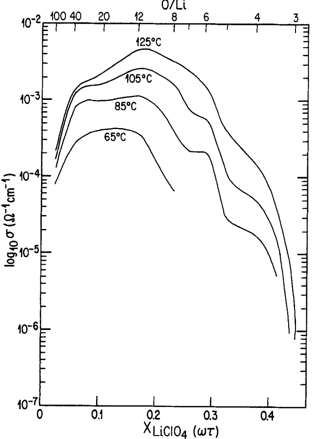

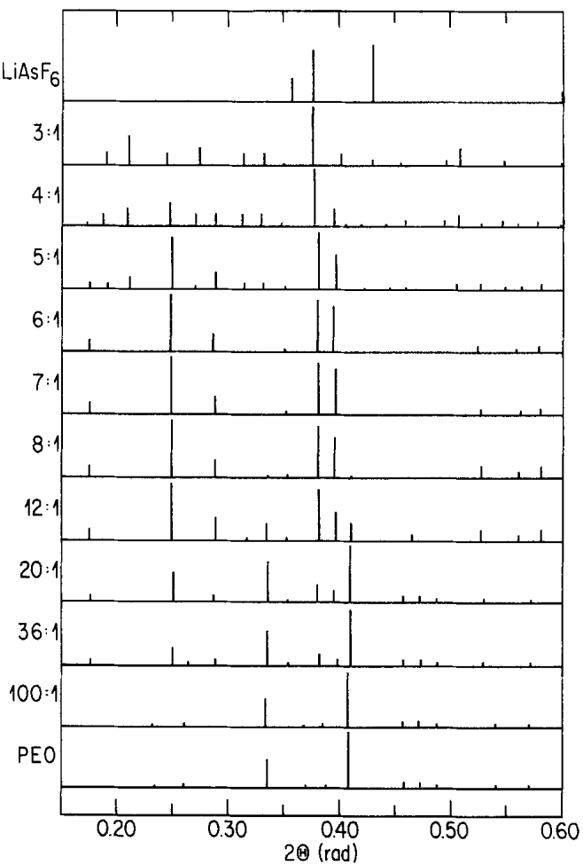

Fig. 13. Histograms of the x-ray diffraction patterns for the PEO-LiAsF$_6$ system.

Downloaded on 2014-07-08 to IP 129.130.252.222 address. Redistribution subject to ECS terms of use (see ecsdl.org/site/terms\_use) unless CC License in place (see abstract).

<!-- page 8 of 11 -->

322

J. Electrochem. Soc.: ELECTROCHEMICAL SCIENCE AND TECHNOLOGY

February 1986

from  $PEO_{7}LiAsF_{6}$  onwards can no longer be detected. For salt concentrations higher than that of  $PEO_{6}LiAsF_{6}$ , new lines different from those of the  $LiAsF_{6}$  salt appear. For  $PEO_{3}LiAsF_{6}$  the characteristic lines of  $PEO_{6}LiAsF_{6}$  are no longer observed. The PEO- $LiAsF_{6}$  system is therefore similar in behavior to the PEO- $LiClO_{4}$  system in that two intermediate compounds of stoichiometries  $P(EO_{6}LiAsF_{6})$  and  $P(EO_{3}LiAsF_{6})$  are formed.

Confirmation of the similarity between PEO-LiAsF$_{6}$ and PEO-LiClO$_{4}$ is provided by the isomorphism observed in one of their intermediate compounds. Figure 14, in fact, shows that the WAXS pattern of the intermediate compound P(EO$_{6}$LiClO$_{4}$) is barely affected when the anion ClO$_{4}^{-}$ is replaced by the anion AsF$_{6}^{-}$. This is an indication that (i) these two compounds are isomorphous, i.e., have the same crystalline structure, and (ii) that their unit-cell parameters have very similar values. Actually, as seen in Fig. 14, these unit-cell values are slightly higher for P(EO$_{6}$LiAsF$_{6}$), in agreement with the estimated volume of the AsF$_{6}^{-}$ anion, which is also slightly larger. The difference in the scattering power of these two anions can explain the small variations observed in the relative intensity of the lines for the two intermediate compounds.

The thermal behavior of the PEO-LiAsF$_{6}$ mixtures corroborates the previous conclusions. As shown in Fig. 15, the different transitions observed by microscopy describe the formation of a eutectic between an intermediate compound, P(EO$_{6}$LiAsF$_{6}$), and pure PEO. The eutectic temperature is around 55°C. The eutectic composition, approximately PEO$_{22}$LiAsF$_{6}$, has a higher salt concentration than the PEO-LiCF$_{3}$SO$_{3}$ system. As in the case of the PEO-LiClO$_{4}$ system, a sharp increase in the liquidus line of P(EO$_{3}$LiAsF$_{6}$) is noted. It should be pointed out that the melting temperature of P(EO$_{6}$LiAsF$_{6}$), i.e., 136°C, is ≈ 70°C higher than that of P(EO$_{6}$LiClO$_{4}$). Electrolytes with a higher salt content than PEO$_{5}$LiAsF$_{6}$ proved to be thermally unstable when observed microscopically and during conductivity measurements. The instability is worse in the presence of lithium electrodes and is observed even with electrolytes having a low salt concentration. It is characterized by a blackening of the electrolytes and an increase in conductivity vs. time at constant temperature when $T > 90°C$.

Figure 16 presents curves of $\log_{10}(\sigma)$ vs. (1/T) for electrolytes with mole ratios between 4 and 100; these curves are described by Eq. [1]. The curve obtained for $\mathrm{PEO_4LiAsF_6}$ is included only as an indication of conductivity values at higher salt concentration. The high apparent activation energy of this particular sample is at least partly due to its thermal degradation. The conductivity

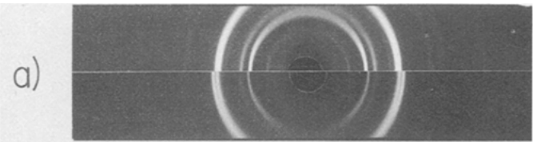

b)

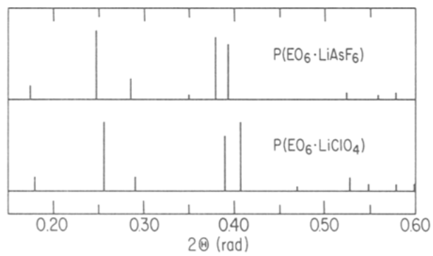

Fig. 14. X-ray diffraction patterns (a) and histogram (b) of the two isomorphous intermediate definite compounds, P(EO₆LiAsF₆) and P(EO₆LiClO₄).

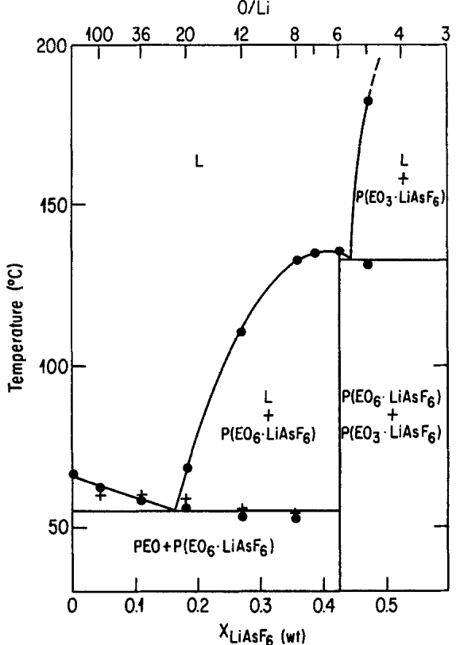

Fig. 15. Phase diagram of the PEO-LiAsF$_6$ system.: (●) transitions observed by microscopy, (+) transitions observed by conductivity measurements.

transition temperatures observed (Fig. 15) correspond to the melting temperatures of the eutectic for electrolytes with a salt concentration higher than that of PEO$_{22}$LiAsF$_6$, and to the end of dissolution temperature for less concentrated electrolytes. Note that in the case of the PEO-LiAsF$_6$ system as for the PEO-LiCF$_3$SO$_3$, the variation in conductivity at the transition temperature seems to be proportional to the amorphous-phase fraction formed.

Activation energy values obtained at temperatures higher than the conductivity transition temperatures observed are presented in Fig. 17 but only for electrolytes with a salt mass fraction lower than 0.35 (O/Li > 8). The above-mentioned instability of these electrolytes introduces a degree of nonreproducibility in the conductivity

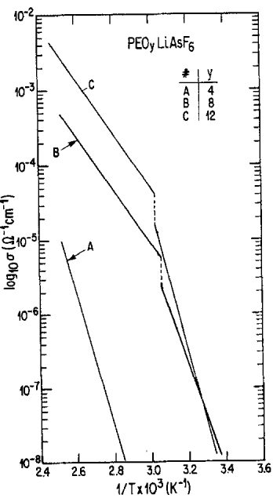

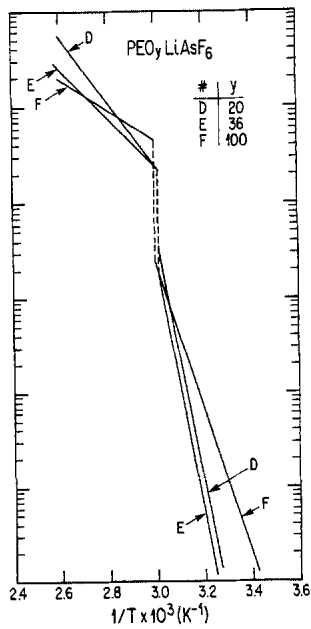

Fig. 16. Variations in total ion conductivity vs. inverse temperature for PEO-LiAsF$_{6}$ based electrolytes with variable mole ratios O/Li(y).

Downloaded on 2014-07-08 to IP 129.130.252.222 address. Redistribution subject to ECS terms of use (see ecsdl.org/site/terms\_use) unless CC License in place (see abstract).

<!-- page 9 of 11 -->

Vol. 133, No. 2

PEO-LiX ELECTROLYTES

323

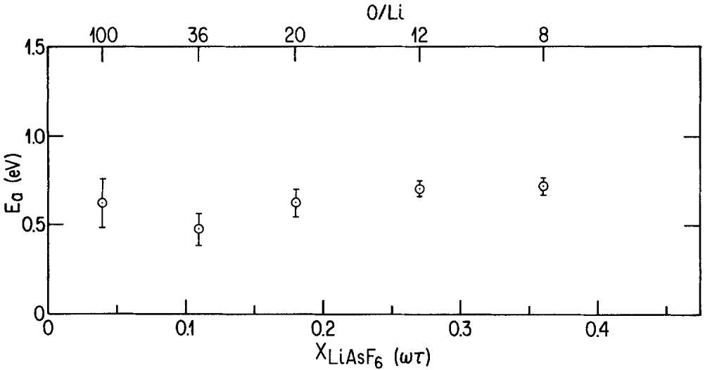

Fig. 17. Variations in the activation energy of the ion conduction mechanism vs. mass fraction of $\mathrm{LiAsF_6}$ in the electrolyte, for $60 < T < 120^{\circ}\mathrm{C}$. For $X > 0.35$, the electrolytes are thermally unstable.

behavior, which explains the greater margin of uncertainty for the activation energy values of the PEO-LiAsF$_{6}$ system conduction mechanism. A more or less constant value of 0.6-0.7 eV can be taken as characteristic.

Figure 18 shows variations in  $\log_{10}(\sigma)$  as a function of the salt mass fraction for different isotherms. Here again the conductivity reaches a maximum for diluted electrolytes. A second maximum is noted around X = 0.18, as in the case of the two previous systems. Unfortunately, the electrolyte instability makes it impossible to define the variation of  $\log_{10}(\sigma)$  for X > 0.35 properly.

## Discussion

It is known that the interactions between PEO and several organic compounds can be experimentally described by phase diagrams (25-29). Moreover, this seems to be a feature of macromolecular systems (30-35). For PEO-alkaline metal salts, however, the phase-diagram ap-

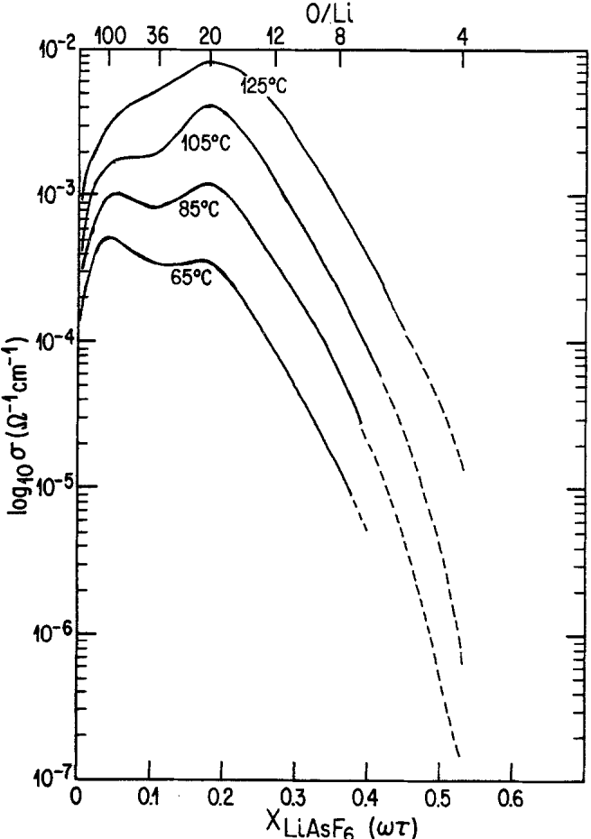

Fig. 18. Isotherms of the ion conductivity vs. mass fraction of $\mathrm{LiAsF_6}$ in the electrolyte.

proach has only been applied to the following salts: NaSCN (8),  $LiCF_{3}SO_{3}$  (10, 12, 15, 18), NaI (10), KSCN (36),  $NH_{4}SCN$ , and  $NH_{4}CF_{3}SO_{3}$  (16), all of which are characterized by one or several eutectic reactions. A number of other salts are also known (3, 14, 17, 37, 38) to form intermediate compounds or complexes with PEO but their phase diagrams have not yet been established.

One of the characteristics of two of the systems covered by the present study is the formation of more than one intermediate compound or complex. The same characteristic has also been observed for other PEO-salt systems (10, 16, 17). The presence of several eutectic reactions has been noted for the PEO-$\mathrm{LiClO_4}$ and PEO-$\mathrm{LiAsF_6}$ systems whereas for the $\mathrm{PEO - LiCF_3SO_3}$ system a simple eutectic reaction has been observed, although its salt concentration is far weaker than that of the other two systems. The former both have solubility curves which show that their intermediate compounds, $\mathrm{P(EO_3LiX)}$, are not very soluble in molten $\mathrm{P(EO_6LiX)}$. This shows up in the phase diagrams under the form of monotectics at a mole ratio of 6. This hexacoordination is kept in the amorphous state over quite wide temperature ranges, characteristic of each system. Only in the case of the $\mathrm{PEO - LiClO_4}$ system is the hexacoordination such that the salt is solvated at the minimum temperature where the PEO can be considered as solvent (T = 70 °C). In the case of the $\mathrm{PEO - LiAsF_6}$ system it takes 25 oxygen monomer units to ensure total salt solvation at that temperature whereas at the other extreme some 100 units are needed for the $\mathrm{PEO - LiCF_3SO_3}$ system.

The spherulitic growth rate is slow for both hexacoordinated intermediate compounds at equivalent undercooling values. This makes the organization of this crystalline structure a slow process, probably limited by the diffusion of macromolecular chains, as shown by conductivity measurements of these intermediate compounds which show no reduction in the mobility of the ionic species. On the contrary, the conductivity of $\mathrm{P(EO_6LiClO_4)}$ shows a slight maximum for $60 < T < 105^{\circ}\mathrm{C}$ (Fig. 12), which is consistent with the assumption that an intramolecular helix (6/1) is formed. This assumption agrees with the model proposed by Papke et al. (21) which corresponds to a macromolecular chain conformation of the $\mathrm{T}_2\mathrm{GT}_2\bar{\mathrm{G}}$ type. Moreover, the isomorphism and quasi-equivalent unit cell parameters observed for the two $\mathrm{P(EO_6LiX)}$ intermediate compounds seem to confirm the existence of a common polymer-cation/arrangement. These compounds together should form solid solutions.

As mentioned in the introduction, the formation of complexes of salt concentrations higher than a mole ratio of 4 has already been identified for lithium and sodium salts. A stoichiometry of 3 seems to be favored for such systems. In fact the experimental results obtained in the present study show that for the PEO-LiClO$_{4}$ and PEO-LiAsF$_{6}$ systems, the stoichiometry of at least one of the

Downloaded on 2014-07-08 to IP 129.130.252.222 address. Redistribution subject to ECS terms of use (see ecsdl.org/site/terms\_use) unless CC License in place (see abstract).

<!-- page 10 of 11 -->

324

J. Electrochem. Soc.: ELECTROCHEMICAL SCIENCE AND TECHNOLOGY

February 1986

intermediate compounds is 3; by analogy, an equivalent stoichiometry is proposed for the intermediate compound P(EO₃LiCF₃SO₃).

When the variation in conductivity vs. the salt concentration in the electrolyte is presented in the form of isotherms, it is obvious that simple models cannot explain the conductivity dependence over the entire concentration range. The decrease in conductivity observed when the volume fraction of the crystalline phase increases can be modeled without taking all the determining parameters into account.

The experimental results of this work reveal that the activation energy of the ion conduction mechanism is constant, and consequently independent of the nature of the anion. The limiting step for conductivity is therefore dependent on the cation mobility in the amorphous phase. Supposing the conductivity is purely cationic, this should therefore result in equivalent conductivity values, from one amorphous system to another. But this is not what is observed experimentally and it may hence be deduced that the anionic interactions are not equivalent in each system (39-41). Graphic representations of the variations in equivalent conductance vs. concentration (Fig. 19) show a deviation from the expected linear behavior for dissociated 1:1 electrolytes (42). From the low dielectric constant of PEO, $\epsilon = 5$ (43), and the shape of the equivalent-conductance curves, there is reason to believe that ion pairs and/or triplets are formed in PEO-LiX solutions. Note, however, that the results presented here provide no information on anion mobility or their temperature- or concentration-dependence. The only way to determine the respective participation of ions is to make direct measurements of the cation and anion transport numbers.

Study of the variation in the conductivity of two-phase electrolytes calls for special consideration, particularly in the case of PEO-LiCF$_3$SO$_2$, which has a two-phase domain extending over wide temperature and concentration ranges. In this situation, two additional parameters may

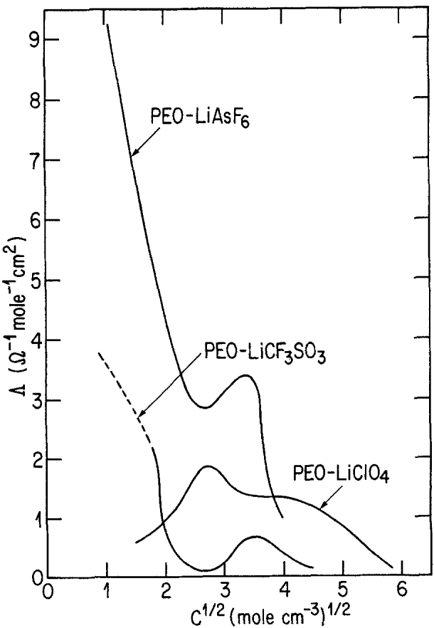

Fig. 19. Equivalent conductance vs. salt concentration in the electrolyte for the PEO-LiCF$_{3}$SO$_{3}$, PEO-LiClO$_{4}$, and PEO-LiAsF$_{6}$ systems at T = 105 °C.

be identified, namely, (i) the nature of the nonconductive charges and their dielectric constant, and (ii) the effects of the interface between the amorphous and the crystalline phases which, in this specific case, presents very large surface/volume ratios.

## Conclusion

The PEO systems studied in this work are subject to the laws of classical thermodynamics and can therefore be described by phase diagrams. However, deviations can be induced by a number of particularities of the molecular nature of the solvent. For example, at temperatures below  60 ° C a fraction of the electrolyte remains in the amorphous state. PEO-LiX systems therefore can only be considered close to thermodynamic equilibrium in the two-phase or single-phase domain, which implies a liquid phase, as reflected by their conductivity behavior. Efforts to model the conductivity in terms of the various dependent parameters should therefore be based on precise data about the amorphous phase, i.e., transport numbers and the ion pair/triplet formation constants. In the crystalline phase, other parameters such as the morphology or the crystalline macrostructure should be considered together with any deviations from thermodynamic equilibrium following the segregation of ionic species.

## Acknowledgments

The authors would like to express their appreciation to Dr. M. Gauthier of IREQ and to Dr. M.B. Armand of the Laboratoire d'énergétique électrochimique of Grenoble, France, for valuable general discussions. The technical assistance of F. Brochu, D. Lebeuf, and R. Bellemare is also acknowledged.

Manuscript submitted May 8, 1985; revised manuscript received Oct. 18, 1985. This was Paper 312 presented at the Toronto, Ontario, Canada, Meeting of the Society, May 12-17, 1985.

Institut de Recherche d'Hydro-Québec assisted in meeting the publication costs of this article.

## REFERENCES

1. D. E. Fenton, J. M. Parker, and P. V. Wright, Polymer, 14, 589 (1973).

2. P. V. Wright, Br. Polymer J., 7, 319 (1975).

3. M. B. Armand, J. M. Chabagno, and M. J. Duclot, in "Fast Ion Transport in Solids," P. Vashishta, J. N. Mundy, and G. K. Shenoy, Editors, pp. 131-136, North-Holland, New York (1979).

4. A. Hooper and J. M. North, Solid State Ionics, 9 and 10, 1161 (1983).

5. M. Gauthier, D. Fauteux, G. Vassort, A. Bélanger, M. Duval, P. Ricoux, J. M. Chabagno, D. Muller, P. Rigaud, M. B. Armand, and D. Deroo, Second International Meeting on Lithium Batteries, Paris, France, April 25-27, 1984.

6. B. L. Papke, M. A. Ratner, and D. F. Shriver, This Journal, 129, 1694 (1982).

7. D. B. James, R. S. Stein, and W. J. Macknight, Bull. Am. Phys. Soc., 24, 479 (1979).

8. C. Robitaille and J. Prud'homme, 65th Canadian Chemical Congress, Toronto, May 1982, Abstract no. MA-10.

9. T. Hibma, Solid State Ionics, 9 and 10, 1101 (1983).

10. W. Gorecki, Doctoral Thesis, Grenoble University, France (1984).

11. C. Berthier, W. Gorecki, M. Minier, M. B. Armand, J. M. Chabagno, and P. Rigaud, Solid State Ionics, 11, 91 (1983).

12. M. Minier, C. Berthier, and W. Gorecki, J. Phys., 45, 739 (1984).

13. R. Dupon, B. L. Papke, M. A. Ratner, D. H. Whitmore, and D. F. Shriver, J. Am. Chem. Soc., 104, 6247 (1982).

14. A. A. Blumberg, S. S. Pollack, and C. A. J. Hoeve, J. Polym. Sci. (A), 2, 2499 (1964).

15. P. R. Sorensen and T. Jacobsen, Polymer Bull., 9, 47 (1983).

16. M. Stainer, L. C. Hardy, D. H. Whitmore, and D. F. Shriver, This Journal, 131, 784 (1984).

17. M. Yakoyama, H. Ishihara, I. H. Iwamoto, and H. Tadokoro, Macromolecules, 2, 184 (1969).

Downloaded on 2014-07-08 to IP 129.130.252.222 address. Redistribution subject to ECS terms of use (see ecsdl.org/site/terms\_use) unless CC License in place (see abstract).<!-- page 11 of 11 -->

Vol. 133, No. 2

PEO-LiX ELECTROLYTES

325

18. J. E. Weston and B. C. H. Steele, Solid State Ionics, 2, 347 (1981).

19. J. E. Weston and B. C. H. Steele, ibid., 7, 81 (1982).

20. D. R. Payne and P. V. Wright, Polymer, 23, 690 (1982).

21. B. L. Papke, M. A. Ratner, and D. F. Shriver, This Journal, 129, 1434 (1982).

22. M. A. Ratner, Acc. Chem. Res., 15, 355 (1982).

23. D. Fauteux, J. Gauthier, A. Bélanger, and M. Gauthier, Abstract 711, p. 1140, The Electrochemical Society Extended Abstracts, Vol. 82-1, Montreal, Que., Canada, May 9-14, 1982.

24. J. M. Sullivan, D. C. Hanson, and R. Keller, This Journal, 117, 779 (1970).

25. R. M. Myasnikova, Vysokomol. soyad., A19, 564 (1977).

26. R. M. Myasnikova, E. F. Titova, and E. S. Obolonkova, Polymer, 21, 403 (1980).

27. C. C. Gryte, H. Berghmans, and G. Smets, J. Polym. Sci., Polym. Phys. Ed., 17, 1295 (1979).

28. J. C. Wittmann and R. St. John Manley, ibid., 15, 2277 (1977).

29. R. E. Prud'homme, ibid., 20, 307 (1982).

30. P. Smith, G. O. R. Alberda van Ekenstein, and A. J. Pennings, Br. Polymer J., 9, 258 (1977).

31. A. M. Hodge, G. Kiss, B. Lotz, and J. C. Wittmann, Polymer, 23, 985 (1982).

32. P. Smith and A. J. Pennings, ibid., 15, 413 (1974).

33. J. C. Wittmann and R. St. John Manley, J. Polym. Sci., Polym. Phys. Ed., 15, 1089 (1977).

34. P. Smith and A. J. Pennings, ibid., 15, 523 (1977).

35. M. Farina, G. Di Silvestro, and M. Grassi, Makromol. Chem., 180, 1041 (1979).

36. S. Marques, Master's Thesis, University of Montreal (1984).

37. D. F. Shriver, B. L. Papke, M. A. Ratner, R. Dupon, T. Wong, and M. Brodwin, Solid State Ionics, 5, 83 (1981).

38. A. A. Brumberg and J. Wyatt, J. Polym. Sci., Polymer Lett., 4, 653 (1966).

39. H. Cheradame, A. Gandini, A. Killis, and J. F. LeNest, J. Power Sources, 9, 389 (1983).

40. M. Mali, J. Roos, and D. Brinkmann, 22nd Ampere Colloquium, Zurich, Switzerland (1984).

41. S. Clancy and D. F. Shriver, Abstract 625, p. 911, The Electrochemical Society Extended Abstracts, Vol. 84-2, New Orleans, LA, Oct. 7-12, 1984.

42. R. M. Fuoss and F. Accascina, "Electrical Conductance of Electrolytes," Interscience, New York (1959).

43. N. G. McCrum, B. E. Read, and G. Williams, "Anelastic and Dielectric Effects in Polymeric Solids," John Wiley & Sons, New York (1967).

# Aluminum Bromide-1-Methyl-3-Ethylimidazolium Bromide Ionic Liquids

I. Densities, Viscosities, Electrical Conductivities, and Phase Transitions

John R. Sanders, Edmund H. Ward, and Charles L. Hussey\*

Department of Chemistry, University of Mississippi, University, Mississippi 38677

## ABSTRACT

The solid-liquid phase diagram, experimental glass transition points, densities, viscosities, and electrical conductivities of the aluminum bromide-1-methyl-3-ethylimidazolium bromide ionic liquid are reported. Certain compositions of this two-component molten salt are liquid at room temperature. Density, viscosity, and conductivity data were collected over the range of aluminum bromide mole fractions from ca. 0.35 to 0.75 and over the range of temperatures from ca. 25 ° to 100 °C. Equations are presented that describe both the composition and temperature dependence of the densities and transport properties. Both the viscosities and the conductivities display the non-Arrhenius temperature dependence typically associated with glass forming ionic liquids. Temperature-dependent activation energies are derived for these transport processes by using the Vogel-Tammann-Fulcher equation.

Certain mixtures of aluminum bromide (AlBr$_3$) and 1-methyl-3-ethylimidazolium bromide (MeEtimBr) are liquid at room temperature and display physical and chemical characteristics similar to binary aluminum chloride-organic chloride molten salt systems like aluminum chloride-1-butylpyridinium chloride (AlCl$_3$-BupyCl) and aluminum chloride-1-methyl-3-ethylimidazolium chloride (AlCl$_3$-MeEtimCl). In fact, the AlBr$_3$-MeEtimBr system is the bromide analog of the latter melt. All of these molten salts fall into the same general class of solvents that are known as room-temperature haloaluminate ionic liquids. Several reviews that discuss these haloaluminate melts are available (1-3).

$\mathrm{AlBr}_3$-MeEtimBr molten salts may be useful solvents for electrochemical and spectroscopic investigations that are concerned with the chemistry of bromo complexes and related species since they are expected to display adjustable Lewis acid-base characteristics similar to those exhibited by the related chloroaluminate systems. However, the utilization of these melts as solvents presupposes knowledge of their physical properties and liquid range. The study reported herein was undertaken in an effort to obtain information about the densities, transport properties, and phase transitions of this new ionic solvent system. It is the first reported comprehensive investigation of the preparation and physical properties of a room-temperature bromoaluminate melt.

\*Electrochemical Society Active Member.

## Experimental

Melt preparation.—The preparation of melt samples and the loading of these samples into the apparatus described below were conducted in the nitrogen-filled dry-box system described previously (4). Anhydrous aluminum bromide (Fluka, 98%) was sublimed under vacuum in this dry box a minimum of three times before use. 1-Methyl-3-ethylimidazolium bromide was prepared by combining freshly distilled 1-methylimidazole (Aldrich, 99%) with an excess of ethyl bromide (Baker, reagent grade). The 1-methylimidazole was added dropwise to the chilled ethyl bromide in a flask fitted with a reflux condenser and balloon. (Caution: a rapid exothermic reaction takes place between these components.) The flask was cooled and the resulting white solid was recrystallized twice from anhydrous acetonitrile in Kontes Airless-ware. Great care was taken to avoid exposure of the salt to atmospheric moisture. The melting point of the purified product was 77°C. The aluminum bromide-1-methyl-3-ethylimidazolium bromide melts were prepared by combining precisely weighed quantities of the purified components inside the dry box. These melts appeared somewhat photosensitive and developed a yellow coloration due to the formation of free bromine after exposure to ordinary room light for several days. Appropriate precautions were taken to avoid unnecessary exposure of the AlBr₃-MeEtimBr melt to light, and no measurements were performed with highly discolored samples.

Downloaded on 2014-07-08 to IP 129.130.252.222 address. Redistribution subject to ECS terms of use (see ecsdl.org/site/terms\_use) unless CC License in place (see abstract).