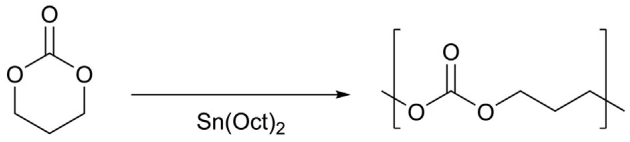
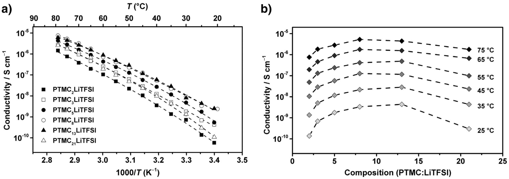
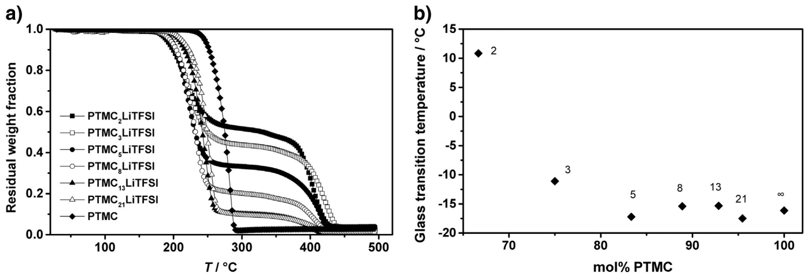
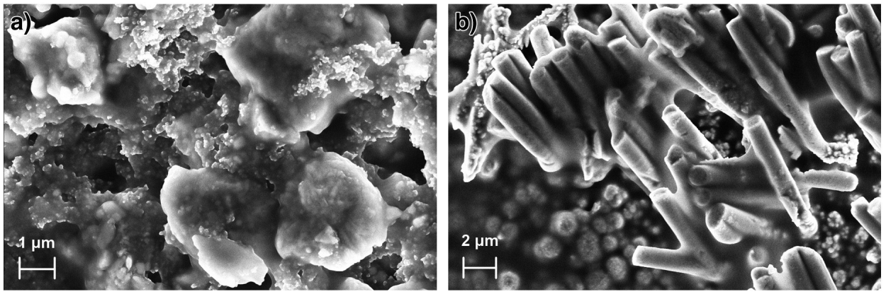

<!-- page 1 of 5 -->

SOSI-12992; No of Pages 5

[Solid State Ionics xxx (2013) xxx–xxx](http://dx.doi.org/10.1016/j.ssi.2013.08.014)

Contents lists available at [ScienceDirect](http://www.sciencedirect.com/science/journal/01672738)

Solid State Ionics

journal homepage: www.elsevier.com/locate/ssi

SOLID STATE IONICS DIFFUSION & REACTIONS

# Polycarbonate-based solid polymer electrolytes for Li-ion batteries

Bing Sun, Jonas Mindemark, Kristina Edström, Daniel Brandell ⁎

Department of Chemistry - Ångström Laboratory, Uppsala University, Box 538, SE-751 21, Uppsala, Sweden

## a r t i c l e i n f o

Article history:

Received 13 May 2013

Received in revised form 13 August 2013

Accepted 21 August 2013

Available online xxxx

Keywords:

Polycarbonate

Trimethylene carbonate

Polymer electrolyte

Li-ion battery

3D-microbattery

## a b s t r a c t

This paper reports the synthesis and application of high-molecular-weight poly(trimethylene carbonate) (PTMC) as a new host material for solid polymer electrolyte-based Li-ion batteries. PTMC was synthesized through bulk ring-opening polymerization of the cyclic monomer to yield a high-molecular-weight polymer to serve as a base material for the electrolytes. The thermal properties and ionic conductivity of polymer electrolytes with different salt ratios were measured by TGA/DSC and electrochemical impedance spectroscopy, respectively. The most conductive systems were found at [Li+]:[carbonate] ratios of 1:13 and 1:8, which showed electrochemical stability up to 5.0 V vs. Li/Li+ and an ionic conductivity on the order of $1 0 ^ { - 7 } \mathrm { S c m } ^ { - 1 } \mathrm { a t } 6 0 ^ { \circ } \mathrm { C } . \mathrm { L i F e P O } _ { 4 }$ half-cells using the electrolytes demonstrated a plateau in the specific discharge capacity around 153 mAhg−1 after long-term cycling. The functionality of the electrolytes for three-dimensional microbatteries was also confirmed.

© 2013 Elsevier B.V. All rights reserved.

## 1. Introduction

The increasing demands in Li-ion batteries with both enhanced safety and reduced cost have in recent years renewed the research interests for suitable solid polymer electrolytes (SPEs) as replacement for the conventionally used liquid/gel electrolytes. Compared to their liquid counterparts, these solvent-free electrolytes eliminate the use of flammable liquid components in conventional Li-ion batteries and can be processed for thinner and more flexible battery designs. Despite their intrinsic low ionic conductivity, SPEs have shown great potential in both small-scale battery designs (e.g., three-dimensional microbatteries; 3D-MBs) [1] and large-scale energy storage applications, such as electric vehicles [2].

Aliphatic polycarbonates have been reported by Silva and co-workers [3–7] as an alternative polymer host matrix for SPEs to the already wellinvestigated polyethers (e.g. poly(ethylene oxide)) [8]. Through their molecular similarity to the low-molecular-weight cyclic and linear carbonates, which have found widespread use as liquid electrolytes – e.g. ethylene carbonate, propylene carbonate and dimethyl carbonate [9,10] – aliphatic polycarbonates are an interesting alternative to these traditional electrolytes. To this end, cyclic carbonates may be polymerized through ring-opening to create solid state macromolecular linear carbonates. Polymers of ethylene carbonate have indeed been prepared and successfully used as Li+-conducting electrolytes [11,12], although the stability of five-membered cyclic carbonates such as ethylene carbonate makes them less ideal for well-controlled polymerization. Consequently, polymerization of ethylene carbonate is accompanied by partial decarboxylation, leading to an ethylene carbonate–ethylene oxide copolymer [13].

More suitable for ring-opening polymerization to yield well-defined macromolecular structures are six-membered cyclic carbonates such as trimethylene carbonate. Materials based on poly(trimethylene carbonate – PTMC – have attained much interest for use in biomedical applications [14–17] but have also been investigated for electrolyte use, although the battery cycling characteristics of PTMC-based materials have so far barely been explored [3–7]. One particularly attractive feature of this class of polymers is the potential for synthetic modifications, thus creating functional monomers and polymers with properties that are tailored for a specific application [18–22]. Furthermore, polycarbonate materials can also be tailored for specific mechanical and thermal properties to fit the requirements for Li-ion battery electrolytes. This prompted us to further explore the potential of polycarbonatebased electrolytes for use in battery applications. In this work, we present our initial studies on SPEs based on poly(trimethylene carbonate) in combination with LiTFSI. For the first time, we show the potential of applying these electrolytes in Li-ion batteries, exemplified by LiFePO4-based cells for high temperature applications. We also show the functionality of PTMC in 3D-MB applications.

## 2. Experimental

## 2.1. Materials

All chemicals, including anhydrous solvents, were obtained from commercial sources and used as received unless otherwise noted.

## 2.2. Synthesis of high-molecular-weight poly(trimethylene carbonate)

In a glovebox under argon atmosphere, 20 g (0.20 mol) of trimethylene carbonate and 0.039 mmol of Sn(Oct)2, added as a

<small>⁎ Corresponding author. Tel.: +46 18 4713709; fax.: +4618513548 E-mail address: [Daniel.Brandell@kemi.uu.se](mailto:Daniel.Brandell@kemi.uu.se) (D. Brandell).</small>

0167-2738/&#36; – see front matter © 2013 Elsevier B.V. All rights reserved. [http://dx.doi.org/10.1016/j.ssi.2013.08.014](http://dx.doi.org/10.1016/j.ssi.2013.08.014)

Please cite this article as: B. Sun, et al., Solid State Ionics (2013), [http://dx.doi.org/10.1016/j.ssi.2013.08.014](http://dx.doi.org/10.1016/j.ssi.2013.08.014)

<!-- page 2 of 5 -->

2

B. Sun et al. / Solid State Ionics xxx (2013) xxx–xxx

1 M solution in dry toluene, were combined in an oven-dried stainless steel reactor. The reactor was sealed and placed in an oven at 130 °C, thoroughly mixing the contents by shaking the reactor as the monomer/catalyst mixture reached a liquid state. The polymerization was allowed to continue for 3 days, after which the reactor was allowed to reach room temperature and the polymer was retrieved as a transparent, rubbery solid. The structure of the polymer was confirmed by 1H NMR spectroscopy. The residual monomer content was determined to be b7‰. $M _ { \eta }$ (GPC, chloroform): 368 000 g/mol, $\mathrm { P D I } = 1 . 3 6 .$

## 2.3. Polymer electrolyte preparation

Self-standing polymer electrolytes were prepared by casting a homogenous mixture of PTMC and LiTFSI (Purolyte, dried at 120 °C for 3 days before use) in anhydrous acetonitrile into a detachable Teflon mould. The solvent was evaporated under a flow of nitrogen gas over a period of 3 days and solvent residues were further removed in a vacuum oven at 60 °C for an additional 2 days. Electrolyte samples are distinguished by the molar ratio of polymer carbonate units to $\mathrm { L i ^ { + } }$ ions: $\mathrm{PTMC}_{n}\mathrm{LiTFSI}, n = 2, 3, 5, 8, 13$ 3 and 21.

## 2.4. Characterizations

## 2.4.1. Molecular weight determination

Determination of molecular weights through GPC was performed on a Verotech PL-GPC 50 equipped with a refractive index detector and two PolarGel-M organic GPC columns. Samples were injected using a PL-AS RT autosampler and chloroform was used as eluent at a flow rate of 1 ml/min. Flow rate fluctuations were corrected by an internal standard and the system was calibrated against narrow polystyrene standards.

## 2.4.2. Thermal properties

The thermal properties of the electrolyte films were measured using differential scanning calorimetry (DSC) on a TA Instruments DSC Q1000. After rapid cooling to -60 °C, samples were heated at a rate of $1 0 ~ ^ { \circ } \mathsf { C } _ { i }$ /min to 130 °C for measurement. Thermal degradation of the polymer electrolytes was studied using thermogravimetric analysis (TGA) on a TA Instruments TGA Q500. Samples were heated to 500 °C at a rate of 10 °C/min under a nitrogen atmosphere.

## 2.4.3. Ionic conductivity

AC impedance measurements were carried out on an Autolab PGSTAT302N Potentiostat/Galvanostat (Eco Chemie). The test cell consisted of a circular electrolyte sample sandwiched between two stainless steel blocking electrodes (diameter of 12 mm) surrounded by a heating jacket connected to a thermostated water bath for temperature control. All samples were analyzed within a temperature range between room temperature and 79 °C over a frequency range of 1 MHz–10 Hz with an amplitude of 10 mV. The bulk electrolyte resistance was obtained from the Nyquist plots by fitting the high-frequency semi-circle and/or the low-frequency linear response to appropriate equivalent circuits using ZView version 2.8d (Scribner Associates).

## 2.4.4. Electrochemical characterization

The electrochemical stability window of the polymer electrolytes was analyzed on a Bio-Logic VMP2 using cyclic voltammetry. The measurements were carried out on a cell with a configuration of Li/polymer electrolyte/Ni at 60 °C at a scan rate of 5 mV/s. LiFePO4 (LFP, Phostech Lithium) was used to prepare composite electrodes for half-cell testing. The composite electrodes contained 75% active material, 10% carbon black and 15% poly(vinylidene fluoride) (PVdF) binder. Half-cells of $\mathrm{LiFePO_{4}}$ composite/polymer electrolyte/Li with “coffee-bag” (aluminium pouch cell) packaging were analyzed at 60 °C between 2.7 and 3.7 V vs. $\mathrm { L i / L i ^ { + } }$ at various C-rates (C/13 and C/55) using a Digatron BTS-600

battery testing system. Unless particularly specified, all test cells were pre-stored for 5 h at 60 °C before cycling.

## 2.4.5. Morphology

Morphological analysis was performed on a LEO 1550 Scanning Electron Microscope (SEM). Both conventional $\mathrm{LiFePO_{4}}$ composite electrodes and 3D Cu-pillar substrates were compared before and after applying the polymer electrolyte coating.

## 3. Results and discussion

To serve as a base material for the solid polymer electrolytes, a highmolecular-weight poly(trimethylene carbonate) (PTMC) was synthesized through bulk ring-opening polymerization of the cyclic monomer trimethylene carbonate (Fig. 1). Being an amorphous polymer with a glass transition temperature $( T _ { \mathrm { g } } )$ well below room temperature, PTMC of low to moderate molecular weight is best described as a viscous liquid and it thus suffers from significant tackiness and poor mechanical properties. However, when the number-average molecular weight $( M _ { \mathrm { n } } )$ exceeds 100 000 g/mol the material gains mechanical stability [23]. Indeed, the PTMC synthesized here, with an $M _ { \eta }$ of 368 000 g/ mol, was obtained as a rubbery, mechanically stable, transparent solid. This base polymer was combined with lithium bis(trifluoromethane) sulfonimide (LiTFSI) and solution-cast to yield flexible SPE films with a molar ratio of polymer carbonate units to lithium ions ranging from 2 to 21.

In Fig. 2a, the plots of the ionic conductivity against temperature for the electrolyte samples all display a Vogel–Tammann–Fulcher (VTF) behavior within the tested temperature range. This indicates that the PTMC-based electrolytes are amorphous [24]. This was further confirmed by the absence of melting endotherms in the DSC experiments. The highest ionic conductivity was observed for [Li+]:[carbonate] ratios of 1:13 and 1:8, being in the order of $10^{-7} \mathrm{~S~cm^{-1}~at~60~^{\circ}C}$ and $1 0 ^ { - 9 } \; \mathrm { S \; c m ^ { - 1 } \; a t \; 2 5 \; ^ { \circ } C } .$ This observation shows that doping PTMC with a larger amount of LiTFSI does not result in higher ionic conductivity. Rather, as can be seen in Fig. 2b, a peak in ionic conductivity is reached, which can be explained by the formation of salt aggregates and a decreasing ion mobility when the salt concentration is increased. In a previous study on similar Li-ion PTMC electrolytes [7], the ionic conductivity of PTMC/LiPF6 with a $\mathrm { [ L i ^ { + } }$ ]:[carbonate] ratio of 1:8 was reported as in the order of $1 0 ^ { - 8 } \; \mathrm { S \; c m ^ { - 1 } }$ at 60 °C and 10−10 S cm−1 at 25 °C. The differences in conductivity might originate from the type of lithium salts being used, as well as the preparation conditions of the electrolytes. $\mathrm { P F _ { 6 } }$ is a smaller anion than $\mathrm { T F S I ^ { - } }$ , resulting in higher attractive forces to $\mathrm { L i ^ { + } }$ cations and therefore likely to a higher degree of ion pairing. This is known to be a more important issue in SPEs than in liquid electrolyte systems.

The thermal characteristics of the electrolytes, as determined by TGA and DSC, are shown in Fig. 3a and b. A general decrease in thermal stability can be observed as the LiTFSI concentration is increased in the polymer electrolyte samples. The onset of thermal decomposition for the sample richest in salt occurs at approximately 190 °C, compared to 260 °C for pure PTMC. This agrees with observations described in similar studies on salt-rich SPEs based on PTMC [3,5–7]. It can also be noted that the plateau in the TGA curves at around 250-400 °C roughly corresponds to the proportion of salt in the electrolyte samples. This indicates that the thermal decomposition of the SPEs occurs in two distinct

chemical

Chemical reaction showing conversion of a cyclic ketone to a polyether with Sn(Oct)2 catalyst

Fig. 1. Synthesis of PTMC through ring-opening polymerization of trimethylene carbonate catalyzed by Sn(Oct)2.

Please cite this article as: B. Sun, et al., Solid State Ionics (2013), [http://dx.doi.org/10.1016/j.ssi.2013.08.014](http://dx.doi.org/10.1016/j.ssi.2013.08.014)

<!-- page 3 of 5 -->

B. Sun et al. / Solid State Ionics xxx (2013) xxx–xxx

3

Fig. 2. Ionic conductivity of PTMC/LiTFSI polymer electrolytes a) as a function of temperature (dashed lines represent VTF fits) and b) as a function of salt concentration.

Fig. 3. a) Thermogravimetric data for PTMC/LiTFSI polymer electrolytes; b) glass transition temperature of the electrolytes as a function of salt concentration. The annotated numbers refer to the [carbonate]:[Li+] ratio.

phases; initially the organic polymer matrix is depolymerized and evaporated, leaving the LiTFSI salt, which is then further decomposed at higher temperatures. In Fig. 3b, the values of the glass transition temperature $( T _ { \mathrm { g } } )$ of all samples are summarized. It can be seen that the original PTMC has a $T _ { \mathrm { g } }$ of approximately -15 °C. For the electrolytes containing higher concentrations of LiTFSI, an obvious increase in $T _ { \mathrm { g } }$ could be observed. This is, however, in contrast to the observations reported by Silva et al. [5–7], which showed a marked decrease in $T _ { \mathrm { g } }$ for PTMC electrolytes with higher concentrations of Li salts. In our experiments, a similar observation of a decrease in $T _ { \mathrm { g } }$ was found only in PTMC/LiTFSI electrolyte samples that had been exposed to the atmosphere for longer periods of time, which likely caused by water absorption into the electrolytes, thus plasticizing the material. This is naturally a more significant problem for electrolytes with a high salt content. During the handling of the electrolytes it was also noted that samples with ratios of [Li+]:[carbonate] of 1:2 and 1:3 had a tougher and more “leathery” character than the other materials; a characteristic related to the difference in $T _ { \mathbf { g } } .$

Two of the best-performing electrolytes, PTMC8LiTFSI and PTMC13LiTFSI, were analyzed to determine the electrochemical stability of the electrolyte system. The voltammogram displayed in Fig. 4 shows that the electrolytes are electrochemically stable up to 5 V vs. Li/Li+. The peaks present at around 0.4 V and 1.7 V can be assigned to

$\mathrm { L i ^ { + } }$ intercalation into $\mathrm { N i O } _ { x }$ iO at the Ni surface [25]. This indicates that the electrolytes can be used with most Li-battery electrodes, including high-voltage materials.

| Voltage / V vs. Li/Li+ | Current density (Solid Line) / µA \(cm^{-2}\) | Current density (Dashed Line) / µA \(cm^{-2}\) |
| --- | --- | --- |
| -1 | ~-88 | — |
| 0 | ~-24 | — |
| 1 | ~-16 | — |
| 2 | ~-8 | — |
| 3 | ~0 | — |
| 4 | ~0 | ~0 |
| 5 | ~0 | ~5 |
| 6 | ~25 | ~92 |

Fig. 4. Electrochemical stability windows of PTMC8LiTFSI (dashed line) and PTMC13LiTFSI (solid line) polymer electrolytes at 60 °C for the 1st cycle. PTMC8LiTFSI was measured down to 3 V vs. Li/Li+.

Please cite this article as: B. Sun, et al., Solid State Ionics (2013), [http://dx.doi.org/10.1016/j.ssi.2013.08.014](http://dx.doi.org/10.1016/j.ssi.2013.08.014)

<!-- page 4 of 5 -->

4

B. Sun et al. / Solid State Ionics xxx (2013) xxx–xxx

| Cycling time (day) | C/55 (mAh \(g^{-1})\) | C/13 (mAh \(g^{-1})\) |
| --- | --- | --- |
| 0 | — | ~2 |
| 32 | ~89 | — |
| 34 | ~92 | — |
| 36 | ~95 | — |
| 38 | ~99 | — |
| 40 | ~103 | — |
| 42 | ~107 | — |
| 44 | ~111 | — |
| 46 | ~115 | — |
| 48 | ~119 | — |
| 50 | ~123 | — |
| 52 | ~128 | — |
| 54 | ~133 | — |
| 56 | ~137 | — |
| 58 | ~142 | — |
| 60 | ~147 | — |
| 62 | ~149 | — |
| 64 | ~149 | — |
| 66 | ~148 | — |
| 68 | ~153 | — |
| 70 | ~153 | — |
| 72 | ~152 | — |
| 74 | ~153 | — |
| 76 | ~153 | — |
| 78 | ~153 | — |
| 80 | ~153 | — |
| 82 | ~153 | — |
| 84 | ~153 | — |
| 86 | ~153 | — |
| 88 | ~153 | — |
| 90 | ~153 | — |
| 92 | ~153 | — |
| 94 | ~153 | — |
| 96 | ~153 | — |
| 98 | ~153 | — |
| 100 | ~153 | — |
| 102 | ~153 | — |
| 104 | ~153 | — |
| 106 | ~153 | — |
| 108 | ~153 | — |
| 110 | ~153 | — |
| 112 | ~153 | — |
| 114 | ~153 | — |
| 116 | ~153 | — |
| 118 | ~153 | — |
| 120 | ~153 | — |

Fig. 5. Discharge capacities of LiFePO4/PTMC5LiTFSI/Li cells cycled at 60 °C for C/13 and C/55, as well as the charge/discharge curve for the 1st cycle post-storage (inset).

| Time / day | Fresh cell (mAh \(g^{-1})\) | Prestored cell – 1 week (mAh \(g^{-1})\) |
| --- | --- | --- |
| 0 | ~5 | ~5 |
| 1 | ~10 | ~10 |
| 2 | ~18 | ~18 |
| 3 | ~26 | ~26 |
| 4 | ~29 | ~29 |
| 5 | ~36 | ~36 |
| 6 | ~40 | ~40 |
| 7 | ~46 | ~46 |
| 8 | ~48 | ~52 |
| 10 | ~55 | ~58 |
| 12 | ~58 | ~63 |
| 14 | ~63 | ~67 |
| 16 | ~69 | ~72 |
| 18 | ~72 | ~78 |
| 20 | ~76 | ~81 |
| 22 | ~80 | ~85 |
| 24 | ~89 | ~89 |
| 26 | ~92 | ~95 |
| 28 | ~95 | ~98 |
| 30 | ~100 | ~103 |
| 32 | ~105 | ~106 |
| 34 | ~111 | — |

Fig. 6. Cycling performance of fresh and stored cells of LiFePO4/PTMC8LiTFSI/Li.

The cycling performance of LFP half-cells using PTMC/LiTFSI polymer electrolytes is summarized in Figs. 5 and 6. Comparing with the practical capacity of LFP/liquid electrolyte/Li (approximately 153 mAh/g at 80 °C as reported by the manufacturer), PTMC-based half-cells are able to achieve comparable discharge capacities during cycling and reaching a capacity plateau of indeed approximately 153 mAh/g – i.e., a very high capacity value, not least for an SPE material. Very similar values are obtained for the charge capacities. The gradual increase of the capacity during cell cycling may be attributed to improved interfacial contact at the interface of the electrodes and the electrolyte film, especially on the

cathode side. The elevated temperature softens the polymer film and increases its penetration into the composite cathode. This behavior is not uncommon; a similar phenomenon has recently been reported for thin SPEs used in LFP half-cells [26]. In addition, unlike the aging commonly seen in conventional liquid electrolyte-based Li-batteries cycled at high temperatures [27,28], there is no indication of capacity fading in the PTMC-based cells during long-term cycling for over 120 days. In Fig. $^ { 5 , }$ the discharge capacity of an LFP/PTMC5LiTFSI/Li cell is plotted against the total time for both cycling and storage times. The test cell was first cycled at C/13 for 30 cycles and stored at 60 °C for 28 days. Post-storage, the cell was cycled again at C/55. A comparison of the cycling profiles clearly shows a notable increase in discharge capacity post-storage, which may be due to softening of the electrolyte, thus promoting the interfacial contacts at the electrolyte/electrode interfaces during storage at high temperature. The effect of pre-storage was also studied by comparing the cycling performance of a fresh cell and a cell that had been pre-heated for 1 week. As seen in Fig. 6, there is little difference in discharge capacity between the fresh cell and the pre-heated cell, indicating that the capacity enhancement rather is related to the heat treatment (passive storage) and independent of the cell cycling (active storage).

In order to test the potential use of the PTMC/LiTFSI electrolytes for both conventional 2D and 3D-microbattery applications, PTMC8LiTFSI was solution-cast directly onto the surfaces of composite $\mathrm{LiFePO_{4}}$ and 3D Cu-nanopillars. Comparisons of the polymer coating on the different substrates are presented in the SEM micrographs in Fig. 7a and b. In both cases, there appears to be a thin conformal polymer coating deposited along the contours of the LFP particles and the Cu nanopillars. It is not trivial to form a conformal coating along 3D nano-pillars using conventional solution casting methods [29], but the conformal nature of the electrolyte coating on 3D electrode architectures could probably be further improved by tailoring the functionality of the PTMC material.

## 4. Conclusions

This current study shows the potential for applying synthetic PTMC polymers with well-controlled macromolecular structures as polymer host material for Li-ion battery electrolytes. The mechanically robust and flexible PTMC/LiTFSI films displayed useful ionic conductivity at elevated temperatures and good electrochemical stability up to 5.0 V vs. Li/Li+. The polymer electrolytes have also been tested in LFP halfcells, displaying very high discharge capacity. High temperature treatment for extended periods of time was shown to increase the cell capacity significantly, probably due to improved interfacial contacts. Indications of the fact that the PTMC host material is a potential candidate for use in 3D microbatteries were also demonstrated. In future studies, functionalization of the trimethylene carbonate monomer may help to further improve the performance of these polymer electrolytes for different battery applications.

Fig. 7. SEM micrographs of PTMC8LiTFSI electrolyte coated onto a) a LiFePO4 composite electrode and b) a 3D Cu-nanopillar substrate.

Please cite this article as: B. Sun, et al., Solid State Ionics (2013), [http://dx.doi.org/10.1016/j.ssi.2013.08.014](http://dx.doi.org/10.1016/j.ssi.2013.08.014)

<!-- page 5 of 5 -->

B. Sun et al. / Solid State Ionics xxx (2013) xxx–xxx

5

## Acknowledgments

This work has been supported by the STandUp for Energy project and KIC InnoEnergy. We thank David Rehnlund, Uppsala University, for providing the Cu 3D-nanosubstrates, and Dr. Ulrica Edlund, Fibre and Polymer Technology, Royal Institute of Technology, Sweden, for performing the GPC measurements. DB wishes to acknowledge “Letterstedts resestipendium”.

## References

[1] [K. Edström, D. Brandell, T. Gustafsson, L. Nyholm, Electrochem. Soc. Interface 20 (2011) 41–46](http://refhub.elsevier.com/S0167-2738%2813%2900370-6/rf0005).
[2] [B. Scrosati, J. Garche, J. Power Sources 195 (2010) 2419–2430](http://refhub.elsevier.com/S0167-2738%2813%2900370-6/rf0010).
[3] [M.J. Smith, M.M. Silva, S. Cerqueira, J.R. MacCallum, Solid State Ionics 140 (2001) 345–351](http://refhub.elsevier.com/S0167-2738%2813%2900370-6/rf0015).
[4] [M.M. Silva, S.C. Barros, M.J. Smith, J.R. MacCallum, J. Power Sources 111 (2002) 52–57](http://refhub.elsevier.com/S0167-2738%2813%2900370-6/rf0020).
[5] [M.M. Silva, S.C. Barros, M.J. Smith, J.R. MacCallum, Electrochim. Acta 49 (2004) 1887–1891](http://refhub.elsevier.com/S0167-2738%2813%2900370-6/rf0025).
[6] [M.M. Silva, P. Barbosa, A. Evans, M.J. Smith, Solid State Sci. 8 (2006) 1318–1321](http://refhub.elsevier.com/S0167-2738%2813%2900370-6/rf0030).
[7] [P.C. Barbosa, L.C. Rodrigues, M.M. Silva, M.J. Smith, Solid State Ionics 193 (2011) 39–42](http://refhub.elsevier.com/S0167-2738%2813%2900370-6/rf0035).
[8] [F.M. Gray, in: J.A. Connor (Ed.), Polymer Electrolytes, Royal Society of Chemistry, Cambridge, 1997, pp. 32–36](http://refhub.elsevier.com/S0167-2738%2813%2900370-6/rf0130).

[9] [I. Geoffroy, P. Willmann, K. Mesfar, B. Carre, D. Lemordant, Electrochim. Acta 45 (2000) 2019–2027](http://refhub.elsevier.com/S0167-2738%2813%2900370-6/rf0040).
[10] [E. Quartarone, P. Mustarelli, Chem. Soc. Rev. 40 (2011) 2525–2540](http://refhub.elsevier.com/S0167-2738%2813%2900370-6/rf0045).
[11] [J.D. Jeon, B.W. Cho, S.Y. Kwak, J. Power Sources 143 (2005) 219–226](http://refhub.elsevier.com/S0167-2738%2813%2900370-6/rf0050).
[12] [A.M. Elmér, P. Jannasch, J. Polym. Sci., Part B: Polym. Phys. 45 (2007) 79–90](http://refhub.elsevier.com/S0167-2738%2813%2900370-6/rf0055).
[13] [G. Rokicki, Prog. Polym. Sci. 25 (2000) 259–342](http://refhub.elsevier.com/S0167-2738%2813%2900370-6/rf0060).
[14] [A.P. Pêgo, A.A. Poot, D.W. Grijpma, J. Feijen, J. Biomater. Sci. Polym. Ed. 12 (2001) 35–53](http://refhub.elsevier.com/S0167-2738%2813%2900370-6/rf0135).
[15] [A.P. Pêgo, M.J.A. Van Luyn, L.A. Brouwer, P.B. van Wachem, A.A. Poot, D.W. Grijpma, J. Feijen, J. Biomed. Mater. Res. Part A 67A (2003) 1044–1054](http://refhub.elsevier.com/S0167-2738%2813%2900370-6/rf0065).
[16] [F. Nederberg, J. Watanabe, K. Ishihara, J. Hilborn, T. Bowden, J. Biomater. Sci. Polym. Ed. 17 (2006) 605–614](http://refhub.elsevier.com/S0167-2738%2813%2900370-6/rf0140).
[17] [J.O.B. Asplund, T. Bowden, T. Mathisen, J. Hilborn, Biomacromolecules 8 (2007) 905–911](http://refhub.elsevier.com/S0167-2738%2813%2900370-6/rf0070).
[18] [S. Tempelaar, L. Mespouille, O. Coulembier, P. Dubois, A.P. Dove, Chem. Soc. Rev. 42 (2013) 1312–1336](http://refhub.elsevier.com/S0167-2738%2813%2900370-6/rf0075).
[19] [R.C. Pratt, F. Nederberg, R.M. Waymouth, J.L. Hedrick, Chem. Commun. (2008) 114–116](http://refhub.elsevier.com/S0167-2738%2813%2900370-6/rf0145).
[20] [J. Mindemark, T. Bowden, Macromol. Rapid Commun. 31 (2010) 1378–1382](http://refhub.elsevier.com/S0167-2738%2813%2900370-6/rf0080).
[21] [J. Mindemark, T. Bowden, Polymer 52 (2011) 5716–5722](http://refhub.elsevier.com/S0167-2738%2813%2900370-6/rf0085).
[22] [J. Mindemark, T. Bowden, Polym. Chem. 3 (2012) 1399–1401](http://refhub.elsevier.com/S0167-2738%2813%2900370-6/rf0090).
[23] [A.P. Pêgo, D.W. Grijpma, J. Feijen, Polymer 44 (2003) 6495–6504](http://refhub.elsevier.com/S0167-2738%2813%2900370-6/rf0095).
[24] [D.F. Shriver, P.G. Bruce, in: P.G. Bruce (Ed.), Solid State Electrochemistry, Cambridge University Press, Cambridge, 1995, pp. 98–99](http://refhub.elsevier.com/S0167-2738%2813%2900370-6/rf0150).
[25] [S. Passerini, B. Scrosati, J. Electrochem. Soc. 141 (1994) 889–895](http://refhub.elsevier.com/S0167-2738%2813%2900370-6/rf0105).
[26] [B. Sun, I.Y. Liao, S. Tan, T. Bowden, D. Brandell, J. Power Sources 238 (2013) 435–441](http://refhub.elsevier.com/S0167-2738%2813%2900370-6/rf0110).
[27] [D.P. Abraham, E.M. Reynolds, P.L. Schultz, A.N. Jansen, D.W. Dees, J. Electrochem. Soc. 153 (2006) A1610–A1616](http://refhub.elsevier.com/S0167-2738%2813%2900370-6/rf0115).
[28] [Y.-G. Lee, J. Cho, Electrochim. Acta 52 (2007) 7404–7408](http://refhub.elsevier.com/S0167-2738%2813%2900370-6/rf0120).
[29] [S. Tan, S. Walus, T. Gustafsson, D. Brandell, Solid State Ionics 198 (2011) 26–31](http://refhub.elsevier.com/S0167-2738%2813%2900370-6/rf0125).

Please cite this article as: B. Sun, et al., Solid State Ionics (2013), [http://dx.doi.org/10.1016/j.ssi.2013.08.014](http://dx.doi.org/10.1016/j.ssi.2013.08.014)