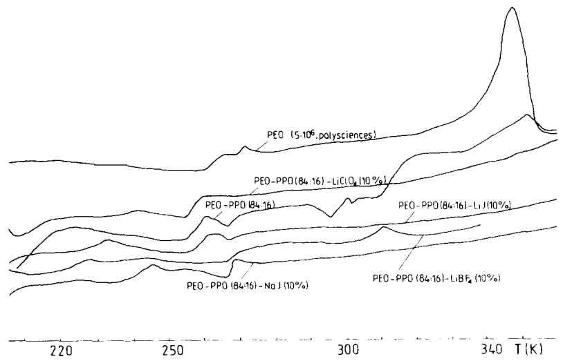
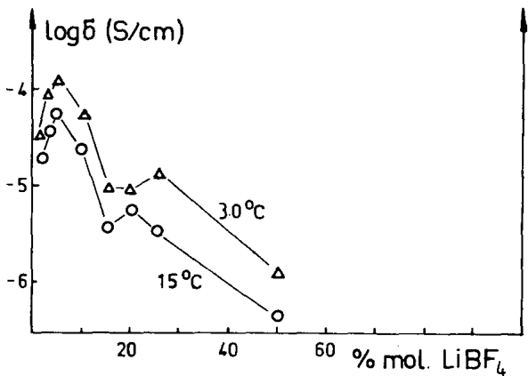
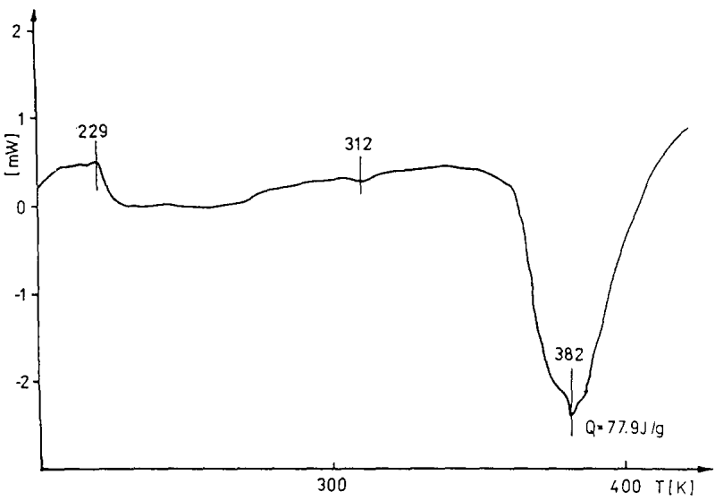
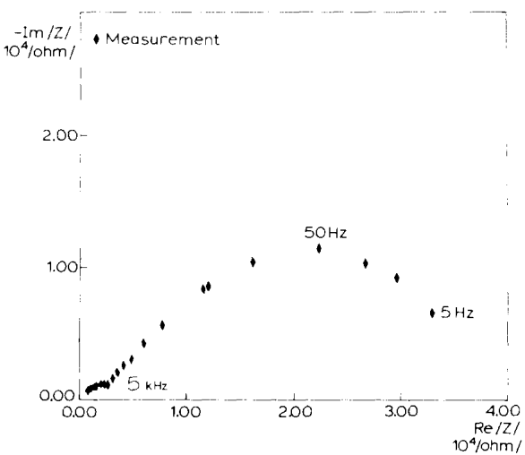

<!-- page 1 of 6 -->

Solid State Ionics 53–56 (1992) 1071–1076
North-Holland

# Copolymer electrolytes

J. Przyłuski and W. Wieczorek

Institute of Solid State Technology, Warsaw University of Technology, ul. Noakowskiego 3, 00-664 Warszawa, Poland

The aim of the present paper is to describe conductivity and phase structure of copolymer solid electrolytes based on ethylene oxide copolymers. The presented systems exhibit conductivities much higher than pristine poly(ethylene oxide)-alkali metal salt complexes. Novel electrolytes excluding ethylene oxide units in a main or side polymer chains are also presented. Preliminary data concerning utilization of copolymer electrolytes in ambient temperature polymeric batteries are shown.

## 1. Introduction

In the last few years a number of methods were developed to increase ionic conductivity of solid polymeric electrolytes. Utilization of random and block copolymers of ethylene oxide with various polar comonomers seems to be one of the most perspective among them [1–5]. The systems were used as model electrolytes in studies of ion transport [6] as well as membranes in ambient-temperature lithium batteries [7].

The present paper deals with optimisation of conductivity of copolymer electrolytes in respect to copolymer structure, kind of alkali metal dopant and its concentration. We summarize our studies on previously described systems [8,9] as well as present some recent results devoted to random and alternating copolymers of sulphur dioxide as the polymer electrolyte hosts. Copolymer electrolytes exhibit conductivities exceeding $10^{-4}\mathrm{Scm}^{-1}$ at room temperature which results from the highly amorphous structure of the studied polymer host and its high flexibility evidenced by $T_{\mathrm{g}}$ value below $210~\mathrm{K}$.

Due to the high conductivity, copolymer electrolytes seem to be able to work in ambient-temperature electrochemical systems. Some examples of preliminary works on applications of the studied systems in batteries will also be presented.

## 2. Experimental

Ethylene oxide (EO)-propylene oxide (PO) copolymers were obtained by the reaction carried out in the presence of partially hydrolyzed organoaluminum compounds. Details of the reaction were described elsewhere [8].

The aliphatic polysulfines were obtained in free radical copolymerization of  $SO_{2}$  with various vinyl monomers carried out at 195 K or 273 K in the presence of t-butyl hydroperoxide as an initiator.

The aliphatic polysulfites were obtained by ionic copolymerization of  $SO_{2}$  with EO carried out at room temperature. Details of preparation of  $SO_{2}$  copolymers were described in our previous paper [9].

Copolymer electrolytes were prepared in the form of thin films by dissolution of copolymers and alkali metal salts in dried acetonitrile followed by vacuum distillation of the solvent in an evacuated dessicator. All components used in electrolyte preparation were carefully dried under vacuum prior to experiments. Ionic conductivity of the studied samples was measured by impedance spectroscopy applying stainless-steel blocking electrodes. Some experiments with reversible lithium electrodes were also performed. Experimental temperature was varied from 293 K to 373 K. Experiments were carried out in a frequency range from 5 Hz to 500 kHz. Thermal behaviour of the electrolytes was investigated by the DSC method. Experiments were performed in a temperature range 190–480 K and a heating rate was equal to 2–3 deg/min. Additionally X-ray experiments were also done.

0167-2738/92/&#36; 05.00 © 1992 Elsevier Science Publishers B.V. All rights reserved.

<!-- page 2 of 6 -->

1072

J. Przyłuski, W. Wieczorek / Copolymer electrolytes

## 3. Results and discussion

In our previous paper [8] optimization of conductivity of EO copolymer-based electrolytes in respect to kind and concentration of oxirane comonomer was described. The highest ambient temperature conductivities were obtained for EO-PO copolymers of EO molecular units content exceeding 60 mol%. The data were confirmed by DSC studies showing amorphous structure of the systems and their low $T_{\mathrm{g}}$ values (for some EO-PO copolymers $T_{\mathrm{g}}$ was lower than 200 K). In order to optimize conductivity of EO-PO electrolytes in respect to kind of added alkali metal salt, complexes with NaI, LiI, $\mathrm{LiClO_4}$ and $\mathrm{LiBF_4}$ were prepared. Temperature dependence of bulk conductivity of the electrolytes is plotted in fig. 1. As can be seen for all the studied samples conductivity increases with increasing temperature from $10^{-5} - 10^{-4}\mathrm{Scm}^{-1}$ at room temperature to $10^{-3} - 10^{-2}\mathrm{Scm}^{-1}$ at 373 K. The highest ambient temperature conductivities were measured for complexes with $\mathrm{LiBF_4}$. However, these systems as well as $\mathrm{LiClO_4}$ electrolytes are not thermally stable at temperatures exceeding the melting point of the crystalline phase ($T_{\mathrm{m}} = 311\mathrm{K}$). Iodide complexes are stable even at higher temperatures but their ambient temperature conductivities are about one order of magnitude lower. Conductivity data were confirmed by DSC experiments (fig. 2). DSC curves evidenced

Fig. 1. Changes of ionic conductivity versus reciprocal temperature for EO–PO copolymer electrolytes (EO:PO=84:16 molar ratio) doped with various alkali metal salts: (○)-NaI, (△)-LiI, (□)-LiClO₄, (x)-LiBF₄. Concentration of salt is equal to 10 mol% in respect to EO molecular unit concentration.

highly amorphous structure of the studied systems. A small melting peak of the crystalline copolymer phase at about 310 K can be observed but it is much smaller than for PEO electrolytes. The lowest  $T_{g}$  value equal to 208 K was measured for  $LiBF_{4}$  electrolytes which is in good agreement with the highest room temperature conductivities measured for this system. All copolymer electrolytes exhibited  $T_{g}$  values lower than PEO based systems.

In order to optimize bulk conductivity in respect to salt concentration complexes of EO–PO copolymer with various amounts of  $LiBF_{4}$  were prepared. Salt concentration varied from 1 to 50 mol%. In fig. 3 conductivity of the electrolytes is depicted versus

Fig. 2. DSC curves for EO\~PO copolymer electrolytes (EO:PO=84:16 molar ratio) doped with various alkali metal salts.

<!-- page 3 of 6 -->

J. Przyłuski, W. Wieczorek / Copolymer electrolytes

1073

Fig. 3. Changes of ionic conductivity versus $\mathrm{LiBF_4}$ concentration for EO-PO-$\mathrm{LiBF_4}$ electrolyte (EO:PO=84:16 molar ratio).

concentration of the added  $LiBF_{4}$ . Conductivity data were taken at 288 K and 303 K. Two distinct maxima at 5 and 20 mol% of the added salt can be observed. The highest values of conductivity were measured for the salt concentration equal to 5 mol%. At 303 K the conductivity exceeded  $10^{-4}$  S cm $^{-1}$ . The presence of a second maximum may be connected with two eutectic compositions but DSC experiments do not confirm this hypothesis. DSC data included in table 1 show the lowest  $T_{g}$  and  $T_{m}$  values for electrolytes containing 5 mol% of the added  $LiBF_{4}$  confirming their highest conductivity and evidencing presence of eutectic composition near this point.

DSC data obtained for EO–PO copolymer solid electrolytes doped with various alkali metal salts (EO:PO molecular unit ratio is equal to 84:16).

| Kind of salt | Salt conc. (mol%) | $T_g$ (K) | $T_m$ (K) |
| --- | --- | --- | --- |
| undoped sample | 0 | 200 | 311 |
| NaI | 10 | 241 | - |
| LiI | 10 | 226 | - |
| $LiClO_4$ | 10 | 236 | - |
| $LiBF_4$ | 1 | 216 | 314 |
| $LiBF_4$ | 3 | 216 | 311 |
| $LiBF_4$ | 5 | 208 | 306 |
| $LiBF_4$ | 10 | 208 | 309 |
| $LiBF_4$ | 15 | 217 | - |
| $LiBF_4$ | 20 | 214 | - |
| $LiBF_4$ | 25 | 215 | - |

The copolymer electrolytes exhibited ambient temperature conductivities considerably higher than PEO-based electrolytes which is evidenced by the above presented results. In the next step of experiments we extended our investigations on copolymers of  $SO_{2}$  since we expected that utilization of highly polar systems should increase the dielectric constant of the electrolyte leading to an increase of conductivity.

In fig. 4 changes of conductivity versus reciprocal temperature for complexes of $\mathrm{LiClO_4}$ with $\mathrm{SO}_2$ copolymers with poly (allil alcohol) - PAA, poly(vinyl acetate) - PVA, and polyacrylamide - PAAM are presented. Samples contain $10\mathrm{mol}\%$ of $\mathrm{LiClO_4}$ in respect to copolymer molecular unit concentration. The values of conductivity measured for $\mathrm{PAA - SO_2}$ electrolytes are lower than for PEO-based systems and do not exceed $10^{-8}\mathrm{Scm}$ at room temperature. The conductivity measured for $\mathrm{PVA - SO_2}$ electrolytes are about two orders of magnitude higher which results from higher flexibility of the system. Conductivity increases from $10^{-6}\mathrm{Scm}^{-1}$ at room temperature to $10^{-5}\mathrm{Scm}^{-1}$ at $373\mathrm{K}$. Much higher conductivities were measured for $\mathrm{PAAM - SO_2}$-based copolymer electrolytes. Room temperature conductivity of this system exceeded $10^{-5}\mathrm{Scm}^{-1}$. This is about an order of magnitude higher for pristine PEO-$\mathrm{LiClO_4}$ electrolytes. High values of conductivity measured for the present system results probably from the polar character of both co-monomers. The effect of cooperative interactions of N and O atoms on conductivity of polymer electrolytes seems to play also an important role. To our knowledge the obtained results are one of the highest measured for polymer electrolytes not containing polyethers molecular units in a side or main chain. As can be seen from the temperature dependence of conductivity all $\mathrm{SO}_2$ based electrolytes are thermally stable up to $373\mathrm{K}$.

Fig. 5 presents changes of conductivity versus reciprocal temperature for EO–SO$_2$ random copolymer-based electrolytes. Polymers are doped with LiBF$_4$ and LiClO$_4$ (10 mol% in respect to copolymer monomeric units concentration). As can be seen, ambient temperature conductivities are exceeding 10$^{-6}$ S cm$^{-1}$ for both systems studied. Samples are thermally stable up to almost 373 K. Undoped EO–SO$_2$ copolymer was of amorphous structure. Addi-

<!-- page 4 of 6 -->

1074

J. Przyłuski, W. Wieczorek / Copolymer electrolytes

Fig. 4. Changes of conductivity versus reciprocal temperature for $\mathrm{SO}_2$ copolymers with various organic co-monomers doped with $\mathrm{LiClO_4}$ (10 mol% in respect to copolymer molecular unit concentration): (+)-AA-$\mathrm{SO}_2$ copolymer; (X)-VA-$\mathrm{SO}_2$ copolymer, (O)-AAM-$\mathrm{SO}_2$ copolymer.

Fig. 5. Changes of ionic conductivity versus reciprocal temperature for $\mathrm{EO - SO_2}$ copolymer based electrolytes doped with $\mathrm{LiClO_4(x)}$ or $\mathrm{LiBF_4(+)}$ (salt concentration is equal to $10\mathrm{mol}\%$ in respect to copolymer monomeric units).

tion of a lithium salt leads to preparation of crystalline complex as is evidenced in fig. 6. The high heat of melting of the complex phase suggests considerable complexation power of the EO–SO $_{2}$ copolymer. Unfortunately the systems are not stable in time and they should be stabilized by addition of pristine PEO. Studies performed on the blend-based electrolytes were described in a previous paper [9].

Due to the high conductivity copolymer electro-

lytes are very promising materials for application in ambient-temperature polymer batteries. Before battery-experiment studies of EO–PO–LiClO$_{4}$ copolymer electrolyte–lithium electrode interface were performed applying impedance spectroscopy experiments. The spectra consist of two well defined semicircles (fig. 7). The high frequency semicircle vanishes at temperatures exceeding the melting point of the crystalline copolymer phase. An increase of interfacial conductivity calculated from the low fre-

<!-- page 5 of 6 -->

J. Przyłuski, W. Wieczorek / Copolymer electrolytes

1075

Fig. 6. DSC curve measured for EO- $SO_{2}$ -LiClO $_{4}$ copolymer electrolyte.

Fig. 7. Impedance spectra measured at 293 K for EO-PO-LiClO₄ (10 mol% of the added salt) electrolyte (EO:PO=84:16 molar ratio). Impedance experiments performed for a cell with lithium electrodes.

quency part of the spectra was not observed during the first few days of experiments. Samples were handled in isothermal condition (T=303 K) during the experiments. This fact suggests that passive layers are not present at the electrolyte–electrode interface.

## 4. Conclusions

It was shown that copolymer electrolytes based on complexes of alkali metal salts with EO copolymers are highly amorphous systems characterized by high ambient temperature ionic conductivity which for some samples exceeded  $10^{-4}$  S cm $^{-1}$  at room temperature. Impedance spectroscopy experiments performed on system with nonblocking lithium electrodes evidences the possibility of their application in ambient temperature lithium batteries. However, the systems are often unstable in time and their temperature stability usually does not exceed the melting point of the copolymer crystalline phase. In comparison to them, new copolymer electrolytes not including EO sequences showed promising conductivity values and wide temperature stability range. Although, additional experiments concerning electrochemical stability of these systems should be performed.

## Acknowledgement

This work was financially supported by the Polish

<!-- page 6 of 6 -->

1076

J. Przyłuski, W. Wieczorek / Copolymer electrolytes

Ministry of Education according to the 505/164/184/1 Research Programme. The authors wish to thank Prof. Z. Florjańczyk for his helpful discussion and preparation of copolymer samples.

## References

[1] See for instance: J.M.G. Cowie, in: Polymer Electrolyte Reviews – 1, eds. J.R. MacCallum and C.A. Vincent (Elsevier, Amsterdam, 1987) chapt. VI; or J. Przyłuski, Conducting Polymers – Electrochemistry (Trans. Tech. Pub., Zurich, 1991).

[2] E. Linden and J.R. Owen, Solid State Ionics 28–30 (1988) 994.

[3] P. Passiniemi, S. Takkumaki, J. Kankare and M. Syrjama, Solid State Ionics 28–30 (1988) 1001.

[4] K. Ishikawa, T. Sugihara, Y. Oshima, T. Kato and A. Imai, Solid State Ionics 40/41 (1990) 612.

[5] J. Przyłuski and W. Wieczorek, Solid State Ionics 36 (1989) 165.

[6] P.G. Bruce, Synth. Met. 45 (1992) 267.

[7] C. Arbizzani, M. Mastragostino, L. Meneghello, T. Hamaide and A. Guyot, Proc. III-rd Int. Symp. Polymeric Electrolytes (Annecy, June 1991) p. 88.

[8] Z. Florjańczyk, W. Krawiec, W. Wieczorek and J. Przyłuski, Angew. Makromol. Chem. 187 (1991) 19.

[9] Z. Florjańczyk, E. Zygadło, K. Such and W. Wieczorek, Proc. III-rd Int. Symp. Polymeric Electrolytes (Annecy, June 1991) p. 43.