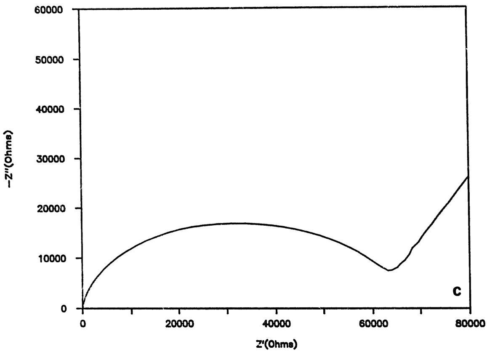
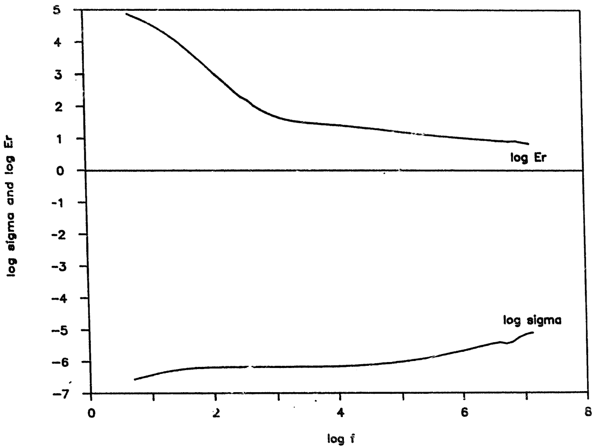
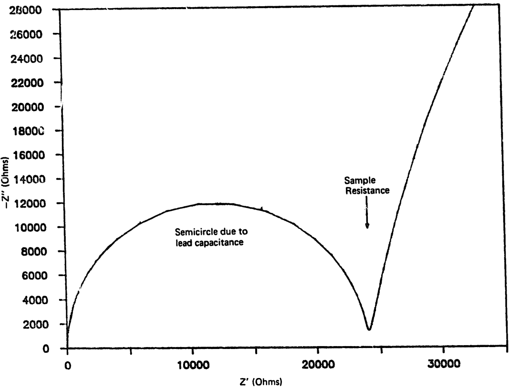
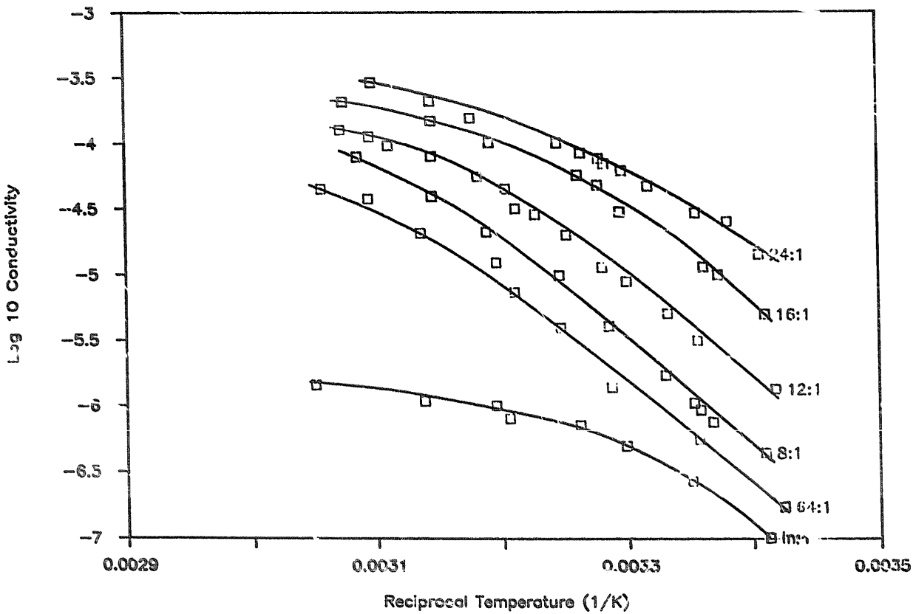
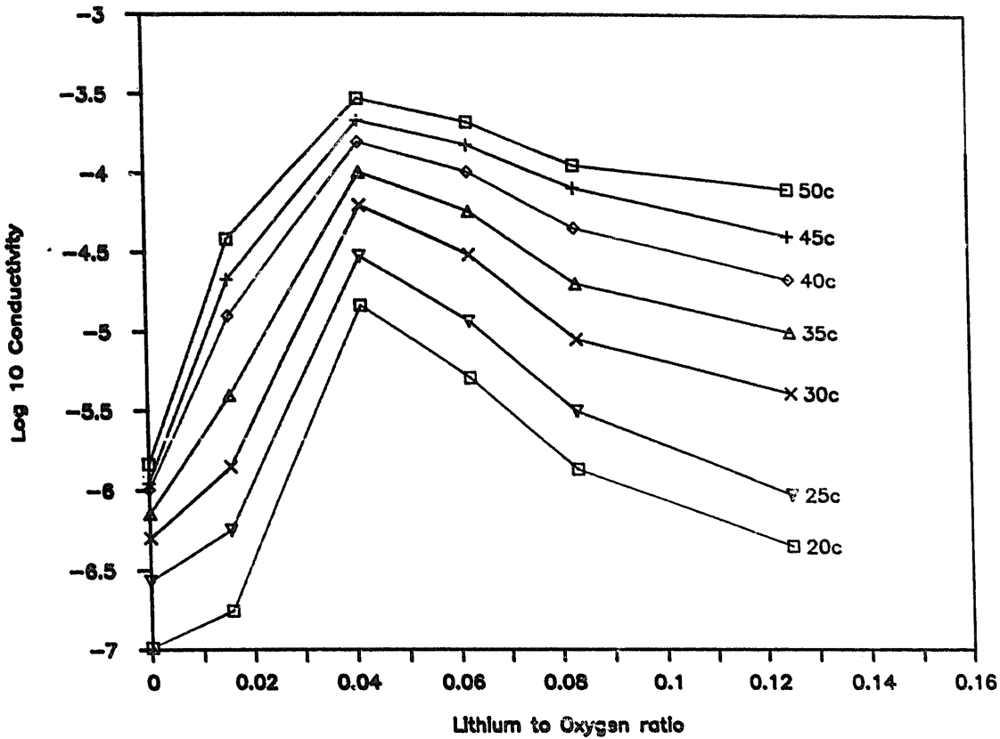
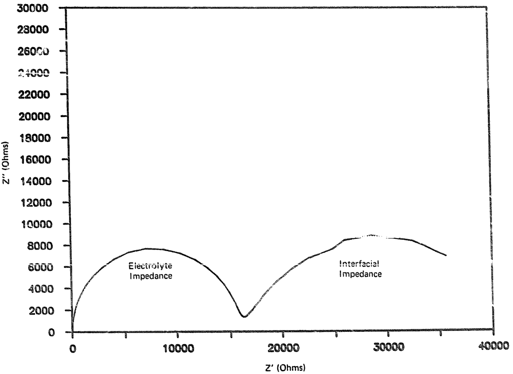

<!-- page 1 of 7 -->

Solid State Ionics 28-30 (1988) 994-1000

North-Holland, Amsterdam

# CONDUCTIVITY MEASUREMENTS ON AMORPHOUS PEO COPOLYMERS

E. LINDEN and J.R. OWEN

Department of Chemistry and Applied Chemistry, University of Salford, Manchester M5 4WT, UK

Received 4 August 1987

A highly conductive, amorphous, oxyethylene–oxymethylene copolymer with a similar molecular structure to poly(ethylene oxide) has been doped with various concentrations of lithium perchlorate. Complex impedance measurements show relaxation semicircles much less depressed than in the semicrystalline analogue. Conductivities are reported as a function of dopant concentration at temperatures between 20 and 50°C. The impedance measured between lithium electrodes shows a large interfacial impedance characteristic of a reaction product between the polymer and lithium.

## 1. Introduction

Polymer electrolytes based on high molecular mass, linear poly(ethylene oxide), PEO, have a strong tendency to crystallize at room temperature, so that the ionic current is confined to a tortuous path through the residual amorphous phase [1]. The ethylene oxide unit has however been shown to be favourable for the co-ordination of alkali metal ions, and therefore is a desirable component in a polymer electrolyte structure. Therefore the incorporation of this unit into an amorphous polymer having a low $T_{\mathrm{g}}$ has been the obvious way forward to obtaining electrolytes which are highly conducting at low temperatures. A number of polymers with this feature have appeared in the recent literature [2-4], and this work investigates a recent addition to the ranks of polymers having conductivities greater than $10^{-5} \mathrm{~S~cm}^{-1}$ at 25 °C – an oxyethylene–oxymethylene copolymer [5].

The type of amorphous PEO studied in this work has a chain configuration very similar to linear PEO, and differs only in having randomly-spaced oxy-methylene units inserted into the linear PEO chain according to the formula:

$$
- [ (\mathrm{CH} _ {2} - \mathrm{CH} _ {2} - \mathrm{O}) _ {n} - \mathrm{CH} _ {2} - \mathrm{O} - ] _ {m},
$$

where $n$ varies randomly around 9 and $m$ is about 600.

Because of its high conductivity, this polymer is of

great interest in the lithium battery field, although its stability against lithium has not yet been assessed. The polymer is also very suited for fundamental studies because of its chemical similarity to PEO, and under ideal conditions should be a suitable model for the intergranular amorphous phase of semicrystalline PEO. This work begins the detailed investigation of the material by examining the frequency dependence of conductivity and dielectric constant, the effects of salt concentration and temperature on the conductivity, and finally the performance of the electrolyte in conjunction with lithium electrodes.

## 2. Experimental

The complex impedance measurement was performed in two different cell configurations according to whether dc or high frequency values were required. The measurements at high conductivity were performed in a thin (100  $\mu$ m×3.6 cm $^{2}$ ) cell configuration, as reported previously [1], such that the sample susceptance was well in excess of that of the cell and leads. A correction for the leads was also applied, according to eq. (1) which is derived [6] from microwave theory [7],

$$
Z = \frac {Z _ {\mathrm{a}} - Z _ {\mathrm{s}}}{Z _ {\mathrm{a}} (1 / Z _ {\mathrm{a}} - 1 / Z _ {\mathrm{o}})} - Z _ {\mathrm{c}}, \tag {1}
$$

where $Z$ is the sample impedance, $Z_{\mathrm{a}}$ the measured

0167-2738/88/&#36; 03.50 © Elsevier Science Publishers B.V.

(North-Holland Physics Publishing Division)

<!-- page 2 of 7 -->

E. Linden, J.R. Owen/Amorphous PEO copolymers

995

Fig. 1. (a) Amorphous PEO: $\mathrm{LiClO_4 - 24:1}$ - uncorrected complex impedance spectrum from thin cell; (b) Amorphous PEO: $\mathrm{LiClO_4 - 24:1}$ - corrected complex impedance spectrum from thin cell; (c) Crystalline PEO: $\mathrm{LiClO_4 - 8:1}$ - corrected complex impedance spectrum from thin cell.

<!-- page 3 of 7 -->

996

E. Linden, J.R. Owen/Amorphous PEO copolymers

| Z' (Ohms) | -Z'' (Ohms) |
| --- | --- |
| 0 | 0 |
| ~32000 | ~17000 |
| ~63000 | ~8000 |
| 80000 | ~26000 |

Fig. 1. Continued.

impedance,  $Z_{s}$  the short circuit co-ax impedance,  $Z_{o}$  the open circuit co-ax impedance, and  $Z_{c}$  the internal cell lead impedance.

For accurate low frequency values, however, a thick cell configuration (0.1 cm×0.1 cm²) was used to minimize errors in thickness measurement. The sample was held in between cylindrical brass electrodes and a closely fitting glass tube so that its thickness could be determined accurately with a travelling microscope. In this case, the sample susceptance was so small that any corrections due to lead and other interferences were futile.

Measurements of the impedance with lithium electrodes was done in the same thin cell, with lithium discs inserted between the polymer and current collectors.

A Hewlett-Packard 4192A impedance analyser was used for all the measurements, which were taken in the range 13 MHz to 5 Hz in all cases, although high frequency results taken with thick cells were disregarded.

Samples were obtained undoped [8] and His-

solved in acetonitrile (BDH, HPLC grade), containing appropriate amounts of the lithium perchlorate dopant (BDH) to give approximately 3% solutions by weight. After evaporation of the solvent under dry argon, the polymers were dried under vacuum at 80 °C for 24 h before loading into the cell within a 5 ppm H₂O dry box.

## 3. Results and discussion

Figs. 1a and 1b show typical impedance plots obtained from the thin cell configuration. The effect of the correction is noted as a raising of high frequency points hitherto depressed by inductive effects, and a progression of points in the complex plane toward the low frequency limit. This correction looks trivial on first inspection, but is essential for the calculation of the dielectric constant. Plots of the conductivity and dielectric constant versus frequency are shown in fig. 2. The following points should be noted:

(1) The high frequency limiting values approach

<!-- page 4 of 7 -->

E. Linden, J.R. Owen/Amorphous PEO copolymers

997

| log f | log Er | log sigma |
| --- | --- | --- |
| 0.5 | ~4.9 | ~-6.5 |
| 1.0 | ~4.2 | ~-6.3 |
| 2.0 | ~3.0 | ~-6.2 |
| 3.0 | ~1.8 | ~-6.2 |
| 4.0 | ~1.5 | ~-6.1 |
| 5.0 | ~1.3 | ~-6.0 |
| 6.0 | ~1.1 | ~-5.7 |
| 7.0 | ~0.9 | ~-5.1 |

Fig. 2. Dielectric constant and conductivity versus frequency for amorphous PEO: $\mathrm{LiClO_4 - 8:1}$ from thin cell.

the origin. Thus the correction procedure has relieved the uncertainty regarding additional resistors in series with the sample.

(2) The extent of depression of the semicircle is much less than that observed for semi-crystalline PEO (fig. 1c). This is consistent with a microstructural interpretation of semicircle depression in PEO. (The angle of depression was observed to decrease with increasing temperature in PEO during a series of experiments not reported here).
(3) The dielectric constant shows far less variation than the conductivity - a result which was expected and has been confirmed for a series with different dopant levels.

In the thick cell measurements, e.g. fig. 3, the reactance of the blocking electrodes was small enough for an accurate dc conductance to be obtained from the low frequency data. Arrhenius plots thus obtained are given in fig. 4.

Fig. 5 shows a selection of results illustrating the effect of dopant concentration. The decrease in conductivity at concentrations greater than Li:O=1:24 is similar to that obtained for other amorphous electrolytes, and is believed to be due to an increase in the glass transition temperature as well as the extent of ion pairing at high dopant concentration.

Finally, in fig. 6 an impedance spectrum taken with lithium electrodes shows a second semicircle characteristic of an interfacial impedance – possibly due to a reaction phase. This aspect has not yet been fully investigated but is mentioned here in order to stress that the oxyethylene–oxymethylene copolymer, in company with most other polymers, requires further development on the way to the optimum electrolyte for lithium batteries.

<!-- page 5 of 7 -->

998

E. Linden, J.R. Owen/Amorphous PEO copolymers

| Z' (Ohms) | -Z'' (Ohms) |
| --- | --- |
| 0 | 0 |
| ~12500 | ~12000 |
| ~24000 | ~1500 |
| ~32000 | ~28000 |

Fig. 3. Amorphous PEO: $\mathrm{LiClO_4 - 24:1}$ - complex impedance spectrum from thick cell.

| Reciprocal Temperature (1/K) | 24:1 | 16:1 | 12:1 | 8:1 | 64:1 | In:1 |
| --- | --- | --- | --- | --- | --- | --- |
| ~0.00305 | -3.55 | -3.70 | -3.90 | -4.10 | -4.35 | -5.85 |
| ~0.00310 | -3.65 | -3.80 | -4.00 | -4.25 | -4.50 | -5.95 |
| ~0.00315 | -3.75 | -3.90 | -4.10 | -4.40 | -4.65 | -6.00 |
| ~0.00320 | -3.85 | -4.00 | -4.25 | -4.55 | -4.80 | -6.10 |
| ~0.00325 | -3.95 | -4.10 | -4.40 | -4.70 | -5.00 | -6.20 |
| ~0.00330 | -4.10 | -4.25 | -4.60 | -4.90 | -5.20 | -6.30 |
| ~0.00335 | -4.25 | -4.40 | -4.80 | -5.10 | -5.40 | -6.40 |
| ~0.00340 | -4.40 | -4.60 | -5.00 | -5.30 | -5.60 | -6.50 |
| ~0.00345 | -4.60 | -4.80 | -5.20 | -5.50 | -5.80 | -6.60 |
| ~0.00350 | -4.80 | -5.00 | -5.40 | -5.70 | -6.00 | -6.70 |

Fig. 4. Arrhenius plots for amorphous PEO doped with $\mathrm{LiClO_4}$ at various concentrations.

<!-- page 6 of 7 -->

E. Linden, J.R. Owen/Amorphous PEO copolymers

999

| Lithium to Oxygen ratio | 20c | 25c | 30c | 35c | 40c | 45c | 50c |
| --- | --- | --- | --- | --- | --- | --- | --- |
| 0 | -7.0 | -6.5 | -6.3 | -6.1 | -6.0 | -5.9 | -5.8 |
| 0.015 | -6.75 | -6.25 | -5.85 | -5.4 | -4.9 | -4.65 | -4.4 |
| 0.04 | -4.85 | -4.5 | -4.2 | -4.0 | -3.8 | -3.65 | -3.5 |
| 0.06 | -5.3 | -4.95 | -4.5 | -4.25 | -4.0 | -3.85 | -3.7 |
| 0.08 | -5.85 | -5.5 | -5.05 | -4.7 | -4.35 | -4.1 | -3.95 |
| 0.125 | -6.35 | -6.0 | -5.4 | -5.0 | -4.65 | -4.4 | -4.1 |

Fig. 5. $\mathrm{Log_{10}}$ conductivity versus dopant level for $\mathrm{LiClO_4}$ doped amorphous PEO at various temperatures.

| Z' (Ohms) | Electrolyte Impedance (Z'' Ohms) | Interfacial Impedance (Z'' Ohms) |
| --- | --- | --- |
| 0 | 0 | 0 |
| ~7500 | ~7800 | — |
| ~16500 | ~1500 | ~1500 |
| ~28000 | — | ~9000 |

Fig. 6. Amorphous PEO: $\mathrm{LiClO_4 - 24:1}$ - complex impedance spectrum from thick cell using lithium electrodes.

<!-- page 7 of 7 -->

1000

E. Linden, J.R. Owen/Amorphous PEO copolymers

## Acknowledgement

The authors wish to thank Chloride Advanced Research, Ltd., for financial support.

## References

[1] C. Berthier, W. Gorecki, M. Minier, M.B. Armand, J.M. Chabagno and P. Rigaud, Solid State Ionics 11 (1983) 91.
[2] J. Knight, C. Booth, R.H. Mobbs, J.R. Owen, J.R.M. Giles, J.R. Craven and I.E. Kelly, British patent application 8520902.

[3] P.M. Blonski, D.F. Shriver, P. Austin and H.R. Allcock, J. Am. Chem. Soc. 106 (1984) 6854.
[4] K. Nagaoka, H. Naruse, I. Shinohara and M. Watanabe, J. Polym. Sci., Polym Lett. Ed. 22 (1984) 659
[5] C.V. Nicholas, D.J. Wilson, C. Booth and J.R.M. Giles, in: Intern. Symp. on Polymer Electrolytes, St. Andrews, June 1987.
[6] E. Linden and J.R. Owen, in: Intern. Symp. on Polymer Electrolytes, St. Andrews, June 1987.
[7] G.L. Ragan, ed. in:, Microwave transmission circuits, MIT Rad. Lab. Series, Vol. 9 (McGraw-Hill, New York, 1948).
[8] Sample kindly provided by C.V. Nicholas (University of Manchester).

## Figure crops from a second parse

The images below are crops of this same PDF produced by a second parser pass
(standard tier) that preserves charts as images. The body text above came
from the advanced tier, which digitises many charts into tables instead --
so for several of these figures the numbers appear above as a table with `~`
values, and the image below is the original plot those values were read off.
Use the image to sanity-check any `~` value you rely on.

