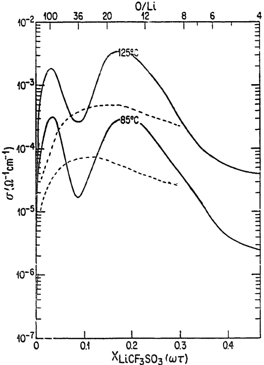
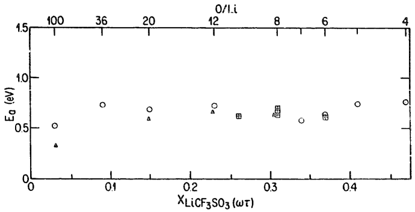
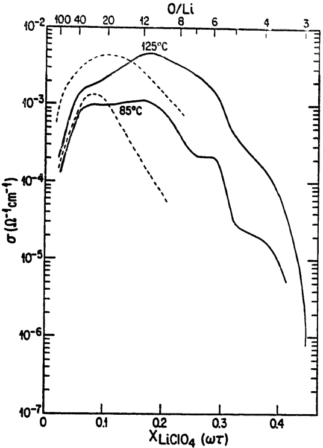
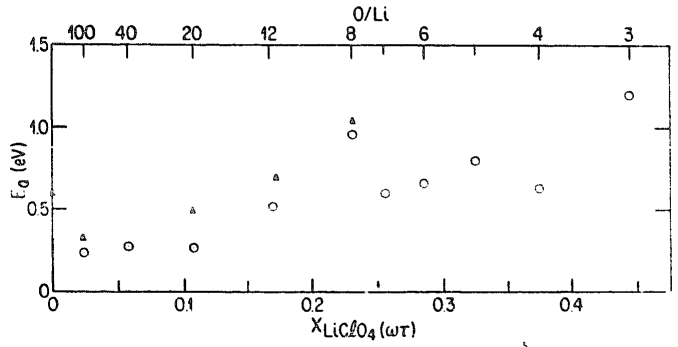
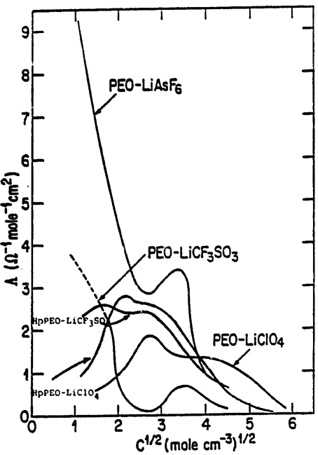
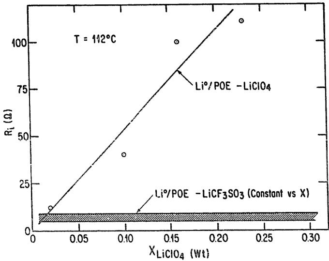
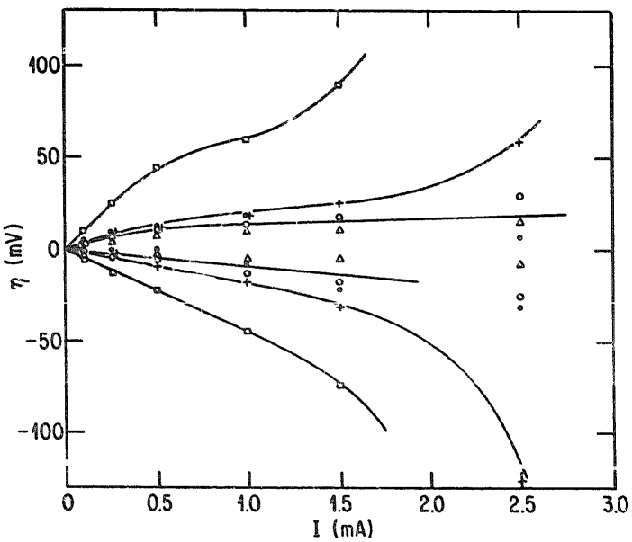
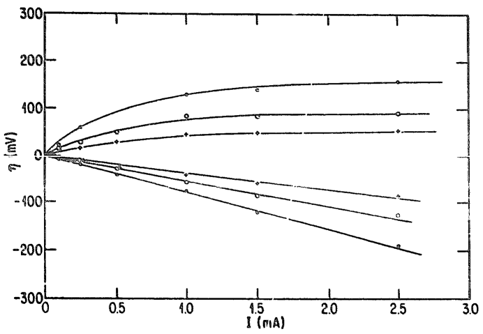

<!-- page 1 of 6 -->

Solid State Ionics 28–30 (1988) 923–928
North-Holland, Amsterdam

# ELECTROCHEMICAL STABILITY AND IONIC CONDUCTIVITY OF SOME POLYMER-LiX BASED ELECTROLYTES

D. FAUTEUX

H&L Engineering, Vestergade 24–26, DK-5700 Svendborg, Denmark

and

J. PRUD'HOMME, P.E. HARVEY $^{1}$

University of Montreal, Montreal, Canada

Received 3 September 1987

High molecular weight poly(ethylene oxide) based solid polymer electrolytes have been considered for application in all solid state electrochemical devices. Such electrolytes show very good mechanical properties. The lithium ion mobility occurs mainly in the amorphous liquid like phase of the solid polymer membrane. We report results obtained with high-molecular weight high purity PEO–LiX ( $X=ClO_{4}^{-}$ ,  $CF_{3}SO_{3}^{-}$ ) based electrolytes for conductivity and stability characterization. The role of catalytic residues present in commercial PEO is discussed.

## 1. Introduction

Since the early work of Wright [1] and Armand et al. [2], solid polymer electrolytes, mainly based on polyether backbones, have been studied for their application in all solid state electrochemical devices [3,4]. Related research work has mostly been focused on the understanding of the ionic conduction mechanism and on the synthesis of new polymer electrolytes which will show higher ionic conductivity at lower temperature. As a result, progress has been made in rechargeable lithium battery and photoelectrochemical technologies [5,6].

Recently, the establishment of phase diagrams for some high molecular weight PEO-alkali metal salt systems enabled us to describe these polymer electrolytes as binary systems [7–10], in which crystalline intermediate compounds of stoichiometry P(EO$_3$MX) and P(EO$_6$MX), eutectic and peritectic reactions have been observed. In relation to these phase diagrams the ionic conduction mechanism and

the electrochemical stability of some polymer electrolytes have been studied [8,11]. From the results of these studies it has been shown for well defined single-phase amorphous and two-phase crystalline-amorphous electrolytes, that the mobility of the ionic species occurs mainly in the amorphous phase. The variation of the ionic conductivity depends on the polymer backbone segmental motion and on the formation of ion associations as in low dielectric constant organic solvents. Hall et al. [12] have confirmed this behaviour for low molecular weight PEC. Their selection of glycol as solvent allowed the preparation of homogeneous dilute solutions free from impurities (catalysis residues). From our previous work we have shown [8,11,13] that PEO-based electrolytes are not stable against lithium, at least at temperatures higher than 60°C, and that the electrolyte salt is involved in the formation of the interphase passivating film. Thus at high temperature high molecular weight PEO-based polymer electrolytes behave similarly to the room temperature liquid electrolytes.

In order to evaluate the effects of the impurities contained in commercial samples of high molecular

<small>$^{1}$  Present address: Hydro Quebec Research Institute, 1800 Mte Ste-Julie, Canada.</small>

0 167-2738/88/&#36; 03.50 © Elsevier Science Publishers B.V.
(North-Holland Physics Publishing Division)

<!-- page 2 of 6 -->

924

D. Faute x et al. / PEO-LiX based electrolytes

weight PEO (C-PEO) on ionic conductivity and electrochemical stability, we have synthesized high purity high molecular weight (MW≈1×10⁶) PEO (HP-PEO) using an anionic initiator. The amount of initiator used was one molecule per polymer chain (i.e. ≈1 ppm). The obtained HP-PEO samples also showed a smaller polydispersity than C-PEO, and no detectable low molecular weight fraction.

We have investigated first the ionic conductivity and the electrochemical stability of HP-PEO–LiCF$_3$SO$_3$ two-phase and of HP-PEO–LiClO$_4$ single-phase systems, in the temperature range from 60 to 120°C. Then we investigated the behaviour of lithium and lithium alloy electrodes under intentiostatic polarizations.

## 2. Experimental

The polyether polymer electrolytes were prepared from C-PEO (Aldrich) of average molecular weight 900000, and from HP-PEO [14]. Before being used, the polymers were dried under dynamic partial vacuum (5 mm Hg of Ar) at 45–50°C for about 48 h. The LiCF$_{3}$SO$_{3}$ and LiClO$_{4}$ were recrystallized in acetonitrile, then dried under dynamic partial vacuum for 48 h at 100–110°C. All further manipulation of these products was carried out in a glove box. These products were weighed and dissolved in acetonitrile. Thin electrolyte films were produced according to a procedure described elsewhere [5].

The electrical properties of the polymer electrolytes and the electrochemical behaviour of the Li$^{0}$/electrolyte interface were characterized by ac-impedance spectroscopy over a frequency range from 65 kHz to 0.1 Hz using a Solartron FRA-1250 and an ECI-1286 (cell area =4 cm$^{2}$). Cyclic voltametry standard conditions were $A=0.4$ cm$^{2}$, $R_{s}=100$ Ω, scan = 10 mV/s. RE: LiAl/Al, WE: Ni and CE: Li$^{0}$, as described previously [8].

Only the electrolyte resistance values measured on the first temperature rise were considered to calculate the conductivity. Thermal cycling was performed in order to characterize the  $Li^{0}$ /electrolytes interfaces.

## 3. Results and discussion

## 3.1. Conductivity

Thermal transition temperatures of the electrolytes observed by optical microscopy and conductivity measurements for both HP-PEO–LiCF$_3$SO$_3$ and HP-PEO–LiCPO$_4$ systems, are equivalent to the result reported previously for C-PEO-based electrolytes [10,11]. It is concluded from these observations that no major structural modifications occur in the HP-PEO-based systems compared to the C-PEO-based systems, although the HP-PEO-based electrolytes appear to be slightly less crystalline. This may be a consequence of the absence of low molecular weight polymer fractions in the HP-PEO electrolytes.

From plots of  $\log_{10}(\sigma)$  versus (1/T), for electrolytes with O/Li ratios ranging from 4 to 100, we obtained the isothermal variation of the ionic conductivity as a function of salt weight fraction. These results are summarized in fig. 1, for the PEO–LiCF $_{3}$ SO $_{3}$  systems. The HP-PEO–LiCF $_{3}$ SO $_{3}$  isotherms show a continuous variation of  $\log_{10}(\sigma)$  ver-

Fig. 1. Isothermal variation of the ionic conductivity as a function of salt weight fraction for C-PEO–LiCF$_3$SO$_3$ (—) and HP-PEO–LiCF$_3$SO$_3$ (---) systems at 85 and 125°C.

<!-- page 3 of 6 -->

D. Fauteux et al. / PEO-LiX based electrolytes

925

sus the salt weight fraction, with only one maximum which corresponds to the liquidus composition. For C-PEO–LiCF$_3$SO$_3$ electrolytes a large variation of the conductivity at low salt concentration (O/Li > 30) has been observed. Although the ionic conductivity isotherms differ, the apparent activation energy for the ionic conduction mechanism in both PEO–LiCF$_3$SO$_3$ systems is equivalent and shows the same dependence on the electrolyte salt weight fraction (fig. 2). For the two-phase domain the apparent activation energy is constant and equal to 0.7 eV. For more dilute salt concentrations where the electrolytes are single-phase amophous at $T > 65^\circ$C, the apparent activation energy is much lower and somehow dependent on the salt concentration and PEO purity.

Isothermal variation of the ionic conductivity for the PEO–LiClO$_{4}$ systems are reported in fig. 3. For salt weight fractions lower than 0.28 (O/Li>6) and temperatures higher than 65°C the PEO–LiClO$_{4}$ electrolytes are amorphous single phase. Thus the observed conductivity dependence, as a function of salt weight fraction, cannot be attributed to phase composition variations, as in the PEO–LiCF$_{3}$SO$_{3}$ systems. The apparent activation energies for ionic conduction for both the C-PEO–LiClO$_{4}$ and HP-PEO–LiClO$_{4}$ amorphous electrolytes, decreases from a value of 1 eV down to a value of 0.26 eV as the salt weight fraction decreased from 0.25 to 0.02 (fig. 4).

For the two-phase domain where an amorphous liquid-like phase is in equilibrium with a crystalline phase, both containing the ionic species, the chemical potentials of the ionic species are constant over the entire concentration range of the two-phase domain. In such a case, the apparent activation energy

Fig. 2. Variation of the apparent activation energy for the ionic conduction mechanism as a function of salt weight fraction for PEO- $LiCF_{3}SO_{3}$ systems. T = 65 °C ( $\odot$ : C-PEO, $\blacktriangle$: HP-PEO).

Fig. 3. Isothermal variation of the ionic conductivity as a function of salt weight fraction for C-PEO-LiClO$_{4}$. (—) and HP-PEO-LiClO$_{4}$ (---) systems at 85 and 125°C.

for ionic conduction is constant and as observed independent of the polymer purity, as in the PEO-LiCF$_3$SO$_3$ systems. For the single-phase amorphous domain the chemical potential of the ionic species varies in relation to the salt concentration. In this case we observed a variation of the value of the apparent activation energy as a function of salt concentration, also independent of the polymer purity, as in the PEO-LiClO$_4$ systems. For single-phase amorphous electrolytes, the chemical interaction of the ionic

Fig. 4. Variation of the apparent activation energy for the ionic conduction mechanism as a function of salt weight fraction for PEO–LiClO₄ systems, T=65°C (○. C-PEO, ▲: HP-PEO).

<!-- page 4 of 6 -->

926

D. Fauteux et al. / PEO-LiX based electrolytes

Fig. 5. Variation of the specific concurrence as a function of salt concentration at T = 105 °C.

species appears to be one of the limiting parameter of the conduction mechanism. Reduction of the polymer segment mobility by ionic cross-linking and by modification of the charge carrier concentrations by association of ions are two probable causes for the observed behaviour, as in liquid electrolytes. Plotting the conductivity values as specific conductance (A) versus $C^{1/2}$ qualitatively confirm the presence of ion-associations (fig. 5).

## 3.2. Stability

We have demonstrated previously  $[8,11,13]$  that a passivating layer is formed at the interface between a lithium electrode and a C-PEO-based polymer electrolyte. The formation and growth of these interphase layers have been investigated for PEO-based electrolytes by impedance spectroscopy. It appears that the electrolyte salt has a determinant role in the kinetics of the passivation process, and in the nature of the passivating layer formed.

For the  $Li^{0}/PEO-LiCF_{3}SO_{3}$  systems, the activation energy of the interphase resistance, which can be associated with the ionic conduction mechanism in the passivating layer, is constant ( $\approx0.8$  eV for films formed at  105 °C ) for salt weight fractions of 0.18<x<0.45, thus for the two-phase domain, when

the electrolytes are single-phase amorphous ($x > 0.18$ at T = 105 °C) the activation energy for the ionic conduction in the passivating layer decreases to 0.65 eV when the salt concentration decreases. This behaviour has been observed for HP-PEO-$\mathrm{LiCF_3SO_3}$ as well as C-PEO-$\mathrm{LiCF_3SO_3}$ based electrolytes. The thickness of the interphase passivating film, evaluated by its resistance, is independent of the $\mathrm{LiCF_3SO_3}$ concentration in the electrolyte (fig. 6).

For the Li$^{c}$/HP-PEO-LiClO$_{4}$ system the activation energy of the interphase resistance shows a smaller dependence on the salt concentration than for the Li$^{0}$/C-PEO-LiClO$_{4}$ system, varying from 0.9 to 0.65 eV. There is a direct relation between the interphase resistance and the LiClO$_{4}$ concentration in these HP-PEO-based single-phase amorphous electrolytes (fig. 6).

Cyclic voltametry indicated the presence of a small amount of water in all electrolytes tested ( $H_{2}O$ ) < 10 ppm). The water is reduced to an undetectable level within 2 h at 105°C. This process is much faster than the formation passivating film on lithium [11].

When pre-electrolysed HP-PEO-based electrolytes were put into contact with a nickel electrode maintained at 5 to 50 mV versus  $Li^{+}/Li^{0}$  the following interphase resistance growth kinetic was observed: at 85°C the slope of the  $\ln(R_{i})$  versus  $\ln(t)$  is very close to 0.5 suggesting a diffusion-limited process; at 120°C the interphase resistance rapidly reached a stable value, indicating that the formed film on the

Fig. 6. Variation of the interphase resistance as a function of salt weight fraction for HP-PEO-based systems.

<!-- page 5 of 6 -->

D. Fauteux et al. / PEO-LiX based electrolytes

927

nickel electrode is electronically insulating and thus prevents further reaction. Kinetics of the interphase resistance growth at a polarized nickel electrode are different from a metallic lithium electrode, suggesting that chemical reactions may also occur at the  $Li^{0}$ /polymer electrolyte interface.

At temperatures higher than  60 ° C we have observed the formation of a passivating film at the  $Li^{0}/HP-PEO-based$  electrolyte interface involving both chemical and electrochemical reactions. The lithium reaction with the water trace cannot account for the observed behaviour. The HP-PEO-based electrolytes are involved in the passivation process. The nature of the salt used will determine – to some extent – the conduction properties and the nature of the passivating film formed. In all cases the interphase resistance was larger than the electrolyte resistance after stabilization at high temperature in OCV.

## 3.3. Intentiostatic polarization

The calculated interphase resistances at low dc-polarization currents for the  $Li^{0}/HP-PEO-LiCF_{3}SO_{3}$  system are in agreement with the measured ac-impedance values. As show in fig. 7 the electrolyte (diffusion) limiting current at  70 °C  is around 0.5 mA/cm $^{2}$ , and thus superimposes a large overpotential to the electrode reaction polarization. Even then we observed an asymmetry between the anodic (“ac-

Fig. 7. Intentiostatic polarization of the $\mathrm{Li^{0} / HP - PEO - LiCF_3SO_3}$ as a function of temperature.

tivated") and cathodic ("ohmic") polarization curves. The ionic conductivity of the HP-PEO-LiClO$_{4}$ electrolytes is such that the limiting current evaluated at 70°C is about 1.5–2.0 mA/cm$^{2}$. The observed polarization curves are not affected by the electrolyte conductivity (fig. 8). At low dc-polarization currents, for the Li$^{0}$/HP-PEO-LiClO$_{4}$, the calculated interphase resistances are in agreement with the ac measured values. Here also, an asymmetry is observed between the anodic and cathodic polarization curves. The observed behaviour can be described with the concept of an electronically insulating and low ionic conducting passivating film formed at the lithium/polymer interfaces. The passivating film characteristics can be modified, mainly by high anodic dc-polarization. In some cases this modification, a decrease of the interphase resistance, can be semipermanent.

The behaviour of interphases formed between LiAl ($E^0 = 350$ mV versus $\mathrm{Li^{+} / Li^{0}}$) and LiSb ($E^0 = 950$ mV versus $\mathrm{Li^{+} / Li^{0}}$) alloys and HP-PEO-$\mathrm{LiClO_4}$ system appears to be similar to the $\mathrm{Li^0 / HP - PEO - }$ $\mathrm{LiClO_4}$ system. At low current and/or high temperature the LiAl/HP-PEO-$\mathrm{LiClO_4}$ interphase resistance decreases under anodic polarization. For low polarization levels the observed variation of interphase resistance is not permanent. The LiSb/HP-PEO-$\mathrm{LiClO_4}$ system shows a behaviour which confirms the one previously observed with $\mathrm{Li^0}$ and LiAl electrodes. Although, under anodic polarization at 70 °C, we observed an activation of the interface. The interphase resistance decreases from $3200\Omega$ to 50

Fig. 8. Intentiostatic polarization of the $\mathrm{Li^{0} / HP - PEO - LiClO_4}$ as a function of temperature.

<!-- page 6 of 6 -->

928

D. Fauteux et al. / PEO-LiX based electrolytes

Ω. At 80°C $R_{i}$ is 20 Ω and at 100°C $R_{i}$ is 2.5 Ω, and in all cases independent of the polarization current. Also the interfacial capacity increases from 0.4 μF/cm² to 17 μF/cm². These new interface parameters are time independent.

The interphase passivating film formed, which is polymeric in nature and including some dissociated salt [8], can be considered as a low ionic conductivity membrane. The ionic conductivity of this membrane is affected by the ionic species concentration, which is in equilibrium with the ionic species content in the electrolyte and can be varied under polarization. Under high level of polarization the passivating film can be electrolyzed or break-down mechanically, leaving a porous structure having an overall resistance lower than the native film. Lithium cycling is possible through thin or porous layer of this membrane. The cycling rates are usually faster than the film formation and growth kinetics, and thus limit the built-up of an extreme interphase resistance. Long standby at high temperature will be detrimental to the cell performance.

## 4. Conclusion

The ionic conduction mechanism is not dependent on the PEO purity even if the measured conductivity is dependent on the polymer purity. The ionic mobility and conduction mechanism are related to the chemical potential of the ionic species. The formation of ion aggregates occurs as in liquid electrolytes. The inorganic impurities present in the C-PEO, modified the ion interactions at low salt concentration.

The HP-PEO-based electrolytes are not thermodynamically stable at the reducing potential of metallic lithium. The passivating film characteristics are more dependent on the lithium salt purity than on that of the polymer. The formation of such a film occurs

also at different lithium-alloy/polymer interfaces. The observed variation of the interphase resistance under polarization is associated with the ionic conductivity variation of the passivating film. Partial depassivation was observed at high polarization levels.

## Acknowledgement

Dr. J.S. Lundsgaard, Dr. S. Yde-Andersen and Dr. R. Koksband of H&L Engineering are acknowledged for the time spent in very fruitful discussions.

## References

[1] D.E. Fenton, J.M. Parker and P.V. Wright, Polymer 14 (1973) 589.

[2] M.B. Armand, J.M. Chabagno and M.J. Duclot, in: Fast ion transport in solids, eds. P. Vashishta, J.N. Mundy and G.K. Shenoy (North-Holland, Amsterdam, 1979) pp. 131–136.

[3] A. Hooper and J.M. North, Solid State Ionics 9/10 (1983) 1161.

[4] T.A. Skotheim and P. Inganas, J. Electrochem. Soc. 132 (1985) 2116.

[5] M. Gauthier, D. Fauteux, G. Vassort, A. Belanger, M. Duval, P. Ricoux, J.M. Chabagno, D. Muller, P. Rigaud, M.B. Armand and D. Deroo, J. Electrochem. Soc. 131 (1985) 1333.

[6] B. Marsan, Ph.D. Thesis, Institut National de la Recherche Scientifique, Varennes, Canada (1987).

[7] C.D. Robitaille, Ph.D. Thesis, University of Montreal, Montreal, Canada (1986).

[8] D. Fauteux, Ph.D. Thesis, Institut National de la Recherche Scientifique, Varennes, Canada (1986).

[9] C.D. Robitaille and D. Fauteux, J. Electrochem Soc. 133 (1986) 307.

[10] D. Fauteux, M.D. Lupien and C.D. Robitaille, J. Electrochem, Soc., to be published.

[11] D. Fauteux, J. Electrochem Soc., submitted for publication.

[12] P.G. Hall, G.R. Davies, I.M. Ward and J.E. McIntyre, Polymer Commun. 27 (1986) 100.

[13] D. Fauteux, Solid State Ionics 17 (1985) 133.

[14] J. Prud'homme and P.E. Harvey, report IREQ 8RT-3228-C (1984).