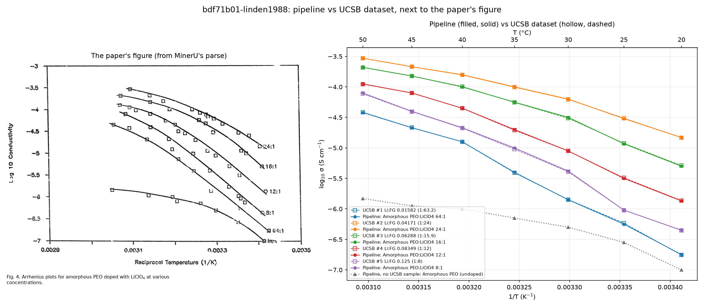

# Extraction benchmark: bdf71b01-linden1988.pdf

- **Paper:** E. Linden and J. R. Owen, Solid State Ionics, 1988, 28–30(2), 994–1000  
  DOI: https://doi.org/10.1016/0167-2738(88)90318-9
- **Job:** `52791ed7780e465b9d5bb8b37cde96cb` (done), features `Temperature (°C), Conductivity (S/cm)`
- **Model:** Claude Code's default for your login (not recorded: the API names no model, and Claude Code doesn't say which it used)
- **Run at:** 2026-10-07T16:38:30-07:00

## Time

| | Time |
| --- | --- |
| Total, submit to finish (polled every 5 s) | 3.5 min (210 s) |
| Total, as the server logged it | 3.4 min (205 s) |
| Waiting in the queue | 0 s |
| MinerU parse | 3.0 min (178 s) |
| LLM call | 28 s |
| Step `parsing` | 3.0 min (178 s) |
| Step `asking` | 28 s |
| Step `collecting` | 0 s |

MinerU parse **ran fresh**: `output/parsed/9be25e50`, 10 figure(s), 6 table(s).

What polling saw (first seen, then how long it stayed):

| Step | First seen | Seen for |
| --- | --- | --- |
| Parsing the PDF | 0 s | 3.0 min (180 s) |
| Asking the model | 180 s | 30 s |
| done | 210 s | — |

## Samples

Found **6** (extracted) vs **5** expected (UCSB), **5** matched.

| Extracted sample | UCSB sample | Matched on |
| --- | --- | --- |
| Amorphous PEO:LiClO4 64:1 | UCSB #1 Li:FG 0.01582 (1:63.2) | ClO4 salt, Li:FG 0.01562 vs 0.01582 (1.2% apart) |
| Amorphous PEO:LiClO4 24:1 | UCSB #2 Li:FG 0.04171 (1:24) | ClO4 salt, Li:FG 0.04167 vs 0.04171 (0.1% apart) |
| Amorphous PEO:LiClO4 16:1 | UCSB #3 Li:FG 0.06288 (1:15.9) | ClO4 salt, Li:FG 0.0625 vs 0.06288 (0.6% apart) |
| Amorphous PEO:LiClO4 12:1 | UCSB #4 Li:FG 0.08349 (1:12) | ClO4 salt, Li:FG 0.08333 vs 0.08349 (0.2% apart) |
| Amorphous PEO:LiClO4 8:1 | UCSB #5 Li:FG 0.125 (1:8) | ClO4 salt, Li:FG 0.125 vs 0.125 (0.0% apart) |
| Amorphous PEO (undoped) | — | no UCSB sample |

## Points

Compared only at temperatures both have (within ±2 °C); a point matches when log₁₀ σ is within ±0.3. Error is extracted minus UCSB, in decades.

| Sample | Compared (extracted / UCSB) | Matches | Precision | Recall | F1 | Mean abs error | Bias |
| --- | --- | --- | --- | --- | --- | --- | --- |
| Amorphous PEO:LiClO4 64:1 | 7 / 7 | 7 | 100% | 100% | 100% | 0.01 | -0.00 |
| Amorphous PEO:LiClO4 24:1 | 7 / 7 | 7 | 100% | 100% | 100% | 0.00 | +0.00 |
| Amorphous PEO:LiClO4 16:1 | 7 / 7 | 7 | 100% | 100% | 100% | 0.01 | -0.00 |
| Amorphous PEO:LiClO4 12:1 | 7 / 7 | 7 | 100% | 100% | 100% | 0.00 | +0.00 |
| Amorphous PEO:LiClO4 8:1 | 7 / 7 | 7 | 100% | 100% | 100% | 0.01 | +0.01 |
| **Overall** | 35 / 35 | 35 | **100%** | **100%** | **100%** | **0.01** | +0.00 |

## Against the paper

The paper's figure: page 5, `output/parsed/9be25e50/figures/standard/page5-block5.png` — "Fig. 4. Arrhenius plots for amorphous PEO doped with $\mathrm{LiClO_4}$ at various concentrations.". Plotted on 1/T, the axis MinerU read off it ("Reciprocal Temperature (1/K)").

## Verdict

The pipeline reported 6 sample(s); the UCSB dataset has 5 for this paper, and 5 of them were matched. Not in the UCSB dataset: Amorphous PEO (undoped) (the dataset holds only salt-containing electrolytes, so an undoped polymer is expected here). On the 35 UCSB points it could be compared with, it closely agrees with the dataset: 35 agree within 0.3 decades (F1 1.00), off by 0.01 decades on average and 0.00 above it overall. Remember the UCSB values were read off fitted curves, not the paper's raw points: gaps of about 0.1 decades are within that reading, so a disagreement says which source to check against the paper's figure, not which is wrong. The comparison image puts both next to that figure.

### Notes

- Where the numbers come from: MinerU's advanced parse turned Fig. 5 (log σ against Li:O ratio, one curve per temperature from 20 to 50 °C) into a table, and the model's values follow it closely: 25 of 42 identical, the rest within 0.05 decades. The UCSB values for this paper sit at the same seven temperatures, so they were most likely read off the same figure. The 100% agreement shows the pipeline read Fig. 5 the way the dataset's curators did; it isn't two independent sources agreeing.
- Against the paper's Arrhenius plot (Fig. 4, left of the image), both sets follow its curves. MinerU also turned Fig. 4 into a table, but a much rougher one (8:1 near 25 °C: −5.1, where Fig. 4's curve and Fig. 5 give about −6.0), and the model didn't use it.
